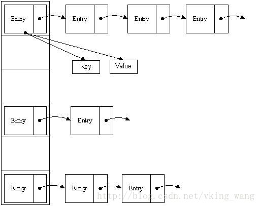
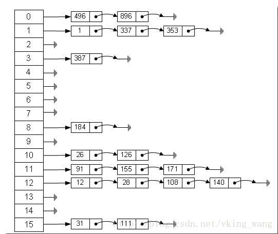

# HashMap实现原理分析


## 1. HashMap的数据结构

数据结构中有数组和链表来实现对数据的存储，但这两者基本上是两个极端。

### 数组

数组存储区间是连续的，占用内存严重，故空间复杂的很大。但数组的二分查找时间复杂度小，为O(1)；数组的特点是：寻址容易，插入和删除困难；

### 链表

链表存储区间离散，占用内存比较宽松，故空间复杂度很小，但时间复杂度很大，达O（N）。**链表**的特点是：寻址困难，插入和删除容易。

### 哈希表

那么我们能不能综合两者的特性，做出一种寻址容易，插入删除也容易的数据结构？答案是肯定的，这就是我们要提起的哈希表。哈希表（(Hash table）既满足了数据的查找方便，同时不占用太多的内容空间，使用也十分方便。

　　哈希表有多种不同的实现方法，我接下来解释的是最常用的一种方法—— 拉链法，我们可以理解为“**链表的数组**” ，如图：



 



 

　　从上图我们可以发现哈希表是由**数组+链表**组成的，一个长度为16的数组中，每个元素存储的是一个链表的头结点。那么这些元素是按照什么样的规则存储到数组中呢。一般情况是通过hash(key)%len获得，也就是元素的key的哈希值对数组长度取模得到。比如上述哈希表中，12%16=12,28%16=12,108%16=12,140%16=12。所以12、28、108以及140都存储在数组下标为12的位置。

　　HashMap其实也是一个线性的数组实现的,所以可以理解为其存储数据的容器就是一个线性数组。这可能让我们很不解，一个线性的数组怎么实现按键值对来存取数据呢？这里HashMap有做一些处理。

　　首先HashMap里面实现一个静态内部类Entry，其重要的属性有 *key , value, next*，从属性key,value我们就能很明显的看出来Entry就是HashMap键值对实现的一个基础bean，我们上面说到HashMap的基础就是一个线性数组，这个数组就是Entry[]，Map里面的内容都保存在Entry[]里面。

***JDK1.8 加入了红黑树， 链表大于8 转为红黑树***

  /**

   \* The table, resized as necessary. Length MUST Always be a power of two.

   */

  **transient** Entry[] table;

## 2. HashMap的存取实现

   既然是线性数组，为什么能随机存取？这里HashMap用了一个小[算法](http://lib.csdn.net/base/datastructure)，大致是这样实现：

```java
// 存储时:
int hash = key.hashCode(); // 这个hashCode方法这里不详述,只要理解每个key的hash是一个固定的int值
int index = hash % Entry[].length;
Entry[index] = value;

// 取值时:
int hash = key.hashCode();
int index = hash % Entry[].length;
return Entry[index];
```

### 1）put

 

疑问：如果两个key通过hash%Entry[].length得到的index相同，会不会有覆盖的危险？

　　这里HashMap里面用到链式数据结构的一个概念。上面我们提到过Entry类里面有一个next属性，作用是指向下一个Entry。打个比方， 第一个键值对A进来，通过计算其key的hash得到的index=0，记做:Entry[0] = A。一会后又进来一个键值对B，通过计算其index也等于0，现在怎么办？HashMap会这样做:*B.next = A*,Entry[0] = B,如果又进来C,index也等于0,那么*C.next = B*,Entry[0] = C；这样我们发现index=0的地方其实存取了A,B,C三个键值对,他们通过next这个属性链接在一起。所以疑问不用担心。**也就是说数组中存储的是最后插入的元素。**到这里为止，HashMap的大致实现，我们应该已经清楚了。

```java
public V put(K key, V value) {
        if (key == null)
            return putForNullKey(value); //null总是放在数组的第一个链表中
        int hash = hash(key.hashCode());
        int i = indexFor(hash, table.length);
        //遍历链表
        for (Entry<K,V> e = table[i]; e != null; e = e.next) {
            Object k;
            //如果key在链表中已存在，则替换为新value
            if (e.hash == hash && ((k = e.key) == key || key.equals(k))) {
                V oldValue = e.value;
                e.value = value;
                e.recordAccess(this);
                return oldValue;
            }
        }
        modCount++;
        addEntry(hash, key, value, i);
        return null;
    }
 
void addEntry(int hash, K key, V value, int bucketIndex) {
    Entry<K,V> e = table[bucketIndex];
    table[bucketIndex] = new Entry<K,V>(hash, key, value, e); //参数e, 是Entry.next
    //如果size超过threshold，则扩充table大小。再散列
    if (size++ >= threshold)
            resize(2 * table.length);
}
```

当然HashMap里面也包含一些优化方面的实现，这里也说一下。比如：Entry[]的长度一定后，随着map里面数据的越来越长，这样同一个index的链就会很长，会不会影响性能？HashMap里面设置一个因子，随着map的size越来越大，Entry[]会以一定的规则加长长度。

### 2）get

```java
public V get(Object key) {
        if (key == null)
            return getForNullKey();
        int hash = hash(key.hashCode());
        //先定位到数组元素，再遍历该元素处的链表
        for (Entry<K,V> e = table[indexFor(hash, table.length)];
             e != null;
             e = e.next) {
            Object k;
            if (e.hash == hash && ((k = e.key) == key || key.equals(k)))
                return e.value;
        }
        return null;
}
```

### 3）null key的存取

null key总是存放在Entry[]数组的第一个元素。

```java
 private V putForNullKey(V value) {
        for (Entry<K,V> e = table[0]; e != null; e = e.next) {
            if (e.key == null) {
                V oldValue = e.value;
                e.value = value;
                e.recordAccess(this);
                return oldValue;
            }
        }
        modCount++;
        addEntry(0, null, value, 0);
        return null;
    }
 
    private V getForNullKey() {
        for (Entry<K,V> e = table[0]; e != null; e = e.next) {
            if (e.key == null)
                return e.value;
        }
        return null;
    }
```

### 4）确定数组index(取模)

HashMap存取时，都需要计算当前key应该对应Entry[]数组哪个元素，即计算数组下标；算法如下：

```java
/**
     * Returns index for hash code h.
     */
    static int indexFor(int h, int length) {
        return h & (length-1);
    }
```

按位取并，作用上相当于取模mod或者取余%。

这意味着数组下标相同，并不表示hashCode相同。

 

### 5）table初始大小

```java
public HashMap(int initialCapacity, float loadFactor) {
        .....
        // Find a power of 2 >= initialCapacity
        int capacity = 1;
        while (capacity < initialCapacity)
            capacity <<= 1;
        this.loadFactor = loadFactor;
        threshold = (int)(capacity * loadFactor);
        table = new Entry[capacity];
        init();
    }
```

**注意table初始大小并不是构造函数中的initialCapacity！！**

**而是 >= initialCapacity的2的n次幂！！！！**

————为什么这么设计呢？——

## 3. 解决hash冲突的办法

1. 开放定址法（线性探测再散列，二次探测再散列，伪随机探测再散列）
2. 再哈希法
3. **链地址法**
4. 建立一个公共溢出区

Java中hashmap的解决办法就是采用的链地址法。

 

## 4. 再散列rehash过程

当哈希表的容量超过默认容量时，必须调整table的大小。当容量已经达到最大可能值时，那么该方法就将容量调整到Integer.MAX_VALUE返回，这时，需要创建一张新表，将原表的映射到新表中。

```java
/**
     * Rehashes the contents of this map into a new array with a
     * larger capacity.  This method is called automatically when the
     * number of keys in this map reaches its threshold.
     *
     * If current capacity is MAXIMUM_CAPACITY, this method does not
     * resize the map, but sets threshold to Integer.MAX_VALUE.
     * This has the effect of preventing future calls.
     *
     * @param newCapacity the new capacity, MUST be a power of two;
     *        must be greater than current capacity unless current
     *        capacity is MAXIMUM_CAPACITY (in which case value
     *        is irrelevant).
     */
    void resize(int newCapacity) {
        Entry[] oldTable = table;
        int oldCapacity = oldTable.length;
        if (oldCapacity == MAXIMUM_CAPACITY) {
            threshold = Integer.MAX_VALUE;
            return;
        }
        Entry[] newTable = new Entry[newCapacity];
        transfer(newTable);
        table = newTable;
        threshold = (int)(newCapacity * loadFactor);
    }
 
    /**
     * Transfers all entries from current table to newTable.
     */
    void transfer(Entry[] newTable) {
        Entry[] src = table;
        int newCapacity = newTable.length;
        for (int j = 0; j < src.length; j++) {
            Entry<K,V> e = src[j];
            if (e != null) {
                src[j] = null;
                do {
                    Entry<K,V> next = e.next;
                    //重新计算index
                    int i = indexFor(e.hash, newCapacity);
                    e.next = newTable[i];
                    newTable[i] = e;
                    e = next;
                } while (e != null);
            }
        }
    }
```


## 先来些简单的问题

**用过吗？你为什么用到它**

几乎每个人都会回答“是的”，然后回答HashMap的一些特性，譬如HashMap可以接受null键值和值，而HashTable则不能；HashMap是非synchronized;HashMap很快；以及HashMap储存的是键值对等等。这显示出你已经用过HashMap，而且对它相当的熟悉。但是面试官来个急转直下，从此刻开始问出一些刁钻的问题，关于HashMap的更多基础的细节。面试官可能会问出下面的问题：

**你知道HashMap的工作原理吗**

你也许会回答“我没有详查标准的JAVA API，你可以看看Java源代码或者Open JDK。”“我可以用Google找到答案。”

但一些面试者可能可以给出答案，“HashMap是基于hashing的原理，我们使用put(key, value)存储对象到HashMap中，使用get(key)从HashMap中获取对象。当我们给put()方法传递键和值时，我们先对键调用hashCode()方法，返回的hashCode用于找到bucket位置来储存Entry对象。”这里关键点在于指出，HashMap是在bucket中储存键对象和值对象，作为Map.Entry。这一点有助于理解获取对象的逻辑。如果你没有意识到这一点，或者错误的认为仅仅只在bucket中存储值的话，你将不会回答如何从HashMap中获取对象的逻辑。这个答案相当的正确，也显示出面试者确实知道hashing以及HashMap的工作原理。但是这仅仅是故事的开始，当面试官加入一些Java程序员每天要碰到的实际场景的时候，错误的答案频现。下个问题可能是关于HashMap中的碰撞探测(collision detection)以及碰撞的解决方法：

**两个对象的hashcode相同会发生什么**

从这里开始，真正的困惑开始了，一些面试者会回答因为hashcode相同，所以两个对象是相等的，HashMap将会抛出异常，或者不会存储它们。然后面试官可能会提醒他们有equals()和hashCode()两个方法，并告诉他们两个对象就算hashcode相同，但是它们可能并不相等。一些面试者可能就此放弃，而另外一些还能继续挺进，他们回答“因为hashcode相同，所以它们的bucket位置相同，‘碰撞’会发生。因为HashMap使用LinkedList存储对象，这个Entry(包含有键值对的Map.Entry对象)会存储在LinkedList中。”这个答案非常的合理，虽然有很多种处理碰撞的方法，这种方法是最简单的，也正是HashMap的处理方法。但故事还没有完结，面试官会继续问：

**如果两个键的hashcode相同，你如何获取值对象**

面试者会回答：当我们调用get()方法，HashMap会使用键对象的hashcode找到bucket位置，然后获取值对象。面试官提醒他如果有两个值对象储存在同一个bucket，他给出答案:将会遍历LinkedList直到找到值对象。面试官会问因为你并没有值对象去比较，你是如何确定确定找到值对象的？除非面试者直到HashMap在LinkedList中存储的是键值对，否则他们不可能回答出这一题。

其中一些记得这个重要知识点的面试者会说，找到bucket位置之后，会调用keys.equals()方法去找到LinkedList中正确的节点，最终找到要找的值对象。完美的答案！

许多情况下，面试者会在这个环节中出错，因为他们混淆了hashCode()和equals()方法。因为在此之前hashCode()屡屡出现，而equals()方法仅仅在获取值对象的时候才出现。一些优秀的开发者会指出使用不可变的、声明作final的对象，并且采用合适的equals()和hashCode()方法的话，将会减少碰撞的发生，提高效率。不可变性使得能够缓存不同键的hashcode，这将提高整个获取对象的速度，使用String，Interger这样的wrapper类作为键是非常好的选择。

如果你认为到这里已经完结了，那么听到下面这个问题的时候，你会大吃一惊。

**如果HashMap的大小超过了负载因子的容量，怎么办**

除非你真正知道HashMap的工作原理，否则你将回答不出这道题。默认的负载因子大小为0.75，也就是说，当一个map填满了75%的bucket时候，和其它集合类(如ArrayList等)一样，将会创建原来HashMap大小的两倍的bucket数组，来重新调整map的大小，并将原来的对象放入新的bucket数组中。这个过程叫作rehashing，因为它调用hash方法找到新的bucket位置。

如果你能够回答这道问题，下面的问题来了：“你了解重新调整HashMap大小存在什么问题吗？”你可能回答不上来，这时面试官会提醒你当多线程的情况下，可能产生条件竞争(race condition)。

当重新调整HashMap大小的时候，确实存在条件竞争，因为如果两个线程都发现HashMap需要重新调整大小了，它们会同时试着调整大小。在调整大小的过程中，存储在LinkedList中的元素的次序会反过来，因为移动到新的bucket位置的时候，HashMap并不会将元素放在LinkedList的尾部，而是放在头部，这是为了避免尾部遍历(tail traversing)。如果条件竞争发生了，那么就死循环了。这个时候，你可以质问面试官，为什么这么奇怪，要在多线程的环境下使用HashMap呢？：）

**热心的读者贡献了更多的关于HashMap的问题：**

1. 为什么String, Interger这样的wrapper类适合作为键？ String, Interger这样的wrapper类作为HashMap的键是再适合不过了，而且String最为常用。因为String是不可变的，也是final的，而且已经重写了equals()和hashCode()方法了。其他的wrapper类也有这个特点。不可变性是必要的，因为为了要计算hashCode()，就要防止键值改变，如果键值在放入时和获取时返回不同的hashcode的话，那么就不能从HashMap中找到你想要的对象。不可变性还有其他的优点如线程安全。如果你可以仅仅通过将某个field声明成final就能保证hashCode是不变的，那么请这么做吧。因为获取对象的时候要用到equals()和hashCode()方法，那么键对象正确的重写这两个方法是非常重要的。如果两个不相等的对象返回不同的hashcode的话，那么碰撞的几率就会小些，这样就能提高HashMap的性能。
2. 我们可以使用自定义的对象作为键吗？ 这是前一个问题的延伸。当然你可能使用任何对象作为键，只要它遵守了equals()和hashCode()方法的定义规则，并且当对象插入到Map中之后将不会再改变了。如果这个自定义对象时不可变的，那么它已经满足了作为键的条件，因为当它创建之后就已经不能改变了。
3. 我们可以使用CocurrentHashMap来代替HashTable吗？这是另外一个很热门的面试题，因为ConcurrentHashMap越来越多人用了。我们知道HashTable是synchronized的，但是ConcurrentHashMap同步性能更好，因为它仅仅根据同步级别对map的一部分进行上锁。ConcurrentHashMap当然可以代替HashTable，但是HashTable提供更强的线程安全性。看看[这篇博客](http://javarevisited.blogspot.sg/2011/04/difference-between-concurrenthashmap.html)查看Hashtable和ConcurrentHashMap的区别。

我个人很喜欢这个问题，因为这个问题的深度和广度，也不直接的涉及到不同的概念。让我们再来看看这些问题设计哪些知识点：

- hashing的概念
- HashMap中解决碰撞的方法
- equals()和hashCode()的应用，以及它们在HashMap中的重要性
- 不可变对象的好处
- HashMap多线程的条件竞争
- 重新调整HashMap的大小

## 总结

**HashMap的工作原理**

HashMap基于hashing原理，我们通过put()和get()方法储存和获取对象。当我们将键值对传递给put()方法时，它调用键对象的hashCode()方法来计算hashcode，让后找到bucket位置来储存值对象。当获取对象时，通过键对象的equals()方法找到正确的键值对，然后返回值对象。HashMap使用LinkedList来解决碰撞问题，当发生碰撞了，对象将会储存在LinkedList的下一个节点中。 HashMap在每个LinkedList节点中储存键值对对象。

当两个不同的键对象的hashcode相同时会发生什么？ 它们会储存在同一个bucket位置的LinkedList中。键对象的equals()方法用来找到键值对。

因为HashMap的好处非常多，我曾经在电子商务的应用中使用HashMap作为缓存。因为金融领域非常多的运用Java，也出于性能的考虑，我们会经常用到HashMap和ConcurrentHashMap。你可以查看更多的关于HashMap和HashTable的文章。

 
