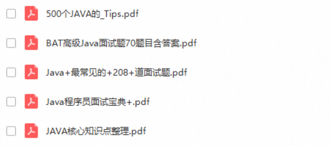

# 面试宝典

[高频面试题](Interview/HighFrequency.md)

* [HashMap实现原理分析](Interview/HighFrequency/HashMap.md)
* [lock 与 synchronize区别(实现原理)](Interview/HighFrequency/lock.md)
* [面试必问之JVM篇](Interview/HighFrequency/jvm.md)
* [垃圾回收机制](Interview/HighFrequency/gc.md)
* [SpringBoot 原理](Interview/HighFrequency/SpringBoot.md)

# 赠全套JAVA面试书籍

https://pan.baidu.com/s/1YyRufYIP03Rmwa0eq8icvA