# 【图解数据结构】 二叉树遍历

## 二叉树遍历原理

> 二叉树的遍历是指从根结点出发，按照某种次序依次访问二叉树中所有结点，使得每个结点被访问一次且仅被访问一次。

为什么研究二叉树的遍历？

因为计算机只会处理线性序列，而我们研究遍历，就是把树中的结点变成某种意义的线性序列，这给程序的实现带来了好处。


## 二叉树的创建

遍历二叉树之前，首先我们要有一个二叉树。要创建一个如下图的二叉树，就要先进行二叉树的扩展，也就是将二叉树每个结点的空指针引出一个虚结点，其值为一个特定值，比如’#’。处理后的二叉树称为原二叉树的扩展二叉树。扩展二叉树的每个遍历序列可以确定一个一颗二叉树，我们采用前序遍历创建二叉树。前序遍历序列：124##5##36##7##。


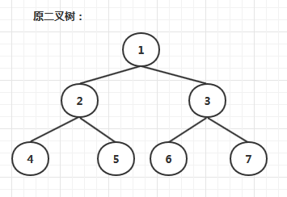


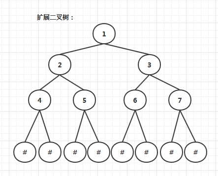


**定义二叉链表结点:**


```java
/** <summary>
 * 二叉链表结点类
 * </summary>
 * <typeparam name="T"></typeparam>
 **/
public class TreeNode<T> {
    // 数据域
    public T Data { get; set; }
    // 左孩子   
    public TreeNode<T> LChild { get; set; } 
    // 右孩子
    public TreeNode<T> RChild { get; set; } 

    public TreeNode(T val, TreeNode<T> lp, TreeNode<T> rp)
    {
        Data = val;
        LChild = lp;
        RChild = rp;
    }

    public TreeNode(TreeNode<T> lp, TreeNode<T> rp)
    {
        Data = default(T);
        LChild = lp;
        RChild = rp;
    }

    public TreeNode(T val)
    {
        Data = val;
        LChild = null;
        RChild = null;
    }

    public TreeNode()
    {
        Data = default(T);
        LChild = null;
        RChild = null;
    }
}
```

**先序递归创建二叉树:**

```java
/// <summary>
/// 先序创建二叉树
/// </summary>
/// <param name="node"></param>
public static void CreateTree(TreeNode<char> node)
{
    node.Data = Console.ReadKey().KeyChar;

    if (node.Data == '#')
    {
        return;
    }

    node.LChild = new TreeNode<char>();

    CreateTree(node.LChild);

    if (node.LChild.Data == '#')
    {
        node.LChild = null;
    }

    node.RChild = new TreeNode<char>();

    CreateTree(node.RChild);

    if (node.RChild.Data == '#')
    {
        node.RChild = null;
    }
}
```


## 二叉树遍历方法


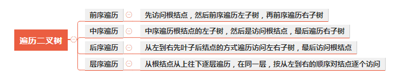

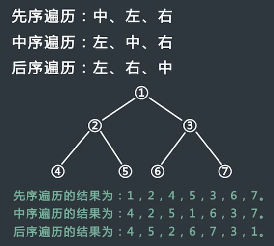

### 前序遍历

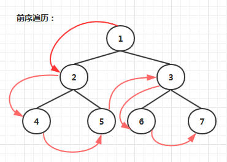

#### 递归方式实现前序遍历

具体过程：

1. 先访问根节点
2. 再序遍历左子树
3. 最后序遍历右子树

**代码实现：**

```java
public static void PreOrderRecur(TreeNode<char> treeNode)
 {
     if (treeNode == null)
     {
         return;
     }
     Console.Write(treeNode.Data); 
     PreOrderRecur(treeNode.LChild);
     PreOrderRecur(treeNode.RChild);
 }
```

#### 非递归方式实现前序遍历

具体过程：

1. 首先申请一个新的栈，记为stack；
2. 将头结点head压入stack中；
3. 每次从stack中弹出栈顶节点，记为cur，然后打印cur值，如果cur右孩子不为空，则将右孩子压入栈中；如果cur的左孩子不为空，将其压入stack中；
4. 重复步骤3，直到stack为空.

**代码实现：**

```java
 public static void PreOrder(TreeNode<char> head)
{
    if (head == null)
    {
        return;
    }
    Stack<TreeNode<char>> stack = new Stack<TreeNode<char>>();
    stack.Push(head);
    while (!(stack.Count == 0))
    {
        TreeNode<char> cur = stack.Pop();
        Console.Write(cur.Data);

        if (cur.RChild != null)
        {
            stack.Push(cur.RChild);
        }
        if (cur.LChild != null)
        {
            stack.Push(cur.LChild);
        }
    }
}
```

**过程模拟：**


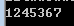

**执行结果：**

### 中序遍历

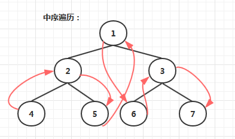

#### 递归方式实现中序遍历

具体过程：

1. 先中序遍历左子树
2. 再访问根节点
3. 最后中序遍历右子树

**代码实现：**

```java
public static void InOrderRecur(TreeNode<char> treeNode)
{
    if (treeNode == null)
    {
        return;
    }  
    InOrderRecur(treeNode.LChild);
    Console.Write(treeNode.Data); 
    InOrderRecur(treeNode.RChild);
}
```

#### 非递归方式实现中序遍历

具体过程：

1. 申请一个新栈，记为stack，申请一个变量cur，初始时令cur为头节点；
2. 先把cur节点压入栈中，对以cur节点为头的整棵子树来说，依次把整棵树的左子树压入栈中，即不断令cur=cur.left，然后重复步骤2；
3. 不断重复步骤2，直到发现cur为空，此时从stack中弹出一个节点记为node，打印node的值，并让cur = node.right，然后继续重复步骤2；
4. 当stack为空并且cur为空时结束。

**代码实现：**

```java
public static void InOrder(TreeNode<char> treeNode)
{
    if (treeNode == null)
    {
        return;
    }
    Stack<TreeNode<char>> stack = new Stack<TreeNode<char>>();

    TreeNode<char> cur = treeNode;

    while (!(stack.Count == 0) || cur != null)
    {
        while (cur != null)
        {
            stack.Push(cur);
            cur = cur.LChild;
        }
        TreeNode<char> node = stack.Pop();
        Console.WriteLine(node.Data);
        cur = node.RChild;
    }
}
```

**过程模拟：**


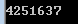

**执行结果：**

### 后序遍历

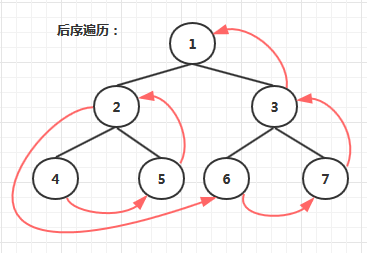

#### 递归方式实现后序遍历

1. 先后序遍历左子树
2. 再后序遍历右子树
3. 最后访问根节点

**代码实现：**

```java
public static void PosOrderRecur(TreeNode<char> treeNode)
{
    if (treeNode == null)
    {
        return;
    }
    PosOrderRecur(treeNode.LChild);
    PosOrderRecur(treeNode.RChild);
    Console.Write(treeNode.Data); 
}
```

#### 非递归方式实现后序遍历一

具体过程：

使用两个栈实现

1. 申请两个栈stack1，stack2，然后将头结点压入stack1中；
2. 从stack1中弹出的节点记为cur，然后先把cur的左孩子压入stack1中，再把cur的右孩子压入stack1中；
3. 在整个过程中，每一个从stack1中弹出的节点都放在第二个栈stack2中；
4. 不断重复步骤2和步骤3，直到stack1为空，过程停止；
5. 从stack2中依次弹出节点并打印，打印的顺序就是后序遍历的顺序；

**代码实现：**

```java
public static void PosOrderOne(TreeNode<char> treeNode)
{
    if (treeNode == null)
    {
        return;
    }

    Stack<TreeNode<char>> stack1 = new Stack<TreeNode<char>>();
    Stack<TreeNode<char>> stack2 = new Stack<TreeNode<char>>();

    stack1.Push(treeNode);
    TreeNode<char> cur = treeNode;

    while (!(stack1.Count == 0))
    {
        cur = stack1.Pop();
        if (cur.LChild != null)
        {
            stack1.Push(cur.LChild);
        }
        if (cur.RChild != null)
        {
            stack1.Push(cur.RChild);
        }
        stack2.Push(cur);
    }

    while (!(stack2.Count == 0))
    {
        TreeNode<char> node = stack2.Pop();
        Console.WriteLine(node.Data); ;
    }
}
```

**过程模拟：**


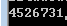

**执行结果：**

#### 非递归方式实现后序遍历二

具体过程：

使用一个栈实现

1. 申请一个栈stack，将头节点压入stack，同时设置两个变量 h 和 c，在整个流程中，h代表最近一次弹出并打印的节点，c代表当前stack的栈顶节点，初始时令h为头节点，，c为null；
2. 每次令c等于当前stack的栈顶节点，但是不从stack中弹出节点，此时分一下三种情况：

(1)如果c的左孩子不为空，并且h不等于c的左孩子，也不等于c的右孩子，则吧c的左孩子压入stack中

(2)如果情况1不成立，并且c的右孩子不为空，并且h不等于c的右孩子，则把c的右孩子压入stack中；

(3)如果情况1和2不成立，则从stack中弹出c并打印，然后令h等于c；

1. 一直重复步骤2，直到stack为空.

**代码实现：**

```java
public static void PosOrderTwo(TreeNode<char> treeNode)
{
    if (treeNode == null)
    {
        return;
    }

    Stack<TreeNode<char>> stack = new Stack<TreeNode<char>>();
    stack.Push(treeNode);

    TreeNode<char> h = treeNode;
    TreeNode<char> c = null;
    while (!(stack.Count == 0))
    {
        c = stack.Peek();
        //c结点有左孩子 并且 左孩子没被遍历（输出）过 并且 右孩子没被遍历过
        if (c.LChild != null && h != c.LChild && h != c.RChild)
            stack.Push(c.LChild);
        //c结点有右孩子 并且 右孩子没被遍历（输出）过
        else if (c.RChild != null && h != c.RChild)
            stack.Push(c.RChild);
        //c结点没有孩子结点 或者孩子结点已经被遍历（输出）过
        else
        {
            TreeNode<char> node = stack.Pop();
            Console.WriteLine(node.Data);
            h = c;
        }
    }
}
```

**过程模拟：**

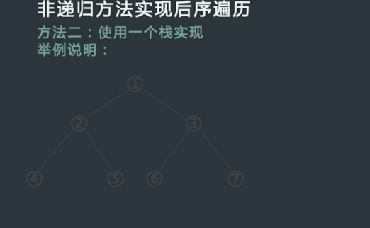


**执行结果：**

### 层序遍历

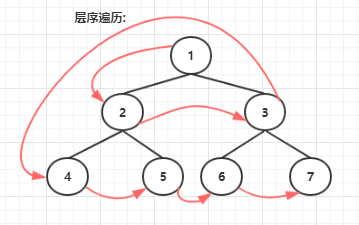

具体过程：

1. 首先申请一个新的队列，记为queue；
2. 将头结点head压入queue中；
3. 每次从queue中出队，记为node，然后打印node值，如果node左孩子不为空，则将左孩子入队；如果node的右孩子不为空，则将右孩子入队；
4. 重复步骤3，直到queue为空。

**代码实现：**

```java
public static void LevelOrder(TreeNode<char> treeNode)
{
    if(treeNode == null)
    {
         return;
    }
    Queue<TreeNode<char>> queue = new Queue<TreeNode<char>>();
    queue.Enqueue(treeNode);

    while (queue.Any())
    {
        TreeNode<char> node = queue.Dequeue();
        Console.Write(node.Data);

        if (node.Left != null)
        {
            queue.Enqueue(node.Left);
        }

        if (node.Right != null)
        {
            queue.Enqueue(node.Right);
        }
    }
}
```

**执行结果**

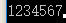


