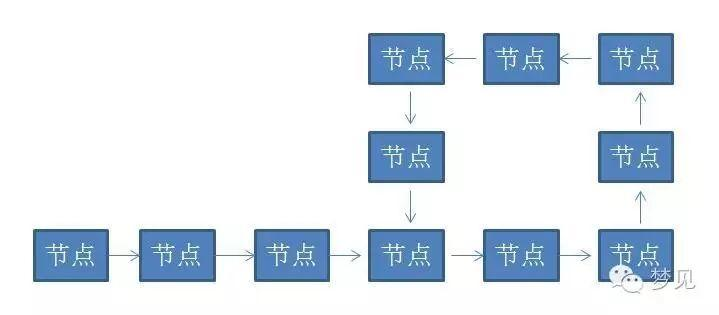
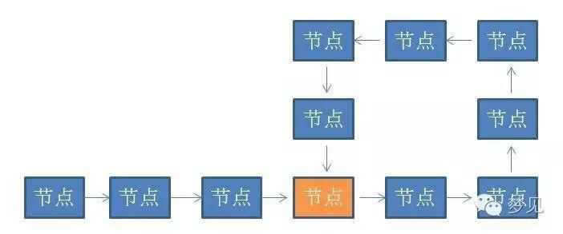

# 漫画算法：如何判断链表有环

大四毕业前夕，计算机学院，

正在四处求职的小灰碰到了同系的学霸大黄……

小灰边说边回忆着上周去面试的情形……

有一个单向链表，链表当中有可能出现“环”，就像下图这样。如何用程序判断出这个链表是有环链表？

**方法一：**首先从头节点开始，依次遍历单链表的每一个节点。每遍历到一个新节点，就从头节点重新遍历新节点之前的所有节点，用新节点ID和此节点之前所有节点ID依次作比较。如果发现新节点之前的所有节点当中存在相同节点ID，则说明该节点被遍历过两次，链表有环；如果之前的所有节点当中不存在相同的节点，就继续遍历下一个新节点，继续重复刚才的操作。

例如这样的链表：A->B->C->D->B->C->D， 当遍历到节点D的时候，我们需要比较的是之前的节点A、B、C，不存在相同节点。这时候要遍历的下一个新节点是B，B之前的节点A、B、C、D中恰好也存在B，因此B出现了两次，判断出链表有环。

假设从链表头节点到入环点的距离是D，链表的环长是S。那么算法的时间复杂度是0+1+2+3+….+(D+S-1) = (D+S-1)*(D+S)/2 ， 可以简单地理解成 O(N*N)。而此算法没有创建额外存储空间，空间复杂度可以简单地理解成为O(1)。

**方法二：**首先创建一个以节点ID为键的HashSet集合，用来存储曾经遍历过的节点。然后同样是从头节点开始，依次遍历单链表的每一个节点。每遍历到一个新节点，就用新节点和HashSet集合当中存储的节点作比较，如果发现HashSet当中存在相同节点ID，则说明链表有环，如果HashSet当中不存在相同的节点ID，就把这个新节点ID存入HashSet，之后进入下一节点，继续重复刚才的操作。

这个方法在流程上和方法一类似，本质的区别是使用了HashSet作为额外的缓存。

假设从链表头节点到入环点的距离是D，链表的环长是S。而每一次HashSet查找元素的时间复杂度是O(1), 所以总体的时间复杂度是1*(D+S)=D+S，可以简单理解为O(N)。而算法的空间复杂度还是D+S-1，可以简单地理解成O(N)。

等通知就是没通知，这是职场上公认的语言。

以上就是小灰悲剧的回忆……

**方法三：**首先创建两个指针1和2（在java里就是两个对象引用），同时指向这个链表的头节点。然后开始一个大循环，在循环体中，让指针1每次向下移动一个节点，让指针2每次向下移动两个节点，然后比较两个指针指向的节点是否相同。如果相同，则判断出链表有环，如果不同，则继续下一次循环。

例如链表A->B->C->D->B->C->D，两个指针最初都指向节点A，进入第一轮循环，指针1移动到了节点B，指针2移动到了C。第二轮循环，指针1移动到了节点C，指针2移动到了节点B。第三轮循环，指针1移动到了节点D，指针2移动到了节点D，此时两指针指向同一节点，判断出链表有环。

此方法也可以用一个更生动的例子来形容：在一个环形跑道上，两个运动员在同一地点起跑，一个运动员速度快，一个运动员速度慢。当两人跑了一段时间，速度快的运动员必然会从速度慢的运动员身后再次追上并超过，原因很简单，因为跑道是环形的。

假设从链表头节点到入环点的距离是D，链表的环长是S。那么循环会进行S次（为什么是S次，有心的同学可以自己揣摩下），可以简单理解为O（N）。除了两个指针以外，没有使用任何额外存储空间，所以空间复杂度是O（1）。

**问题一：**判断两个单向链表是否相交，如果相交，求出交点。

**问题二：**在一个有环链表中，如何找出链表的入环点？

