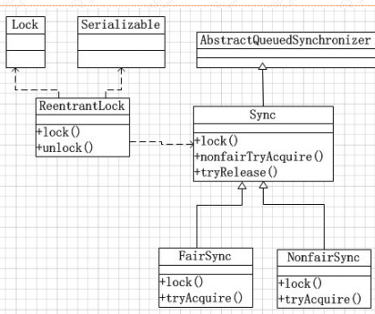
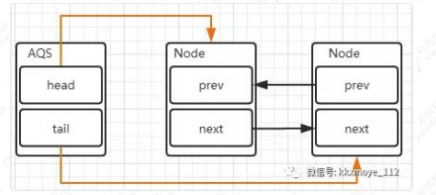
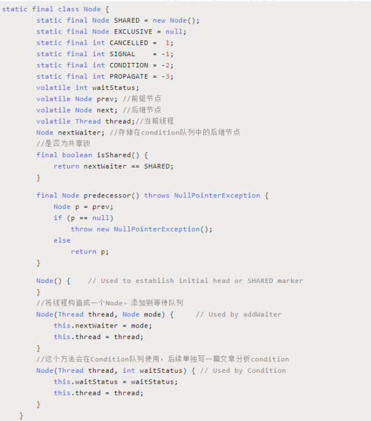
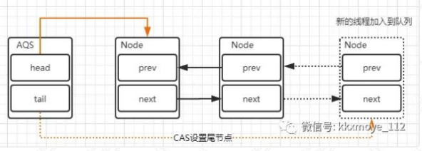
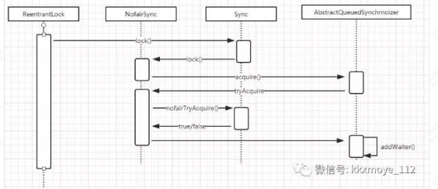
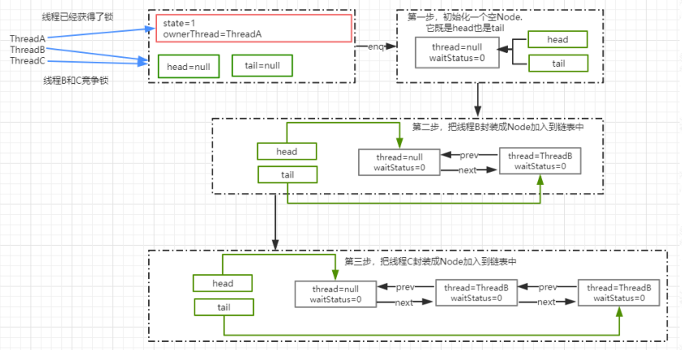
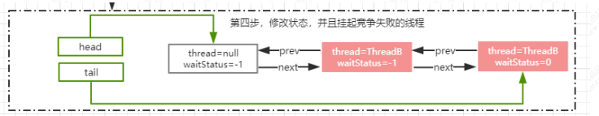
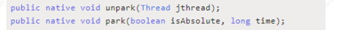
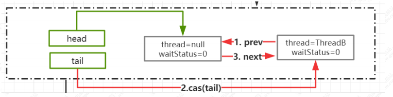
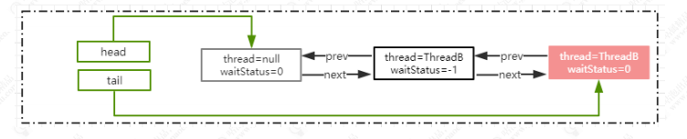

# 理解J.U.C中ReentrantLock的底层设计


**J.U.C 简介**

Java.util.concurrent 是在并发编程中比较常用的工具类，里面包含很多用来在并发

场景中使用的组件。比如线程池、阻塞队列、计时器、同步器、并发集合等等。并

发包的作者是大名鼎鼎的 Doug Lea。我们在接下来的课程中，回去剖析一些经典

的比较常用的组件的设计思想

**Lock**

Lock 在 J.U.C 中是最核心的组件，前面我们讲 synchronized 的时候说过，锁最重

要的特性就是解决并发安全问题。为什么要以 Lock 作为切入点呢？如果有同学看

过 J.U.C 包中的所有组件，一定会发现绝大部分的组件都有用到了 Lock。所以通

过 Lock 作为切入点使得在后续的学习过程中会更加轻松。

**Lock 简介** 

在 Lock 接口出现之前，Java 中的应用程序对于多线程的并发安全处理只能基于

synchronized 关键字来解决。但是 synchronized 在有些场景中会存在一些短板，

也就是它并不适合于所有的并发场景。但是在 Java5 以后，Lock 的出现可以解决

synchronized 在某些场景中的短板，它比 synchronized 更加灵活。


**Lock 的实现** 

Lock 本质上是一个接口，它定义了释放锁和获得锁的抽象方法，定义成接口就意

味着它定义了锁的一个标准规范，也同时意味着锁的不同实现。实现 Lock 接口的

类有很多，以下为几个常见的锁实现


ReentrantLock：表示重入锁，它是唯一一个实现了 Lock 接口的类。重入锁指的是

线程在获得锁之后，再次获取该锁不需要阻塞，而是直接关联一次计数器增加重入

次数

ReentrantReadWriteLock：重入读写锁，它实现了 ReadWriteLock 接口，在这个

类中维护了两个锁，一个是 ReadLock，一个是 WriteLock，他们都分别实现了 Lock

接口。读写锁是一种适合读多写少的场景下解决线程安全问题的工具，基本原则

是： 读和读不互斥、读和写互斥、写和写互斥。也就是说涉及到影响数据变化的

操作都会存在互斥。

StampedLock： stampedLock 是 JDK8 引入的新的锁机制，可以简单认为是读写

锁的一个改进版本，读写锁虽然通过分离读和写的功能使得读和读之间可以完全

并发，但是读和写是有冲突的，如果大量的读线程存在，可能会引起写线程的饥饿。

stampedLock 是一种乐观的读策略，使得乐观锁完全不会阻塞写线程

**Lock 的类关系图** 

Lock 有很多的锁的实现，但是直观的实现是 ReentrantLock 重入锁




> void lock() // 如果锁可用就获得锁，如果锁不可用就阻塞直到锁释放
>
> void lockInterruptibly() // 和lock()方法相似, 但阻塞的线程 可 中 断 ， 抛 出java.lang.InterruptedException 异常boolean tryLock() // 非阻塞获取锁;尝试获取锁，如果成功返回 true
>
> boolean tryLock(long timeout, TimeUnit timeUnit)  //带有超时时间的获取锁方法
>
> void unlock() // 释放锁


**ReentrantLock 重入锁**

重入锁，表示支持重新进入的锁，也就是说，如果当前线程 t1 通过调用 lock 方

法获取了锁之后，再次调用 lock，是不会再阻塞去获取锁的，直接增加重试次数

就行了。synchronized 和 ReentrantLock 都是可重入锁。很多同学不理解为什么

锁会存在重入的特性，那是因为对于同步锁的理解程度还不够，比如在下面这类

的场景中，存在多个加锁的方法的相互调用，其实就是一种重入特性的场景。

**重入锁的设计目的** 

比如调用 demo 方法获得了当前的对象锁，然后在这个方法中再去调用

demo2，demo2 中的存在同一个实例锁，这个时候当前线程会因为无法获得

demo2 的对象锁而阻塞，就会产生死锁。重入锁的设计目的是避免线程的死

锁。

```java
public class ReentrantDemo{
    public synchronized void demo(){
        System.out.println("begin:demo");
        demo2();
    }
    public void demo2(){
        System.out.println("begin:demo1");
        synchronized (this){
        }
    }
    public static void main(String[] args) {
        ReentrantDemo rd=new ReentrantDemo();
        new Thread(rd::demo).start();
    } 
}
```

**ReentrantLock 的使用案例**

```java
public class AtomicDemo {
    private static int count=0;
    static Lock lock=new ReentrantLock();
    public static void inc(){
        lock.lock();
        try {
            Thread.sleep(1);
        } catch (InterruptedException e) {
            e.printStackTrace();
        }
        count++;
        lock.unlock();
    }
    public static void main(String[] args) throws 
        InterruptedException {
        for(int i=0;i<1000;i++){
            new Thread(()->{AtomicDemo.inc();}).start();;
        }
        Thread.sleep(3000);
        System.out.println("result:"+count);
    } 
}
```

**ReentrantReadWriteLock** 

我们以前理解的锁，基本都是排他锁，也就是这些锁在同一时刻只允许一个线程进

行访问，而读写所在同一时刻可以允许多个线程访问，但是在写线程访问时，所有

的读线程和其他写线程都会被阻塞。读写锁维护了一对锁，一个读锁、一个写锁; 

一般情况下，读写锁的性能都会比排它锁好，因为大多数场景读是多于写的。在读

多于写的情况下，读写锁能够提供比排它锁更好的并发性和吞吐量.

```java
public class LockDemo {
    static Map<String,Object> cacheMap=new HashMap<>();
    static ReentrantReadWriteLock rwl=new 
        ReentrantReadWriteLock();
    static Lock read=rwl.readLock();
    static Lock write=rwl.writeLock();
    public static final Object get(String key) {
        System.out.println("开始读取数据");
        read.lock(); //读锁
        try {
            return cacheMap.get(key);
        }finally {
            read.unlock();
        }
    }
    public static final Object put(String key,Object value){
        write.lock();
        System.out.println("开始写数据");
        try{
            return cacheMap.put(key,value);
        }finally {
            write.unlock();
        }
    } 
}
```

在这个案例中，通过 hashmap 来模拟了一个内存缓存，然后使用读写所来保证这

个内存缓存的线程安全性。当执行读操作的时候，需要获取读锁，在并发访问的时

候，读锁不会被阻塞，因为读操作不会影响执行结果。

在执行写操作是，线程必须要获取写锁，当已经有线程持有写锁的情况下，当前线

程会被阻塞，只有当写锁释放以后，其他读写操作才能继续执行。使用读写锁提升

读操作的并发性，也保证每次写操作对所有的读写操作的可见性

⚫ 读锁与读锁可以共享

⚫ 读锁与写锁不可以共享（排他）

⚫ 写锁与写锁不可以共享（排他）


**ReentrantLock 的实现原理**

我们知道锁的基本原理是，基于将多线程并行任务通过某一种机制实现线程的串

行执行，从而达到线程安全性的目的。在 synchronized 中，我们分析了偏向锁、

轻量级锁、乐观锁。基于乐观锁以及自旋锁来优化了 synchronized 的加锁开销，

同时在重量级锁阶段，通过线程的阻塞以及唤醒来达到线程竞争和同步的目的。

那么在 ReentrantLock 中，也一定会存在这样的需要去解决的问题。就是在多线程

竞争重入锁时，竞争失败的线程是如何实现阻塞以及被唤醒的呢？

**AQS 是什么** 

在 Lock 中，用到了一个同步队列 AQS，全称 AbstractQueuedSynchronizer，它

是一个同步工具也是 Lock 用来实现线程同步的核心组件。如果你搞懂了 AQS，那

么 J.U.C 中绝大部分的工具都能轻松掌握。

**AQS 的两种功能** 

从使用层面来说，AQS 的功能分为两种：独占和共享

独占锁，每次只能有一个线程持有锁，比如前面给大家演示的 ReentrantLock 就是

以独占方式实现的互斥锁

共 享 锁 ， 允 许 多 个 线 程 同 时 获 取 锁 ， 并 发 访 问 共 享 资 源 ， 比 如

ReentrantReadWriteLock

**AQS 的内部实现** 

AQS 队列内部维护的是一个 FIFO 的双向链表，这种结构的特点是每个数据结构都有两个指针，分别指向直接的后继节点和直接前驱节点。所以双向链表可以从任

意一个节点开始很方便的访问前驱和后继。每个 Node 其实是由线程封装，当线

程争抢锁失败后会封装成 Node 加入到 ASQ 队列中去；当获取锁的线程释放锁以

后，会从队列中唤醒一个阻塞的节点(线程)。



**Node 的组成**



**释放锁以及添加线程对于队列的变化** 

当出现锁竞争以及释放锁的时候，AQS 同步队列中的节点会发生变化，首先看一下添加节点的场景。



里会涉及到两个变化

1. 新的线程封装成 Node 节点追加到同步队列中，设置 prev 节点以及修改当前节

点的前置节点的 next 节点指向自己

2. 通过 CAS 讲 tail 重新指向新的尾部节点

head 节点表示获取锁成功的节点，当头结点在释放同步状态时，会唤醒后继节点，

如果后继节点获得锁成功，会把自己设置为头结点，节点的变化过程如下


这个过程也是涉及到两个变化

1. 修改 head 节点指向下一个获得锁的节点

2. 新的获得锁的节点，将 prev 的指针指向 null

设置 head 节点不需要用 CAS，原因是设置 head 节点是由获得锁的线程来完成

的，而同步锁只能由一个线程获得，所以不需要 CAS 保证，只需要把 head 节点设置为原首节点的后继节点，并且断开原 head 节点的 next 引用即可

**ReentrantLock 的源码分析**

以 ReentrantLock 作为切入点，来看看在这个场景中是如何使用 AQS 来实现线程

的同步的

**ReentrantLock 的时序图** 

调用 ReentrantLock 中的 lock()方法，源码的调用过程我使用了时序图来展现。



**ReentrantLock.lock()**

这个是 reentrantLock 获取锁的入口

```java
public void lock() {
    sync.lock();
}
```

sync 实际上是一个抽象的静态内部类，它继承了 AQS 来实现重入锁的逻辑，我们

前面说过 AQS 是一个同步队列，它能够实现线程的阻塞以及唤醒，但它并不具备

业务功能，所以在不同的同步场景中，会继承 AQS 来实现对应场景的功能

Sync 有两个具体的实现类，分别是：

NofairSync：表示可以存在抢占锁的功能，也就是说不管当前队列上是否存在其他

线程等待，新线程都有机会抢占锁

FailSync: 表示所有线程严格按照 FIFO 来获取锁


**NofairSync.lock** 

以非公平锁为例，来看看 lock 中的实现

1. 非公平锁和公平锁最大的区别在于，在非公平锁中我抢占锁的逻辑是，不管有

没有线程排队，我先上来 cas 去抢占一下

2. CAS 成功，就表示成功获得了锁

3. CAS 失败，调用 acquire(1)走锁竞争逻辑

```java
final void lock() {
    if (compareAndSetState(0, 1))

        setExclusiveOwnerThread(Thread.currentThread());
    else
        acquire(1);
}
```

**CAS 的实现原理**

```java
protected final boolean compareAndSetState(int 
                                           expect, int update) {
    // See below for intrinsics setup to support 
    this
        return unsafe.compareAndSwapInt(this, 
                                        stateOffset, expect, update);
}
```

通过 cas 乐观锁的方式来做比较并替换，这段代码的意思是，如果当前内存中的

state 的值和预期值 expect 相等，则替换为 update。更新成功返回 true，否则返

回 false.

这个操作是原子的，不会出现线程安全问题，这里面涉及到Unsafe这个类的操作，

以及涉及到 state 这个属性的意义。

state 是 AQS 中的一个属性，它在不同的实现中所表达的含义不一样，对于重入

锁的实现来说，表示一个同步状态。它有两个含义的表示

1. 当 state=0 时，表示无锁状态

2. 当 state>0 时，表示已经有线程获得了锁，也就是 state=1，但是因为

ReentrantLock 允许重入，所以同一个线程多次获得同步锁的时候，state 会递增，

比如重入 5 次，那么 state=5。

而在释放锁的时候，同样需要释放 5 次直到 state=0

其他线程才有资格获得锁

**Unsafe 类**

Unsafe 类是在 sun.misc 包下，不属于 Java 标准。但是很多 Java 的基础类库，包

括一些被广泛使用的高性能开发库都是基于 Unsafe 类开发的，比如 Netty、

Hadoop、Kafka 等；

Unsafe 可认为是 Java 中留下的后门，提供了一些低层次操作，如直接内存访问、

线程的挂起和恢复、CAS、线程同步、内存屏障

而 CAS 就是 Unsafe 类中提供的一个原子操作，第一个参数为需要改变的对象，

第二个为偏移量(即之前求出来的 headOffset 的值)，第三个参数为期待的值，第

四个为更新后的值整个方法的作用是如果当前时刻的值等于预期值 var4 相等，则

更新为新的期望值 var5，如果更新成功，则返回 true，否则返回 false；

**stateOffset**

一个 Java 对象可以看成是一段内存，每个字段都得按照一定的顺序放在这段内存

里，通过这个方法可以准确地告诉你某个字段相对于对象的起始内存地址的字节

偏移。用于在后面的 compareAndSwapInt 中，去根据偏移量找到对象在内存中的

具体位置

所以 stateOffset 表示 state 这个字段在 AQS 类的内存中相对于该类首地址的偏移

量

**compareAndSwapInt**

在 unsafe.cpp 文件中，可以找到 compareAndSwarpInt 的实现

```c++
UNSAFE_ENTRY(jboolean, Unsafe_CompareAndSwapInt(JNIEnv *env, jobject 
                                                unsafe, jobject obj, jlong offset, jint e, jint x))
    UnsafeWrapper("Unsafe_CompareAndSwapInt");
oop p = JNIHandles::resolve(obj); //将 Java 对象解析成 JVM 的 oop（普通
对象指针）,
jint* addr = (jint *) index_oop_from_field_offset_long(p, offset); //根据对象 p
和地址偏移量找到地址
    return (jint)(Atomic::cmpxchg(x, addr, e)) == e; //基于 cas 比较并替换， x 表
示需要更新的值，addr 表示 state 在内存中的地址，e 表示预期值
    UNSAFE_END                                          
```

**AQS.accquire** 

acquire 是 AQS 中的方法，如果 CAS 操作未能成功，说明 state 已经不为 0，此

时继续 acquire(1)操作

➢ 大家思考一下，acquire 方法中的 1 的参数是用来做什么呢？

这个方法的主要逻辑是

1. 通过 tryAcquire 尝试获取独占锁，如果成功返回 true，失败返回 false

2. 如果 tryAcquire 失败，则会通过 addWaiter 方法将当前线程封装成 Node 添加

到 AQS 队列尾部

3. acquireQueued，将 Node 作为参数，通过自旋去尝试获取锁。

```java
public final void acquire(int arg) {
    if (!tryAcquire(arg) &&
        acquireQueued(addWaiter(Node.EXCLUSIVE), arg))
        selfInterrupt();
}
```

**NonfairSync.tryAcquire**

这个方法的作用是尝试获取锁，如果成功返回 true，不成功返回 false

它是重写 AQS 类中的 tryAcquire 方法，并且大家仔细看一下 AQS 中 tryAcquire

方法的定义，并没有实现，而是抛出异常。按照一般的思维模式，既然是一个不实

现的模版方法，那应该定义成 abstract，让子类来实现呀？大家想想为什么

```java
protected final boolean tryAcquire(int acquires) {
    return nonfairTryAcquire(acquires);
}
```

**ReentrantLock.nofairTryAcquire**

1. 获取当前线程，判断当前的锁的状态

2. 如果 state=0 表示当前是无锁状态，通过 cas 更新 state 状态的值

3. 当前线程是属于重入，则增加重入次数

```java
final boolean nonfairTryAcquire(int acquires) {
    final Thread current = Thread.currentThread();//获取当前执行的线程
    int c = getState();//获得 state 的值
    if (c == 0) {//表示无锁状态
        if (compareAndSetState(0, acquires)) {//cas 替换 state 的值，cas 成功表示获取锁成功
            setExclusiveOwnerThread(current);//保存当前获得锁的线程,下次再来的时候不要再尝试竞争锁
            return true;
        }
    }
    else if (current == getExclusiveOwnerThread()) {//如果同一个线程来获得锁，直接增加重入次数
        int nextc = c + acquires;
        if (nextc < 0) // overflow
            throw new Error("Maximum lock count exceeded");
        setState(nextc);
        return true;
    }
    return false; 
}
```

**AQS.addWaiter**

当 tryAcquire 方法获取锁失败以后，则会先调用 addWaiter 将当前线程封装成

Node.

入参 mode 表示当前节点的状态，传递的参数是 Node.EXCLUSIVE，表示独占状

态。意味着重入锁用到了 AQS 的独占锁功能

1. 将当前线程封装成 Node

2. 当前链表中的 tail 节点是否为空，如果不为空，则通过 cas 操作把当前线程的

node 添加到 AQS 队列

3. 如果为空或者 cas 失败，调用 enq 将节点添加到 AQS 队列

```java
private Node addWaiter(Node mode) {
    Node node = new Node(Thread.currentThread(), mode);//把
    当前线程封装为 Node
        Node pred = tail; //tail 是 AQS 中表示同比队列队尾的属性，默认
    是 null
        if (pred != null) {//tail 不为空的情况下，说明队列中存在节点
            node.prev = pred;//把当前线程的 Node 的 prev 指向 tail
            if (compareAndSetTail(pred, node)) {//通过 cas 把 node
                加入到 AQS 队列，也就是设置为 tail
                    pred.next = node;//设置成功以后，把原 tail 节点的 next
                指向当前 node
                    return node;
            }
        }
    enq(node);//tail=null,把 node 添加到同步队列
    return node;
}
```

**enq**

enq 就是通过自旋操作把当前节点加入到队列中

```java
private Node enq(final Node node) {
    for (;;) {
        Node t = tail;
        if (t == null) { // Must initialize
            if (compareAndSetHead(new Node()))
                tail = head;
        } else {
            node.prev = t;
            if (compareAndSetTail(t, node)) {
                t.next = node;
                return t;
            }
        }
    } 
}
```

**图解分析**

假设 3 个线程来争抢锁，那么截止到 enq 方法运行结束之后，或者调用 addwaiter

方法结束后，AQS 中的链表结构图



**AQS.acquireQueued** 

通过 addWaiter 方法把线程添加到链表后，会接着把 Node 作为参数传递给

acquireQueued 方法，去竞争锁

1. 获取当前节点的 prev 节点

2. 如果 prev 节点为 head 节点，那么它就有资格去争抢锁，调用 tryAcquire 抢占

锁

3. 抢占锁成功以后，把获得锁的节点设置为 head，并且移除原来的初始化 head

节点

4. 如果获得锁失败，则根据 waitStatus 决定是否需要挂起线程

5. 最后，通过 cancelAcquire 取消获得锁的操作

```java
final boolean acquireQueued(final Node node, int 
                            arg) {
    boolean failed = true;
    try {
        boolean interrupted = false;
        for (;;) {
            final Node p = node.predecessor();//获
            取当前节点的 prev 节点
                if (p == head && tryAcquire(arg)) {//如
                    果是 head 节点，说明有资格去争抢锁
                        setHead(node);//获取锁成功，也就是
                    ThreadA 已经释放了锁，然后设置 head 为 ThreadB 获得执行权
                        限
                        p.next = null; //把原 head 节点从链表中
                    移除
                        failed = false;
                    return interrupted;
                }//ThreadA 可能还没释放锁，使得 ThreadB 在执
            行 tryAcquire 时会返回 false
                if (shouldParkAfterFailedAcquire(p, 
                                                 node) &&
                    parkAndCheckInterrupt())
                    interrupted = true; //并且返回当前线程
            在等待过程中有没有中断过。
        }
    } finally {
        if (failed)
            cancelAcquire(node);
    } 
}
```

**NofairSync.tryAcquire**

这个方法在前面分析过，就是通过 state 的状态来判断是否处于无锁状态，然后在

通过 cas 进行竞争锁操作。成功表示获得锁，失败表示获得锁失败

**shouldParkAfterFailedAcquire**

如果 ThreadA 的锁还没有释放的情况下，ThreadB 和 ThreadC 来争抢锁肯定是会

失败，那么失败以后会调用 shouldParkAfterFailedAcquire 方法

Node 有 5 中状态，分别是：CANCELLED（1），SIGNAL（-1）、CONDITION（- 

2）、PROPAGATE(-3)、默认状态(0) 

CANCELLED: 在同步队列中等待的线程等待超时或被中断，需要从同步队列中取

消该 Node 的结点, 其结点的 waitStatus 为 CANCELLED，即结束状态，进入该状

态后的结点将不会再变化

SIGNAL: 只要前置节点释放锁，就会通知标识为 SIGNAL 状态的后续节点的线程

CONDITION： 和 Condition 有关系，后续会讲解

PROPAGATE：共享模式下，PROPAGATE 状态的线程处于可运行状态

0:初始状态

这个方法的主要作用是，通过 Node 的状态来判断，ThreadA 竞争锁失败以后是

否应该被挂起。

1. 如果 ThreadA 的 pred 节点状态为 SIGNAL，那就表示可以放心挂起当前线程

2. 通过循环扫描链表把 CANCELLED 状态的节点移除

3. 修改 pred 节点的状态为 SIGNAL,返回 false.

返回 false 时，也就是不需要挂起，返回 true，则需要调用 parkAndCheckInterrupt

挂起当前线程

```java
private static boolean 
    shouldParkAfterFailedAcquire(Node pred, Node 
                                 node) {
    int ws = pred.waitStatus;//前置节点的
    waitStatus
        if (ws == Node.SIGNAL)
            //如果前置节点为 SIGNAL，意味着只需要等待其他前置节点的线程被释放，
            return true;//返回 true，意味着可以直接放心的挂起了
        if (ws > 0) {//ws 大于 0，意味着 prev 节点取消了排队，直接移除这个节点就行
                do {
                    node.prev = pred = pred.prev;
                    //相当于: pred=pred.prev; 
                    node.prev=pred;
                } while (pred.waitStatus > 0); //这里采用循环，从双向列表中移除 CANCELLED 的节点
                pred.next = node;
        } else {//利用 cas 设置 prev 节点的状态为 SIGNAL(-1)
                compareAndSetWaitStatus(pred, ws, 
                                        Node.SIGNAL);
        }
    return false; 
}
```

**parkAndCheckInterrupt**

使用 LockSupport.park 挂起当前线程编程 WATING 状态

Thread.interrupted，返回当前线程是否被其他线程触发过中断请求，也就是

thread.interrupt(); 如果有触发过中断请求，那么这个方法会返回当前的中断标识

true，并且对中断标识进行复位标识已经响应过了中断请求。如果返回 true，意味

着在 acquire 方法中会执行 selfInterrupt()

```java
private final boolean parkAndCheckInterrupt() {
    LockSupport.park(this);
    return Thread.interrupted();
}
```

selfInterrupt： 标识如果当前线程在 acquireQueued 中被中断过，则需要产生一

个中断请求，原因是线程在调用 acquireQueued 方法的时候是不会响应中断请求

的

```java
static void selfInterrupt() {
    Thread.currentThread().interrupt();
}
```

**图解分析**

通过 acquireQueued 方法来竞争锁，如果 ThreadA 还在执行中没有释放锁的话，

意味着 ThreadB 和 ThreadC 只能挂起了。



**LockSupport**

LockSupport类是 Java6引入的一个类，提供了基本的线程同步原语。LockSupport

实际上是调用了 Unsafe 类里的函数，归结到 Unsafe 里，只有两个函数



unpark 函数为线程提供“许可(permit)”，线程调用 park 函数则等待“许可”。这个有

点像信号量，但是这个“许可”是不能叠加的，“许可”是一次性的。

permit 相当于 0/1 的开关，默认是 0，调用一次 unpark 就加 1 变成了 1.调用一次park 会消费 permit，又会变成 0。 如果再调用一次 park 会阻塞，因为 permit 已

经是 0 了。直到 permit 变成 1.这时调用 unpark 会把 permit 设置为 1.每个线程都

有一个相关的 permit，permit 最多只有一个，重复调用 unpark 不会累积

**锁的释放流程**

如果这个时候 ThreadA 释放锁了，那么我们来看锁被释放后会产生什么效果

**ReentrantLock.unlock** 

在 unlock 中，会调用 release 方法来释放锁

```java
public final boolean release(int arg) {
    if (tryRelease(arg)) { //释放锁成功
        Node h = head; //得到 aqs 中 head 节点
        if (h != null && h.waitStatus != 0)//如果 head 节点不
            为空并且状态！=0.调用 unparkSuccessor(h)唤醒后续节点
            unparkSuccessor(h);
        return true;
    }
    return false; 
}
```

**ReentrantLock.tryRelease** 

这个方法可以认为是一个设置锁状态的操作，通过将 state 状态减掉传入的参数值

（参数是 1），如果结果状态为 0，就将排它锁的 Owner 设置为 null，以使得其它

的线程有机会进行执行。

在排它锁中，加锁的时候状态会增加 1（当然可以自己修改这个值），在解锁的时

候减掉 1，同一个锁，在可以重入后，可能会被叠加为 2、3、4 这些值，只有 unlock()

的次数与 lock()的次数对应才会将 Owner 线程设置为空，而且也只有这种情况下

才会返回 true。

```java
protected final boolean tryRelease(int releases) 
{
    int c = getState() - releases;
    if (Thread.currentThread() != 
        getExclusiveOwnerThread())
        throw new IllegalMonitorStateException();
    boolean free = false;
    if (c == 0) {
        free = true;
        setExclusiveOwnerThread(null);
    }
    setState(c);
    return free;
}
```


**unparkSuccessor**

```java
private void unparkSuccessor(Node node) {
    int ws = node.waitStatus;//获得 head 节点的状态
    if (ws < 0)
        compareAndSetWaitStatus(node, ws, 0);// 设置 head 节点
    状态为 0
        Node s = node.next;//得到 head 节点的下一个节点
    if (s == null || s.waitStatus > 0) {
        //如果下一个节点为 null 或者 status>0 表示 cancelled 状态. //通过从尾部节点开始扫描，找到距离 head 最近的一个
        waitStatus<=0 的节点
            s = null;
        for (Node t = tail; t != null && t != node; t = 
             t.prev)
            if (t.waitStatus <= 0)
                s = t;
    }
    if (s != null) //next 节点不为空，直接唤醒这个线程即可
        LockSupport.unpark(s.thread);
}
```

**为什么在释放锁的时候是从 tail 进行扫描**

这个问题有几个同学问过我，我觉得有必要单独拧出来说一下，我们再回到 enq

那个方法、。在标注为红色部分的代码来看一个新的节点是如何加入到链表中的

1. 将新的节点的 prev 指向 tail

2. 通过 cas 将 tail 设置为新的节点，因为 cas 是原子操作所以能够保证线程安全性

3. t.next=node；设置原 tail 的 next 节点指向新的节点

```java
private Node enq(final Node node) {
    for (;;) {
        Node t = tail;
        if (t == null) { // Must initialize
            if (compareAndSetHead(new Node()))
                tail = head;
        } else {
            node.prev = t;
            if (compareAndSetTail(t, node)) {
                t.next = node;
                return t;
            }
        }
    } 
}
```



在 cas 操作之后，

t.next=node 操作之前。

存在其他线程调用 unlock 方法从 head

开始往后遍历，由于 t.next=node 还没执行意味着链表的关系还没有建立完整。

就会导致遍历到 t 节点的时候被中断。所以从后往前遍历，一定不会存在这个问

题。

**图解分析**

通过锁的释放，原本的结构就发生了一些变化。head 节点的 waitStatus 变成了 0，

ThreadB 被唤醒



**原本挂起的线程继续执行**


