# 了解多线程的意义和使用


### 硬件层面

CPU、内存、磁盘、网络

### 软件层面

> 最大化的利用硬件资源

线程数量、JVM内存分配大小、网络通信机制（BIO/NIO/AIO）、磁盘IO


## 1. 多线程编程的意义

**为什么有进程**

为了减少计算机CUP 资源的浪费，当一个程序需要等待操作时， CPU可以切换执行内存中的另外的程序，提高CPU的利用率。

进程： 是一个正在执行的程序，程序运行时系统会创建一个进程，并且给每个进程分配独立的内存地址空间包装每个进程地址不会互相干扰。同时，在 CPU 对进程做时间片的切换时，保证进程切换过程中仍然要从进程切换之前运行的位置出开始执行。所以进程通常还会包括程序计数器、堆栈指针。

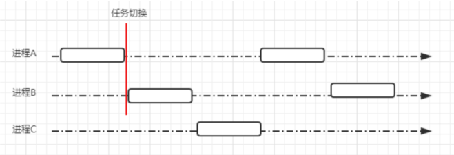

有了进程以后，可以让操作系统从宏观层面实现多应用并发。而并发的实现是通过 CPU 时间片不端切换执行的。对于单核 CPU 来说，在任意一个时刻只会有一个进程在被CPU 调度

> 单核CPU也是可以支持多线程 -> CPU的时间片切换

**线程的出现** 

有了进程以后，为什么还会发明线程呢？

1. 在多核 CPU 中，利用多线程可以实现真正意义上的并行执行

2. 在一个应用进程中，会存在多个同时执行的任务，如果其中一个任务被阻塞，将会引起不依赖该任务的任务也被阻塞。通过对不同任务创建不同的线程去处理，可以提升程序处理的实时性

3. 线程可以认为是轻量级的进程，所以线程的创建、销毁比进程更快


## 2. 线程的使用

线程数量如何提高服务端的并发数量？

- 网络请求分发的场景

- 文件导入并行处理
- 短信发送场景

在 Java 中，有多种方式来实现多线程。继承 Thread 类、实现 Runnable 接口、使用 ExecutorService、Callable/Future 实现带返回结果的多线程。

**继承 Thread 类创建线程** 

Thread 类本质上是实现了 Runnable 接口的一个实例，代表一个线程的实例。启动线程的唯一方法就是通过 Thread类的 start()实例方法。start()方法是一个 native 方法，它会启动一个新线程，并执行 run()方法。这种方式实现多线程很简单，通过自己的类直接 extend Thread，并复写 run()方法，就可以启动新线程并执行自己定义的 run()方法。

```java
public class MyThread extends Thread{

    @Override
    public void run() {
        System.out.println("MyThread.run ...");
    }
    public static void main(String[] args) {
        MyThread myThread1 = new MyThread();
        MyThread myThread2 = new MyThread();
        myThread1.start();
        myThread2.start();
    }
}
```

**实现 Runnable 接口创建线程** 

如果自己的类已经 extends 另一个类，就无法直接 extends Thread，此时，可以实现一个 Runnable 接口

```java
public class MyThreadRunnable extends OtherClass implements Runnable {
    @Override
    public void run() {
        System.out.println("MyThreadRunnable run ...");
    }
}
```

**实现 Callable 接口通过 FutureTask 包装器来创建 Thread 线程** 

有的时候，我们可能需要让一步执行的线程在执行完成以后，提供一个返回值给到当前的主线程，主线程需要依赖这个值进行后续的逻辑处理，那么这个时候，就需要用到带返回值的线程了。Java 中提供了这样的实现方式

```java
public class CallableDemo implements Callable<String> {
    @Override
    public String call() throws Exception {
        int a = 1;
        int b = 1;
        System.out.println(a + b);
        return "执行结果" + (a + b);
    }

    public static void main(String[] args) {
        try {
            ExecutorService executorService = Executors.newFixedThreadPool(1);
            Future<String> future = executorService.submit(new CallableDemo());
            System.out.println(future.get());
            executorService.shutdown();
            // 注意不应该使用executorService.shutdownNow()， 相当于kill -9
        } catch (InterruptedException e) {
            e.printStackTrace();
        } catch (ExecutionException e) {
            e.printStackTrace();
        }
    }
}
```

### 多线程的实际应用场景

其实大家在工作中应该很少有场景能够应用多线程了，因为基于业务开发来说，很多使用异步的场景我们都通过分布式消息队列来做了。但并不是说多线程就不会被用到，你们如果有看一些框架的源码，会发现线程的使用无处不在之前我应用得比较多的场景是在做文件跑批，每天会有一些比如收益文件、对账文件，我们会有一个定时任务去拿到数据然后通过线程去处理。

### Java 并发编程的基础

基本应用搞清楚以后，我们再来基于Java线程的基础切入，来逐步去深入挖掘线程的整体模型。

#### 多线程的特性

- 异步
- 并行

#### 线程的生命周期

Java 线程既然能够创建，那么也势必会被销毁，所以线程是存在生命周期的，那么我们接下来从线程的生命周期开始去了解线程。

线程一共有 6 种状态（NEW、RUNNABLE、BLOCKED、WAITING、TIME_WAITING、TERMINATED）

NEW：初始状态，线程被构建，但是还没有调用 start 方法

RUNNABLED：运行状态，JAVA 线程把操作系统中的就绪和运行两种状态统一称为“运行中”

BLOCKED：阻塞状态，表示线程进入等待状态,也就是线程因为某种原因放弃了 CPU 使用权，阻塞也分为几种情况

➢ 等待阻塞：运行的线程执行 wait 方法，jvm 会把当前线程放入到等待队列

➢ 同步阻塞：运行的线程在获取对象的同步锁时，若该同步锁被其他线程锁占用了，那么 jvm 会把当前的线程放入到锁池中

➢ 其他阻塞：运行的线程执行 Thread.sleep 或者 t.join 方法，或者发出了 I/O 请求时，JVM 会把当前线程设置为阻塞状态，当 sleep 结束、join 线程终止、io 处理完毕则线程恢复

TIME_WAITING：超时等待状态，超时以后自动返回

TERMINATED：终止状态，表示当前线程执行完毕

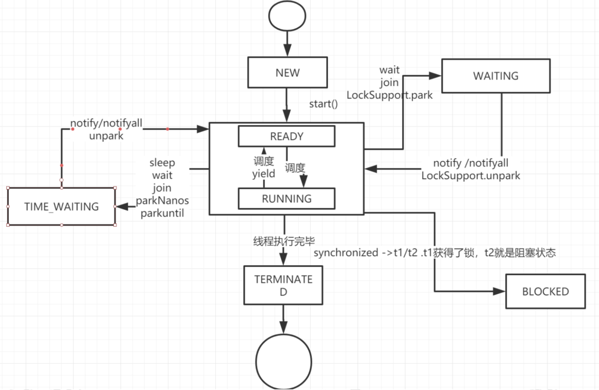


通过代码演示线程的状态

```java
public class ThreadStatus {

    public static void main(String[] args) {

        // time_waiting
        new Thread(() -> {
            while (true) {
                try {
                    TimeUnit.SECONDS.sleep(100);
                } catch (InterruptedException e) {
                    e.printStackTrace();
                }
            }
        }, "time_waiting").start();

        // waiting , 线程 ThreadStatus 类锁上通过 wait 进行等待
        new Thread(() -> {
            while (true) {
                synchronized (ThreadStatus.class) {
                    try {
                        ThreadStatus.class.wait();
                    } catch (InterruptedException e) {
                        e.printStackTrace();
                    }
                }
            }
        }, "waiting").start();

        // 线程在 ThreadStatus 加锁后， 不会释放锁
        new Thread(new BlockedDemo(), "BlockDemo-01").start();
        new Thread(new BlockedDemo(), "BlockDemo-02").start();
    }
    static class BlockedDemo implements Runnable {
        @Override
        public void run() {
            synchronized (BlockedDemo.class) {
                while (true) {
                    try {
                        TimeUnit.SECONDS.sleep(100);
                    } catch (InterruptedException e){
                        e.printStackTrace();
                    }
                }
            }
        }
	}
}
```

启动一个线程前，最好为这个线程设置线程名称，因为这样在使用 jstack 分析程序或者进行问题排查时，就会给开发人员提供一些提示

显示线程的状态

> 运行该示例，打开终端或者命令提示符，键入“jps”， （JDK1.5 提供的一个显示当前所有 java 进程 pid 的命令） 

> 根据上一步骤获得的 pid，继续输入 jstack pid（jstack是 java 虚拟机自带的一种堆栈跟踪工具。jstack 用于打印出给定的 java 进程 ID 或 core file 或远程调试服务的 Java 堆栈信息）

通过上面的分析，我们了解到了线程的生命周期，现在在整个生命周期中并不是固定的处于某个状态，而是随着代码的执行在不同的状态之间进行切换

线程的启动

前面我们通过一些案例演示了线程的启动，也就是调用start()方法去启动一个线程，当 run 方法中的代码执行完毕以后，线程的生命周期也将终止。调用 start 方法的语义是当前线程告诉 JVM，启动调用 start 方法的线程。

**线程的启动原理**

很多同学最早学习线程的时候会比较疑惑，启动一个线程为什么是调用 start 方法，而不是 run 方法，这做一个简单的分析，先简单看一下 start 方法的定义

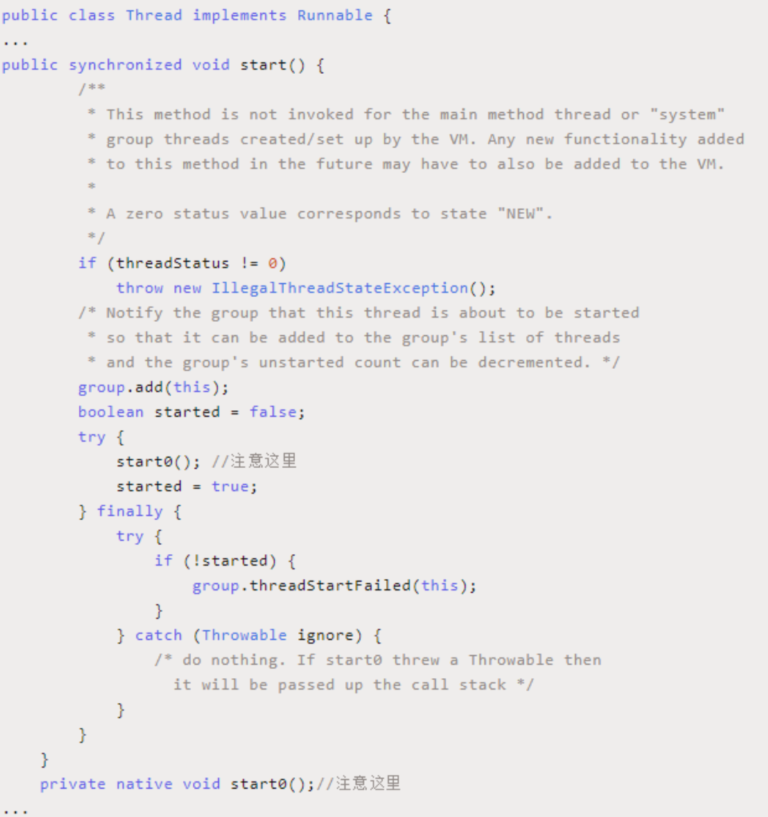

我们看到调用 start 方法实际上是调用一个 native 方法start0()来启动一个线程，首先 start0()这个方法是在Thread 的静态块中来注册的，代码如下

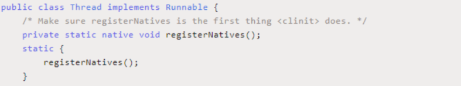

registerNatives 的 本 地 方 法 的 定 义 在 文 件Thread.c,Thread.c 定义了各个操作系统平台要用的关于线程的公共数据和操作，以下是 Thread.c 的全部内容

http://hg.openjdk.java.net/jdk8/jdk8/jdk/file/00cd9dc3c2b5/src/share/native/java/lang/Thread.c

```
static JNINativeMethod methods[] = {
    {"start0",           "()V",        (void *)&JVM_StartThread},
    {"stop0",            "(" OBJ ")V", (void *)&JVM_StopThread},
    {"isAlive",          "()Z",        (void *)&JVM_IsThreadAlive},
    {"suspend0",         "()V",        (void *)&JVM_SuspendThread},
    {"resume0",          "()V",        (void *)&JVM_ResumeThread},
    {"setPriority0",     "(I)V",       (void *)&JVM_SetThreadPriority},
    {"yield",            "()V",        (void *)&JVM_Yield},
    {"sleep",            "(J)V",       (void *)&JVM_Sleep},
    {"currentThread",    "()" THD,     (void *)&JVM_CurrentThread},
    {"countStackFrames", "()I",        (void *)&JVM_CountStackFrames},
    {"interrupt0",       "()V",        (void *)&JVM_Interrupt},
    {"isInterrupted",    "(Z)Z",       (void *)&JVM_IsInterrupted},
    {"holdsLock",        "(" OBJ ")Z", (void *)&JVM_HoldsLock},
    {"getThreads",        "()[" THD,   (void *)&JVM_GetAllThreads},
    {"dumpThreads",      "([" THD ")[[" STE, (void *)&JVM_DumpThreads},
};

#undef THD
#undef OBJ
#undef STE

JNIEXPORT void JNICALL
Java_java_lang_Thread_registerNatives(JNIEnv *env, jclass cls)
{
    (*env)->RegisterNatives(env, cls, methods, ARRAY_LENGTH(methods));
}
```

从 这 段 代 码 可 以 看 出 ， start0() ， 实 际 会 执 行JVM_StartThread 方法，这个方法是干嘛的呢？ 从名字上来看，似乎是在 JVM 层面去启动一个线程，如果真的是这样，那么在 JVM 层面，一定会调用 Java 中定义的 run 方法。那接下来继续去找找答案。我们找到 jvm.cpp 这个文件；这个文件需要下载 hotspot 的源码才能找到。

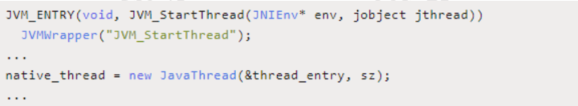

JVM_ENTRY 是用来定义 JVM_StartThread 函数的，在这个函数里面创建了一个真正和平台有关的本地线程. 本着打破砂锅查到底的原则，继续看看 newJavaThread 做了什么事情,继续寻找 JavaThread 的定义在 hotspot 的源码中 thread.cpp 文件中 1558 行的位置可以找到如下代码

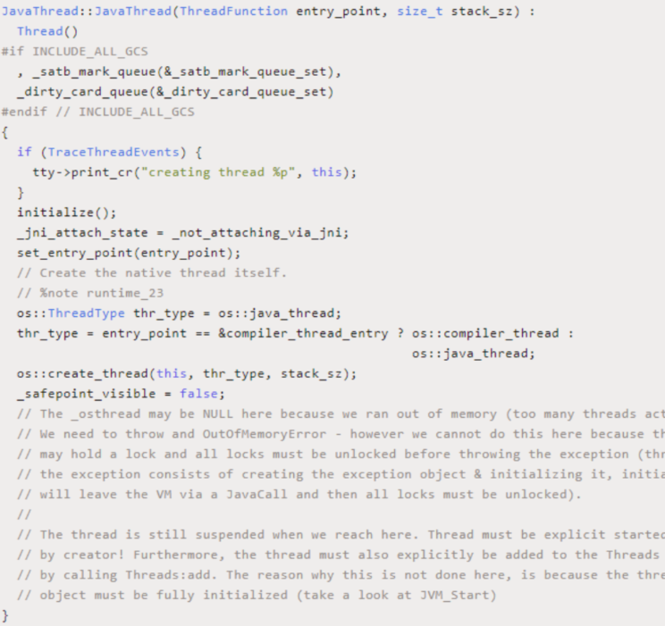

这个方法有两个参数，第一个是函数名称，线程创建成功之后会根据这个函数名称调用对应的函数；第二个是当前进程内已经有的线程数量。最后我们重点关注与一下os::create_thread,实际就是调用平台创建线程的方法来创建线程。

接下来就是线程的启动，会调用 Thread.cpp 文件中的Thread::start(Thread* thread)方法，代码如下

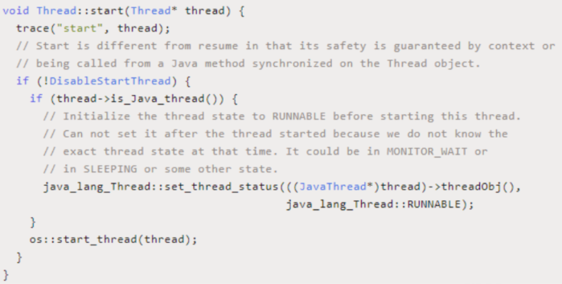

start 方法中有一个函数调用： os::start_thread(thread); 调用平台启动线程的方法，最终会调用 Thread.cpp 文件中的 JavaThread::run()方法

**线程的终止** 

线程的启动过程大家都非常熟悉，但是如何终止一个线程呢？ 这是面试过程中针对 3 年左右的人喜欢问到的一个

题目。线程的终止，并不是简单的调用 stop 命令去。虽然 api 仍然可以调用，但是和其他的线程控制方法如 suspend、resume 一样都是过期了的不建议使用，就拿 stop 来说，stop 方法在结束一个线程时并不会保证线程的资源正常释放，因此会导致程序可能出现一些不确定的状态。

要优雅的去中断一个线程，在线程中提供了一个 interrupt方法

**interrupt 方法**

当其他线程通过调用当前线程的 interrupt 方法，表示向当前线程打个招呼，告诉他可以中断线程的执行了，至于什么时候中断，取决于当前线程自己。线程通过检查资深是否被中断来进行相应，可以通过isInterrupted()来判断是否被中断。

通过下面这个例子，来实现了线程终止的逻辑

```java
public class InterruptDemo {

    private static int i;
    public static void main(String[] args) throws InterruptedException {
        Thread thread = new Thread(() -> {
            while (!Thread.currentThread().isInterrupted()) { //默认情况下 isInterrupted 返回 false、通过 thread.interrupt 变成了 true
                i++;
            }
            System.out.println("Num:" + i);
        }, "interruptDemo");
        thread.start();
        TimeUnit.SECONDS.sleep(1);
        thread.interrupt(); //加和不加的效果

    }
}
```

这种通过标识位或者中断操作的方式能够使线程在终止时有机会去清理资源，而不是武断地将线程停止，因此这种终止线程的做法显得更加安全和优雅。

**Thread.interrupted**

上面的案例中，通过 interrupt，设置了一个标识告诉线程可 以 终 止 了 ， 线 程 中 还 提 供 了 静 态 方 法Thread.interrupted()对设置中断标识的线程复位。比如在上面的案例中，外面的线程调用 thread.interrupt 来设置中断标识，而在线程里面，又通过 Thread.interrupted 把线程的标识又进行了复位

```java
public class InterruptDemo2 {

    public static void
    main(String[] args) throws
            InterruptedException {
        Thread thread = new
                Thread(() -> {
            while (true) {
                if (Thread.currentThread().isInterrupted()) {
                    System.out.println("before:" + Thread.currentThread().isInterrupted());
                    Thread.interrupted(); //对线程进行复位，由 true 变成 false
                    System.out.println("after:" + Thread
                            .currentThread().isInterrupted());
                }
            }
        }, "interruptDemo");
        thread.start();
        TimeUnit.SECONDS.sleep(1);
        thread.interrupt();
    }
}
```

**其他的线程复位**

除了通过 Thread.interrupted 方法对线程中断标识进行复位 以 外 ， 还 有 一 种 被 动 复 位 的 场 景 ， 就 是 对 抛 出InterruptedException 异 常 的 方 法 ， 在InterruptedException 抛出之前，JVM 会先把线程的中断标识位清除，然后才会抛出 InterruptedException，这个时候如果调用 isInterrupted 方法，将会返回 false

**为什么要复位**

Thread.interrupted()是属于当前线程的，是当前线程对外界中断信号的一个响应，表示自己已经得到了中断信号，但不会立刻中断自己，具体什么时候中断由自己决定，让外界知道在自身中断前，他的中断状态仍然是 false，这就是复位的原因。

**线程的终止原理**

我们来看一下 thread.interrupt()方法做了什么事情

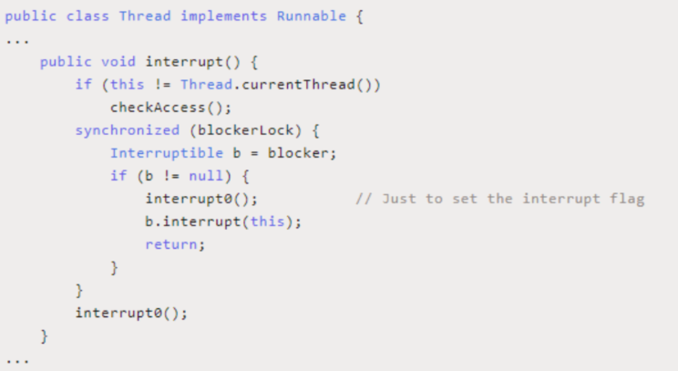

这个方法里面，调用了 interrupt0()，这个方法在前面分析start 方法的时候见过，是一个 native 方法，这里就不再重复贴代码了，同样，我们找到 jvm.cpp 文件，找到JVM_Interrupt 的定义

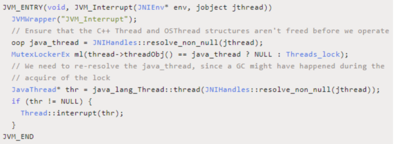

这个方法比较简单，直接调用了 Thread::interrupt(thr)这个方法，这个方法的定义在 Thread.cpp 文件中，代码如下

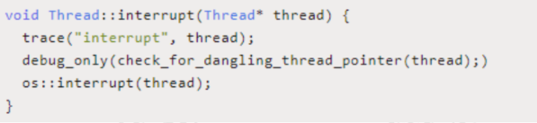

Thread::interrupt 方法调用了 os::interrupt 方法，这个是调用平台的 interrupt 方法，这个方法的实现是在 os_*.cpp文件中，其中星号代表的是不同平台，因为 jvm 是跨平台的，所以对于不同的操作平台，线程的调度方式都是不一样的。我们以 os_linux.cpp 文件为例

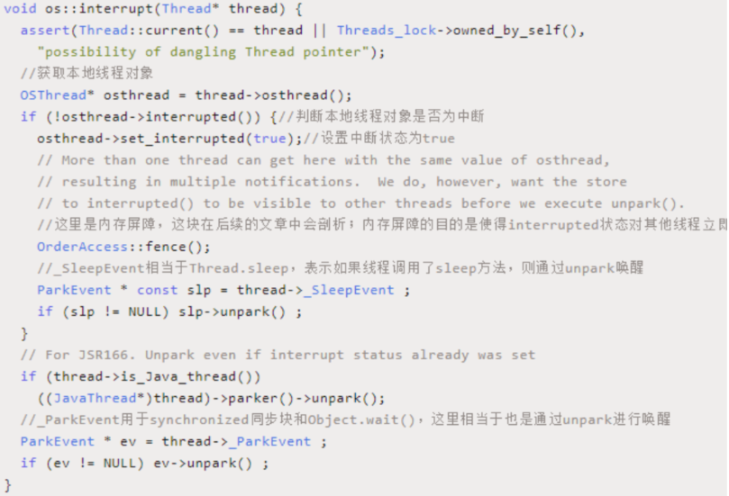

set_interrupted(true)实际上就是调用 osThread.hpp 中的set_interrupted()方法，在 osThread 中定义了一个成员属性 volatile jint _interrupted;

通过上面的代码分析可以知道，thread.interrupt()方法实际就是设置一个 interrupted 状态标识为 true、并且通过ParkEvent 的 unpark 方法来唤醒线程。

1. 对于 synchronized 阻塞的线程，被唤醒以后会继续尝试获取锁，如果失败仍然可能被 park

2. 在调用 ParkEvent 的 park 方法之前，会先判断线程的中断状态，如果为 true，会清除当前线程的中断标识

3. Object.wait 、 Thread.sleep 、 Thread.join 会 抛 出InterruptedException


这里给大家普及一个知识点，为什么 Object.wait、Thread.sleep和 Thread.join都会抛出InterruptedException? 你会发现这几个方法有一个共同点，都是属于阻塞的方法而阻塞方法的释放会取决于一些外部的事件，但是阻塞方法可能因为等不到外部的触发事件而导致无法终止，所以它允许一个线程请求自己来停止它正在做的事情。当一个方法抛出 InterruptedException 时，它是在告诉调用者如果执行该方法的线程被中断，它会尝试停止正在做的事情并且通过抛出 InterruptedException 表示提前返回。所以，这个异常的意思是表示一个阻塞被其他线程中断了。然 后 ， 由 于 线 程 调 用 了 interrupt() 中 断 方 法 ， 那 么Object.wait、Thread.sleep 等被阻塞的线程被唤醒以后会通过 is_interrupted 方法判断中断标识的状态变化，如果发现中断标识为 true，则先清除中断标识，然后抛出InterruptedException需要注意的是，InterruptedException 异常的抛出并不意味着线程必须终止，而是提醒当前线程有中断的操作发生，至于接下来怎么处理取决于线程本身，比如

1. 直接捕获异常不做任何处理

2. 将异常往外抛出

3. 停止当前线程，并打印异常信息

为 了 让 大 家 能 够 更 好 的 理 解 上 面 这 段 话 ， 我 们 以Thread.sleep 为例直接从 jdk 的源码中找到中断标识的清除以及异常抛出的方法代码找 到 is_interrupted() 方法， linux 平 台 中 的 实 现 在os_linux.cpp 文件中，代码如下

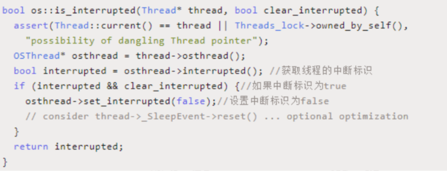

找到 Thread.sleep 这个操作在 jdk 中的源码体现，怎么找?

相信如果前面大家有认真看的话，应该能很快找到，代码在 jvm.cpp 文件中

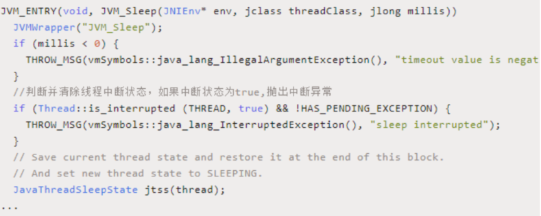

注意上面加了中文注释的地方的代码，先判断is_interrupted 的 状 态 ， 然 后 抛 出 一 个InterruptedException 异常。到此为止，我们就已经分析清楚了中断的整个流程

