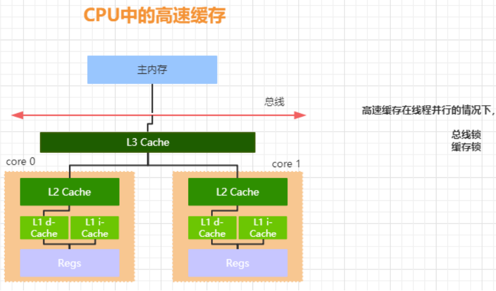
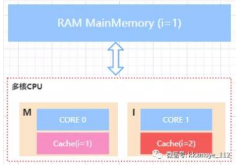
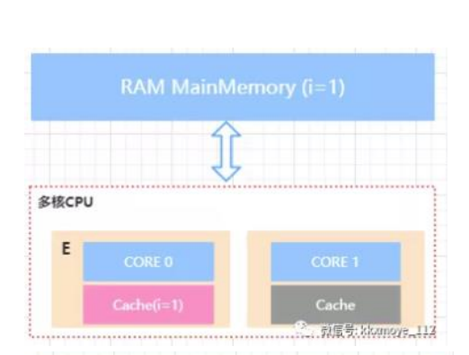
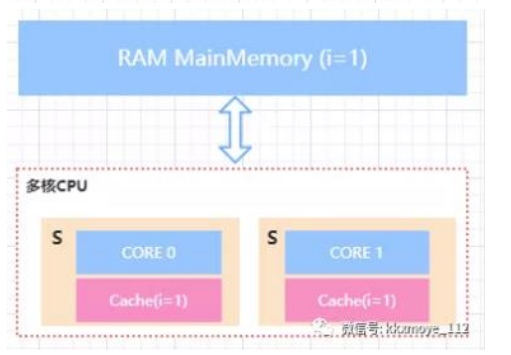
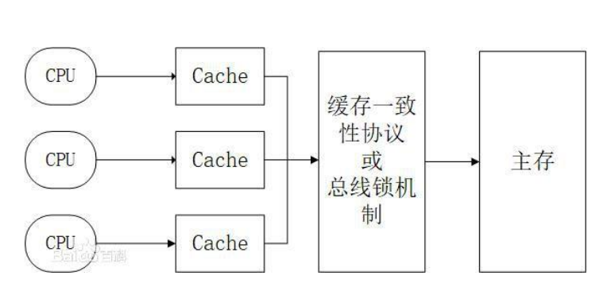
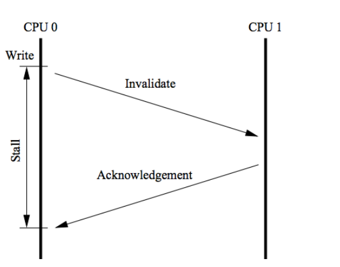
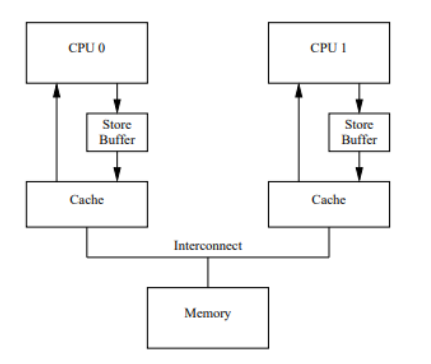
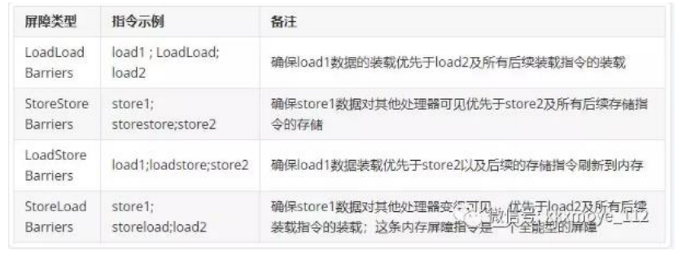

# 探索线程安全性背后的本质

## 一个问题引发的思考

```java
public static void main(String[] args) throws InterruptedException {

    Thread thread = new Thread(() -> {

        int i = 0;
        while (!stop) {
            i ++;
        }
        System.out.println(i);
    });

    thread.start();
    Thread.sleep(1000);
    stop = true;
}
```


### print就可以导致循环结束

```java
public static void main(String[] args) throws InterruptedException {

    Thread thread = new Thread(() -> {

        int i = 0;
        while (!stop) {
            i ++;
            System.out.println(i);
        }
        // System.out.println(i);
    });

    thread.start();
    Thread.sleep(1000);
    stop = true;
}
```

其实是即时编译器 JIT 优化的

结果是

```java
if (!stop) {
    while (true) {
        i ++;
    }
}
```

获取我们设置编译器参数： -Djava.comiler=NONE, 同样可以结束

why???

查看 System.out.println 代码发现：

```java
public void println(int x) {
    synchronized (this) {
        print(x);
        newLine();
    }
}
```

print 方法有两个操作：

- IO操作  

- synchronized 

IO  会导致读写磁盘， 影响操作系统阻塞， 所以和IO也有关系, 我们发现随便创建一个文件也会结束

```java
new File("txt.txt")
```


synchronized 关键字也会影响， 我们会发现， 随便加个锁， 也会结束

```java
synchronized （this） {

} 
```

深度优化


### Thread.sleep

```java
public static void main(String[] args) throws InterruptedException {

    Thread thread = new Thread(() -> {

        int i = 0;
        while (!stop) {
            i ++;
            try {
                Thread.sleep(0);
            } catch (InterruptedException e) {
                e.printStackTrace();
            }
        }
    });

    thread.start();
    Thread.sleep(1000);
    stop = true;
}
```

Thread.sleep(0) 也会导致结束， 为什么？ 会导致线程切换， 操作系统会重新分配资源， 导致原本的缓存失效， 所以会重新加载资源


## volatile 关键字（保证可见性）

```java
public class VolatileDemo {

    private volatile static boolean stop = false;

    public static void main(String[] args) throws InterruptedException {

        Thread thread = new Thread(() -> {

            int i = 0;
            while (!stop) {
                i ++;
            }
        });

        thread.start();
        Thread.sleep(1000);
        stop = true;
    }

}
```

volatile  导致线程结束， 获取我们给 i 设置volatile 关键字也是可以的

```java
private volatile static int i = 0;
```


## lock 汇编指令来保证可见性

我们使用一个工具hsdis-amd64  参数看汇编指令：

1. 解压压缩文件，讲解压的内容放到`JRE_HOME/bin/server`路径下
2. 在运行main函数之前，加入虚拟机参数

> -server -Xcomp -XX:+UnlockDiagnosticVMOptions -XX:+PrintAssembly -XX:CompileCommand=compileonly,`VolatileDemo.*`

【（替换成实际运行的代码）】

注意： 是在 jdk1.8.0_231\jre\bin\server  


```
0x000000000382884f: lock add dword ptr [rsp],0h  ;*putfield declaredMethods
                                                ; - java.lang.Class::privateGetDeclaredMethods@62 (line 2706
```

我们发现有个 lock  的汇编指令

把volatile 关键词去掉了， 就没有这个指令


## 什么是可见性

线程A  修改了一个共享值， 线程B 可见

## 硬件层面

CPU/内存/IO设备

- CPU层面增加了高速缓存
- 操作系统、进程、线程 | CPU的时间片切换
- 编译器的优化， 更合理的利用CUP的高速缓存

### CUP 中的高速缓存



CUP > 一级缓存(高速缓存 d区， i 区)  > 二级缓存(高速缓存) >  三级缓存 >  内存

首先，有了高速缓存的存在以后，每个 CPU 的处理过程是，先将计算需要用到的数据缓存在 CPU 高速缓存中，在 CPU进行计算时，直接从高速缓存中读取数据并且在计算完成之后写入到缓存中。在整个运算过程完成后，再把缓存中的数据同步到主内存由于在多 CPU 种，每个线程可能会运行在不同的 CPU 内，并且每个线程拥有自己的高速缓存。同一份数据可能会被缓存到多个 CPU 中，如果在不同 CPU 中运行的不同线程看到同一份内存的缓存值不一样就会存在缓存不一致的问题为了解决缓存不一致的问题，在 CPU 层面做了很多事情，主要提供了两种解决办法：

- 总线锁   三级 缓存 加总线锁

- 缓存锁   x86 架构引入 缓存锁 ， 其实是较低了锁的颗粒度， 提高性能

什么时候用缓存锁， 什么时候用总线锁？

- CUP的架构是否支持
- 当前数据是否存在于缓存行

总线锁，简单来说就是，在多 cpu 下，当其中一个处理器要对共享内存进行操作的时候，在总线上发出一个 LOCK#信号，这个信号使得其他处理器无法通过总线来访问到共享内存中的数据，总线锁定把 CPU 和内存之间的通信锁住了，这使得锁定期间，其他处理器不能操作其他内存地址的数据，所以总线锁定的开销比较大，这种机制显然是不合适的。

如何优化呢？最好的方法就是控制锁的保护粒度，我们只需要保证对于被多个 CPU 缓存的同一份数据是一致的就行。所以引入了缓存锁，它核心机制是基于缓存一致性协议来实现的

### 缓存一致性协议

为了达到数据访问的一致，需要各个处理器在访问缓存时遵循一些协议，在读写时根据协议来操作，常见的协议有MSI，MESI，MOSI 等。最常见的就是 MESI 协议。接下来给大家简单讲解一下 MESI

MESI 表示缓存行的四种状态，分别是

- **Modify 修改** 表示共享数据只缓存在当前 CPU 缓存中，并且是被修改状态，也就是缓存的数据和主内存中的数据不一致

- **Exclusive 独占**  表示缓存的独占状态，数据只缓存在当前CPU 缓存中，并且没有被修改

- **Shared 共享** 表示数据可能被多个 CPU 缓存，并且各个缓存中的数据和主内存数据一致

- **Invalid 失效** 表示缓存已经失效

在 MESI 协议中，每个缓存的缓存控制器不仅知道自己的读写操作，而且也监听(snoop)其它 Cache 的读写操作







对于 MESI 协议，从 CPU 读写角度来说会遵循以下原则：

CPU 读请求：缓存处于 M、E、S 状态都可以被读取，I 状 态 CPU 只能从主存中读取数据

CPU 写请求：缓存处于 M、E 状态才可以被写。对于 S 状态的写，需要将其他 CPU 中缓存行置为无效才可写

使用总线锁和缓存锁机制之后，CPU 对于内存的操作大概可以抽象成下面这样的结构。从而达到缓存一致性效果



**总结可见性的本质** 

由于 CPU 高速缓存的出现使得 如果多个 cpu 同时缓存了相同的共享数据时，可能存在可见性问题。也就是 CPU0 修改了自己本地缓存的值对于 CPU1 不可见。不可见导致的后果是 CPU1 后续在对该数据进行写入操作时，是使用的脏数据。使得数据最终的结果不可预测。很多同学肯定希望想在代码里面去模拟一下可见性的问题，实际上，这种情况很难模拟。因为我们无法让某个线程指定某个特定 CPU，这是系统底层的算法， JVM 应该也是没法控制的。还有最重要的一点，就是你无法预测 CPU 缓 存什么时候会把值传给主存，可能这个时间间隔非常短，短到你无法观察到。最后就是线程的执行的顺序问题，因为多线程你无法控制哪个线程的某句代码会在另一个线程的某句代码后面马上执行。

所以我们只能基于它的原理去了解这样一个存在的客观事实

了解到这里，大家应该会有一个疑问，刚刚不是说基于缓存一致性协议或者总线锁能够达到缓存一致性的要求吗？为什么还需要加 volatile 关键字？或者说为什么还会存在可见性问题呢？


### MESI 优化带来的可见性问题 

MESI 协议虽然可以实现缓存的一致性，但是也会存在一些问题。

就是各个 CPU 缓存行的状态是通过消息传递来进行的。如 果 CPU0 要对一个在缓存中共享的变量进行写入，首先需要发送一个失效的消息给到其他缓存了该数据的 CPU。并且要等到他们的确认回执。CPU0 在这段时间内都会处于阻塞状态。为了避免阻塞带来的资源浪费。在 cpu 中引入了 Store Bufferes。



CPU0 只需要在写入共享数据时，直接把数据写入到 storebufferes 中，同时发送 invalidate 消息，然后继续去处理其他指令。

当收到其他所有 CPU 发送了 invalidate acknowledge 消息时，再将 store bufferes 中的数据数据存储至 cache line中。最后再从缓存行同步到主内存。



但是这种优化存在两个问题

1. 数据什么时候提交是不确定的，因为需要等待其他 cpu给回复才会进行数据同步。这里其实是一个异步操作

2. 引入了 storebufferes 后，处理器会先尝试从 storebuffer中读取值，如果 storebuffer 中有数据，则直接从storebuffer 中读取，否则就再从缓存行中读取

我们来看一个例子

```java
value = 3;
void exeToCUP0() {
  value = 10;
  isFinsh = true;
}
void exeToCUP1() {
    if (isFinsh) {
        assert value == 10;
    }
}
```

exeToCPU0和exeToCPU1分别在两个独立的CPU上执行。假如 CPU0 的缓存行中缓存了 isFinish 这个共享变量，并且状态为（E）、而 Value 可能是（S）状态。那么这个时候，CPU0 在执行的时候，会先把 value=10 的指令写入到storebuffer中。并且通知给其他缓存了该value变量的 CPU。在等待其他 CPU 通知结果的时候，CPU0 会继续执行 isFinish=true 这个指令。而因为当前 CPU0 缓存了 isFinish 并且是 Exclusive 状态,所以可以直接修改 isFinish=true。这个时候 CPU1 发起 read操作去读取 isFinish 的值可能为 true，但是 value 的值不等于 10。

这种情况我们可以认为是 CPU 的乱序执行，也可以认为是一种重排序，而这种重排序会带来可见性的问题

这下硬件工程师也抓狂了，我们也能理解，从硬件层面很难去知道软件层面上的这种前后依赖关系，所以没有办法通过某种手段自动去解决。

所以硬件工程师就说： 既然怎么优化都不符合你的要求，要不你来写吧。

所以在 CPU 层面提供了 memory barrier(内存屏障)的指令，从硬件层面来看这个 memroy barrier 就是 CPU flush store bufferes 中的指令。软件层面可以决定在适当的地方来插入内存屏障。

### **CPU 层面的内存屏障** 

什么是内存屏障?从前面的内容基本能有一个初步的猜想，内存屏障就是将 store bufferes 中的指令写入到内存，从而使得其他访问同一共享内存的线程的可见性。X86 的 memory barrier 指令包括 lfence(读屏障) sfence(写屏障) mfence(全屏障)

Store Memory Barrier(写屏障) 告诉处理器在写屏障之前的所有已经存储在存储缓存(store bufferes)中的数据同步到主内存，简单来说就是使得写屏障之前的指令的结果对屏障之后的读或者写是可见的Load Memory Barrier(读屏障) 处理器在读屏障之后的读操作,都在读屏障之后执行。配合写屏障，使得写屏障之前的内存更新对于读屏障之后的读操作是可见的Full Memory Barrier(全屏障) 确保屏障前的内存读写操作的结果提交到内存之后，再执行屏障后的读写操作有了内存屏障以后，对于上面这个例子，我们可以这么来改，从而避免出现可见性问题

```java
value = 3;
void exeToCUP0() {
    value = 10;
    storeMemoryBarrier(); // 这个是一个伪代码， 插入一个写屏障， 使得value=10 这个值强制写入到住内存
    isFinsh = true;
}
void exeToCUP1() {
    if (isFinsh) {
        loadMemoryBarrier(); // 伪代码， 插入一个读屏障， 使得cup1从主内存中获得最新的数据
        assert value == 10;
    }
}
```

总的来说，内存屏障的作用可以通过防止 CPU 对内存的乱序访问来保证共享数据在多线程并行执行下的可见性但是这个屏障怎么来加呢？回到最开始我们讲 volatile 关键字的代码，这个关键字会生成一个 Lock 的汇编指令，这个指令其实就相当于实现了一种内存屏障

这个时候问题又来了，内存屏障、重排序这些东西好像是和平台以及硬件架构有关系的。作为 Java 语言的特性，一次编写多处运行。我们不应该考虑平台相关的问题，并且这些所谓的内存屏障也不应该让程序员来关心。

防止指令重排序， 禁止指令重排 volatile final 

我们在代码中加了 volatile 关键字 相当于内存屏障，禁止了指令重排序。提供可见性

Lock 指令 内存屏障


## 软件层面

### JMM  Java内存模型

JMM 全称是 Java Memory Model. 什么是 JMM 呢？通过前面的分析发现，导致可见性问题的根本原因是缓存以及重排序。 而 JMM 实际上就是提供了合理的禁用缓存以及禁止重排序的方法。所以它最核心的价值在于解决可见性和有序性。JMM 属于语言级别的抽象内存模型，可以简单理解为对硬件模型的抽象，它定义了共享内存中多线程程序读写操作的行为规范：在虚拟机中把共享变量存储到内存以及从内存中取出共享变量的底层实现细节通过这些规则来规范对内存的读写操作从而保证指令的正确性，它解决了 CPU 多级缓存、处理器优化、指令重排序导致的内存访问问题，保证了并发场景下的可见性。

需要注意的是，JMM 并没有限制执行引擎使用处理器的寄存器或者高速缓存来提升指令执行速度，也没有限制编译器对指令进行重排序，也就是说在 JMM 中，也会存在缓存一致性问题和指令重排序问题。只是 JMM 把底层的问题抽象到 JVM 层面，再基于 CPU 层面提供的内存屏障指令，以及限制编译器的重排序来解决并发问题

JMM 抽象模型分为主内存、工作内存；主内存是所有线程共享的，一般是实例对象、静态字段、数组对象等存储在堆内存中的变量。工作内存是每个线程独占的，线程对变量的所有操作都必须在工作内存中进行，不能直接读写主内存中的变量，线程之间的共享变量值的传递都是基于主内存来完成

Java 内存模型底层实现可以简单的认为：通过内存屏障(memory barrier)禁止重排序，即时编译器根据具体的底层体系架构，将这些内存屏障替换成具体的 CPU 指令。对于编译器而言，内存屏障将限制它所能做的重排序优化。而对于处理器而言，内存屏障将会导致缓存的刷新操作。比如，对于 volatile，编译器将在 volatile 字段的读写操作前后各插入一些内存屏障。


### **JMM 是如何解决可见性有序性问题的**

简单来说，JMM 提供了一些禁用缓存以及进制重排序的方法，来解决可见性和有序性问题。这些方法大家都很熟悉：volatile、synchronized、final 

### volatile 关键字

javap -v Demo.class  我们发现被 volatile 修饰的关键字会加上 ACC_VOLATILE  关键字


### **JMM 如何解决顺序一致性问题** 

**重排序问题**

为了提高程序的执行性能，编译器和处理器都会对指令做重排序，其中处理器的重排序在前面已经分析过了。所谓的重排序其实就是指执行的指令顺序。

编译器的重排序指的是程序编写的指令在编译之后，指令可能会产生重排序来优化程序的执行性能。

从源代码到最终执行的指令，可能会经过三种重排序。


2 和 3 属于处理器重排序。这些重排序可能会导致可见性问题。

编译器的重排序，JMM 提供了禁止特定类型的编译器重排序。

处理器重排序，JMM 会要求编译器生成指令时，会插入内存屏障来禁止处理器重排序

当然并不是所有的程序都会出现重排序问题编译器的重排序和 CPU 的重排序的原则一样，会遵守数据依赖性原则，编译器和处理器不会改变存在数据依赖关系的两个操作的执行顺序,比如下面的代码

```
a=1; b=a; 
a=1;a=2;
a=b;b=1;
```

这三种情况在单线程里面如果改变代码的执行顺序，都会导致结果不一致，所以重排序不会对这类的指令做优化。这种规则也成为 as-if-serial。不管怎么重排序，对于单个线程来说执行结果不能改变。比如

```
int a=2; //1
int b=3; //2
int rs=a*b; //3
```

1 和 3、2 和 3 存在数据依赖，所以在最终执行的指令中，3 不能重排序到 1 和 2 之前，否则程序会报错。由于 1 和 2不存在数据依赖，所以可以重新排列 1 和 2 的顺序


### **JMM 层面的内存屏障**

为了保证内存可见性，Java 编译器在生成指令序列的适当位置会插入内存屏障来禁止特定类型的处理器的重排序，在 JMM 中把内存屏障分为四类



**HappenBefore** 

它的意思表示的是前一个操作的结果对于后续操作是可见的，所以它是一种表达多个线程之间对于内存的可见性。所以我们可以认为在 JMM 中，如果一个操作执行的结果需要对另一个操作课件，那么这两个操作必须要存在happens-before 关系。这两个操作可以是同一个线程，也可以是不同的线程


### **JMM 中有哪些方法建立 happen-before 规则** 

**程序顺序规则** 

1. 一个线程中的每个操作，happens-before 于该线程中的任意后续操作; 可以简单认为是 as-if-serial。单个线程中的代码顺序不管怎么变，对于结果来说是不变的顺序规则表示 1 happenns-before 2; 3 happens-before 4

```java
class VolatileExample {
    int a = 0;
    volatile boolean flag;
    public void writer() {
        a = 1;                // 第一步1
        flag = true; // 修改
    }
    public void reader() {
        if (flag) { // true
            int i = a; // a = 1
            
        }
    }
}
```


2. volatile 变量规则，对于 volatile 修饰的变量的写的操作，一定 happen-before 后续对于 volatile 变量的读操作；根据 volatile 规则，2 happens before 3

```java
class VolatileExample {
    int a = 0;
    volatile boolean flag;
    public void writer() {
        a = 1;                // 第一步1
        flag = true; // 修改
    }
    public void reader() {
        if (flag) { // true
            int i = a; // a = 1
            
        }
    }
}
```


3. 传递性规则，如果 1 happens-before 2; 3happens-before 4; 那么传递性规则表示: 1 happens-before 4;

```java
class VolatileExample {
    int a = 0;
    volatile boolean flag;
    public void writer() {
        a = 1;                // 第一步1
        flag = true; // 修改
    }
    public void reader() {
        if (flag) { // true
            int i = a; // a = 1
            
        }
    }
}
```


4. start 规则，如果线程 A 执行操作 ThreadB.start(),那么线程 A 的 ThreadB.start()操作 happens-before 线程 B 中的任意操作

```java
public class StartDemo {
    public StartDemo{ 
        int x=0;
        Thread t1 = new Thread(()->{
         // 主线程调用 t1.start() 之前
         // 所有对共享变量的修改，此处皆可见
         // 此例中，x==10
        });
        // 此处对共享变量 x 修改
        x = 10;
        // 主线程启动子线程
        t1.start();
	}
}
```

5. join 规则，如果线程 A 执行操作 ThreadB.join()并成功返回，那么线程 B 中的任意操作 happens-before 于线程A 从 ThreadB.join()操作成功返回。

```java
public class Test {
    public void test() {
        Thread t1 = new Thread(()->{
        	// 此处对共享变量 x 修改
         	x= 100;
        });
        // 例如此处对共享变量修改，
        // 则这个修改结果对线程 t1 可见
        // 主线程启动子线程
        t1.start();
        t1.join()
        // 子线程所有对共享变量的修改
        // 在主线程调用 t1.join() 之后皆可见
        // 此例中，x==100
    }
}
```

6. 监视器锁的规则，对一个锁的解锁，happens-before 于随后对这个锁的加锁

```java
synchronized (this) { // 此处自动加锁
    // x 是共享变量, 初始值 =10
    if (this.x < 12) {
     	this.x = 12; 
     } 
} // 此处自动解锁
```

假设 x 的初始值是 10，线程 A 执行完代码块后 x 的值会变成 12（执行完自动释放锁），线程 B 进入代码块时，能够看到线程 A 对 x 的写操作，也就是线程 B 能够看到 x==12。


final 关键字提供了内存可见性


## 什么是死锁

这四个条件同时满足， 就会产生死锁

- 互斥 共享资源X和Y 只能被同一个线程占有
- 占用且等待 线程T1 已经获得了X的占有， 同时等待共享资源Y的时候,不释放共享资源X
- 不可抢占， 其他线程不能强行抢占线程T1占有的资源
- 循环等待 线程T1等待线程T2占有的资源， 线程T2等待线程T1占有的资源

要解决死锁， 我们只能破坏 占用等待、 不可抢占、循环等待 

方法一：

分配资源统一分配，申请


方法二：

tryLock


方法三：


### Thread.join


## ThreadLocal

线程级别的私有存储


### 线程探测

、

## 面试题

阿里云、菜鸟ThreadLocal 原理

- sleep
- join
- wait
- notify
- yiled
- sleep 触发一次切换


java 中能够创建 volatile 数组吗？

可以创建， volatile 对于应用可见， 


- java  的 ++ 是线程安全的吗？

线程安全体现的是 有序性 原子性 可见性

++ 操作无法满足原子性

- 线程什么时候会抛出InterruptedExecption()

t.interrupt() 去中断一个处于阻塞状态下的线程时（join/sleep/wait）

- java  中Runnable  的 Callable 有什么区别

接口， 不带返回值

- 有 T1 / T2 /T3 三个线程， 如何保证顺序

  join

- Java 内存模型是什么？


- 什么是线程安全

有序性 原子性 可见性

