# JVM前奏篇

## 官网介绍

官网文档 : https://docs.oracle.com/javase/8/

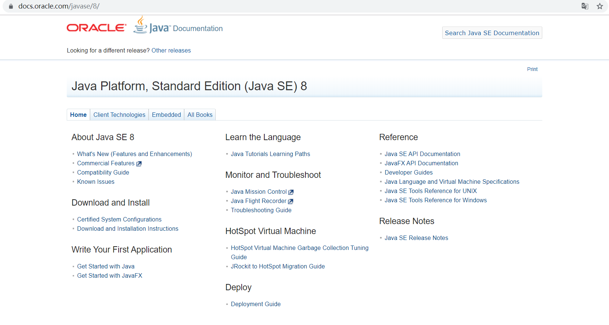

官方网站：[https://www.oracle.com](https://www.oracle.com/index.html)


https://developer.oracle.com/

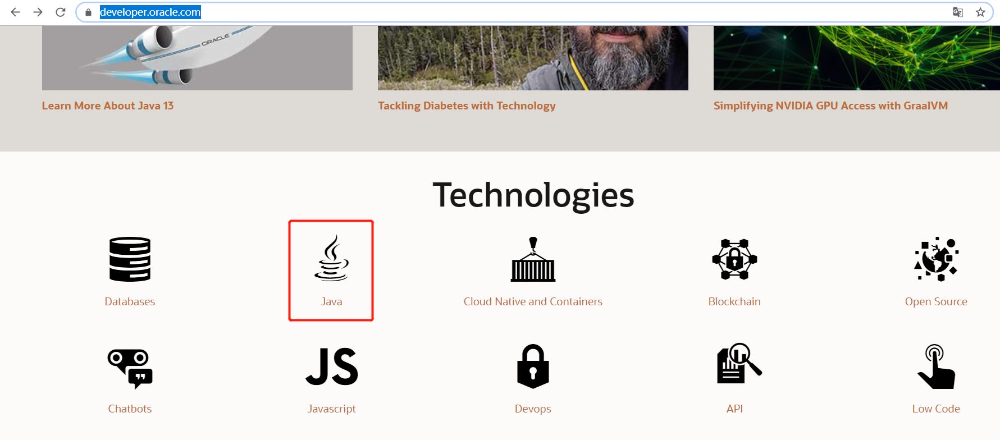

https://developer.oracle.com/java/

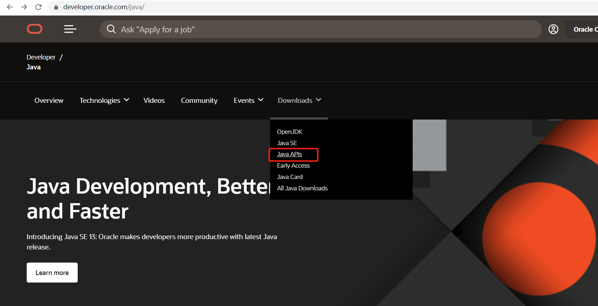

https://docs.oracle.com/en/java/javase/index.html

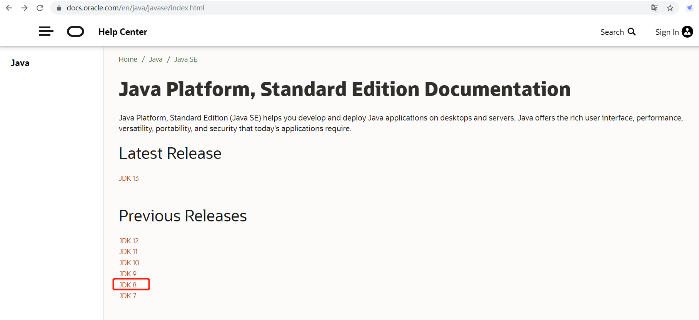

https://docs.oracle.com/javase/8/docs/index.html

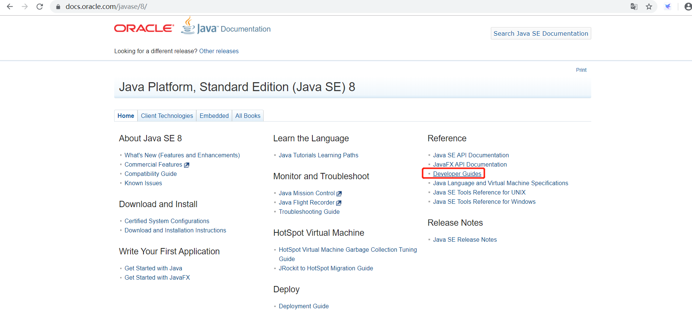


## The relation(关系) of JDK/JRE/JVM 

Reference -> Developer Guides -> 定位到:https://docs.oracle.com/javase/8/docs/index.html 

```
Oracle has two products that implement Java Platform Standard Edition (Java SE) 8: Java SE Development Kit (JDK) 8 and Java SE Runtime Environment (JRE) 8. JDK 8 is a superset of JRE 8, and contains everything that is in JRE 8, plus tools such as the compilers and debuggers necessary for developing applets and applications. JRE 8 provides the libraries, the Java Virtual Machine (JVM), and other components to run applets and applications written in the Java programming language. Note that the JRE includes components not required by the Java SE specification, including both standard and non-standard Java components.
```


The following conceptual diagram illustrates the components of Oracle's Java SE products:

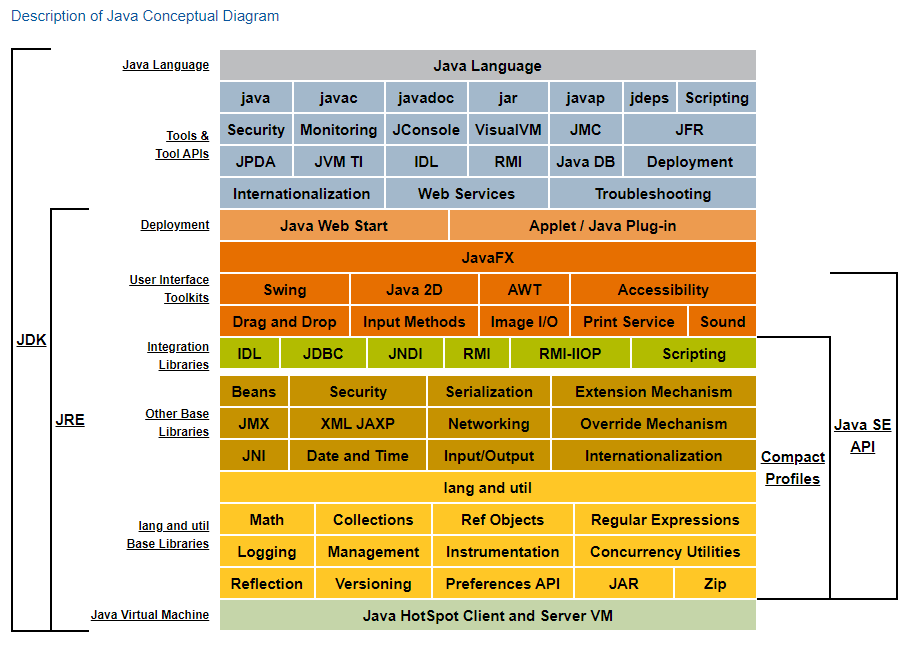

## 源码到类文件

### 源码

我们使用一个Person.java  演示一个java 文件的类加载过程：

```java
public class Person {
    private String name;
    private int age;
    private static String address;
    private final static String hobby = "Programming";
    public void say() {
        System.out.println("person say...");
    }
    public int calc(int op1, int op2) {
        return op1 + op2;
    }
}
```

编译：javac Person.java  ==>  Person.class

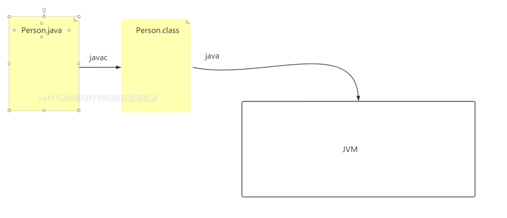

### 编译过程

Person.java -> 此法分析器 -> tokens流 -> 语法分析器 -> 语法树/抽象语法树 -> 语义分析器 -> 注解抽象语法树 -> 字节码生成器 -> Person.class文件

### 类文件（Class文件）

官网 The class File Format

加载 ==》验证 ==》 准备 ==》 解析 ==》初始化 ==》 使用 ==》 卸载

javac  **编译原理**

词法分析   语法分析 语法树  字节码生成 生成 Person.class

https://docs.oracle.com/javase/8/

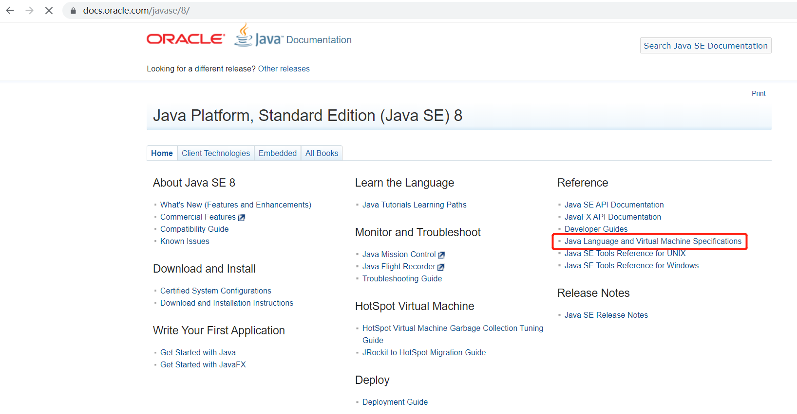

https://docs.oracle.com/javase/specs/index.html

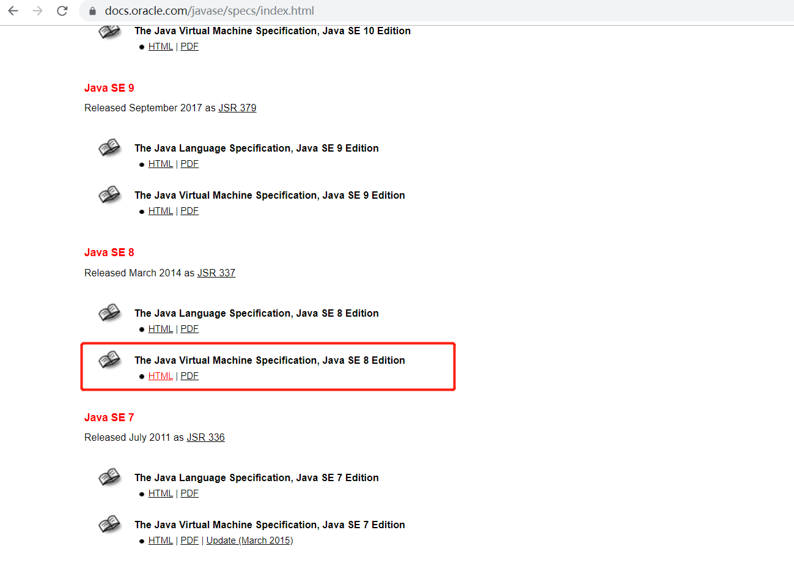

https://docs.oracle.com/javase/specs/jvms/se8/html/index.html

选择 ==》 **Chapter 4. The** **class** **File Format**

https://docs.oracle.com/javase/specs/jvms/se8/html/jvms-4.html

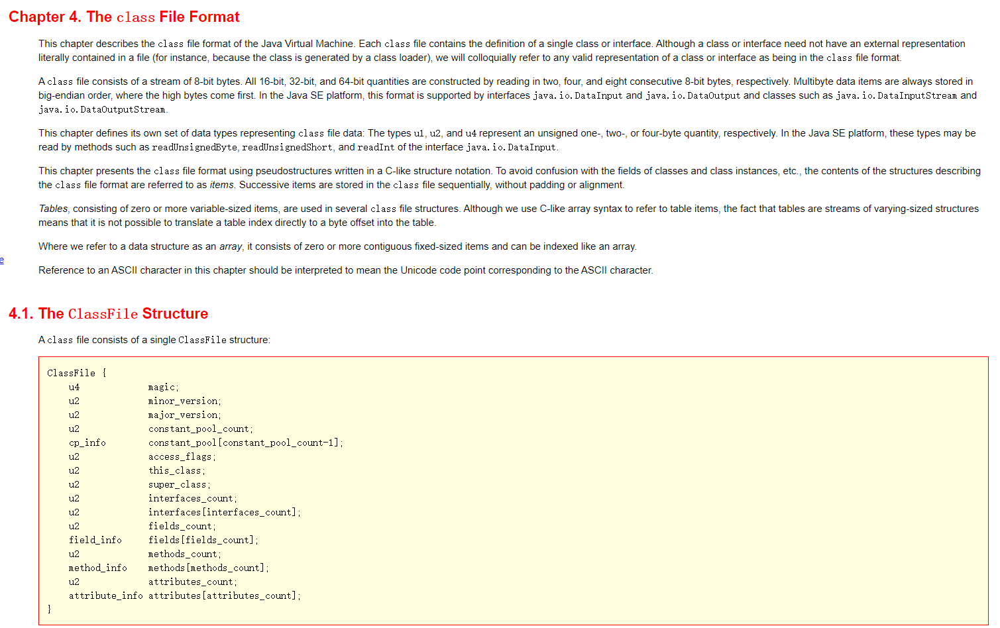

Sublime  打开Person.class是16进制的文件

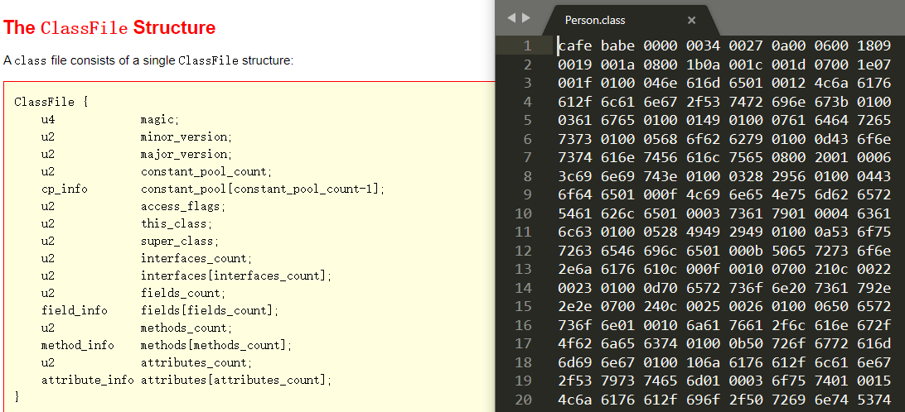


magic

The magic item supplies the magic number identifying the class file format; it has the value 0xCAFEBABE.

minor_version, major_version

The values of the minor_version and major_version items are the minor and major version numbers of this class file. Together, a major and a minor version number determine the version of the class file format. If a class file has major version number M and minor version number m, we denote the version of its class file format as M.m. Thus, class file format versions may be ordered lexicographically, for example, 1.5 < 2.0 < 2.1.

[其他的查看官网解释](https://docs.oracle.com/javase/specs/jvms/se8/html/jvms-4.html)

**类文件到虚拟机(类加载机制）**

使用和卸载不算是类加载过程中的阶段，只是画完整了一下

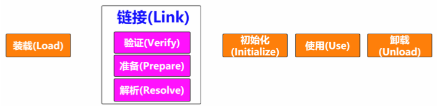


java 类加载机制

将class文件交给JVM

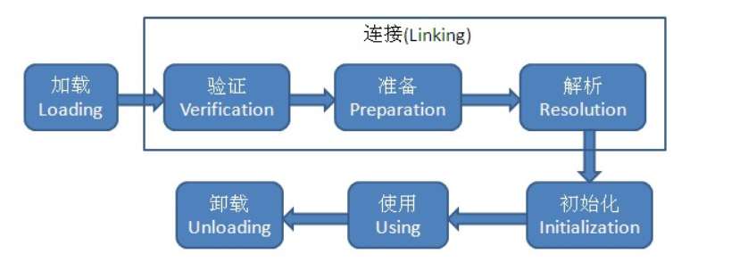

步骤：

**(1) 装载**

a.先找到类文件所在的位置 磁盘 类全路径  （类装载器 ClassLoader.find(String name)） 寻找类

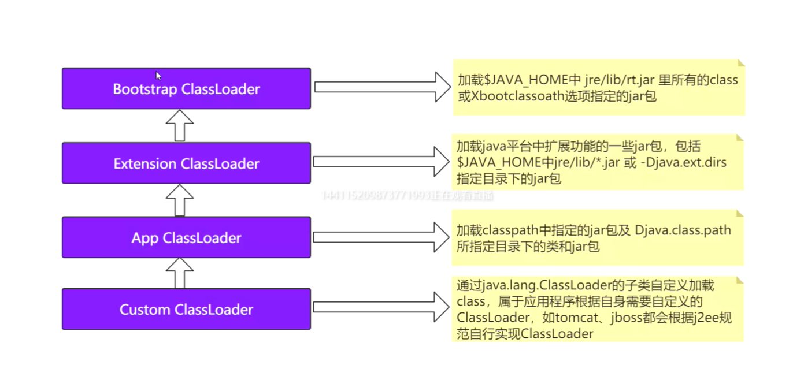

**装载机制： 双亲委派机制 （领导优先）**

父加载器不是父类，双亲委托：自下而上，先挨个找缓存，到了顶层缓存中还没有，就开始初始化，从各自对应负责的包路径下查找，有就创建，没有给就子加载器加载

java.lang.String 不能存在两份  双亲委派 为了类加载安全

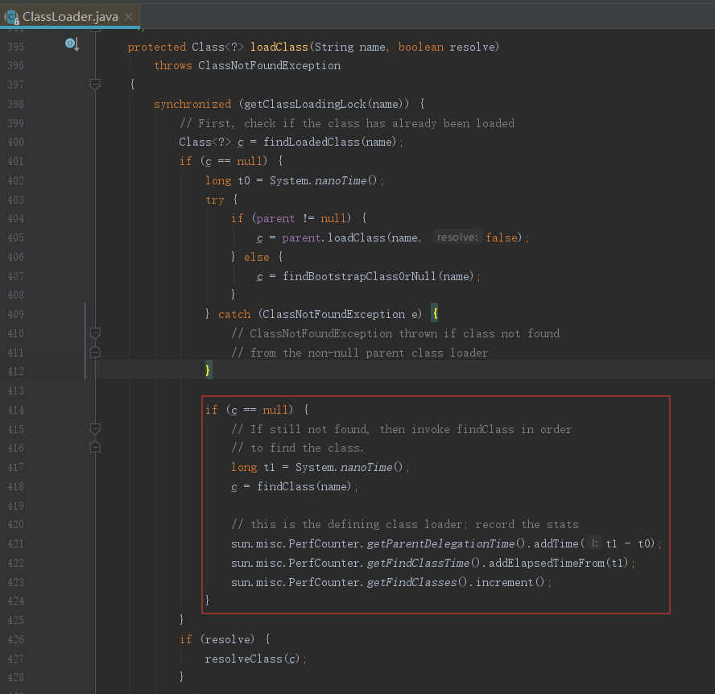

b.类文件的信息交给JVM  类文件字节流静态存储结构 JVM里面的方法区  Method Area

c.类文件所对应的对象Class 装载到JVM   堆Heap

核心方法： loadClass、 findLoadedClass、parent.loadClass、findBootStrapClass、findClass

**(2) 链接**

a.验证 

保证被加载的类信息正确

从上面类的生命周期一图中我们可以看出，验证是连接的第一步，这一阶段的目的主要是为了确保Class文件的字节流中包含的信息符合当前虚拟机的要求，从而不会危害虚拟机自身安全。也就是说，当加载阶段将字节流加载进方法区之后，JVM需要做的第一件事就是对字节流进行安全校验，以保证格式正确，使自己之后能正确的解析到数据并保证这些数据不会对自身造成危害。

验证阶段主要分成四个子阶段：

- 文件格式验证
- 元数据验证
- 字节码验证
- 符号引用验证

b.准备

  要为类的静态变量分配内存空间， 将其值初始化为默认值

c.解析

  将类的符号引用转化为直接引用， 符号引用？？

  String str = 的 地址是什么

首先来说**常量池**：在Class的文件结构中我们就花了大量的篇幅去介绍了常量池，我们再来总结一下：**常量池(constant pool)指的是在编译期被确定，并被保存在已编译的.class文件中的一些数据。它包括了关于类、方法、接口等中的常量，也包括字符串常量。**

然后这段话中的常量池指的就是存在于.class文件中的常量池，结果在运行期被JVM装载，并且可以扩充的存在于方法区中的**运行时常量池**。

然后来看**符号引用**：在Class文件中我们也讲述了什么是符号引用。总的来说就是常量池中存储的那些描述类、方法、接口的字面量，你可以简单的理解为就是那些所需要信息的全限定名，目的就是为了虚拟机在使用的时候可以定位到所需要的目标。

最后来看**直接引用**：直接指向目标的指针、相对偏移量或能间接定位到目标的句柄。

**(3) 初始化**

  为静态变量， 真正的值 a=10

**运行时数据区**

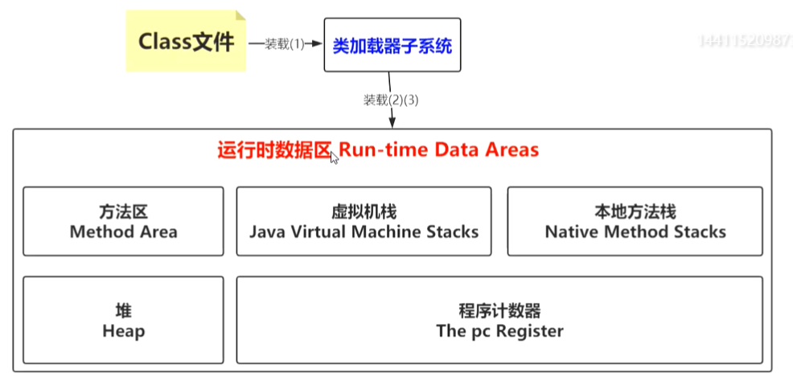

https://docs.oracle.com/javase/specs/jvms/se8/html/jvms-2.html#jvms-2.5


java 虚拟机栈

Each Java Virtual Machine thread has a private *Java Virtual Machine stack*, created at the same time as the thread. A Java Virtual Machine stack stores frames ([§2.6](https://docs.oracle.com/javase/specs/jvms/se8/html/jvms-2.html#jvms-2.6)). A Java Virtual Machine stack is analogous to the stack of a conventional language such as C: it holds local variables and partial results, and plays a part in method invocation and return. Because the Java Virtual Machine stack is never manipulated directly except to push and pop frames, frames may be heap allocated. The memory for a Java Virtual Machine stack does not need to be contiguous.

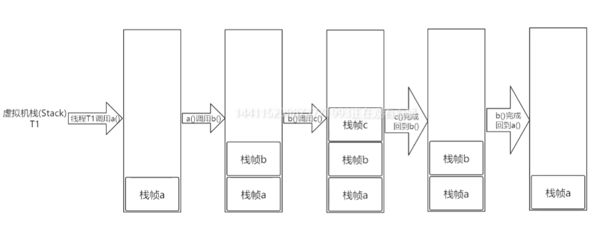

If the computation in a thread requires a larger Java Virtual Machine stack than is permitted, the Java Virtual Machine throws a StackOverflowError.

If Java Virtual Machine stacks can be dynamically expanded, and expansion is attempted but insufficient memory can be made available to effect the expansion, or if insufficient memory can be made available to create the initial Java Virtual Machine stack for a new thread, the Java Virtual Machine throws an OutOfMemoryError.


javap  反编译 查看字节码指令

Frame : 方法的执行


参考文档：

https://pan.baidu.com/s/10N1Cx_lAHXE2SVT_Cv-FNA