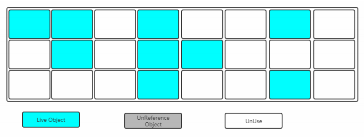
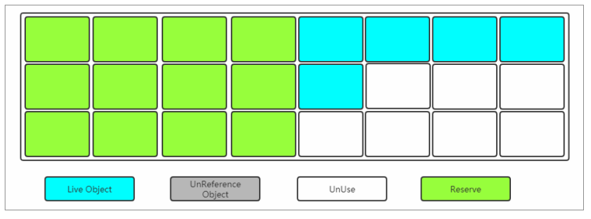
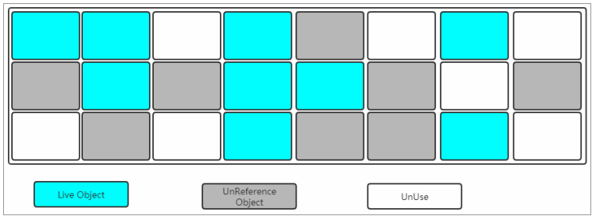
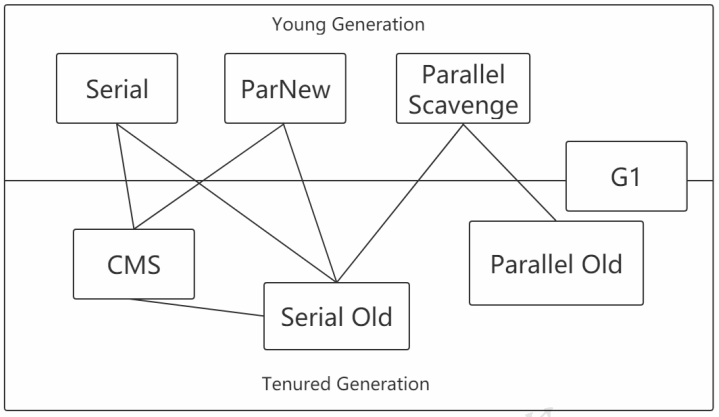
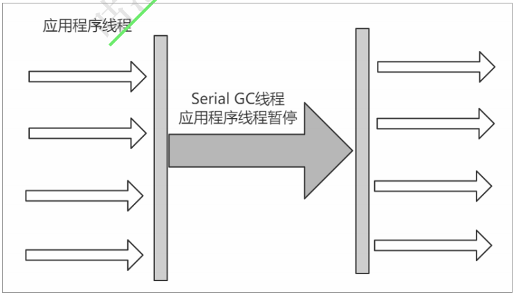
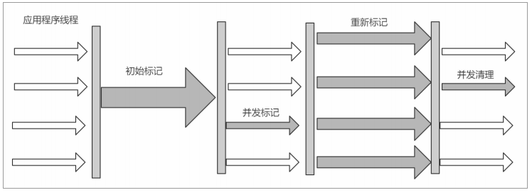

# JVM升华篇

## Garbage Collect(**垃圾回收**)

### 如何确定一个对象是垃圾？

要想进行垃圾回收，得先知道什么样的对象是垃圾。

#### **引用计数法**

对于某个对象而言，只要应用程序中持有该对象的引用，就说明该对象不是垃圾，如果一个对象没有任何指针对其引用，它就是垃圾。

弊端 :如果AB相互持有引用，导致永远不能被回收。

#### **可达性分析**

通过GC Root的对象，开始向下寻找，看某个对象是否可达

能作为GC Root:类加载器、Thread、虚拟机栈的本地变量表、static成员、常量引用、本地方法

栈的变量等。

## 垃圾收集算法

> 已经能够确定一个对象为垃圾之后，接下来要考虑的就是回收，怎么回收呢？
>
> 得要有对应的算法，下面聊聊常见的垃圾回收算法。

###  标记清除(Mark-Sweep)

- 标记

找出内存中需要回收的对象，并且把它们标记出来

> 此时堆中所有的对象都会被扫描一遍，从而才能确定需要回收的对象，比较耗时


- 清除

> 清除掉被标记需要回收的对象，释放出对应的内存空间



缺点:

```
标记清除之后会产生大量不连续的内存碎片，空间碎片太多可能会导致以后在程 序运行过程中需要分配较大对象时，无法找到足够的连续内存而不得不提前触发另一次垃圾收集动作。 
(1)标记和清除两个过程都比较耗时，效率不高 
(2)会产生大量不连续的内存碎片，空间碎片太多可能会导致以后在程序运行过程中需要分配较大对象时，无 法找到足够的连续内存而不得不提前触发另一次垃圾收集动作。
```

###  复制(Copying)

> 将内存划分为两块相等的区域，每次只使用其中一块，如下图所示:


> 当其中一块内存使用完了，就将还存活的对象复制到另外一块上面，然后把已经使用过的内存空间一次清除掉。



缺点:

```
 空间利用率降低。
```

### 标记-整理(Mark-Compact)

> 标记过程仍然与"标记-清除"算法一样，但是后续步骤不是直接对可回收对象进行清理，而是让所有存活的对象都向一端移动，然后直接清理掉端边界以外的内存。



> 让所有存活的对象都向一端移动，清理掉边界意外的内存。


### 分代收集算法

> 既然上面介绍了3中垃圾收集算法，那么在堆内存中到底用哪一个呢？

Young区：复制算法(对象在被分配之后，可能生命周期比较短，Young区复制效率比较高)

Old区：标记清除或标记整理(Old区对象存活时间比较长，复制来复制去没必要，不如做个标记再清理)

## 垃圾收集器

> 如果说收集算法是内存回收的方法论，那么垃圾收集器就是内存回收的具体实现，说白了就是落地咯。



### Serial收集器

Serial收集器是最基本、发展历史最悠久的收集器，曾经（在JDK1.3.1之前）是虚拟机新生代收集的唯一选择。

它是一种单线程收集器，不仅仅意味着它只会使用一个CPU或者一条收集线程去完成垃圾收集工作，更重要的是其在进行垃圾收集的时候需要暂停其他线程.

```
优点：简单高效，拥有很高的单线程收集效率 
缺点：收集过程需要暂停所有线程 
算法：复制算法 
适用范围：新生代 
应用：Client模式下的默认新生代收集器
```



### ParNew收集器

可以把这个收集器理解为Serial收集器的多线程版本。

```
优点：在多CPU时，比Serial效率高。
缺点：收集过程暂停所有应用程序线程，单CPU时比Serial效率差。
算法：复制算法
适用范围：新生代
应用：运行在Server模式下的虚拟机中首选的新生代收集器
```


### Parallel Scavenge收集器

Parallel Scavenge收集器是一个新生代收集器，它也是使用复制算法的收集器，又是并行的多线程收集器，看上去和ParNew一样，但是Parallel Scanvenge更关注 系统的吞吐量 

> 吞吐量=运行用户代码的时间/(运行用户代码的时间+垃圾收集时间)
>
> 比如虚拟机总共运行了100分钟，垃圾收集时间用了1分钟，
>
> 吞吐量=(100-1)/100=99%。
>
> 若吞吐量越大，意味着垃圾收集的时间越短，则用户代码可以充分利用CPU资源，尽快完成程序的运算任务。

```
-XX:MaxGCPauseMillis控制最大的垃圾收集停顿时间，
-XX:GCTimeRatio直接设置吞吐量的大小。
```

### Serial Old收集器

Serial Old收集器是Serial收集器的老年代版本，也是一个单线程收集器，不同的是采用"标记-整理算法"，运行过程和Serial收集器一样。


### Parallel Old收集器

Parallel Old收集器是Parallel Scavenge收集器的老年代版本，使用多线程和"标记-整理算法"进行垃圾回收。

吞吐量优先

### **CMS**收集器

CMS(Concurrent Mark Sweep)收集器是一种以获取 最短回收停顿时间 为目标的收集器。

采用的是"标记-清除算法",整个过程分为4步

```
(1)初始标记 CMS initial mark 标记GC Roots能关联到的对象 Stop The World--->速度很快 
(2)并发标记 CMS concurrent mark 进行GC Roots Tracing 
(3)重新标记 CMS remark 修改并发标记因用户程序变动的内容 Stop The World 
(4)并发清除 CMS concurrent sweep
```

> 由于整个过程中，并发标记和并发清除，收集器线程可以与用户线程一起工作，所以总体上来说，CMS收集器的内存回收过程是与用户线程一起并发地执行的。

```
优点：并发收集、低停顿 
缺点：产生大量空间碎咕泡学院 只为更好的你 片、并发阶段会降低吞吐量
```



### G1收集器

G1特点

```
并行与并发 
分代收集（仍然保留了分代的概念） 
空间整合（整体上属于“标记-整理”算法，不会导致空间碎片） 
可预测的停顿（比CMS更先进的地方在于能让使用者明确指定一个长度为M毫秒的时间片段内，消耗在垃圾收集上的时间不得超过N毫秒）
```

> 使用G1收集器时，Java堆的内存布局与就与其他收集器有很大差别，它将整个Java堆划分为多个大小相等的独立区域（Region），虽然还保留有新生代和老年代的概念，但新生代和老年代不再是物理隔离的了，它们都是一部分Region（不需要连续）的集合。

工作过程可以分为如下几步

```
初始标记（Initial Marking） 标记一下GC Roots能够关联的对象，并且修改TAMS的值，需要暂 停用户线程 
并发标记（Concurrent Marking） 从GC Roots进行可达性分析，找出存活的对象，与用户线程并发 执行
最终标记（Final Marking） 修正在并发标记阶段因为用户程序的并发执行导致变动的数据，需 暂停用户线程 
筛选回收（Live Data Counting and Evacuation） 对各个Region的回收价值和成本进行排序，根据 用户所期望的GC停顿时间制定回收计划
```


### 垃圾收集器分类

- 串行收集器->Serial和Serial Old

只能有一个垃圾回收线程执行，用户线程暂停。 适用于内存比较小的嵌入式设备 。

- 并行收集器[吞吐量优先]->Parallel Scanvenge、Parallel Old

多条垃圾收集线程并行工作，但此时用户线程仍然处于等待状态。 适用于科学计算、后台处理等若交互场景 。

- 并发收集器[停顿时间优先]->CMS、G1

用户线程和垃圾收集线程同时执行(但并不一定是并行的，可能是交替执行的)，垃圾收集线程在执行的时候不会停顿用户线程的运行。 适用于相对时间有要求的场景，比如Web

#### 理解吞吐量和停顿时间

- 停顿时间->垃圾收集器 进行 垃圾回收终端应用执行响应的时间

- 吞吐量->运行用户代码时间/(运行用户代码时间+垃圾收集时间) 

```
停顿时间越短就越适合需要和用户交互的程序，良好的响应速度能提升用户体验； 
高吞吐量则可以高效地利用CPU时间，尽快完成程序的运算任务，主要适合在后台运算而不需要太多交互的任务。
```

小结 :这两个指标也是评价垃圾回收器好处的标准，其实调优也就是在观察者两个变量。

#### **如何选择合适的垃圾收集器**

官网 ：https://docs.oracle.com/javase/8/docs/technotes/guides/vm/gctuning/collectors.html#sthref28

- 优先调整堆的大小让服务器自己来选择

- 如果内存小于100M，使用串行收集器

- 如果是单核，并且没有停顿时间要求，使用串行或JVM自己选

- 如果允许停顿时间超过1秒，选择并行或JVM自己选

- 如果响应时间最重要，并且不能超过1秒，使用并发收集器

- 对于G1收集

#### 再次理解G1

>  JDK 7开始使用，JDK 8非常成熟，JDK 9默认的垃圾收集器，适用于新老生代。

判断是否需要使用G1收集器？

```
（1）50%以上的堆被存活对象占用 
（2）对象分配和晋升的速度变化非常大 
（3）垃圾回收时间比较长
```

#### **如何开启需要的垃圾收集器**

> 这里JVM参数信息的设置大家先不用关心，下一章节会学习到。

```
（1）串行 
    -XX：+UseSerialGC 
    -XX：+UseSerialOldGC 
（2）并行(吞吐量优先)： 
    -XX：+UseParallelGC 
    -XX：+UseParallelOldGC 
（3）并发收集器(响应时间优先) 
    -XX：+UseConcMarkSweepGC 
    -XX：+UseG1G
```


参考文档：

https://pan.baidu.com/s/15RIqCmazkso6BkhXDS2OpA