# JVM实战篇

##  **JVM**参数

### **标准参数**

```
-version 
-help 
-server 
-cp
```

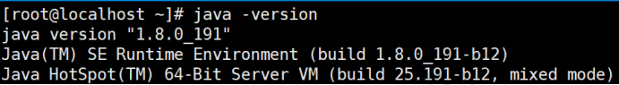

###  **-X**参数

> 非标准参数，也就是在JDK各个版本中可能会变动

```
-Xint 解释执行 
-Xcomp 第一次使用就编译成本地代码 
-Xmixed 混合模式，JVM自己来决定
```

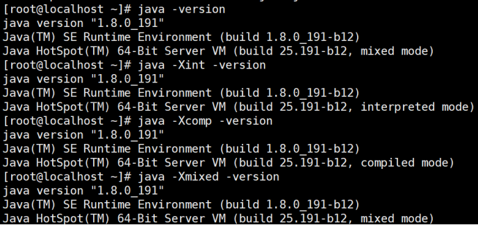

###  **-XX**参数

> **使用得最多的参数类型**
>
> 非标准化参数，相对不稳定，主要用于JVM调优和Debug

```
a.Boolean类型 
格式：-XX:[+-]<name> +或-表示启用或者禁用name属性 
比如：-XX:+UseConcMarkSweepGC 表示启用CMS类型的垃圾回收器 -XX:+UseG1GC 表示启用G1类型的垃圾回收器 
b.非Boolean类型 
格式：-XX<name>=<value>表示name属性的值是value 
比如：-XX:MaxGCPauseMillis=500
```

### **其他参数**

```
-Xms1000等价于-XX:InitialHeapSize=1000 
-Xmx1000等价于-XX:MaxHeapSize=1000 -Xss100等价于
-XX:ThreadStackSize=100
```

> 所以这块也相当于是-XX类型的参数

###  **查看参数**

> java -XX:+PrintFlagsFinal -version > flflags.txt

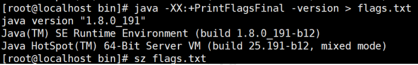

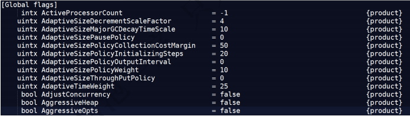

> 值得注意的是"="表示默认值，":="表示被用户或JVM修改后的值
>
> 要想查看某个进程具体参数的值，可以使用jinfo，这块后面聊
>
> 一般要设置参数，可以先查看一下当前参数是什么，然后进行修改

### **设置参数的方式**

- 开发工具中设置比如IDEA，eclipse

- 运行jar包的时候:java -XX:+UseG1GC xxx.jar

- web容器比如tomcat，可以在脚本中的进行设置

- 通过jinfo实时调整某个java进程的参数(参数只有被标记为manageable的flflags可以被实时修改)

### **实践和单位换算**

```
1Byte(字节)=8bit(位) 
1KB=1024Byte(字节) 
1MB=1024KB 
1GB=1024MB 
1TB=1024GB
```

```
(1)设置堆内存大小和参数打印 -Xmx100M -Xms100M -XX:+PrintFlagsFinal 
(2)查询  +PrintFlagsFinal的值 :=true 
(3)查询堆内存大小MaxHeapSize := 104857600 
(4)换算  104857600(Byte)/1024=102400(KB) 102400(KB)/1024=100(MB) 
(5)结论  104857600是字节单位 咕泡学院 只
```

###  **常用参数含义**

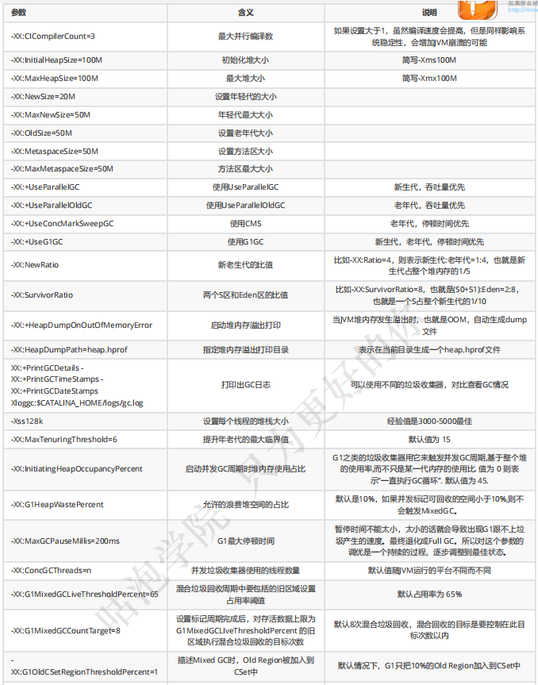

## **常用命令**

###  **jps**

> 查看java进程

```
The jps command lists the instrumented Java HotSpot VMs on the target system. 
The command is limited to reporting information on JVMs for which it has the 
access permissions.
```

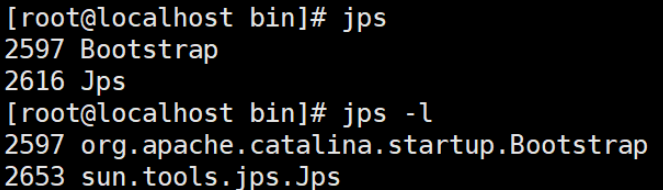

###  **jinfo**

> (1)实时查看和调整JVM配置参数

```
The jinfo command prints Java configuration information for a specified Java process or core file or a remote debug server. The configuration information includes Java system properties and Java Virtual Machine (JVM) command-line flags.
```

> (2)查看 jinfo -flflag name PID 查看某个java进程的name属性的值

```
jinfo -flag MaxHeapSize PID jinfo -flag UseG1GC PID
```

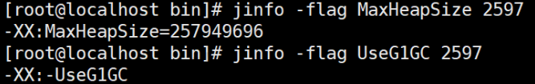

> (3)修改   参数只有被标记为 manageable 的 flflags 可以被实时修改
>
> jinfo -flflag [+|-] PID
>
> jinfo -flflag = PID

> (4)查看曾经赋过值的一些参数

```
jinfo -flags PID
```

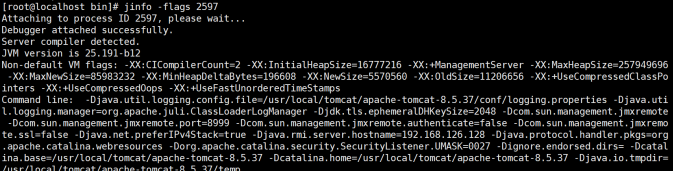

### **jstat**

> (1)查看虚拟机性能统计信息

```
The jstat command displays performance statistics for an instrumented Java HotSpot VM. The target JVM is identified by its virtual machine identifier, or vmid option.
```

> (2)查看类装载信息

```
jstat -class PID 1000 10 
查看某个java进程的类装载信息，每1000毫秒输出一次，共输出10 次
```

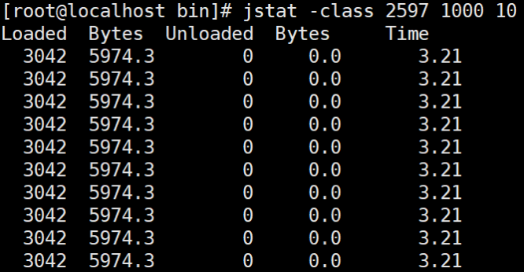

> (3)查看垃圾收集信息

```
jstat -gc PID 1000 10
```

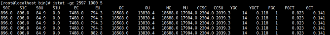

### **jstack**

> (1)查看线程堆栈信息

```
The jstack command prints Java stack traces of Java threads for a specified Java process, core file, or remote debug server.
```

> (2)用法

```
jstack PID
```

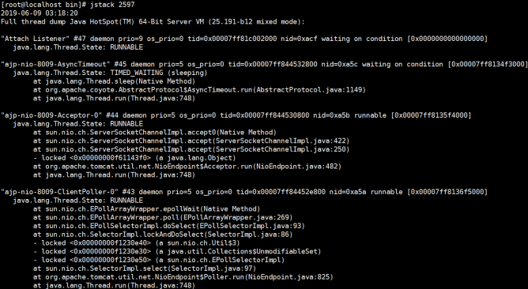

> (4)排查死锁案例

- DeadLockDemo

```java
//运行主类 
public class DeadLockDemo {
    public static void main(String[] args) {
        DeadLock d1 = new DeadLock(true);
        DeadLock d2 = new DeadLock(false);
        Thread t1 = new Thread(d1);
        Thread t2 = new Thread(d2);
        t1.start();
        t2.start();
    }
}//定义锁对象 

class MyLock {
    public static Object obj1 = new Object();
    public static Object obj2 = new Object();
}//死锁代码 

class DeadLock implements Runnable {
    private boolean flag;

    DeadLock(boolean flag) {
        this.flag = flag;
    }

    public void run() {
        if (flag) {
            while (true) {
                synchronized (MyLock.obj1) {
                    System.out.println(Thread.currentThread().getName() + "----if 获得obj1锁");
                    synchronized (MyLock.obj2) {
                        System.out.println(Thread.currentThread().getName() + "--- -if获得obj2锁");
                    }
                }
            }
        } else {
            while (true) {
                synchronized (MyLock.obj2) {
                    System.out.println(Thread.currentThread().getName() + "----否则 获得obj2锁");
                    synchronized (MyLock.obj1) {
                        System.out.println(Thread.currentThread().getName() + "--- -否则获得obj1锁");
                    }
                }
            }
        }
    }
}
```

- 运行结果

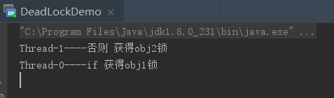

- jstack分析

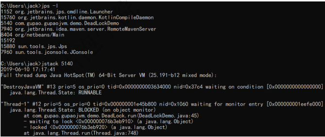

> 把打印信息拉到最后可以发现

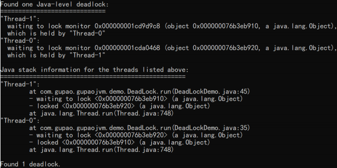

###  **jmap**

> (1)生成堆转储快照

```
The jmap command prints shared object memory maps or heap memory details of a specified process, core file, or remote debug server.
```

> (2)打印出堆内存相关信息

```
-XX:+PrintFlagsFinal -Xms300M -Xmx300M 
jmap -heap PID
```

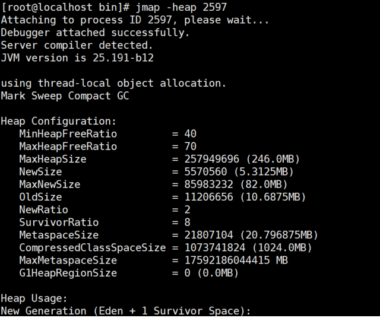

> (3)dump出堆内存相关信息
>
> jmap -dump:format=b,fifile=heap.hprof PID

```
jmap -dump:format=b,file=heap.hprof 44808
```

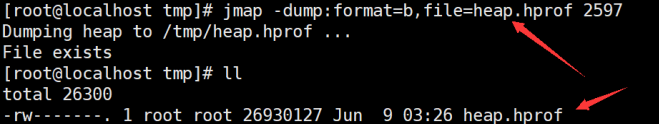

> (4)要是在发生堆内存溢出的时候，能自动dump出该文件就好了

一般在开发中，JVM参数可以加上下面两句，这样内存溢出时，会自动dump出该文件

-XX:+HeapDumpOnOutOfMemoryError -XX:HeapDumpPath=heap.hprof

```
设置堆内存大小: -Xms20M -Xmx20M 启动，然后访问localhost:9090/heap，使得堆内存溢出
```

> (5)关于dump下来的文件

一般dump下来的文件可以结合工具来分析，这块后面再说。

###  **常用工具**

> 参数也了解了，命令也知道了，关键是用起来不是很方便，要是有图形化的界面就好了。
>
> 一定会有好事之者来做这件事情

###  **jconsole**

JConsole工具是JDK自带的可视化监控工具。查看java应用程序的运行概况、监控堆信息、永久区使用情况、类加载情况等

> 命令行中输入：jconsole

###  **jvisualvm**

####  监控本地 Java 进程

可以监控本地的java进程的CPU，类，线程等

#### 监控远端 Java 进程

> 比如监控远端tomcat，演示部署在阿里云服务器上的tomcat

(1)在visualvm中选中“远程”，右击“添加”

(2)主机名上写服务器的ip地址，比如31.100.39.63，然后点击“确定”

(3)右击该主机“31.100.39.63”，添加“JMX”[也就是通过JMX技术具体监控远端服务器哪个Java进程]

(4)要想让服务器上的tomcat被连接，需要改一下 bin/catalina.sh 这个文件

> 注意下面的8998不要和服务器上其他端口冲突

```
JAVA_OPTS="$JAVA_OPTS -Dcom.sun.management.jmxremote - Djava.rmi.server.hostname=31.100.39.63 -Dcom.sun.management.jmxremote.port=8998 -Dcom.sun.management.jmxremote.ssl=false - Dcom.sun.management.jmxremote.authenticate=true - Dcom.sun.management.jmxremote.access.file=../conf/jmxremote.access - Dcom.sun.management.jmxremote.password.file=../conf/jmxremote.password
```

(5)在 ../conf 文件中添加两个文件jmxremote.access和jmxremote.password

> jmxremote.access 文件
>
> ```
> guest readonly 
> manager readwrite
> ```


> jmxremote.password 文件
>
> ```
> guest guest 
> manager manager
> ```

授予权限 : chmod 600 *jmxremot*

(6)将连接服务器地址改为公网ip地址

```
hostname -i 查看输出情况 
    172.26.225.240 172.17.0.1 
vim /etc/hosts 
    172.26.255.240 31.100.39.63
```

(7)设置上述端口对应的阿里云安全策略和防火墙策略

(8)启动tomcat，来到bin目录

```
./startup.sh
```

(9)查看tomcat启动日志以及端口监听

```
tail -f ../logs/catalina.out 
lsof -i tcp:8080
```

(10)查看8998监听情况，可以发现多开了几个端口

```
lsof -i:8998 得到PID 
netstat -antup | grep PID
```

(11)在刚才的JMX中输入8998端口，并且输入用户名和密码则登录成功

```
端口:8998 
用户名:manager 
密码:manager
```

###  **Arthas**

>  github ：https://github.com/alibaba/arthas

```
Arthas allows developers to troubleshoot production issues for Java applications without modifying code or restarting servers.
```

Arthas 是Alibaba开源的Java诊断工具，采用**命令行交互模式**，是排查jvm相关问题的利器。

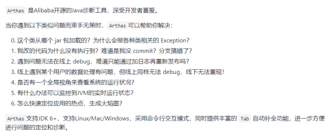

#### **下载安装**

```
curl -O https://alibaba.github.io/arthas/arthas-boot.jar 
java -jar arthas-boot.jar 
# 然后可以选择一个Java进程
```

**Print usage**

```
java -jar arthas-boot.jar -h
```

####  **常用命令**

> 具体每个命令怎么使用，大家可以自己查阅资料

```
version:查看arthas版本号 
help:查看命名帮助信息 
cls:清空屏幕 
session:查看当前会话信息 
quit:退出arthas客户端 
--- 
dashboard:当前进程的实时数据面板 
thread:当前JVM的线程堆栈信息 
jvm:查看当前JVM的信息 
sysprop:查看JVM的系统属性 
--- 
sc:查看JVM已经加载的类信息 
dump:dump已经加载类的byte code到特定目录 
jad:反编译指定已加载类的源码 
--- 
monitor:方法执行监控 
watch:方法执行数据观测 
trace:方法内部调用路径，并输出方法路径上的每个节点上耗时 
stack:输出当前方法被调用的调用路径 
......
```

### **MAT**

Java堆分析器，用于查找内存泄漏

Heap Dump，称为堆转储文件，是Java进程在某个时间内的快照

> 下载地址 ：https://www.eclipse.org/mat/downloads.php

#### Dump 信息包含的内容

- All Objects

Class, fifields, primitive values and references

- All Classes

Classloader, name, super class, static fifields

- Garbage Collection Roots

Objects defifined to be reachable by the JVM

- Thread Stacks and Local Variables

The call-stacks of threads at the moment of the snapshot, and per-frame information about local objects

#### 获取Dump文件

- 手动

```
jmap -dump:format=b,file=heap.hprof 44808
```

- 自动

```
-XX:+HeapDumpOnOutOfMemoryError -XX:HeapDumpPath=heap.hprof
```

**使用**

- Histogram

> Histogram可以列出内存中的对象，对象的个数及其大小

```
Class Name:类名称，java类名 
Objects:类的对象的数量，这个对象被创建了多少个
Shallow Heap:一个对象内存的消耗大小，不包含对其他对象的引用 
Retained Heap:是shallow Heap的总和，即该对象被GC之后所能回收到内存的总和
```

```
右击类名--->List Objects--->with incoming references--->列出该类的实例
```

```
右击Java对象名--->Merge Shortest Paths to GC Roots--->exclude all ...--->找到GC Root以及原因
```

- Leak Suspects

> 查找并分析内存泄漏的可能原因

```
Reports--->Leak Suspects--->Details
```

- Top Consumers

> 列出大对象

###  **GC****日志分析工具**

> 要想分析日志的信息，得先拿到GC日志文件才行，所以得先配置一下
>
> 根据前面参数的学习，下面的配置很容易看懂

```
-XX:+PrintGCDetails -XX:+PrintGCTimeStamps -XX:+PrintGCDateStamps -Xloggc:gc.log
```

- 在线

http://gceasy.io

- GCViewer


参考文档：

https://pan.baidu.com/s/1P8RXagtvV9ykAYckw1JtDQ