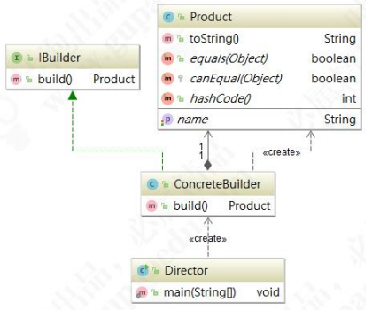
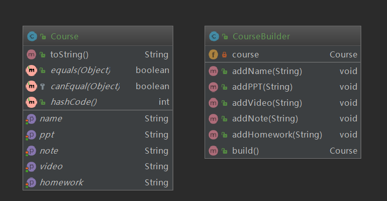
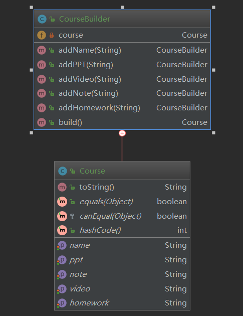

# 建造者模式 

建造者模式（Builder Pattern）是将一个复杂对象的构建过程与它的表示分离，使得同样的构建过 程可以创建不同的表示，属于创建型模式。使用建造者模式对于用户而言只需指定需要建造的类型就可 以获得对象，建造过程及细节不需要了解。

> **官方原文：**Separate the construction of a complex object from its representation so that the same construction process can create different representations.

建造者模式适用于创建对象需要很多步骤，但是步骤的顺序不一定固定。如果一个对象有非常复杂 的内部结构（很多属性），可以将复杂对象的创建和使用进行分离。先来看一下建造者模式的类图： 



建造者模式的设计中主要有四个角色：

1、产品（Product）:要创建的产品类对象 

2、建造者抽象（Builder）：建造者的抽象类，规范产品对象的各个组成部分的建造，一般由子类 实现具体的建造过程。 

3、建造者（ConcreteBuilder）:具体的 Builder 类，根据不同的业务逻辑，具体化对象的各个组成 部分的创建。 

4、调用者（Director）：调用具体的建造者，来创建对象的各个部分，在指导者中不涉及具体产品 的信息，只负责保证对象各部分完整创建或按某种顺序创建。

### 建造者模式的应用场景 

建造者模式适用于一个具有较多的零件的复杂产品的创建过程，由于需求的变化，组成这个复杂产 品的各个零件经常猛烈变化，但是它们的组合方式却相对稳定。

建造者模式适用于以下几种场景： 

1 相同的方法，不同的执行顺序，产生不同的结果时 

2 多个部件或零件，都可以装配到一个对象中，但是产生的结果又不相同。

3 产品类非常复杂，或者产品类中的调用顺序不同产生不同的作用。 

4 当初始化一个对象特别复杂，参数多，而且很多参数都具有默认值时。

### 建造者模式的基本写法

我们还是以课程为例，一个完整的课程需要由 PPT 课件、回放视频、课堂笔记、课后作业组成，但是这些内容的设置顺序可以随意调整，我们用建造者模式来代入理解一下。首先我们创建一个需要构造的产品类 Course：

```java
@Data
public class Course {

    private String name;
    private String ppt;
    private String video;
    private String note;

    private String homework;

    @Override
    public String toString() {
        return "CourseBuilder{" +
                "name='" + name + '\'' +
                ", ppt='" + ppt + '\'' +
                ", video='" + video + '\'' +
                ", note='" + note + '\'' +
                ", homework='" + homework + '\'' +
                '}';
    }
}
```

然后创建建造者类 CourseBuilder，将复杂的构造过程封装起来，构造步骤由用户决定：

```java
public class CourseBuilder{

    private Course course = new Course();

    public void addName(String name) {
        course.setName(name);
    }
    
    public void addPPT(String ppt) {
        course.setPpt(ppt);
    }
    
    public void addVideo(String video) {
        course.setVideo(video);
    }
    
    public void addNote(String note) {
        course.setNote(note);
    }
    
    public void addHomework(String homework) {
        course.setHomework(homework);
    }
    
    public Course build() {
        return course;
    }
}
```

编写测试类：

```java
public class Test {
    public static void main(String[] args) {
        CourseBuilder builder = new CourseBuilder();

        builder.addName("设计模式");
        builder.addPPT("【PPT课件】");
        builder.addVideo("【回放视频】");
        builder.addNote("【课堂笔记】");
        builder.addHomework("【课后作业】");

        System.out.println(builder.build());

    }
}
```

来看一下类结构图：



### 建造者模式的链式写法

在平时的应用中，建造者模式通常是采用链式编程的方式构造对象，下面我们来一下演示代码，修 

改 CourseBuilder 类，将 Course 变为 CourseBuilder 的内部类, 然后，将构造步骤添加进去，每完成一个步骤，都返回 this：

```java
public class CourseBuilder {
    private Course course = new Course();

    public CourseBuilder addName(String name) {
        course.setName(name);
        return this;
    }

    public CourseBuilder addPPT(String ppt) {
        course.setPpt(ppt);
        return this;
    }

    public CourseBuilder addVideo(String video) {
        course.setVideo(video);
        return this;
    }

    public CourseBuilder addNote(String note) {
        course.setNote(note);
        return this;
    }

    public CourseBuilder addHomework(String homework) {
        course.setHomework(homework);
        return this;
    }

    public Course build() {
        return this.course;
    }

    @Data
    public class Course {

        private String name;
        private String ppt;
        private String video;
        private String note;

        private String homework;

        @Override
        public String toString() {
            return "CourseBuilder{" +
                    "name='" + name + '\'' +
                    ", ppt='" + ppt + '\'' +
                    ", video='" + video + '\'' +
                    ", note='" + note + '\'' +
                    ", homework='" + homework + '\'' +
                    '}';
        }
    }

}
```

客户端测试：

```java
public class Test {
    public static void main(String[] args) {
        CourseBuilder builder = new CourseBuilder()
                .addName("设计模式")
                .addPPT("【PPT课件】")
                .addVideo("【回放视频】")
                .addNote("【课堂笔记】")
                .addHomework("【课后作业】");

        System.out.println(builder.build());

        StringBuilder sb = new StringBuilder();
        sb.append("");
        
        CacheBuilder cacheBuilder = new CacheBuilder("");
        cacheBuilder.blocking(false);
//        cacheBuilder.

        SqlSessionFactoryBuilder sqlSessionFactoryBuilder = new SqlSessionFactoryBuilder();
//        sqlSessionFactoryBuilder.
        
        BeanDefinitionBuilder beanDefinitionBuilder = BeanDefinitionBuilder.genericBeanDefinition();
//        beanDefinitionBuilder.
        
    }
}

```

这样写法是不是很眼熟，好像在哪见过呢？后面我们分析建造者模式在源码中的应用大家就会明白。 接下来，我们再来看一下类图的变化：

 


### 建造者模式应用案例

下面我们再来看一个实战案例，这个案例参考了开源框架 JPA 的 SQL 构造模式。是否记得我们在构 造 SQL 查询条件的时候，需要根据不同的条件来拼接 SQL 字符串。如果查询条件复杂的时候，我们 SQL 拼接的过程也会变得非常复杂，从而给我们的代码维护带来非常大的困难。因此，我们用建造者类 QueryRuleSqlBuilder 将复杂的构造 SQL 过程进行封装，用 QueryRule 对象专门保存 SQL 查询时的 条件，最后根据查询条件，自动生成 SQL 语句。来看代码，先创建 QueryRule 类：

```java
public final class QueryRule implements Serializable
{
	private static final long serialVersionUID = 1L;
	public static final int ASC_ORDER = 101;
	public static final int DESC_ORDER = 102;
	public static final int LIKE = 1;
	public static final int IN = 2;
	public static final int NOTIN = 3;
	public static final int BETWEEN = 4;
	public static final int EQ = 5;
	public static final int NOTEQ = 6;
	public static final int GT = 7;
	public static final int GE = 8;
	public static final int LT = 9;
	public static final int LE = 10;
	public static final int ISNULL = 11;
	public static final int ISNOTNULL = 12;
	public static final int ISEMPTY = 13;
	public static final int ISNOTEMPTY = 14;
	public static final int AND = 201;
	public static final int OR = 202;
	private List<Rule> ruleList = new ArrayList<Rule>();
	private List<QueryRule> queryRuleList = new ArrayList<QueryRule>();
	private String propertyName;

	private QueryRule() {}

	private QueryRule(String propertyName) {
		this.propertyName = propertyName;
	}

	public static QueryRule getInstance() {
		return new QueryRule();
	}
	
	/**
	 * 添加升序规则
	 * @param propertyName
	 * @return
	 */
	public QueryRule addAscOrder(String propertyName) {
		this.ruleList.add(new Rule(ASC_ORDER, propertyName));
		return this;
	}

	/**
	 * 添加降序规则
	 * @param propertyName
	 * @return
	 */
	public QueryRule addDescOrder(String propertyName) {
		this.ruleList.add(new Rule(DESC_ORDER, propertyName));
		return this;
	}

	public QueryRule andIsNull(String propertyName) {
		this.ruleList.add(new Rule(ISNULL, propertyName).setAndOr(AND));
		return this;
	}

	public QueryRule andIsNotNull(String propertyName) {
		this.ruleList.add(new Rule(ISNOTNULL, propertyName).setAndOr(AND));
		return this;
	}

	public QueryRule andIsEmpty(String propertyName) {
		this.ruleList.add(new Rule(ISEMPTY, propertyName).setAndOr(AND));
		return this;
	}

	public QueryRule andIsNotEmpty(String propertyName) {
		this.ruleList.add(new Rule(ISNOTEMPTY, propertyName).setAndOr(AND));
		return this;
	}

	public QueryRule andLike(String propertyName, Object value) {
		this.ruleList.add(new Rule(LIKE, propertyName, new Object[] { value }).setAndOr(AND));
		return this;
	}

	public QueryRule andEqual(String propertyName, Object value) {
		this.ruleList.add(new Rule(EQ, propertyName, new Object[] { value }).setAndOr(AND));
		return this;
	}

	public QueryRule andBetween(String propertyName, Object... values) {
		this.ruleList.add(new Rule(BETWEEN, propertyName, values).setAndOr(AND));
		return this;
	}

	public QueryRule andIn(String propertyName, List<Object> values) {
		this.ruleList.add(new Rule(IN, propertyName, new Object[] { values }).setAndOr(AND));
		return this;
	}

	public QueryRule andIn(String propertyName, Object... values) {
		this.ruleList.add(new Rule(IN, propertyName, values).setAndOr(AND));
		return this;
	}
	
	public QueryRule andNotIn(String propertyName, List<Object> values) {
		this.ruleList.add(new Rule(NOTIN, propertyName, new Object[] { values }).setAndOr(AND));
		return this;
	}

	public QueryRule orNotIn(String propertyName, Object... values) {
		this.ruleList.add(new Rule(NOTIN, propertyName, values).setAndOr(OR));
		return this;
	}
	

	public QueryRule andNotEqual(String propertyName, Object value) {
		this.ruleList.add(new Rule(NOTEQ, propertyName, new Object[] { value }).setAndOr(AND));
		return this;
	}

	public QueryRule andGreaterThan(String propertyName, Object value) {
		this.ruleList.add(new Rule(GT, propertyName, new Object[] { value }).setAndOr(AND));
		return this;
	}

	public QueryRule andGreaterEqual(String propertyName, Object value) {
		this.ruleList.add(new Rule(GE, propertyName, new Object[] { value }).setAndOr(AND));
		return this;
	}

	public QueryRule andLessThan(String propertyName, Object value) {
		this.ruleList.add(new Rule(LT, propertyName, new Object[] { value }).setAndOr(AND));
		return this;
	}

	public QueryRule andLessEqual(String propertyName, Object value) {
		this.ruleList.add(new Rule(LE, propertyName, new Object[] { value }).setAndOr(AND));
		return this;
	}
	
	
	public QueryRule orIsNull(String propertyName) {
		this.ruleList.add(new Rule(ISNULL, propertyName).setAndOr(OR));
		return this;
	}

	public QueryRule orIsNotNull(String propertyName) {
		this.ruleList.add(new Rule(ISNOTNULL, propertyName).setAndOr(OR));
		return this;
	}

	public QueryRule orIsEmpty(String propertyName) {
		this.ruleList.add(new Rule(ISEMPTY, propertyName).setAndOr(OR));
		return this;
	}

	public QueryRule orIsNotEmpty(String propertyName) {
		this.ruleList.add(new Rule(ISNOTEMPTY, propertyName).setAndOr(OR));
		return this;
	}

	public QueryRule orLike(String propertyName, Object value) {
		this.ruleList.add(new Rule(LIKE, propertyName, new Object[] { value }).setAndOr(OR));
		return this;
	}

	public QueryRule orEqual(String propertyName, Object value) {
		this.ruleList.add(new Rule(EQ, propertyName, new Object[] { value }).setAndOr(OR));
		return this;
	}

	public QueryRule orBetween(String propertyName, Object... values) {
		this.ruleList.add(new Rule(BETWEEN, propertyName, values).setAndOr(OR));
		return this;
	}

	public QueryRule orIn(String propertyName, List<Object> values) {
		this.ruleList.add(new Rule(IN, propertyName, new Object[] { values }).setAndOr(OR));
		return this;
	}

	public QueryRule orIn(String propertyName, Object... values) {
		this.ruleList.add(new Rule(IN, propertyName, values).setAndOr(OR));
		return this;
	}

	public QueryRule orNotEqual(String propertyName, Object value) {
		this.ruleList.add(new Rule(NOTEQ, propertyName, new Object[] { value }).setAndOr(OR));
		return this;
	}

	public QueryRule orGreaterThan(String propertyName, Object value) {
		this.ruleList.add(new Rule(GT, propertyName, new Object[] { value }).setAndOr(OR));
		return this;
	}

	public QueryRule orGreaterEqual(String propertyName, Object value) {
		this.ruleList.add(new Rule(GE, propertyName, new Object[] { value }).setAndOr(OR));
		return this;
	}

	public QueryRule orLessThan(String propertyName, Object value) {
		this.ruleList.add(new Rule(LT, propertyName, new Object[] { value }).setAndOr(OR));
		return this;
	}

	public QueryRule orLessEqual(String propertyName, Object value) {
		this.ruleList.add(new Rule(LE, propertyName, new Object[] { value }).setAndOr(OR));
		return this;
	}
	

	public List<Rule> getRuleList() {
		return this.ruleList;
	}

	public List<QueryRule> getQueryRuleList() {
		return this.queryRuleList;
	}

	public String getPropertyName() {
		return this.propertyName;
	}

	protected class Rule implements Serializable {
		private static final long serialVersionUID = 1L;
		private int type;	//规则的类型
		private String property_name;
		private Object[] values;
		private int andOr = AND;

		public Rule(int paramInt, String paramString) {
			this.property_name = paramString;
			this.type = paramInt;
		}

		public Rule(int paramInt, String paramString,
				Object[] paramArrayOfObject) {
			this.property_name = paramString;
			this.values = paramArrayOfObject;
			this.type = paramInt;
		}
		
		public Rule setAndOr(int andOr){
			this.andOr = andOr;
			return this;
		}
		
		public int getAndOr(){
			return this.andOr;
		}

		public Object[] getValues() {
			return this.values;
		}

		public int getType() {
			return this.type;
		}

		public String getPropertyName() {
			return this.property_name;
		}
	}
}
```

然后，创建 QueryRuleSqlBuilder 类：

```java
package builder.sql;

import org.apache.commons.lang3.ArrayUtils;
import org.apache.commons.lang3.StringUtils;

import java.util.ArrayList;
import java.util.HashMap;
import java.util.List;
import java.util.Map;
import java.util.regex.Matcher;
import java.util.regex.Pattern;


/**
 * 根据QueryRule自动构建sql语句
 * @author 
 *
 */
public class QueryRuleSqlBuilder {
	private int CURR_INDEX = 0; //记录参数所在的位置
	private List<String> properties; //保存列名列表
	private List<Object> values; //保存参数值列表
	private List<Order> orders; //保存排序规则列表
	
	private String whereSql = ""; 
	private String orderSql = "";
	private Object [] valueArr = new Object[]{};
	private Map<Object,Object> valueMap = new HashMap<Object,Object>();
	
	/**
	 * 或得查询条件
	 * @return
	 */
	private String getWhereSql(){
		return this.whereSql;
	}
	
	/**
	 * 获得排序条件
	 * @return
	 */
	private String getOrderSql(){
		return this.orderSql;
	}
	
	/**
	 * 获得参数值列表
	 * @return
	 */
	public Object [] getValues(){
		return this.valueArr;
	}
	
	/**
	 * 获取参数列表
	 * @return
	 */
	private Map<Object,Object> getValueMap(){
		return this.valueMap;
	}
	
	/**
	 * 创建SQL构造器
	 * @param queryRule
	 */
	public QueryRuleSqlBuilder(QueryRule queryRule) {
		CURR_INDEX = 0;
		properties = new ArrayList<String>();
		values = new ArrayList<Object>();
		orders = new ArrayList<Order>();
		for (QueryRule.Rule rule : queryRule.getRuleList()) {
			switch (rule.getType()) {
			case QueryRule.BETWEEN:
				processBetween(rule);
				break;
			case QueryRule.EQ:
				processEqual(rule);
				break;
			case QueryRule.LIKE:
				processLike(rule);
				break;
			case QueryRule.NOTEQ:
				processNotEqual(rule);
				break;
			case QueryRule.GT:
				processGreaterThen(rule);
				break;
			case QueryRule.GE:
				processGreaterEqual(rule);
				break;
			case QueryRule.LT:
				processLessThen(rule);
				break;
			case QueryRule.LE:
				processLessEqual(rule);
				break;
			case QueryRule.IN:
				processIN(rule);
				break;
			case QueryRule.NOTIN:
				processNotIN(rule);
				break;
			case QueryRule.ISNULL:
				processIsNull(rule);
				break;
			case QueryRule.ISNOTNULL:
				processIsNotNull(rule);
				break;
			case QueryRule.ISEMPTY:
				processIsEmpty(rule);
				break;
			case QueryRule.ISNOTEMPTY:
				processIsNotEmpty(rule);
				break;
			case QueryRule.ASC_ORDER:
				processOrder(rule);
				break;
			case QueryRule.DESC_ORDER:
				processOrder(rule);
				break;
			default:
				throw new IllegalArgumentException("type " + rule.getType() + " not supported.");
			}
		}
		//拼装where语句
		appendWhereSql();
		//拼装排序语句
		appendOrderSql();
		//拼装参数值
		appendValues();
	}
	
	/**
	 * 去掉order
	 * 
	 * @param sql
	 * @return
	 */
	private String removeOrders(String sql) {
		Pattern p = Pattern.compile("order\\s*by[\\w|\\W|\\s|\\S]*", Pattern.CASE_INSENSITIVE);
		Matcher m = p.matcher(sql);
		StringBuffer sb = new StringBuffer();
		while (m.find()) {
			m.appendReplacement(sb, "");
		}
		m.appendTail(sb);
		return sb.toString();
	}
	
	/**
	 * 去掉select
	 * 
	 * @param sql
	 * @return
	 */
	private String removeSelect(String sql) {
		if(sql.toLowerCase().matches("from\\s+")){
			int beginPos = sql.toLowerCase().indexOf("from");
			return sql.substring(beginPos);
		}else{
			return sql;
		}
	}
	
	/**
	 * 处理like
	 * @param rule
	 */
	private  void processLike(QueryRule.Rule rule) {
		if (ArrayUtils.isEmpty(rule.getValues())) {
			return;
		}
		Object obj = rule.getValues()[0];

		if (obj != null) {
			String value = obj.toString();
			if (!StringUtils.isEmpty(value)) {
				value = value.replace('*', '%');
				obj = value;
			}
		}
		add(rule.getAndOr(),rule.getPropertyName(),"like","%"+rule.getValues()[0]+"%");
	}

	/**
	 * 处理between
	 * @param rule
	 */
	private  void processBetween(QueryRule.Rule rule) {
		if ((ArrayUtils.isEmpty(rule.getValues()))
				|| (rule.getValues().length < 2)) {
			return;
		}
		add(rule.getAndOr(),rule.getPropertyName(),"","between",rule.getValues()[0],"and");
		add(0,"","","",rule.getValues()[1],"");
	}
	
	/**
	 * 处理 =
	 * @param rule
	 */
	private  void processEqual(QueryRule.Rule rule) {
		if (ArrayUtils.isEmpty(rule.getValues())) {
			return;
		}
		add(rule.getAndOr(),rule.getPropertyName(),"=",rule.getValues()[0]);
	}

	/**
	 * 处理 <>
	 * @param rule
	 */
	private  void processNotEqual(QueryRule.Rule rule) {
		if (ArrayUtils.isEmpty(rule.getValues())) {
			return;
		}
		add(rule.getAndOr(),rule.getPropertyName(),"<>",rule.getValues()[0]);
	}

	/**
	 * 处理 >
	 * @param rule
	 */
	private  void processGreaterThen(
			QueryRule.Rule rule) {
		if (ArrayUtils.isEmpty(rule.getValues())) {
			return;
		}
		add(rule.getAndOr(),rule.getPropertyName(),">",rule.getValues()[0]);
	}

	/**
	 * 处理>=
	 * @param rule
	 */
	private  void processGreaterEqual(
			QueryRule.Rule rule) {
		if (ArrayUtils.isEmpty(rule.getValues())) {
			return;
		}
		add(rule.getAndOr(),rule.getPropertyName(),">=",rule.getValues()[0]);
	}

	/**
	 * 处理<
	 * @param rule
	 */
	private  void processLessThen(QueryRule.Rule rule) {
		if (ArrayUtils.isEmpty(rule.getValues())) {
			return;
		}
		add(rule.getAndOr(),rule.getPropertyName(),"<",rule.getValues()[0]);
	}

	/**
	 * 处理<=
	 * @param rule
	 */
	private  void processLessEqual(
			QueryRule.Rule rule) {
		if (ArrayUtils.isEmpty(rule.getValues())) {
			return;
		}
		add(rule.getAndOr(),rule.getPropertyName(),"<=",rule.getValues()[0]);
	}

	/**
	 * 处理  is null
	 * @param rule
	 */
	private  void processIsNull(QueryRule.Rule rule) {
		add(rule.getAndOr(),rule.getPropertyName(),"is null",null);
	}

	/**
	 * 处理 is not null
	 * @param rule
	 */
	private  void processIsNotNull(QueryRule.Rule rule) {
		add(rule.getAndOr(),rule.getPropertyName(),"is not null",null);
	}

	/**
	 * 处理  <>''
	 * @param rule
	 */
	private  void processIsNotEmpty(QueryRule.Rule rule) {
		add(rule.getAndOr(),rule.getPropertyName(),"<>","''");
	}

	/**
	 * 处理 =''
	 * @param rule
	 */
	private  void processIsEmpty(QueryRule.Rule rule) {
		add(rule.getAndOr(),rule.getPropertyName(),"=","''");
	}

	
	/**
	 * 处理in和not in
	 * @param rule
	 * @param name
	 */
	private void inAndNotIn(QueryRule.Rule rule,String name){
		if (ArrayUtils.isEmpty(rule.getValues())) {
			return;
		}
		if ((rule.getValues().length == 1) && (rule.getValues()[0] != null)
				&& (rule.getValues()[0] instanceof List)) {
			List<Object> list = (List) rule.getValues()[0];
			
			if ((list != null) && (list.size() > 0)){
				for (int i = 0; i < list.size(); i++) {
					if(i == 0 && i == list.size() - 1){
						add(rule.getAndOr(),rule.getPropertyName(),"",name + " (",list.get(i),")");
					}else if(i == 0 && i < list.size() - 1){
						add(rule.getAndOr(),rule.getPropertyName(),"",name + " (",list.get(i),"");
					}
					if(i > 0 && i < list.size() - 1){
						add(0,"",",","",list.get(i),"");
					}
					if(i == list.size() - 1 && i != 0){
						add(0,"",",","",list.get(i),")");
					}
				}
			}
		} else {
			Object[] list =  rule.getValues();
			for (int i = 0; i < list.length; i++) {
				if(i == 0 && i == list.length - 1){
					add(rule.getAndOr(),rule.getPropertyName(),"",name + " (",list[i],")");
				}else if(i == 0 && i < list.length - 1){
					add(rule.getAndOr(),rule.getPropertyName(),"",name + " (",list[i],"");
				}
				if(i > 0 && i < list.length - 1){
					add(0,"",",","",list[i],"");
				}
				if(i == list.length - 1 && i != 0){
					add(0,"",",","",list[i],")");
				}
			}
		}
	}
	
	/**
	 * 处理 not in
	 * @param rule
	 */
	private void processNotIN(QueryRule.Rule rule){
		inAndNotIn(rule,"not in");
	}
	
	/**
	 * 处理 in
	 * @param rule
	 */
	private  void processIN(QueryRule.Rule rule) {
		inAndNotIn(rule,"in");
	}
	
	/**
	 * 处理 order by
	 * @param rule 查询规则
	 */
	private void processOrder(QueryRule.Rule rule) {
		switch (rule.getType()) {
		case QueryRule.ASC_ORDER:
			// propertyName非空
			if (!StringUtils.isEmpty(rule.getPropertyName())) {
				orders.add(Order.asc(rule.getPropertyName()));
			}
			break;
		case QueryRule.DESC_ORDER:
			// propertyName非空
			if (!StringUtils.isEmpty(rule.getPropertyName())) {
				orders.add(Order.desc(rule.getPropertyName()));
			}
			break;
		default:
			break;
		}
	}
	
	
	/**
	 * 加入到sql查询规则队列
	 * @param andOr and 或者 or
	 * @param key 列名
	 * @param split 列名与值之间的间隔
	 * @param value 值
	 */
	private  void add(int andOr,String key,String split ,Object value){
		add(andOr,key,split,"",value,"");
	}
	
	/**
	 * 加入到sql查询规则队列
	 * @param andOr and 或则 or
	 * @param key 列名
	 * @param split 列名与值之间的间隔
	 * @param prefix 值前缀
	 * @param value 值
	 * @param suffix 值后缀
	 */
	private  void add(int andOr,String key,String split ,String prefix,Object value,String  suffix){
		String andOrStr = (0 == andOr ? "" :(QueryRule.AND == andOr ? " and " : " or "));  
		properties.add(CURR_INDEX, andOrStr + key + " " + split + prefix + (null != value ? " ? " : " ") + suffix);
		if(null != value){
			values.add(CURR_INDEX,value);
			CURR_INDEX ++;
		}
	}
	
	
	/**
	 * 拼装 where 语句
	 */
	private void appendWhereSql(){
		StringBuffer whereSql = new StringBuffer();
		for (String p : properties) {
			whereSql.append(p);
		}
		this.whereSql = removeSelect(removeOrders(whereSql.toString()));
	}
	
	/**
	 * 拼装排序语句
	 */
	private void appendOrderSql(){
		StringBuffer orderSql = new StringBuffer();
		for (int i = 0 ; i < orders.size(); i ++) {
			if(i > 0 && i < orders.size()){
				orderSql.append(",");
			}
			orderSql.append(orders.get(i).toString());
		}
		this.orderSql = removeSelect(removeOrders(orderSql.toString()));
	}
	
	/**
	 * 拼装参数值
	 */
	private void appendValues(){
		Object [] val = new Object[values.size()];
		for (int i = 0; i < values.size(); i ++) {
			val[i] = values.get(i);
			valueMap.put(i, values.get(i));
		}
		this.valueArr = val;
	}

	public String builder(String tableName){
		String ws = removeFirstAnd(this.getWhereSql());
		String whereSql = ("".equals(ws) ? ws : (" where " + ws));
		String sql = "select * from " + tableName + whereSql;
		Object [] values = this.getValues();
		String orderSql = this.getOrderSql();
		orderSql = (StringUtils.isEmpty(orderSql) ? " " : (" order by " + orderSql));
		sql += orderSql;
		return sql;
	}


	private String removeFirstAnd(String sql){
		if(StringUtils.isEmpty(sql)){return sql;}
		return sql.trim().toLowerCase().replaceAll("^\\s*and", "") + " ";
	}

}
```

创建 Order 类：

```java
public class Order {
	private boolean ascending; //升序还是降序
	private String propertyName; //哪个字段升序，哪个字段降序
	
	public String toString() {
		return propertyName + ' ' + (ascending ? "asc" : "desc");
	}

	/**
	 * Constructor for Order.
	 */
	protected Order(String propertyName, boolean ascending) {
		this.propertyName = propertyName;
		this.ascending = ascending;
	}

	/**
	 * Ascending order
	 *
	 * @param propertyName
	 * @return Order
	 */
	public static Order asc(String propertyName) {
		return new Order(propertyName, true);
	}

	/**
	 * Descending order
	 *
	 * @param propertyName
	 * @return Order
	 */
	public static Order desc(String propertyName) {
		return new Order(propertyName, false);
	}

}
```

编写测试代码：

```java
public class Test {
    public static void main(String[] args) {
        QueryRule queryRule = QueryRule.getInstance();
        queryRule.addAscOrder("age");
        queryRule.andEqual("addr","Changsha");
        queryRule.andLike("name","Tom");
        QueryRuleSqlBuilder builder = new QueryRuleSqlBuilder(queryRule);

        System.out.println(builder.builder("t_member"));

        System.out.println("Params: " + Arrays.toString(builder.getValues()));


    }
}
```

这样一来，我们的客户端代码就非常清朗，来看运行结果：

> select * from t_member where  addr = ?  and name like ?  order by age asc
> Params: [Changsha, %Tom%]

### 建造者模式在源码中的体现

下面来看建造者模式在哪些源码中有应用呢？首先来看 JDK 的 StringBuilder，它提供 append()方 法，给我们开放构造步骤，最后调用 toString()方法就可以获得一个构造好的完整字符串，源码下：

```java
public final class StringBuilder
    extends AbstractStringBuilder
    implements java.io.Serializable, CharSequence
{
   ...
    public StringBuilder append(String str) { 
       super.append(str); return this; 
   }
   ...
}
```

在 MyBatis 中也有体现，比如 CacheBuilder 类，如下：

```java
public class CacheBuilder {
    private String id;
    private Class<? extends Cache> implementation;
    private List<Class<? extends Cache>> decorators;
    private Integer size;
    private Long clearInterval;
    private boolean readWrite;
    private Properties properties;
    private boolean blocking;

    public CacheBuilder(String id) {
        this.id = id;
        this.decorators = new ArrayList();
    }
    ...
    public CacheBuilder blocking(boolean blocking) {
        this.blocking = blocking;
        return this;
    }
    ...
    public Cache build() {
        this.setDefaultImplementations();
        Cache cache = this.newBaseCacheInstance(this.implementation, this.id);
        this.setCacheProperties((Cache)cache);
        if (PerpetualCache.class.equals(cache.getClass())) {
            Iterator i$ = this.decorators.iterator();

            while(i$.hasNext()) {
                Class<? extends Cache> decorator = (Class)i$.next();
                cache = this.newCacheDecoratorInstance(decorator, (Cache)cache);
                this.setCacheProperties((Cache)cache);
            }

            cache = this.setStandardDecorators((Cache)cache);
        } else if (!LoggingCache.class.isAssignableFrom(cache.getClass())) {
            cache = new LoggingCache((Cache)cache);
        }

        return (Cache)cache;
    }
    ...
}  
```

同 样 在 MyBatis 中 ， 比 如 SqlSessionFactoryBuilder 通 过 调 用 build() 方 法 获 得 的 是 一 个 SqlSessionFactory 类。

当然，在 Spring 中自然也少不了，比如 BeanDefinitionBuilder 通过调用 getBeanDefinition()方 法获得一个 BeanDefinition 对象。

### 建造者模式的优缺点

建造者模式的优点： 

1、封装性好，创建和使用分离； 

2、扩展性好，建造类之间独立、一定程度上解耦。 

建造者模式的缺点： 

1、产生多余的 Builder 对象； 

2、产品内部发生变化，建造者都要修改，成本较大

### 建造者模式和工厂模式的区别

同过前面的学习，我们已经了解建造者模式，那么它和工厂模式有什么区别你？ 

1、建造者模式更加注重方法的调用顺序，工厂模式注重于创建对象。

2、创建对象的力度不同，建造者模式创建复杂的对象，由各种复杂的部件组成，工厂模式创建出来 的都一样。 

3、关注重点不一样，工厂模式模式只需要把对象创建出来就可以了，而建造者模式中不仅要创建出 这个对象，还要知道这个对象由哪些部件组成。 

4、建造者模式根据建造过程中的顺序不一样，最终的对象部件组成也不一样。 