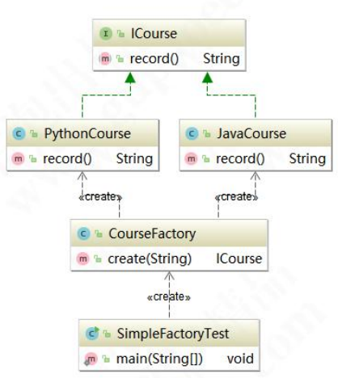
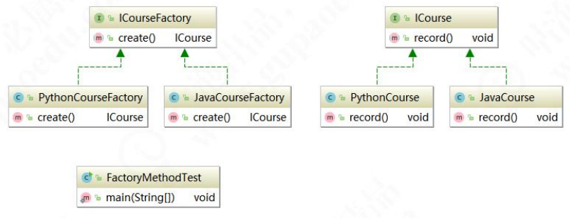
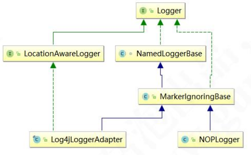
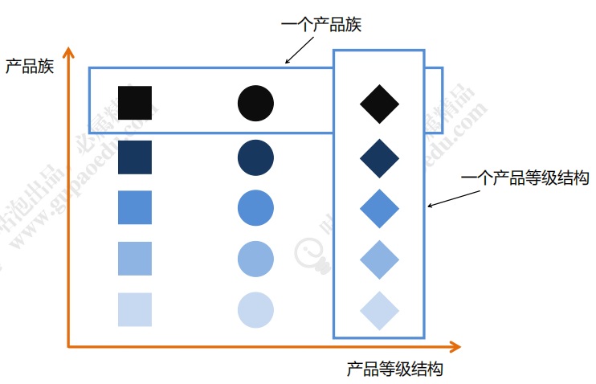
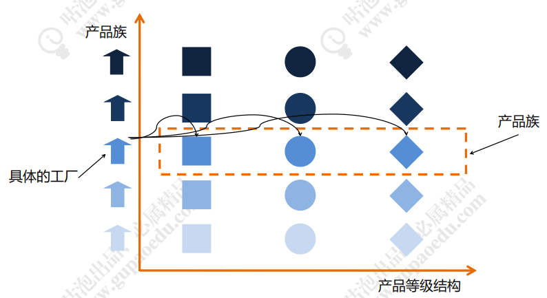

# 工厂模式

剖析工厂模式的历史由来及应用场景。

### 工厂模式的历史由来

在现实生活中我们都知道，原始社会自给自足（没有工厂）、农耕社会小作坊（简单工厂，民间酒坊）、工业革命流水线（工厂方法，自产自销）、现代产业链代工厂（抽象工厂，富士康）


**原始社会自给自足      农耕社会小作坊**


**工厂流水线生产    现代产业链代工厂**

我们的项目代码同样也是由简而繁一步一步迭代而来，但对于调用者来说确是越来越简单化。

### 简单工厂模式

简单工厂模式是指由一个工厂决定创建出哪一种产品类的实例，但它不属于GOF, 23 种设计模式（参考资料：http://en.wikipedia.org/wiki/Design_Patterns#Patterns_by_Type）。简单工厂适用于工厂类负责创建的对象较少的场景，且客户端只需要传入工厂类的参数，对于如何创建对象的逻辑不需要关系。

接下来我们来看代码， 还是以课程为例。咕咆学院目前设有Java架构、大数据、人工智能等课程，已经形成了一个生态。我们可以定义一个课程标准ICourse接口：

```java
public interface ICourse {
    /** 录制视频 */
    public void record();
}
```

创建一个Java课程的实现JavaCourse类：

```java
public class JavaCourse implements ICourse {
    public void record() {
        System.out.printIn("录制Java课程");
    }
}
```

看客户端调用代码，我们会这样写：

```java
public static void main(String[] args) {
    ICounrse course = new JavaCourse();
    course.record();
}
```

看上面的代码，父类ICourse指向子类JavaCourse的引用，应用层代码需要依赖JavaCourse， 如果业务扩展，我继续增加PythonCourse甚至更多，那么我们客户端的依赖会变得越来越臃肿。因此，我们要想办法把这种依赖减弱，把创建细节隐藏。虽然目前的代码中，我们创建对象的过程并不复杂，但从代码设计角度来讲不易于扩展。现在，我们用简单工厂模式对代码进行优化。先增加课程PythonCourse类：

```java
public class PythonCourse implements ICourse {
    public void record() {
        System.out.printIn("录制Python课程");
    }
}
```

创建CourseFactory工厂类：

```java
public class CourseFactory {
    public ICourse create(String name) {
        if ("java".equals(name)) {
            return new JavaCourse();
        } else if ("python".equals(name)) {
            return new PythonCourse();
        } else {
            return null;
        }        
    }
}
```

修改客户端调用代码：

```java
public class SimpleFactoryTest {
    public static void main(String[] args) {
        CourseFactory factory = new CourseFactory();
        factory.create("java");
    }
}
```

当然，我们为了调用方便，可将factory的create()改为静态方法，下面来看一下类图：



客户端调用是简单了，但如果我们业务继续扩展，要增加前端课程，那么工厂中的create()就要根据产品链的丰富每次都要修改代码逻辑。不符合开闭原则。因此，我们对简单工厂还可以继续优化，可以采用反射技术：

```java
public class CourseFactory {
    public ICourse create(String className) {
        try {
            if (!(null == className || "".equals(className))) {
                return (ICourse) Class.forName(className).newInstance();
            }
        } catch (Exception e) {
            e.printStackTrace();
        }
        return null;
    }
}
```

修改客户端调用代码：

```java
public static void main(String[] args) {
    CourseFactory factory = new CourseFactory();
    ICourse course = factory.create("com.free.pattern.factory.simplefactory.JavaCourse");
    course.record();
}
```

优化之后，产品不断丰富不需要修改CourseFactory中的代码。但是，有个问题是，方法参数是字符串，可控件有待提升，而且还需要强制转型。我们再修改一下代码：

```java
public Icource create(Class<? extends ICourse> clazz) {
    try {
        if (null != clazz) {
            return clazz.newInstance();
        }
    } catch (Exception e) {
        e.printStackTrace();
    }
    return null;
}
```

优化客户端代码

```java
public static void main(String[] args) {
    CourseFactory factory = new CourseFactory();
    ICourse course = factory.create(JavaCourse.class);
    course.record();
}
```

再看一下类图：


简单工厂模式在JDK源码也是无处不在，现在我们来举个例子，例如Calendar类，看Calendar.getInstance()方法，下面打开的是Calendar的具体创建类：

```java
private static Calendar createCalendar(TimeZone zone, Locale aLocale) {
    CalendarProvider provider = LocaleProviderAdapter.getAdapter(CalendarProvider.class, aLocale).getCalendarProvider();
    if (provider != null) {
        try {
            return provider.getInstance(zone, aLocale)
        } catch (IllegalArgumentException e) {
            // fall back to the default instantiation
        }
    }
    Calendar cal = null;
    if (aLocale.hasExtensions()) {
        String caltype = aLocale.getUnicodeLocaleType("ca");
        if (caltype != null) {
            switch (caltype) {
                case "buddhist":
                    cal = new BuddhisCalendar(zone, aLocale);
                    break;
                case "japanese":
                    cal = new JapaneseImperialCalendar(zone, aLocale);
                    break;
                case "gregory":
                    cal = new GregorianCalendar(zone, aLocale);
                    break;
                    
            }
        }
    }
    if (cal == null) {
        // If no known calendar type is explicitly specified, 
        // perform the traditional way to create a Calendar: 
        // create a BuddhistCalendar for th_TH locale, 
        // a JapaneseImperialCalendar for ja_JP_JP locale, or 
        // a GregorianCalendar for any other locales. 
        // NOTE: The language, country and variant strings are interned.
        if (aLocale.getLanguage() == "th" && aLocale.getCountry() == "TH") {
            cal = new BuddhisCalendar(zone, aLocale);
        } else if (aLocale.getVariant() == "JP" && aLocale.getLanguage() == "ja" && aLocale.getCountry() == "JP") {
            cal = new JapaneseTmperialCalendar(zone, aLocale);
        } else {
            cal = new GregorianCalendar(zone, aLocale);
        }
    }
    return cal;
}
```

还有一个大家经常使用的logback, 我们可以看到LoggerFactory 中有多个重载的方法getLogger():

```java
public static Logger getLogger(String name) {
    ILonggerFactory iLoggerFactory = getILoggerFactory();
    return iLoggerFactory.getLogger(name);
}

public static Logger getLogger(Class clazz) {
    return getLogger(clazz.getName());
}
```

简单工厂也有它的缺点：工厂类的职责相对过重，不易于扩展过于复杂的产品结构。

### 工厂方法模式

工厂方法模式（Fatory Method Pattern）是指定义一个创建对象的接口，但让实现这个接口的类来决定实例化哪个类，工厂方法让类的实例推迟到子类中进行。在工厂方法模式中用户只需要关心所需产品对应的工厂，无须关心创建细节，而且加入新的产品符合开闭原则。

工厂方法模式主要解决产品扩展的问题，在简单工厂中，随着产品链的丰富，如果每个课程的创建逻辑有区别的话，工厂的职责会变得越来越多，有点像万能工厂，并不便于维护。根据单一职责原则我们将职能继续拆分，专人干专事。Java课程由Java工厂创建，Python 课程由Python工厂创建，对工厂本身也做一个抽象。来看代码，先创建ICourseFactory 接口：

```java
public interface ICourseFactory {
    ICourse create();
}
```

在分别创建子工厂，JavaCourseFactory 类：

```java
import com.free.pattern.factory.ICourse;
import com.free.pattern.factory.JavaCourse;
public class JavaCourseFactory implements ICourseFactory {
    public ICourse create() {
        return new JavaCourse();
    }
}
```

PythonCourseFactory 类：

```java
import com.free.pattern.factory.ICourse;
import com.free.pattern.factory.PythonCourse;

public class PythonCourseFactory implements ICourseFactory{
    public ICourse create() {
        return new PythonCourse();
    }  
}
```

看测试代码：

```java
public static void main(String[] args) {
    ICourseFactory factory = new PythonCourseFactory();
    ICourse course = factory.create();
    course.record();
    
    factory = new JavaCourseFactory();
    course = factory.create();
    course.record();
}
```

现在再来看一下类图：



再来看看logback中工厂方法模式的应用，看看类图就OK了：





工厂方法适用于以下场景：

1. 创建对象需要大量重复的代码。
2. 客户端不依赖于产品类实例如何被创建、实现等细节。
3. 一个类通过其子类来指定创建哪个对象。

工厂方法也有缺点：

1. 类的个数容易过多，增加复杂度。
2. 增加了系统的抽象性和理解难度。

### 抽象工厂模式

抽象工厂模式（Abastract Factory Pattern）是指提供一个创建一系列相关或互相依赖对象的接口，无须指定他们具体的类。客户端（应用层）不依赖于产品类实例如何被创建、实现等细节。强调的是一系列相关的产品对象（属于同一产品族）一起使用创建对象需要大量重复的代码。需要提供一个产品类的库，所有的产品以同样的接口出现，从而使客户端不依赖具体实现。

讲解抽象工厂之前，我们要了解两个概念产品等级结构和产品族，看下面的图：



从上图中看出有正方形，圆形和菱形三种图形，相同颜色深浅就代表同一个产品族，相同形状的代表同一个

产品等级结构。同样可以从生活中来举例，比如，美的电器生产多种家用电器。那么上图中，颜色最深的正方形就代表美的洗衣机、颜色最深的圆形代表美的空调、颜色最深的菱形代表美的热水器，颜色最深的一排都属于美的品牌，都是美的电器这个产品族。再看最右侧的菱形，颜色最深的我们指定了代表美的热水器，那么第二排颜色稍微浅一点的菱形，代表海信的热水器。同理，同一产品结构下还有格力热水器，格力空调，格力洗衣机。

再看下面的这张图，最左侧的小房子我们就认为具体的工厂，有美的工厂，有海信工厂，有格力工厂。每个品牌的工厂都生产洗衣机、热水器和空调。



通过上面两张图的对比理解，相信大家对抽象工厂有了非常形象的理解。接下来我们来看一个具体的业务场景而且用代码来实现。还是以课程为例，咕咆学院第三期课程有了新的标准，每个课程不仅要提供课程的录播视频，而且还要提供老师的课堂笔记。相当于现在的业务变更为同一个课程不单纯是一个课程信息，要同时包含录播视频、课堂笔记甚至还要提供源码才能构成一个完整的课程。在产品等级中增加两个产品IVideo录播视频和INote课堂笔记。

IVideo接口：

```java
public interface IVideo {
    void record();
}
```

INote 接口

```java
public interface INote {
    void edit();
}
```

然后创建一个抽象工厂CourseFactory类：

```java
import com.free.pattern.factory.INote;
import com.free.pattern.factory.IVideo;

public interface CourseFactory {
    INote createNote();
    IVideo createNote();
}
```

接下来，创建Java产品族，Java视频JavaVideo类：

```java
public class JavaVideo implements IVideo {
    public void record() {
        System.out.printIn("录播Java视频");
    }
}
```

扩展产品等级Java课堂笔记JavaNote类：

```java
public class JavaNote implements INote {
    public void edit() {
        System.out.printIn("编写Java笔记");
    }
}
```

创建Java产品族的具体工厂JavaCourseFactory:

```java
public class JavaCourseFactory implements CourseFactory {
    public INote createNote() {
        return new JavaNote();
    }
    public IVideo createVideo() {
        return new JavaVideo();
    }
}
```

然后创建Python产品，Python视频PythonVideo类：

```java
public class PythonVideo implements IVideo {
    public void record() {
        System.out.printIn("录制Python视频");
    }
}
```

扩展产品等级Python课堂笔记PythonNote类：

```java
public class PythonNote implements INote {
    public void edit() {
        System.out.printIn("编写Python笔记");
    }
}
```

创建Python产品族的具体工厂PythonCourseFactory:

```java
public class PythonCourseFactory implements CourseFactory {
    public INote createNote() {
        return new PythonNote();
    }
    public IVideo createVideo() {
        return new PythonVideo();
    }
}
```

来看客户端调用：

```java
public static void main(String[] args) {
    JavaCourseFactory factory = new JavaCourseFactory();
    factory.createNote().edit();
    factory.createNote().record();
}
```

上面的代码完整地描述了两个产品族Java课程和Python课程，也描述了两个产品等级视频和手记。抽象工厂非常完美清晰地描述这样一层复杂的关系。但是，不知道大家有没有发现，如果我们再继续扩展产品等级，将源码Source也加入到课程中，那么我们的代码从抽象工厂，到具体工厂要全部调整，很明显不符合开闭原则。因此抽象工厂也是有缺点的：

1. 规定了所有可能被创建的产品集合，产品族中扩展新的产品空难，需要修改抽象工厂的接口。
2. 增加了系统的抽象性和理解难度。

但在实际应用中，我们千万不能犯强迫症甚至有洁癖。在实际需求中产品等级结构升级是非常正常的一件事情。我们可以根据实际情况，只要不是频繁升级，可以不遵循开闭原则。代码每半年升级一次或者每年升级一次又有何不可呢？

### 利用工厂模式重构的实践案例

还是演示课堂开始的JDBC操作案例，我们每次操作是不是都需要重新创建数据库连接，每次创建其实都非常耗费性能，消耗业务调用时间。我们利用工厂模式，将数据库连接预先创建好放到容器中缓存着，在业务调用时就只需要现取现用。接下来我们来看这段代码：

Pool抽象类：

```java
package org.jdbc.sqlhelper;

public abstract class Pool {
    public String propertiesName = "";
    private static Pool instance = null; // 定义唯一示例
    
    protected int maxConnect = 100; // 最大连接数
    protected int normalConnect = 10; // 保持连接数
    protected String driverName = null; // 驱动字符串
    protected Driver driver = null; // 驱动变量
    
    protected Pool() {
        try {
            init();
            loadDrivers(driverName);
        } catch (Exception e) {
            e.printStackTrace();
        }
    }
    
    private void init() throws IOException {
        InputStream is = Pool.class.getResourceAsStream(propertiesName);
        Properties p = new Properties();
        p.load(is);
        this.driverName = p.getProperty("driverName");
        this.maxConnect = Integer.parseInt(p.getProperty("maxConnect"));
        this.normalConnect = Integer.parseInt(p.getProperty("normalConnect"));
    }
    
    protoected void loadDrivers(String dri) {
        String driverClassName = dri;
        try {
            driver = (Driver) Class.forName(driverClassName).newIntance();
            DirverManager.registerDriver(driver);
            Ststem.out.printIn("成功注册JDBC驱动程序" + driverClassName);
        } catch (Exception e) {
            System.out.printIn("无法注册JDBC驱动程序：" + driverClassName + ",错误：" + e);
        }
    }
    
    /**
     * 创建连接池
     */
    public abstract void createPool();
    
    public static synchronized Pool getInstance() throws IOException, InstantiationException, IllegalAccessException, ClassNotFoundException {
        if (instance == null) {
            instance.init();
            instance = () Class.forName("org.e_book.sqlhelp.Pool").newInstance();
            
        }
        return instance;
    }
    
    public abstract Connection getConnection();
    
    public abstract Connection getConnection(long time);
    
    public abstract void freeConnection(Connection con);
    
    public abstract int getnum();
    
    public abstract int getnumActive();
    
    protected synchronized void release() {
        try {
            DriverManager.dergisterDriver(driver);
            System.out.printIn("撤销JDBC驱动程序" + driver.getClass().getName());
        } catch (SQLExcetion e) {
            System.out.printIn("无法撤销JDBC驱动程序的注册：" + driver.getClass().getName());
        }
    }
    
    
}
```

DBConnectionPool 数据库连接池：

```java
package org.jdbc.sqlhelper;

import java.io.IOException;
import java.io.InputStream;
import java.sql.*;
import java.util.*;
import java.util.Date;


/**
 * 数据库链接池管理类
 *
 * @author Tom
 *
 */
public final class DBConnectionPool extends Pool {
	private int checkedOut; //正在使用的连接数
	/**
	 * 存放产生的连接对象容器
	 */
	private Vector<Connection> freeConnections = new Vector<Connection>(); //存放产生的连接对象容器

	private String passWord = null; // 密码

	private String url = null; // 连接字符串

	private String userName = null; // 用户名

	private static int num = 0;// 空闲连接数

	private static int numActive = 0;// 当前可用的连接数

	private static DBConnectionPool pool = null;// 连接池实例变量

	/**
	 * 产生数据连接池
	 * @return
	 */
	public static synchronized DBConnectionPool getInstance()
	{
		if(pool == null)
		{
			pool = new DBConnectionPool();
		}
		return pool;
	}

	/**
	 * 获得一个 数据库连接池的实例
	 */
	private DBConnectionPool() {
		try
		{
			init();
			for (int i = 0; i < normalConnect; i++) { // 初始normalConn个连接
				Connection c = newConnection();
				if (c != null) {
					freeConnections.addElement(c); //往容器中添加一个连接对象
					num++; //记录总连接数
				}
			}
		}catch(Exception e)
		{
			e.printStackTrace();
		}
	}
	/**
	 * 初始化
	 * @throws IOException
	 *
	 */
	private void init() throws IOException
	{
		InputStream is = DBConnectionPool.class.getResourceAsStream(propertiesName);
		Properties p = new Properties();
		p.load(is);
		this.userName = p.getProperty("userName");
		this.passWord = p.getProperty("passWord");
		this.driverName = p.getProperty("driverName");
		this.url = p.getProperty("url");
		this.driverName = p.getProperty("driverName");
		this.maxConnect = Integer.parseInt(p.getProperty("maxConnect"));
		this.normalConnect = Integer.parseInt(p.getProperty("normalConnect"));
	}

	/**
	 * 如果不再使用某个连接对象时,可调此方法将该对象释放到连接池
	 *
	 * @param con
	 */
	public synchronized void freeConnection(Connection con) {
		freeConnections.addElement(con);
		num++;
		checkedOut--;
		numActive--;
		notifyAll(); //解锁
	}

	/**
	 * 创建一个新连接
	 *
	 * @return
	 */
	private Connection newConnection() {
		Connection con = null;
		try {
			if (userName == null) { // 用户,密码都为空
				con = DriverManager.getConnection(url);
			} else {
				con = DriverManager.getConnection(url, userName, passWord);
			}
			System.out.println("连接池创建一个新的连接");
		} catch (SQLException e) {
			System.out.println("无法创建这个URL的连接" + url);
			return null;
		}
		return con;
	}

	/**
	 * 返回当前空闲连接数
	 *
	 * @return
	 */
	public int getnum() {
		return num;
	}

	/**
	 * 返回当前连接数
	 *
	 * @return
	 */
	public int getnumActive() {
		return numActive;
	}

	/**
	 * (单例模式)获取一个可用连接
	 *
	 * @return
	 */
	public synchronized Connection getConnection() {
		Connection con = null;
		if (freeConnections.size() > 0) { // 还有空闲的连接
			num--;
			con = (Connection) freeConnections.firstElement();
			freeConnections.removeElementAt(0);
			try {
				if (con.isClosed()) {
					System.out.println("从连接池删除一个无效连接");
					con = getConnection();
				}
			} catch (SQLException e) {
				System.out.println("从连接池删除一个无效连接");
				con = getConnection();
			}
		} else if (maxConnect == 0 || checkedOut < maxConnect) { // 没有空闲连接且当前连接小于最大允许值,最大值为0则不限制
			con = newConnection();
		}
		if (con != null) { // 当前连接数加1
			checkedOut++;
		}
		numActive++;
		return con;
	}

	/**
	 * 获取一个连接,并加上等待时间限制,时间为毫秒
	 *
	 * @param timeout  接受等待时间(以毫秒为单位)
	 * @return
	 */
	public synchronized Connection getConnection(long timeout) {
		long startTime = new Date().getTime();
		Connection con;
		while ((con = getConnection()) == null) {
			try {
				wait(timeout); //线程等待
			} catch (InterruptedException e) {
			}
			if ((new Date().getTime() - startTime) >= timeout) {
				return null; // 如果超时,则返回
			}
		}
		return con;
	}

	/**
	 * 关闭所有连接
	 */
	public synchronized void release() {
		try {
			//将当前连接赋值到 枚举中
			Enumeration allConnections = freeConnections.elements();
			//使用循环关闭所用连接
			while (allConnections.hasMoreElements()) {
				//如果此枚举对象至少还有一个可提供的元素，则返回此枚举的下一个元素
				Connection con = (Connection) allConnections.nextElement();
				try {
					con.close();
					num--;
				} catch (SQLException e) {
					System.out.println("无法关闭连接池中的连接");
				}
			}
			freeConnections.removeAllElements();
			numActive = 0;
		} finally {
			super.release();
		}
	}

	/**
	 * 建立连接池
	 */
	public void createPool() {

		pool = new DBConnectionPool();
		if (pool != null) {
			System.out.println("创建连接池成功");
		} else {
			System.out.println("创建连接池失败");
		}
	}
}

```