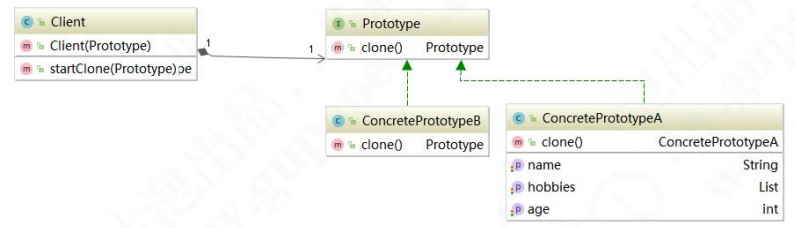

# 原型模式

原型模式（Prototype Pattern）是指原型实例指定创建对象的种类，并且通过拷贝这些原型创建新 的对象，属于创建型模式。

> **官方原文：**Specify the kinds of objects to create using a prototypical instance,and create new objects by copying this prototype.

原型模式的核心在于拷贝原型对象。以系统中已存在的一个对象为原型，直接基于内存二进制流进 行拷贝，无需再经历耗时的对象初始化过程（不调用构造函数），性能提升许多。当对象的构建过程比 较耗时时，可以利用当前系统中已存在的对象作为原型，对其进行克隆（一般是基于二进制流的复制），躲避初始化过程，使得新对象的创建时间大大减少。下面，我们来看看原型模式类结构图：

从 UML 图中，我们可以看到，原型模式 主要包含三个角色： 

客户(Client)：客户类提出创建对象的请求。 

抽象原型(Prototype)：规定拷贝接口。 

具体原型（Concrete Prototype）：被拷贝的对象。

> 注：对不通过 new 关键字，而是通过对象拷贝来实现创建对象的模式就称作原型模式。


### **原型模式的应用场景** 

你一定遇到过大篇幅 getter、setter 赋值的场景。例如这样的代码：

```java
package prototype.demo;

import lombok.Data;

@Data
public class ExamPaper{

   private String examinationPaperId;//试卷主键
   private String leavTime;//剩余时间
   private String organizationId;//单位主键
   private String id;//考试主键
   private String examRoomId;//考场主键
   private String userId;//用户主键
   private String specialtyCode;//专业代码
   private String postionCode;//报考岗位
   private String gradeCode;//报考等级
   private String examStartTime;//考试开始时间
   private String examEndTime;//考试结束时间
   private String singleSelectionImpCount;//单选选题重要数量
   private String multiSelectionImpCount;//多选题重要数量
   private String judgementImpCount;//判断题重要数量
   private String examTime;//考试时长
   private String fullScore;//总分
   private String passScore;//及格分
   private String userName;//学员姓名
   private String score;//考试得分
   private String resut;//是否及格
   private String singleOkCount;//单选题答对数量
   private String multiOkCount;//多选题答对数量
   private String judgementOkCount;//判断题答对数量

   public ExamPaper copy(){
      ExamPaper examPaper = new ExamPaper();
      //剩余时间
      examPaper.setLeavTime(this.getLeavTime());
      //单位主键
      examPaper.setOrganizationId(this.getOrganizationId());
      //考试主键
      examPaper.setId(this.getId());
      //用户主键
      examPaper.setUserId(this.getUserId());
      //专业
      examPaper.setSpecialtyCode(this.getSpecialtyCode());
      //岗位
      examPaper.setPostionCode(this.getPostionCode());
      //等级
      examPaper.setGradeCode(this.getGradeCode());
      //考试开始时间
      examPaper.setExamStartTime(this.getExamStartTime());
      //考试结束时间
      examPaper.setExamEndTime(this.getExamEndTime());
      //单选题重要数量
      examPaper.setSingleSelectionImpCount(this.getSingleSelectionImpCount());
      //多选题重要数量
      examPaper.setMultiSelectionImpCount(this.getMultiSelectionImpCount());
      //判断题重要数量
      examPaper.setJudgementImpCount(this.getJudgementImpCount());
      //考试时间
      examPaper.setExamTime(this.getExamTime());
      //总分
      examPaper.setFullScore(this.getFullScore());
      //及格分
      examPaper.setPassScore(this.getPassScore());
      //学员姓名
      examPaper.setUserName(this.getUserName());
      //分数
      examPaper.setScore(this.getScore());

      //单选答对数量
      examPaper.setSingleOkCount(this.getSingleOkCount());
      //多选答对数量
      examPaper.setMultiOkCount(this.getMultiOkCount());
      //判断答对数量
      examPaper.setJudgementOkCount(this.getJudgementOkCount());

      return examPaper;
   }
}
```

代码非常工整，命名非常规范，注释也写的很全面，大家觉得这样的代码优雅吗？我认 为，这样的代码属于纯体力劳动。那么原型模式，能帮助我们解决这样的问题。 原型模式（Prototype Pattern）是指原型实例指定创建对象的种类，并且通过拷贝这些原型创建新的对象。 

原型模式主要适用于以下场景： 

1、类初始化消耗资源较多。 

2、new 产生的一个对象需要非常繁琐的过程（数据准备、访问权限等）

3、构造函数比较复杂。 

4、循环体中生产大量对象时。 

在 Spring 中，原型模式应用得非常广泛。例如 scope=“prototype”，在我们经常用的JSON.parseObject()也是一种原型模式。下面，我们来看看原型模式类结构图：


### 原型模式的通用写法

一个标准的原型模式代码，应该是这样设计的。先创建原型 Prototype 接口：

```java
public interface IPrototype<T> { T clone(); }
```

创建具体需要克隆的对象 ConcretePrototype

```java
public class ConcretePrototype implements IPrototype {

    private int age;
    private String name;

    public int getAge() {
        return age;
    }
    public void setAge(int age) {
        this.age = age;
    }
    public String getName() {
        return name;
    }
    public void setName(String name) {
        this.name = name;
    }
    @Override
    public ConcretePrototype clone() {
        ConcretePrototype concretePrototype = new ConcretePrototype();
        concretePrototype.setAge(this.age);
        concretePrototype.setName(this.name);
        return concretePrototype;
    }
    @Override
    public String toString() {
        return "ConcretePrototype{" +
                "age=" + age +
                ", name='" + name + '\'' +
                '}';
    }
}
```

测试代码：

```java
public static void main(String[] args) {
    //创建原型对象
    ConcretePrototype prototype = new ConcretePrototype();
    prototype.setAge(18);
    prototype.setName("Tom");
    System.out.println(prototype);
    //拷贝原型对象
    ConcretePrototype cloneType = prototype.clone();
    System.out.println(cloneType);
}
```

运行结果：

> ConcretePrototype{age=18, name='Tom'}
> ConcretePrototype{age=18, name='Tom'}

这时候，有小伙伴就问了，原型模式就这么简单吗？对，就是这么简单。在这个简单的场景之下，看上 去操作好像变复杂了。但如果有几百个属性需要复制，那我们就可以一劳永逸。但是，上面的复制过程 是我们自己完成的，在实际编码中，我们一般不会浪费这样的体力劳动，JDK 已经帮我们实现了一个现 成的 API，我们只需要实现 Cloneable 接口即可。来改造一下代码，修改 ConcretePrototype 类：

```java
public class ConcretePrototype implements Cloneable {

    private int age;
    private String name;

    public int getAge() {
        return age;
    }
    public void setAge(int age) {
        this.age = age;
    }
    public String getName() {
        return name;
    }
    public void setName(String name) {
        this.name = name;
    }
    @Override
    public ConcretePrototype clone() {
        try {
            return (ConcretePrototype)super.clone(); 
        } catch (CloneNotSupportedException e) { 
            e.printStackTrace(); return null; 
        }
    }
    @Override
    public String toString() {
        return "ConcretePrototype{" +
                "age=" + age +
                ", name='" + name + '\'' +
                '}';
    }
}
```

重新运行，也会得到同样的结果。有了 JDK 的支持再多的属性复制我们也能轻而易举地搞定了。下面我 们再来做一个测试，给 ConcretePrototype 增加一个个人爱好的属性 hobbies：

```java
@Data
public class ConcretePrototype implements Cloneable {

    private int age;
    private String name;
    private List<String> hobbies;

    @Override
    public ConcretePrototype clone() {
        try {
            return (ConcretePrototype)super.clone();
        } catch (CloneNotSupportedException e) {
            e.printStackTrace();
            return null;
        }
    }
    @Override
    public String toString() {
        return "ConcretePrototype{" +
                "age=" + age +
                ", name='" + name + '\'' +
                ", hobbies=" + hobbies +
                '}';
    }
}
```

修改客户端测试代码：

```java
public class Client {
    public static void main(String[] args) {
        //创建原型对象
        ConcretePrototype prototype = new ConcretePrototype();
        prototype.setAge(18);
        prototype.setName("Tom");
        List<String> hobbies = new ArrayList<String>();
        hobbies.add("书法");
        hobbies.add("美术");
        prototype.setHobbies(hobbies);
        //拷贝原型对象
        ConcretePrototype cloneType = prototype.clone();
        cloneType.getHobbies().add("技术控");
        System.out.println("原型对象：" + prototype);
        System.out.println("克隆对象：" + cloneType);
        System.out.println(prototype == cloneType);
    }
}
```

我们给，复制后的克隆对象新增一项爱好，发现原型对象也发生了变化，这显然不符合我们的预期。 因为我们希望克隆出来的对象应该和原型对象是两个独立的对象，不应该再有联系了。从测试结果分析 来看，应该是 hobbies 共用了一个内存地址，意味着复制的不是值，而是引用的地址。这样的话，如果我们修改任意一个对象中的属性值，prototype 和 cloneType 的 hobbies 值都会改变。这就是我们常 说的浅克隆。只是完整复制了值类型数据，没有赋值引用对象。换言之，所有的引用对象仍然指向原来 的对象，显然不是我们想要的结果。那如何解决这个问题呢？下面我们来看深度克隆继续改造。

### 使用序列化实现深度克隆 

在上面的基础上我们继续改造，来看代码，增加一个 deepClone()方法：

```java
@Data
public class ConcretePrototype implements Cloneable,Serializable {

    private int age;
    private String name;
    private List<String> hobbies;

    @Override
    public ConcretePrototype clone() {
        try {
            return (ConcretePrototype)super.clone();
        } catch (CloneNotSupportedException e) {
            e.printStackTrace();
            return null;
        }
    }

    public ConcretePrototype deepCloneHobbies(){
        try {
            ConcretePrototype result = (ConcretePrototype)super.clone();
            result.hobbies = (List)((ArrayList)result.hobbies).clone();
            return result;
        } catch (CloneNotSupportedException e) {
            e.printStackTrace();
            return null;
        }
    }

    public ConcretePrototype deepClone(){
        try {
            ByteArrayOutputStream bos = new ByteArrayOutputStream();
            ObjectOutputStream oos = new ObjectOutputStream(bos);
            oos.writeObject(this);

            ByteArrayInputStream bis = new ByteArrayInputStream(bos.toByteArray());
            ObjectInputStream ois = new ObjectInputStream(bis);

            return (ConcretePrototype)ois.readObject();
        }catch (Exception e){
            e.printStackTrace();
            return null;
        }
    }

    @Override
    public String toString() {
        return "ConcretePrototype{" +
                "age=" + age +
                ", name='" + name + '\'' +
                ", hobbies=" + hobbies +
                '}';
    }
}
```

来看客户端调用代码：

```java
public class Client {
    public static void main(String[] args) {
        //创建原型对象
        ConcretePrototype prototype = new ConcretePrototype();
        prototype.setAge(18);
        prototype.setName("Tom");
        List<String> hobbies = new ArrayList<String>();
        hobbies.add("书法");
        hobbies.add("美术");
        prototype.setHobbies(hobbies);

        //拷贝原型对象
        ConcretePrototype cloneType = prototype.deepCloneHobbies();
        cloneType.getHobbies().add("技术控");

        System.out.println("原型对象：" + prototype);
        System.out.println("克隆对象：" + cloneType);
        System.out.println(prototype == cloneType);
        
        System.out.println("原型对象的爱好：" + prototype.getHobbies());
        System.out.println("克隆对象的爱好：" + cloneType.getHobbies());
        System.out.println(prototype.getHobbies() == cloneType.getHobbies());
    }
}
```

运行程序，我们发现得到了我们期望的结果：

> 原型对象：ConcretePrototype{age=18, name='Tom', hobbies=[书法, 美术]}
> 克隆对象：ConcretePrototype{age=18, name='Tom', hobbies=[书法, 美术, 技术控]}
> false
> 原型对象的爱好：[书法, 美术]
> 克隆对象的爱好：[书法, 美术, 技术控]
> false

### 克隆破坏单例模式 

如果我们克隆的目标的对象是单例对象，那意味着，深克隆就会破坏单例。实际上防止克隆破坏单 例解决思路非常简单，禁止深克隆便可。要么你我们的单例类不实现 Cloneable 接口；要么我们重写 clone()方法，在 clone 方法中返回单例对象即可，具体代码如下： 

```java
@Override
public ConcretePrototype clone() {
    return instance;
}
```

### 原型模式在源码中的应用

先来 JDK 中 Cloneable 接口： 

```java
public interface Cloneable {
}
```

接口定义还是很简单的，我们找源码其实只需要找到看哪些接口实现了 Cloneable 即可。来看 ArrayList 类的实现。

```java
public Object clone() {
    try {
        ArrayList<?> v = (ArrayList<?>) super.clone();
        v.elementData = Arrays.copyOf(elementData, size);
        v.modCount = 0;
        return v;
    } catch (CloneNotSupportedException e) {
        // this shouldn't happen, since we are Cloneable
        throw new InternalError(e);
    }
}
```

我们发现方法中只是将 List 中的元素循环遍历了一遍。这个时候我们再思考一下，是不是这种形式 就是深克隆呢？其实用代码验证一下就知道了，继续修改 ConcretePrototype 类，增加一个 deepCloneHobbies()方法：

```java
 public ConcretePrototype deepCloneHobbies(){
     try {
         ConcretePrototype result = (ConcretePrototype)super.clone();
         result.hobbies = (List)((ArrayList)result.hobbies).clone();
         return result;
     } catch (CloneNotSupportedException e) {
         e.printStackTrace();
         return null;
     }
 }
```

修改客户端代码： 

```java
public static void main(String[] args) {
    ...
    //拷贝原型对象
    ConcretePrototype cloneType = prototype.deepCloneHobbies();
    ...
}
```

运行也能得到期望的结果。但是这样的代码，其实是硬编码，如果在对象中声明了各种集合类型， 那每种情况都需要单独处理。因此，深克隆的写法，一般会直接用序列化来操作。

### 原型模式的优缺点 

优点: 

1、性能优良，Java 自带的 原型模式 是基于内存二进制流的拷贝，比直接 new 一个对象性能上提 升了许多。 

2、可以使用深克隆方式保存对象的状态，使用原型模式将对象复制一份并将其状态保存起来，简化 了创建对象的过程，以便在需要的时候使用(例如恢复到历史某一状态)，可辅助实现撤销操作。 

缺点： 

1、需要为每一个类配置一个克隆方法。 

2、克隆方法位于类的内部，当对已有类进行改造的时候，需要修改代码，违反了开闭原则。 

3、在实现深克隆时需要编写较为复杂的代码，而且当对象之间存在多重嵌套引用时，为了实现深克 隆，每一层对象对应的类都必须支持深克隆，实现起来会比较麻烦。因此，深拷贝、浅拷贝需要运用得当。