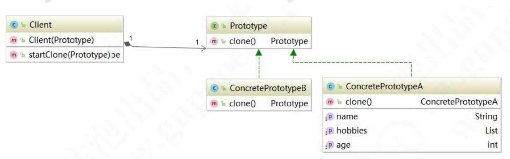

# 原型模式


**原型模式的应用场景** 

你一定遇到过大篇幅 getter、setter 赋值的场景。例如这样的代码：

```java
public void setParam(ExamPaperVo vo){ 
        ExamPaper examPaper = new ExamPaper(); //试卷主键 
    	examPaper.setExaminationPaperId(vo.getExaminationPaperId()); //剩余时间 curForm.setLeavTime(examPaper.getLeavTime()); //单位主键 curForm.setOrganizationId(examPaper.getOrganizationId()); //考试主键 curForm.setId(examPaper.getId()); //考场主键 curForm.setExamroomId(examPaper.getExamroomId()); //用户主键 curForm.setUserId(examPaper.getUserId()); //专业 curForm.setSpecialtyCode(examPaper.getSpecialtyCode()); //岗位 curForm.setPostionCode(examPaper.getPostionCode()); //等级 curForm.setGradeCode(examPaper.getGradeCode()); //考试开始时间 curForm.setExamStartTime(examPaper.getExamStartTime()); //考试结束时间
    curForm.setExamEndTime(examPaper.getExamEndTime()); //单选题重要数量 curForm.setSingleSelectionImpCount(examPaper.getSingleSelectionImpCount()); //多选题重要数量 curForm.setMultiSelectionImpCount(examPaper.getMultiSelectionImpCount()); //判断题重要数量 curForm.setJudgementImpCount(examPaper.getJudgementImpCount()); //考试时间 curForm.setExamTime(examPaper.getExamTime()); //总分 curForm.setFullScore(examPaper.getFullScore()); //及格分 curForm.setPassScore(examPaper.getPassScore()); //学员姓名 curForm.setUserName(examPaper.getUserName()); //分数 curForm.setScore(examPaper.getScore()); //是否及格 curForm.setResult(examPaper.getResult()); curForm.setIsPassed(examPaper.getIsPassed()); //单选答对数量 curForm.setSingleOkCount(examPaper.getSingleOkCount()); //多选答对数量 curForm.setMultiOkCount(examPaper.getMultiOkCount()); //判断答对数量 curForm.setJudgementOkCount(examPaper.getJudgementOkCount()); //提交试卷 service.submit(examPaper); 
}
```

代码非常工整，命名非常规范，注释也写的很全面，大家觉得这样的代码优雅吗？我认 

为，这样的代码属于纯体力劳动。那么原型模式，能帮助我们解决这样的问题。 

原型模式（Prototype Pattern）是指原型实例指定创建对象的种类，并且通过拷贝这些 

原型创建新的对象。 

原型模式主要适用于以下场景： 

1、类初始化消耗资源较多。 

2、new 产生的一个对象需要非常繁琐的过程（数据准备、访问权限等）

3、构造函数比较复杂。 

4、循环体中生产大量对象时。 

在 Spring 中，原型模式应用得非常广泛。例如 scope=“prototype”，在我们经常用 

的 JSON.parseObject()也是一种原型模式。下面，我们来看看原型模式类结构图：



**简单克隆** 

一个标准的原型模式代码，应该是这样设计的。先创建原型 Prototype 接口：

```java
public interface Prototype{ Prototype clone(); }
```

创建具体需要克隆的对象 ConcretePrototype

```java
import java.util.List; public class ConcretePrototypeA implements Prototype { private int age; private String name; private List hobbies; public int getAge() { return age; }public void setAge(int age) { this.age = age; }public String getName() { return name; }
public void setName(String name) { this.name = name; }public List getHobbies() { return hobbies; }public void setHobbies(List hobbies) { this.hobbies = hobbies; }@Override public ConcretePrototypeA clone() { ConcretePrototypeA concretePrototype = new ConcretePrototypeA(); concretePrototype.setAge(this.age); concretePrototype.setName(this.name); concretePrototype.setHobbies(this.hobbies); return concretePrototype; } }
```

创建 Client 对象

```java
public class Client { private Prototype prototype; public Client(Prototype prototype){ this.prototype = prototype; }public Prototype startClone(Prototype concretePrototype){ return (Prototype)concretePrototype.clone(); } }
```


