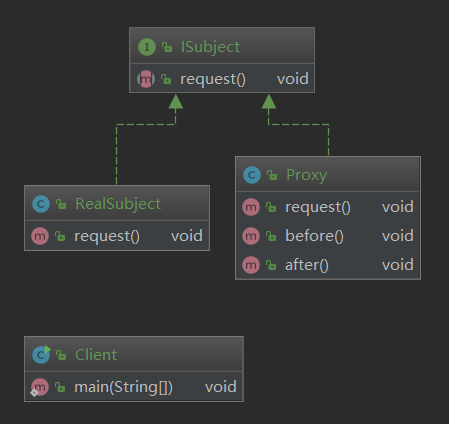
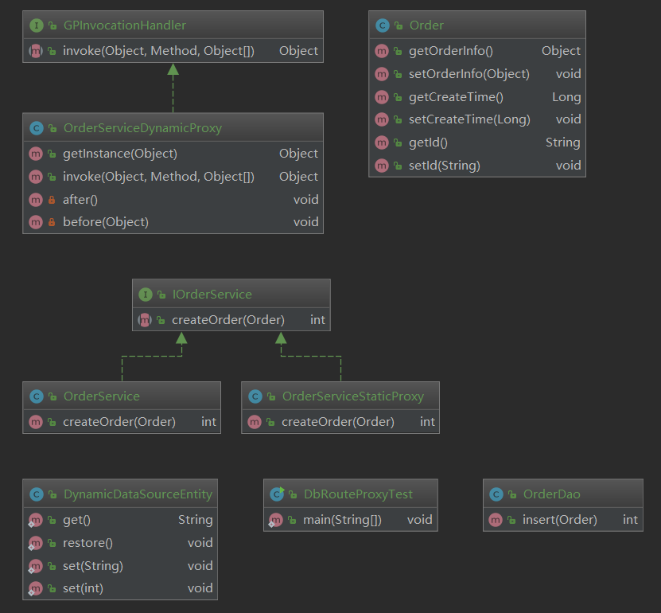
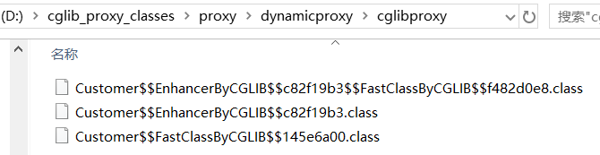
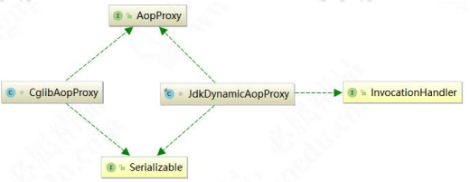

# 代理模式

### 本文目标

1、掌握代理模式的应用场景和实现原理。 

2、了解静态代理和动态代理的区别。 

3、了解 CGLib 和 JDK Proxy 的根本区别。 

4、手写实现定义的动态代理。

### 内容定位

都知道 SpringAOP 是用代理模式实现，到底是怎么实现的？我们来一探究竟，并且自己仿真手写 还原部分细节。

### 代理模式

代理模式（Proxy Pattern）是指为其他对象提供一种代理，以控制对这个对象的访问，属于结构型 模式。在某些情况下，一个对象不适合或者不能直接引用另一个对象，而代理对象可以在客户端和目标 对象之间起到中介的作用。

> **官方原文：**Provide a surrogate or placeholder for another object to control access to it.

首先来看代理模式的通用 UML 类图：



代理模式一般包含三种角色：

- 抽象主题角色（Subject）：抽象主题类的主要职责是声明真实主题与代理的共同接口方法，该类可 以是接口也可以是抽象类； 

- 真实主题角色（RealSubject）：该类也被称为被代理类，该类定义了代理所表示的真实对象，是负 责执行系统真正的逻辑业务对象； 

- 代理主题角色（Proxy）：也被称为代理类，其内部持有 RealSubject 的引用，因此具备完全的对 RealSubject 的代理权。客户端调用代理对象的方法，同时也调用被代理对象的方法，但是会在代理对 象前后增加一些处理代码。

在代码中，一般代理会被理解为代码增强，实际上就是在原代码逻辑前后增加一些代码逻辑，而使 调用者无感知。代理模式属于结构型模式，分为静态代理和动态代理。

### 代理模式的应用场景

生活中的租房中介、售票黄牛、婚介、经纪人、快递、事务代理、非侵入式日志监听等，都是代理 模式的实际体现。当无法或不想直接引用某个对象或访问某个对象存在困难时，可以通过也给代理对象 来间接访问。使用代理模式主要有两个目的：一是保护目标对象，二是增强目标对象。

### 代理模式的通用写法 

下面是代理模式的通用代码展示，首先创建代理主题角色 ISubject 类：

```java
public interface ISubject {
    void request();
}
```

创建真实主题角色 RealSubject 类： 

```java
public class RealSubject implements ISubject {

    public void request() {
        System.out.println("real service is called.");
    }

}
```

创建代理主题角色 Proxy 类：

```java
public class Proxy implements ISubject {

    private ISubject subject;

    public Proxy(ISubject subject){
        this.subject = subject;
    }


    public void request() {
        before();
        subject.request();
        after();
    }

    public void before(){
        System.out.println("called before request().");
    }

    public void after(){
        System.out.println("called after request().");
    }
}
```

客户端调用代码： 

```java
public class Client {
    public static void main(String[] args) {
        Proxy proxy = new Proxy(new RealSubject());
        proxy.request();
    }
}
```

### 从静态代理到动态代理 

举个例子，有些人到了适婚年龄，其父母总是迫不及待地希望早点抱孙子。而现在在各种压力之下， 很多人都选择晚婚晚育。于是着急的父母就开始到处为自己的子女相亲，比子女自己还着急。下面来看代码实现。创建顶层接口 IPerson 的代码如下：

```java
public interface IPerson {
    void findLove();
}
```

儿子张三要找对象，实现 ZhangSan 类：

```java
public class ZhangSan implements IPerson {

    public void findLove() {
        System.out.println("儿子要求：肤白貌美大长腿");
    }
}
```

父亲张老三要帮儿子张三相亲，实现 Father 类

```java
public class ZhangLaosan implements IPerson {

    private ZhangSan zhangsan;

    public ZhangLaosan(ZhangSan zhangsan) {
        this.zhangsan = zhangsan;
    }

    public void findLove() {
        System.out.println("张老三开始物色");
        zhangsan.findLove();
        System.out.println("开始交往");
    }
}
```

来看测试代码：

```java
public class Test {
    public static void main(String[] args) {
        ZhangLaosan zhangLaosan = new ZhangLaosan(new ZhangSan());
        zhangLaosan.findLove();
    }
}
```

运行结果如下所示:

> 张老三开始物色
> 儿子要求：肤白貌美大长腿
> 开始交往

但上面的场景有个弊端，就是自己父亲只会给自己的子女去物色对象，别人家的孩子是不会管的。

但社会上这项业务发展成了一个产业，出现了媒婆、婚介所等，还有各种各样的定制套餐。如果还使用 静态代理成本就太高了，需要一个更加通用的解决方案，满足任何单身人士找对象的需求。这就是由静 态代理升级到了动态代理。采用动态代理基本上只要是人（IPerson）就可以提供相亲服务。动态代理 的底层实现一般不用我们自己亲自去实现，已经有很多现成的 API。在 Java 生态中，目前最普遍使用的 是 JDK 自带的代理和 Cglib 提供的类库。下面我们首先基于 JDK 的动态代理支持如来升级一下代码。

首先，创建媒婆（婚介所）类 JdkMeipo：

```java
public class JdkMeipo implements InvocationHandler {
    private IPerson target;
    public IPerson getInstance(IPerson target){
        this.target = target;
        Class<?> clazz =  target.getClass();
        return (IPerson) Proxy.newProxyInstance(clazz.getClassLoader(),clazz.getInterfaces(),this);
    }

    public Object invoke(Object proxy, Method method, Object[] args) throws Throwable {
        before();
        Object result = method.invoke(this.target,args);
        after();
        return result;
    }

    private void after() {
        System.out.println("双方同意，开始交往");
    }

    private void before() {
        System.out.println("我是媒婆，已经收集到你的需求，开始物色");
    }
}
```

再创建一个类 ZhaoLiu： 

```java
public class ZhaoLiu implements IPerson {

    public void findLove() {
        System.out.println("赵六要求：有车有房学历高");
    }

    public void buyInsure() {

    }
}
```

测试代码如下： 

```java
public class Test {
    public static void main(String[] args) {
        JdkMeipo jdkMeipo = new JdkMeipo();
        IPerson zhangsan = jdkMeipo.getInstance(new Zhangsan());
        zhangsan.findLove();

        IPerson zhaoliu = jdkMeipo.getInstance(new ZhaoLiu());
        zhaoliu.findLove();
    }
}
```

运行效果如下所示：

> 我是媒婆，已经收集到你的需求，开始物色
> 张三要求：肤白貌美大长腿
> 双方同意，开始交往
> 我是媒婆，已经收集到你的需求，开始物色
> 赵六要求：有车有房学历高
> 双方同意，开始交往

### 静态模式在业务中的应用

这里“小伙伴们”可能会觉得还是不知道如何将代理模式应用到业务场景中，我们来看一个实际的 业务场景。在分布式业务场景中，通常会对数据库进行分库分表，分库分表之后使用 Java 操作时就可 能需要配置多个数据源，我们通过设置数据源路由来动态切换数据源。先创建 Order 订单类：

```java
public class Order {
    private Object orderInfo;
    //订单创建时间进行按年分库
    private Long createTime;
    private String id;

    public Object getOrderInfo() {
        return orderInfo;
    }

    public void setOrderInfo(Object orderInfo) {
        this.orderInfo = orderInfo;
    }

    public Long getCreateTime() {
        return createTime;
    }

    public void setCreateTime(Long createTime) {
        this.createTime = createTime;
    }

    public String getId() {
        return id;
    }

    public void setId(String id) {
        this.id = id;
    }
}
```

创建 OrderDao 持久层操作类：

```java
public class OrderDao {
    public int insert(Order order){
        System.out.println("OrderDao创建Order成功!");
        return 1;
    }
}
```

创建 IOrderService 接口：

```java
public interface IOrderService {
    int createOrder(Order order);
}
```

创建 OrderService 实现类： 

```java
public class OrderService implements IOrderService {
    private OrderDao orderDao;

    public OrderService(){
        //如果使用Spring应该是自动注入的
        //我们为了使用方便，在构造方法中将orderDao直接初始化了
        orderDao = new OrderDao();
    }

    public int createOrder(Order order) {
        System.out.println("OrderService调用orderDao创建订单");
        return orderDao.insert(order);
    }
}
```

接下来使用静态代理，主要完成的功能是：根据订单创建时间自动按年进行分库。根据开闭原则， 我们修改原来写好的代码逻辑，通过代理对象来完成。先创建数据源路由对象，使用 ThreadLocal 的单 例实现 DynamicDataSourceEntry 类：

```java
public class DynamicDataSourceEntity {

    public final static String DEFAULE_SOURCE = null;

    private final static ThreadLocal<String> local = new ThreadLocal<String>();

    private DynamicDataSourceEntity(){}


    public static String get(){return  local.get();}

    public static void restore(){
         local.set(DEFAULE_SOURCE);
    }

    //DB_2018
    //DB_2019
    public static void set(String source){local.set(source);}

    public static void set(int year){local.set("DB_" + year);}

}
```

创建切换数据源的代理类 OrderServiceSaticProxy：

```java
public class OrderServiceStaticProxy implements IOrderService {
    private SimpleDateFormat yearFormat = new SimpleDateFormat("yyyy");

    private IOrderService orderService;
    public OrderServiceStaticProxy(IOrderService orderService) {
        this.orderService = orderService;
    }

    public int createOrder(Order order) {
        Long time = order.getCreateTime();
        Integer dbRouter = Integer.valueOf(yearFormat.format(new Date(time)));
        System.out.println("静态代理类自动分配到【DB_" +  dbRouter + "】数据源处理数据" );
        DynamicDataSourceEntity.set(dbRouter);

        this.orderService.createOrder(order);
        DynamicDataSourceEntity.restore();

        return 0;
    }
}
```

来看测试代码：

```java
public class DbRouteProxyTest {
    public static void main(String[] args) {
        try {
            Order order = new Order();
            SimpleDateFormat sdf = new SimpleDateFormat("yyyy/MM/dd");
            Date date = sdf.parse("2020/03/01");
            order.setCreateTime(date.getTime());
            IOrderService orderService = (IOrderService)new OrderServiceStaticProxy(new OrderService());
            orderService.createOrder(order);
        }catch (Exception e){
            e.printStackTrace();
        }
    }
}
```

运行结果如下所示：

> 静态代理类自动分配到【DB_2020】数据源处理数据
> OrderService调用orderDao创建订单
> OrderDao创建Order成功!

结果符合我们的预期。现在再来回顾一下类图，看是不是和我们最先画的一致，如下图所示。



动态代理和静态代理的基本思路是一致的，只不过动态代理功能更加强大，随着业务的扩展适应性 更强。

### 动态代理在业务场景中的应用

上面的案例理解了，我们再来看数据源动态路由业务，帮助“小伙伴们”加深对动态代理的印象。创建动态代理的类 OrderServiceDynamicProxy：

```java
public class OrderServiceDynamicProxy implements InvocationHandler {

    private SimpleDateFormat yearFormat = new SimpleDateFormat("yyyy");

    Object proxyObj;
    public Object getInstance(Object proxyObj) {
        this.proxyObj = proxyObj;
        Class<?> clazz = proxyObj.getClass();
        return Proxy.newProxyInstance(new GPClassLoader(),clazz.getInterfaces(),this);
    }

    public Object invoke(Object proxy, Method method, Object[] args) throws Throwable {
        before(args[0]);
        Object object = method.invoke(proxyObj,args);
        after();
        return object;
    }

    private void after() {
        System.out.println("Proxy after method");
        //还原成默认的数据源
        DynamicDataSourceEntity.restore();
    }

    //target 应该是订单对象Order
    private void before(Object target) {
        try {
            //进行数据源的切换
            System.out.println("Proxy before method");

            //约定优于配置
            Long time = (Long) target.getClass().getMethod("getCreateTime").invoke(target);
            Integer dbRouter = Integer.valueOf(yearFormat.format(new Date(time)));
            System.out.println("动态代理类自动分配到【DB_" + dbRouter + "】数据源处理数据");
            DynamicDataSourceEntity.set(dbRouter);
        }catch (Exception e){
            e.printStackTrace();
        }
    }
}
```

测试代码如下：

```java
public class DbRouteProxyTest {
    public static void main(String[] args) {
        try {
            Order order = new Order();
            SimpleDateFormat sdf = new SimpleDateFormat("yyyy/MM/dd");
            Date date = sdf.parse("2020/03/01");
            order.setCreateTime(date.getTime());
            IOrderService orderService = (IOrderService)new OrderServiceDynamicProxy().getInstance(new OrderService());
            orderService.createOrder(order);
        }catch (Exception e){
            e.printStackTrace();
        }
    }
}
```

运行结果：

> Proxy before method
> 动态代理类自动分配到【DB_2020】数据源处理数据
> OrderService调用orderDao创建订单
> OrderDao创建Order成功!
> Proxy after method

依然能够达到相同运行效果。但是，使用动态代理实现之后，我们不仅能实现 Order 的数据源动态 路由，还可以实现其他任何类的数据源路由。当然，有个比较重要的约定，必须实现 getCreateTime() 方法，因为路由规则是根据时间来运算的。我们可以通过接口规范来达到约束的目的，在此就不再举例。

### 手写 JDK 动态代理实现原理

不仅知其然，还得知其所以然。既然 JDK 动态代理功能如此强大，那么它是如何实现的呢？我们现 在来探究一下原理，并模仿 JDK 动态代理动手写一个属于自己的动态代理。 我们都知道 JDK 动态代理采用字节重组，重新生成对象来替代原始对象，以达到动态代理的目的。 

JDK 动态代理生成对象的步骤如下： 

（1）获取被代理对象的引用，并且获取它的所有接口，反射获取。 

（2）JDK 动态代理类重新生成一个新的类，同时新的类要实现被代理类实现的所有接口。 

（3）动态生成 Java 代码，新加的业务逻辑方法由一定的逻辑代码调用（在代码中体现）。 

（4）编译新生成的 Java 代码.class 文件。 

（5）重新加载到 JVM 中运行。 

以上过程就叫字节码重组。JDK 中有一个规范，在 ClassPath 下只要是$开头的.class 文件，一般都是自动生成的。那么我们有没有办法看到代替后的对象的“真容”呢？做一个这样测试，我们将内存中 的对象字节码通过文件流输出到一个新的.class 文件，然后利用反编译工具查看其源代码。

```java
public class JDKProxyTest {
    public static void main(String[] args) {
        try {
            IPerson obj = new JdkMeipo().getInstance(new Zhangsan());
            obj.findLove();
            //通过反编译工具可以查看源代码
            byte[] bytes = ProxyGenerator.generateProxyClass("$Proxy0", new Class[]{IPerson.class});
            FileOutputStream os = new FileOutputStream("D://$Proxy0.class");
            os.write(bytes);
            os.close();
        } catch (Exception e) {
            e.printStackTrace();
        }
    }
}
```

运行以上代码，我们能在 D 盘下找到一个$Proxy0.class 文件。使用 Jad 反编译，得$Proxy0.jad 文件，打开它可以看到如下内容：

```java
import java.lang.reflect.InvocationHandler;
import java.lang.reflect.Method;
import java.lang.reflect.Proxy;
import java.lang.reflect.UndeclaredThrowableException;
import proxy.dynamicproxy.jdkproxy.IPerson;

public final class $Proxy0 extends Proxy implements IPerson {
    private static Method m1;
    private static Method m3;
    private static Method m2;
    private static Method m4;
    private static Method m0;

    public $Proxy0(InvocationHandler var1) throws  {
        super(var1);
    }

    public final boolean equals(Object var1) throws  {
        try {
            return (Boolean)super.h.invoke(this, m1, new Object[]{var1});
        } catch (RuntimeException | Error var3) {
            throw var3;
        } catch (Throwable var4) {
            throw new UndeclaredThrowableException(var4);
        }
    }

    public final void findLove() throws  {
        try {
            super.h.invoke(this, m3, (Object[])null);
        } catch (RuntimeException | Error var2) {
            throw var2;
        } catch (Throwable var3) {
            throw new UndeclaredThrowableException(var3);
        }
    }

    public final String toString() throws  {
        try {
            return (String)super.h.invoke(this, m2, (Object[])null);
        } catch (RuntimeException | Error var2) {
            throw var2;
        } catch (Throwable var3) {
            throw new UndeclaredThrowableException(var3);
        }
    }

    public final void buyInsure() throws  {
        try {
            super.h.invoke(this, m4, (Object[])null);
        } catch (RuntimeException | Error var2) {
            throw var2;
        } catch (Throwable var3) {
            throw new UndeclaredThrowableException(var3);
        }
    }

    public final int hashCode() throws  {
        try {
            return (Integer)super.h.invoke(this, m0, (Object[])null);
        } catch (RuntimeException | Error var2) {
            throw var2;
        } catch (Throwable var3) {
            throw new UndeclaredThrowableException(var3);
        }
    }

    static {
        try {
            m1 = Class.forName("java.lang.Object").getMethod("equals", Class.forName("java.lang.Object"));
            m3 = Class.forName("proxy.dynamicproxy.jdkproxy.IPerson").getMethod("findLove");
            m2 = Class.forName("java.lang.Object").getMethod("toString");
            m4 = Class.forName("proxy.dynamicproxy.jdkproxy.IPerson").getMethod("buyInsure");
            m0 = Class.forName("java.lang.Object").getMethod("hashCode");
        } catch (NoSuchMethodException var2) {
            throw new NoSuchMethodError(var2.getMessage());
        } catch (ClassNotFoundException var3) {
            throw new NoClassDefFoundError(var3.getMessage());
        }
    }
}

```

我们发现，$Proxy0 继承了 Proxy 类，同时还实现了 Person 接口，而且重写了 findLove()等方法。 在静态块中用反射查找到了目标对象的所有方法，而且保存了所有方法的引用，重写的方法用反射调用 目标对象的方法。“小伙伴们”此时一定会好奇：这些代码是哪里来的呢？其实是 JDK 帮我们自动生成 的。现在我们不依赖 JDK，自己来动态生成源代码、动态完成编译，然后替代目标对象并执行。

创建 GPInvocationHandler 接口：

```java
public interface GPInvocationHandler {
    public Object invoke(Object proxy, Method method, Object[] args)
            throws Throwable;
}
```

创建 GPProxy 类： 

```java
public class GPProxy {

    public static final String ln = "\r\n";

    public static Object newProxyInstance(GPClassLoader classLoader, Class<?> [] interfaces, GPInvocationHandler h){
       try {
           //1、动态生成源代码.java文件
           String src = generateSrc(interfaces);

//           System.out.println(src);
           //2、Java文件输出磁盘
           String filePath = GPProxy.class.getResource("").getPath();
//           System.out.println(filePath);
           File f = new File(filePath + "$Proxy0.java");
           FileWriter fw = new FileWriter(f);
           fw.write(src);
           fw.flush();
           fw.close();

           //3、把生成的.java文件编译成.class文件
           JavaCompiler compiler = ToolProvider.getSystemJavaCompiler();
           StandardJavaFileManager manage = compiler.getStandardFileManager(null,null,null);
           Iterable iterable = manage.getJavaFileObjects(f);

          JavaCompiler.CompilationTask task = compiler.getTask(null,manage,null,null,null,iterable);
          task.call();
          manage.close();

           //4、编译生成的.class文件加载到JVM中来
          Class proxyClass =  classLoader.findClass("$Proxy0");
          Constructor c = proxyClass.getConstructor(GPInvocationHandler.class);
          f.delete();

           //5、返回字节码重组以后的新的代理对象
           return c.newInstance(h);
       }catch (Exception e){
           e.printStackTrace();
       }
        return null;
    }

    private static String generateSrc(Class<?>[] interfaces){
            StringBuffer sb = new StringBuffer();
            sb.append(GPProxy.class.getPackage() + ";" + ln);
            sb.append("import " + interfaces[0].getName() + ";" + ln);
            sb.append("import java.lang.reflect.*;" + ln);
            sb.append("public class $Proxy0 implements " + interfaces[0].getName() + "{" + ln);
                sb.append("GPInvocationHandler h;" + ln);
                sb.append("public $Proxy0(GPInvocationHandler h) { " + ln);
                    sb.append("this.h = h;");
                sb.append("}" + ln);
                for (Method m : interfaces[0].getMethods()){
                    Class<?>[] params = m.getParameterTypes();

                    StringBuffer paramNames = new StringBuffer();
                    StringBuffer paramValues = new StringBuffer();
                    StringBuffer paramClasses = new StringBuffer();

                    for (int i = 0; i < params.length; i++) {
                        Class clazz = params[i];
                        String type = clazz.getName();
                        String paramName = toLowerFirstCase(clazz.getSimpleName());
                        paramNames.append(type + " " +  paramName);
                        paramValues.append(paramName);
                        paramClasses.append(clazz.getName() + ".class");
                        if(i > 0 && i < params.length-1){
                            paramNames.append(",");
                            paramClasses.append(",");
                            paramValues.append(",");
                        }
                    }

                    sb.append("public " + m.getReturnType().getName() + " " + m.getName() + "(" + paramNames.toString() + ") {" + ln);
                        sb.append("try{" + ln);
                            sb.append("Method m = " + interfaces[0].getName() + ".class.getMethod(\"" + m.getName() + "\",new Class[]{" + paramClasses.toString() + "});" + ln);
                            sb.append((hasReturnValue(m.getReturnType()) ? "return " : "") + getCaseCode("this.h.invoke(this,m,new Object[]{" + paramValues + "})",m.getReturnType()) + ";" + ln);
                        sb.append("}catch(Error _ex) { }");
                        sb.append("catch(Throwable e){" + ln);
                        sb.append("throw new UndeclaredThrowableException(e);" + ln);
                        sb.append("}");
                        sb.append(getReturnEmptyCode(m.getReturnType()));
                    sb.append("}");
                }
            sb.append("}" + ln);
            return sb.toString();
    }


    private static Map<Class,Class> mappings = new HashMap<Class, Class>();
    static {
        mappings.put(int.class,Integer.class);
    }

    private static String getReturnEmptyCode(Class<?> returnClass){
        if(mappings.containsKey(returnClass)){
            return "return 0;";
        }else if(returnClass == void.class){
            return "";
        }else {
            return "return null;";
        }
    }

    private static String getCaseCode(String code,Class<?> returnClass){
        if(mappings.containsKey(returnClass)){
            return "((" + mappings.get(returnClass).getName() +  ")" + code + ")." + returnClass.getSimpleName() + "Value()";
        }
        return code;
    }

    private static boolean hasReturnValue(Class<?> clazz){
        return clazz != void.class;
    }

    private static String toLowerFirstCase(String src){
        char [] chars = src.toCharArray();
        chars[0] += 32;
        return String.valueOf(chars);
    }

}
```

创建 GPClassLoader 类：

```java
public class GPClassLoader extends ClassLoader {

    private File classPathFile;
    public GPClassLoader(){
        String classPath = GPClassLoader.class.getResource("").getPath();
        this.classPathFile = new File(classPath);
    }

    @Override
    protected Class<?> findClass(String name) throws ClassNotFoundException {

        String className = GPClassLoader.class.getPackage().getName() + "." + name;
        if(classPathFile  != null){
            File classFile = new File(classPathFile,name.replaceAll("\\.","/") + ".class");
            if(classFile.exists()){
                FileInputStream in = null;
                ByteArrayOutputStream out = null;
                try{
                    in = new FileInputStream(classFile);
                    out = new ByteArrayOutputStream();
                    byte [] buff = new byte[1024];
                    int len;
                    while ((len = in.read(buff)) != -1){
                        out.write(buff,0,len);
                    }
                    return defineClass(className,out.toByteArray(),0,out.size());
                }catch (Exception e){
                    e.printStackTrace();
                }
            }
        }
        return null;
    }
}
```

创建 GPMeipo 类：

```java
public class GpMeipo implements GPInvocationHandler {
    private IPerson target;
    public IPerson getInstance(IPerson target){
        this.target = target;
        Class<?> clazz =  target.getClass();
        return (IPerson) GPProxy.newProxyInstance(new GPClassLoader(),clazz.getInterfaces(),this);
    }

    public Object invoke(Object proxy, Method method, Object[] args) throws Throwable {
        before();
        Object result = method.invoke(this.target,args);
        after();
        return result;
    }

    private void after() {
        System.out.println("双方同意，开始交往");
    }

    private void before() {
        System.out.println("我是媒婆，已经收集到你的需求，开始物色");
    }
}
```

客户端测试代码如下：

```java
public class Test {
    public static void main(String[] args) {
        GpMeipo gpMeipo = new GpMeipo();
        IPerson zhangsan = gpMeipo.getInstance(new Zhangsan());
        zhangsan.findLove();
    }
}

```

到此，手写 JDK 动态代理就完成了。“小伙伴们”是不是又多了一个面试用的“撒手锏”呢？

### CGLib 代理调用 API 及原理分析

简单看一下 CGLib 代理的使用，还是以媒婆为例，创建 CglibMeipo 类：

```java
package proxy.dynamicproxy.cglibproxy;

import net.sf.cglib.proxy.Enhancer;
import net.sf.cglib.proxy.MethodInterceptor;
import net.sf.cglib.proxy.MethodProxy;

import java.lang.reflect.Method;

public class CGlibMeipo implements MethodInterceptor {


    public Object getInstance(Class<?> clazz) throws Exception{
        //相当于Proxy，代理的工具类
        Enhancer enhancer = new Enhancer();
        enhancer.setSuperclass(clazz);
        enhancer.setCallback(this);
        return enhancer.create();
    }

    public Object intercept(Object o, Method method, Object[] objects, MethodProxy methodProxy) throws Throwable {
        before();
        Object obj = methodProxy.invokeSuper(o,objects);
        after();
        return obj;
    }

    private void before(){
        System.out.println("我是媒婆，我要给你找对象，现在已经确认你的需求");
        System.out.println("开始物色");
    }

    private void after(){
        System.out.println("OK的话，准备办事");
    }
}
```

创建单身客户类 Customer：

```java
package proxy.dynamicproxy.cglibproxy;

public class Customer {

    public void findLove(){
        System.out.println("儿子要求：肤白貌美大长腿");
    }
}
```

有个小细节，CGLib 代理的目标对象不需要实现任何接口，它是通过动态继承目标对象实现动态代 理的。来看测试代码：

```java
package proxy.dynamicproxy.cglibproxy;

import net.sf.cglib.core.DebuggingClassWriter;

public class CglibTest {
    public static void main(String[] args) {

        try {
            Customer obj = (Customer) new CGlibMeipo().getInstance(Customer.class);
            obj.findLove();
        } catch (Exception e) {
            e.printStackTrace();
        }

    }
}
```

CGLib 代理的实现原理又是怎样的呢？我们可以在测试代码中加上一句代码，将 CGLib 代理后 的.class 文件写入磁盘，然后反编译来一探究竟，代码如下： 

```java
public class CglibTest {
    public static void main(String[] args) {

        try {
            System.setProperty(DebuggingClassWriter.DEBUG_LOCATION_PROPERTY,"D://cglib_proxy_classes");

            Customer obj = (Customer) new CGlibMeipo().getInstance(Customer.class);
            obj.findLove();
        } catch (Exception e) {
            e.printStackTrace();
        }

    }
}
```

重新执行代码，我们会发现在 D://cglib_proxy_class 目录下多了三个.class 文件，如下图所示



通过调试跟踪发现，Customer$$EnhancerByCGLIB$$c82f19b3.class 就是 CGLib 代理生成的代 理类，继承了 Customer 类。

```java
//
// Source code recreated from a .class file by IntelliJ IDEA
// (powered by Fernflower decompiler)
//

package proxy.dynamicproxy.cglibproxy;

import java.lang.reflect.Method;
import net.sf.cglib.core.ReflectUtils;
import net.sf.cglib.core.Signature;
import net.sf.cglib.proxy.Callback;
import net.sf.cglib.proxy.Factory;
import net.sf.cglib.proxy.MethodInterceptor;
import net.sf.cglib.proxy.MethodProxy;

public class Customer$$EnhancerByCGLIB$$c82f19b3 extends Customer implements Factory {
    ...

    final void CGLIB$findLove$0() {
        super.findLove();
    }

    public final void findLove() {
        MethodInterceptor var10000 = this.CGLIB$CALLBACK_0;
        if (this.CGLIB$CALLBACK_0 == null) {
            CGLIB$BIND_CALLBACKS(this);
            var10000 = this.CGLIB$CALLBACK_0;
        }

        if (var10000 != null) {
            var10000.intercept(this, CGLIB$findLove$0$Method, CGLIB$emptyArgs, CGLIB$findLove$0$Proxy);
        } else {
            super.findLove();
        }
    }

   ...
}
```

我们重写了 Customer 类的所有方法，通过代理类的源码可以看到，代理类会获得所有从父类继承 来 的方 法 ， 并且 会 有 MethodProxy 与 之对 应 ， 比如 Method CGLIB$findLove$0$Method 、 MethodProxy CGLIB$findLove$0$Proxy 这些方法在代理类的 findLove()方法中都有调用。

```java
// 代理方法（methodProxy.invokeSuper()方法会调用）
final void CGLIB$findLove$0() {
    super.findLove();
}

public final void findLove() {
    MethodInterceptor var10000 = this.CGLIB$CALLBACK_0;
    if (this.CGLIB$CALLBACK_0 == null) {
        CGLIB$BIND_CALLBACKS(this);
        var10000 = this.CGLIB$CALLBACK_0;
    }

    if (var10000 != null) {
        var10000.intercept(this, CGLIB$findLove$0$Method, CGLIB$emptyArgs, CGLIB$findLove$0$Proxy);
    } else {
        super.findLove();
    }
}
```

调用过程为：代理对象调用 this.findLove()方法→调用拦截器→methodProxy.invokeSuper→ CGLIB$findLove$0→被代理对象 findLove()方法。

此时，我们发现拦截器 MethodInterceptor 中就是由 MethodProxy 的 invokeSuper()方法调用代 理方法的，MethodProxy 非常关键，我们分析一下它具体做了什么。

```java
package net.sf.cglib.proxy;

import java.lang.reflect.InvocationTargetException;
import java.lang.reflect.Method;
import net.sf.cglib.core.AbstractClassGenerator;
import net.sf.cglib.core.CodeGenerationException;
import net.sf.cglib.core.GeneratorStrategy;
import net.sf.cglib.core.NamingPolicy;
import net.sf.cglib.core.Signature;
import net.sf.cglib.reflect.FastClass;
import net.sf.cglib.reflect.FastClass.Generator;

public class MethodProxy {
    private Signature sig1;
    private Signature sig2;
    private MethodProxy.CreateInfo createInfo;
    private final Object initLock = new Object();
    private volatile MethodProxy.FastClassInfo fastClassInfo;

    public static MethodProxy create(Class c1, Class c2, String desc, String name1, String name2) {
        MethodProxy proxy = new MethodProxy();
        proxy.sig1 = new Signature(name1, desc);
        proxy.sig2 = new Signature(name2, desc);
        proxy.createInfo = new MethodProxy.CreateInfo(c1, c2);
        return proxy;
    }

    ...
    private static class CreateInfo {
        Class c1;
        Class c2;
        NamingPolicy namingPolicy;
        GeneratorStrategy strategy;
        boolean attemptLoad;

        public CreateInfo(Class c1, Class c2) {
            this.c1 = c1;
            this.c2 = c2;
            AbstractClassGenerator fromEnhancer = AbstractClassGenerator.getCurrent();
            if (fromEnhancer != null) {
                this.namingPolicy = fromEnhancer.getNamingPolicy();
                this.strategy = fromEnhancer.getStrategy();
                this.attemptLoad = fromEnhancer.getAttemptLoad();
            }

        }
    }
    ...
}
```

继续看 invokeSuper()方法：

```java
public Object invokeSuper(Object obj, Object[] args) throws Throwable {
    try {
        this.init();
        MethodProxy.FastClassInfo fci = this.fastClassInfo;
        return fci.f2.invoke(fci.i2, obj, args);
    } catch (InvocationTargetException var4) {
        throw var4.getTargetException();
    }
}
...
private static class FastClassInfo {
    FastClass f1;
    FastClass f2;
    int i1;
    int i2;

    private FastClassInfo() {
    }
}
```

上面的代码调用就是获取代理类对应的 FastClass，并执行代理方法。还记得之前生成的三个.class 文件吗？Customer$$EnhancerByCGLIB$$3feeb52a$$FastClassByCGLIB$$6aad62f1.class 就是代 理类的 FastClass，Customer$$FastClassByCGLIB$$2669574a.class 就是被代理类的 FastClass。

CGLib 代理执行代理方法的效率之所以比 JDK 的高，是因为 CGlib 采用了 FastClass 机制，它的原 理简单来说就是：为代理类和被代理类各生成一个类，这个类会为代理类或被代理类的方法分配一个 index（int 类型）；这个 index 当作一个入参，FastClass 就可以直接定位要调用的方法并直接进行调用，省去了反射调用，所以调用效率比 JDK 代理通过反射调用高。下面我们反编译一个 FastClass 看看：

```

```

FastClass并不是跟 代理类一起生成的， 而是在第一次执行MethodProxy的invoke()或invokeSuper()方法时生成的，并放在了缓存中。

```java

```

至此，CGLib 代理的原理我们就基本搞清楚了，对代码细节有兴趣的“小伙伴”可以自行深入研究。

### CGLib 和 JDK 动态代理对比

（1）JDK 动态代理实现了被代理对象的接口，CGLib 代理继承了被代理对象。 

（2）JDK 动态代理和 CGLib 代理都在运行期生成字节码，JDK 动态代理直接写 Class 字节码，CGLib 代理使用 ASM 框架写 Class 字节码，CGlib 代理实现更复杂，生成代理类比 JDK 动态代理效率低。 

（3）JDK 动态代理调用代理方法是通过反射机制调用的，CGLib 代理是通过 FastClass 机制直接调 用方法的，CGLib 代理的执行效率更高。

### 代理模式于 Spring 生态 

#### 1、代理模式在 Spring 中的应用 

先看 ProxyFactoryBean 核心方法 getObject()，源码如下：

```java
public Object getObject() throws BeansException {
    this.initializeAdvisorChain();
    if (this.isSingleton()) {
        return this.getSingletonInstance();
    } else {
        if (this.targetName == null) {
            this.logger.warn("Using non-singleton proxies with singleton targets is often undesirable. Enable prototype proxies by setting the 'targetName' property.");
        }

        return this.newPrototypeInstance();
    }
}
```

在 getObject()方法中，主要调用 getSingletonInstance()和 newPrototypeInstance()。在 Spring 的配置中如果不做任何设置，那么 Spring 代理生成的 Bean 都是单例对象。如果修改 scope，则每次 创建一个新的原型对象。newPrototypeInstance()里面的逻辑比较复杂，我们后面再做深入研究，这里 先做简单了解。

Spring 利 用 动 态 代 理 实 现 AOP 时 有 两 个 非 常 重 要 的 类 ： JdkDynamicAopProxy 类 和CglibAopProxy 类，来看一下类图，如下图所示。



#### 2. Spring 中的代理选择原则

（1）当 Bean 有实现接口时，Spring 就会用 JDK 动态代理。 

（2）当 Bean 没有实现接口时，Spring 会选择 CGLib 代理。 

（3）Spring 可以通过配置强制使用 CGLib 代理，只需在 Spring 的配置文件中加入如下代码：

`<aop:aspectj-autoproxy proxy-target-class="true"/>`

### 静态代理和动态代理的本质区别

（1）静态代理只能通过手动完成代理操作，如果被代理类增加了新的方法，代理类需要同步增加， 违背开闭原则。 

（2）动态代理采用在运行时动态生成代码的方式，取消了对被代理类的扩展限制，遵循开闭则。 

（3）若动态代理要对目标类的增强逻辑进行扩展，结合策略模式，只需要新增策略类便可完成，无 须修改代理类的代码。 

### 代理模式的优缺点 

代理模式具有以下优点： 

（1）代理模式能将代理对象与真实被调用目标对象分离。 

（2）在一定程度上降低了系统的耦合性，扩展性好。

（3）可以起到保护目标对象的作用。 

（4）可以增强目标对象的功能。 

当然，代理模式也有缺点： 

（1）代理模式会造成系统设计中类的数量增加。 

（2）在客户端和目标对象中增加一个代理对象，会导致请求处理速度变慢。 

（3）增加了系统的复杂度。