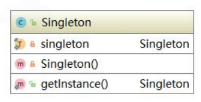
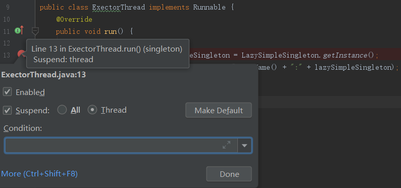
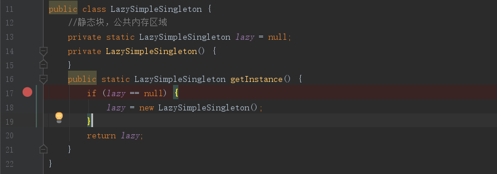
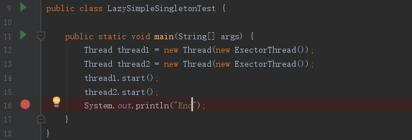
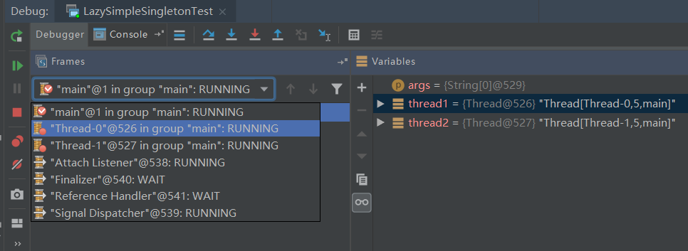
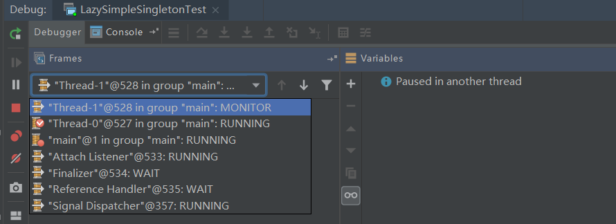
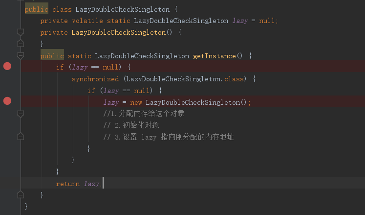
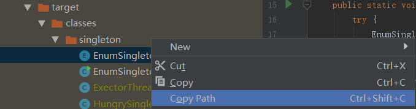

# 单例模式


## 本文目标

1. 掌握单例模式的应用场景。 

2. 掌握 IDEA 环境下的多线程调试方式。 

3. 掌握保证线程安全的单例模式策略。 

4. 掌握反射暴力攻击单例解决方案及原理分析。 

5. 序列化破坏单例的原理及解决方案。 

6. 掌握常见的单例模式写法。


## 内容定位

1. 听说过单例模式，但不知道如何应用的人群。 

2. 单例模式是非常经典的高频面试题，希望通过面试单例彰显技术深度，顺利拿到 Offer 的人群。


## 单例模式的应用场景

单例模式（Singleton Pattern）是指确保一个类在任何情况下都绝对只有一个实例，并 

提供一个全局访问点。单例模式是创建型模式。单例模式在现实生活中应用也非常广泛。 

例如，国家主席、公司 CEO、部门经理等。在 J2EE 标准中，ServletContext、 

ServletContextConfig 等；在 Spring 框架应用中 ApplicationContext；数据库的连接 

池也都是单例形式。


### **饿汉式单例** 

先来看单例模式的类结构图：



饿汉式单例是在类加载的时候就立即初始化，并且创建单例对象。绝对线程安全，在线 

程还没出现以前就是实例化了，不可能存在访问安全问题。 

优点：没有加任何的锁、执行效率比较高，在用户体验上来说，比懒汉式更好。 

缺点：类加载的时候就初始化，不管用与不用都占着空间，浪费了内存，有可能占着茅 

坑不拉屎。 

Spring 中 IOC 容器 ApplicationContext 本身就是典型的饿汉式单例。接下来看一段代 

码：

```java
public class HungrySingleton {
    //先静态、后动态 
    // 先属性、后方法 
    // 先上后下 
    private static final HungrySingleton hungrySingleton = new HungrySingleton();
    private HungrySingleton() {
    }
    public static HungrySingleton getInstance() {
        return hungrySingleton;
    }
}
```

还有另外一种写法，利用静态代码块的机制：

```java
public class HungryStaticSingleton {

    private static final HungryStaticSingleton hungrySingleton;
    static {
        hungrySingleton = new HungryStaticSingleton();
    }
    private HungryStaticSingleton() {
    }
    public static HungryStaticSingleton getInstance() {
        return hungrySingleton;
    }
}
```

这两种写法都非常的简单，也非常好理解，饿汉式适用在单例对象较少的情况。下面我 

们来看性能更优的写法。

### 懒汉式单例

懒汉式单例的特点是：被外部类调用的时候内部类才会加载，下面看懒汉式单例的简单 

实现 LazySimpleSingleton： 

```java
// 懒汉式单例 
// 在外部需要使用的时候才进行实例化 
public class LazySimpleSingleton {
    //静态块，公共内存区域 
    private static LazySimpleSingleton lazy = null;
    private LazySimpleSingleton() {
    }
    public static LazySimpleSingleton getInstance() {
        if (lazy == null) {
            lazy = new LazySimpleSingleton();
        }
        return lazy;
    }
}
```

然后写一个线程类 ExectorThread 类：

```java
public class ExectorThread implements Runnable {
    @Override
    public void run() {

        LazySimpleSingleton lazySimpleSingleton = LazySimpleSingleton.getInstance();
        System.out.println(Thread.currentThread().getName() + ":" + lazySimpleSingleton);
    }
}
```

客户端测试代码：

```java
public class LazySimpleSingletonTest {
    
    public static void main(String[] args) {
        Thread thread1 = new Thread(new ExectorThread());
        Thread thread2 = new Thread(new ExectorThread());
        thread1.start();
        thread2.start();
        System.out.println("End");
    }
}
```

运行结果

> Thread-1:singleton.LazySimpleSingleton@5eb39c2b
> Thread-0:singleton.LazySimpleSingleton@520fddc3

运行结果2

> Thread-0:singleton.LazySimpleSingleton@6840b323
> Thread-1:singleton.LazySimpleSingleton@6840b323

上面的代码一定几率出现创建两个不同结果的情况，就意味着上面的单例存在线程安全隐患。现在我们用调试运行再具体看一下，教给大家一个新技能，用线程模式调试，手动控制线程的执行顺序来跟踪内存的变化状态。先给 ExectorThread 类打上断点： 


右键点击断点，切换为 Thread 模式，如下图：



然后，给 LazySimpleSingleton 类打上断点，同样标记为 Thread 模式：



切回到客户端测试代码，同样也打上断点，同时改为 Thread 模式，如下图: 



开始 debug 之后，会看到 debug 控制台可以自由切换 Thread 的运行状态：



通过不断切换线程，并观测其内存状态，我们发现在线程环境下 LazySimpleSingleton 被实例化了两次。有时，我们得到的运行结果可能是相同的两个对象，实际上是被后面 执行的线程覆盖了，我们看到了一个假象，线程安全隐患依旧存在。那么，我们如何来 优化代码，使得懒汉式单例在线程环境下安全呢？来看下面的代码，给getInstance()加 上 synchronized 关键字，是这个方法变成线程同步方法：

```java
public class LazySimpleSingleton {
    //静态块，公共内存区域
    private static LazySimpleSingleton lazy = null;
    private LazySimpleSingleton() {
    }
    public synchronized static LazySimpleSingleton getInstance() {
        if (lazy == null) {
            lazy = new LazySimpleSingleton();
        }
        return lazy;
    }
}
```

这时候，我们再来调试。当我们将其中一个线程执行并调用 getInstance()方法时，另一 个线程在调用getInstance()方法，线程的状态由 RUNNING 变成了 MONITOR,出现阻 塞。直到第一个线程执行完，第二个线程才恢复 RUNNING 状态继续调用 getInstance() 方法。如下图所示：



完美的展现了 synchronized 监视锁的运行状态，线程安全的问题便解决了。但是，用 synchronized 加锁，在线程数量比较多情况下，如果 CPU 分配压力上升，会导致大批 量线程出现阻塞，从而导致程序运行性能大幅下降。那么，有没有一种更好的方式，既 兼顾线程安全又提升程序性能呢？答案是肯定的。我们来看双重检查锁的单例模式： 

```java
public class LazyDoubleCheckSingleton {
    private volatile static LazyDoubleCheckSingleton lazy = null;
    private LazyDoubleCheckSingleton() {
    }
    public static LazyDoubleCheckSingleton getInstance() {
        if (lazy == null) {
            synchronized (LazyDoubleCheckSingleton.class) {
                if (lazy == null) {
                    lazy = new LazyDoubleCheckSingleton();
                    //1.分配内存给这个对象 
                    // 2.初始化对象 
                    // 3.设置 lazy 指向刚分配的内存地址 
                }
            }
        }
        return lazy;
    }
}
```

现在，我们来断点调试：



当第一个线程调用 getInstance()方法时，第二个线程也可以调用 getInstance()。当第一 个线程执行到 synchronized 时会上锁，第二个线程就会变成 MONITOR 状态，出现阻 塞。此时，阻塞并不是基于整个 LazySimpleSingleton 类的阻塞，而是在 getInstance() 方法内部阻塞，只要逻辑不是太复杂，对于调用者而言感知不到。 但是，用到 synchronized 关键字，总归是要上锁，对程序性能还是存在一定影响的。难 道就真的没有更好的方案吗？当然是有的。我们可以从类初始化角度来考虑，看下面的 代码，采用静态内部类的方式：

```java
// 这种形式兼顾饿汉式的内存浪费，也兼顾 synchronized 性能问题
// 完美地屏蔽了这两个缺点
public class LazyInnerClassSingleton {
    //默认使用 LazyInnerClassGeneral 的时候，会先初始化内部类
    //如果没使用的话，内部类是不加载的
    private LazyInnerClassSingleton() {
    }
    // 每一个关键字都不是多余的
    // static 是为了使单例的空间共享
    // 保证这个方法不会被重写，重载
    public static final LazyInnerClassSingleton getInstance() {
        //在返回结果以前，一定会先加载内部类
        return LazyHolder.LAZY;
    }
    //默认不加载
    private static class LazyHolder {
        private static final LazyInnerClassSingleton LAZY = new LazyInnerClassSingleton();
    }
}
```

这种形式兼顾饿汉式的内存浪费，也兼顾 synchronized 性能问题。内部类一定是要在方 法调用之前初始化，巧妙地避免了线程安全问题。由于这种方式比较简单，我们就不带大家一步一步调试了。

### **反射破坏单例**

大家有没有发现，上面介绍的单例模式的构造方法除了加上 private 以外，没有做任何处 理。如果我们使用反射来调用其构造方法，然后，再调用 getInstance()方法，应该就会 两个不同的实例。现在来看一段测试代码，以 LazyInnerClassSingleton 为例：

```java
public class LazyInnerClassSingletonTest {

    public static void main(String[] args) {
        try {
            //很无聊的情况下，进行破坏
            Class<?> clazz = LazyInnerClassSingleton.class;

            //通过反射拿到私有的构造方法
            Constructor c = clazz.getDeclaredConstructor(null);
            //强制访问，强吻，不愿意也要吻
            c.setAccessible(true);

            //暴力初始化
            Object o1 = c.newInstance();
            //调用了两次构造方法，相当于 new 了两次
            // 犯了原则性问题，
            Object o2 = c.newInstance();

            System.out.println(o1 == o2);

        } catch (Exception e) {
            e.printStackTrace();
        }
    }
}
```

运行结果如下：

> false
>
> 

显然，是创建了两个不同的实例。现在，我们在其构造方法中做一些限制，一旦出现多 次重复创建，则直接抛出异常。来看优化后的代码： 

```java
public class LazyInnerClassSingleton {
    //默认使用 LazyInnerClassGeneral 的时候，会先初始化内部类
    //如果没使用的话，内部类是不加载的
    private LazyInnerClassSingleton() {
        if (LazyHolder.LAZY != null) {
            throw new RuntimeException("不允许创建多个实例");
        }
    }
    // 每一个关键字都不是多余的
    // static 是为了使单例的空间共享
    // 保证这个方法不会被重写，重载
    public static final LazyInnerClassSingleton getInstance() {
        //在返回结果以前，一定会先加载内部类
        return LazyHolder.LAZY;
    }
    //默认不加载
    private static class LazyHolder {
        private static final LazyInnerClassSingleton LAZY = new LazyInnerClassSingleton();
    }
}
```

再运行测试代码，会得到如下图所示结果:

> java.lang.reflect.InvocationTargetException
> 	at sun.reflect.NativeConstructorAccessorImpl.newInstance0(Native Method)
> 	at sun.reflect.NativeConstructorAccessorImpl.newInstance(NativeConstructorAccessorImpl.java:62)
> 	at sun.reflect.DelegatingConstructorAccessorImpl.newInstance(DelegatingConstructorAccessorImpl.java:45)
> 	at java.lang.reflect.Constructor.newInstance(Constructor.java:423)
> 	at singleton.LazyInnerClassSingletonTest.main(LazyInnerClassSingletonTest.java:24)
> Caused by: java.lang.RuntimeException: 不允许创建多个实例
> 	at singleton.LazyInnerClassSingleton.<init>(LazyInnerClassSingleton.java:16)
> 	... 5 more

至此，自认为史上最牛的单例模式的实现方式便大功告成。

### 序列化破坏单例

一个单例对象创建好后，有时候需要将对象序列化然后写入磁盘，下次使用时再从磁盘中读取对象并进行反序列化，将其转化为内存对象。反序列化后的对象会重新分配内存，即重新创建。如果序列化 的目标对象为单例对象，就违背了单例模式的初衷，相当于破坏了单例，来看一段代码：

```java
//反序列化导致破坏单例模式 本来可以不加 implements Serializable ， 但是我就加了怎么办？
public class SerializableSingleton implements Serializable {

    // 序列化就是把内存中的状态通过转换成字节码的形式
    // 从而转换一个 I/O 流，写入其他地方（可以是磁盘、网络 I/O）
    // 内存中的状态会永久保存下来

    // 反序列化就是将已经持久化的字节码内容转换为 I/O 流
    // 通过 I/O 流的读取，进而将读取的内容转换为 Java 对象
    // 在转换过程中会重新创建对象 new

    public final static SerializableSingleton INSTANCE = new SerializableSingleton();

    private SerializableSingleton() {
    }

    public static SerializableSingleton getInstance() {
        return INSTANCE;
    }
    
}
```

运行结果如下所示：

> singleton.SerializableSingleton@6d03e736
> singleton.SerializableSingleton@14ae5a5
> false

从运行结果可以看出，反序列化后的对象和手动创建的对象是不一致的，实例化了两次，违背了单例模式的设计初衷。那么，我们如何保证在序列化的情况下也能够实现单例模式呢？其实很简单，只需要增加 readResolve()方法即可。来看优化后的代码：

```java
//反序列化导致破坏单例模式 本来可以不加 implements Serializable ， 但是我就加了怎么办？
public class SerializableSingleton implements Serializable {

    // 序列化就是把内存中的状态通过转换成字节码的形式
    // 从而转换一个 I/O 流，写入其他地方（可以是磁盘、网络 I/O）
    // 内存中的状态会永久保存下来

    // 反序列化就是将已经持久化的字节码内容转换为 I/O 流
    // 通过 I/O 流的读取，进而将读取的内容转换为 Java 对象
    // 在转换过程中会重新创建对象 new

    public final static SerializableSingleton INSTANCE = new SerializableSingleton();

    private SerializableSingleton() {
    }

    public static SerializableSingleton getInstance() {
        return INSTANCE;
    }

    private Object readResolve() {
        return INSTANCE;
    }

}
```

再看运行结果，如下所示

> singleton.SerializableSingleton@14ae5a5
> singleton.SerializableSingleton@14ae5a5
> true

大家一定会想：这是什么原因呢？为什么要这样写？看上去很神奇的样子，也让人有些费解。不如 我们一起来看看 JDK 的源码实现以了解清楚。我们进入 ObjectInputStream 类的 readObject()方法， 代码如下:

```java
 public final Object readObject()
        throws IOException, ClassNotFoundException
    {
        if (enableOverride) {
            return readObjectOverride();
        }

        // if nested read, passHandle contains handle of enclosing object
        int outerHandle = passHandle;
        try {
            Object obj = readObject0(false);
            handles.markDependency(outerHandle, passHandle);
            ClassNotFoundException ex = handles.lookupException(passHandle);
            if (ex != null) {
                throw ex;
            }
            if (depth == 0) {
                vlist.doCallbacks();
            }
            return obj;
        } finally {
            passHandle = outerHandle;
            if (closed && depth == 0) {
                clear();
            }
        }
    }
```

我们发现，在 readObject()方法中又调用了重写的 readObject0()方法。进入 readObject0()方法， 

代码如下：

```java
private Object readObject0(boolean unshared) throws IOException { 
    ...
	case TC_OBJECT:
    	return checkResolve(readOrdinaryObject(unshared));
    ...
}
```

我们看到 TC_OBJECT 中调用了 ObjectInputStream 的 readOrdinaryObject()方法，看源码：

```java
private Object readOrdinaryObject(boolean unshared)
        throws IOException {
    if (bin.readByte() != TC_OBJECT) {
        throw new InternalError();
    }

    ObjectStreamClass desc = readClassDesc(false);
    desc.checkDeserialize();

    Class<?> cl = desc.forClass();
    if (cl == String.class || cl == Class.class
        || cl == ObjectStreamClass.class) {
        throw new InvalidClassException("invalid class descriptor");
    }

    Object obj;
    try {
        obj = desc.isInstantiable() ? desc.newInstance() : null;
    } catch (Exception ex) {
        throw (IOException) new InvalidClassException(
            desc.forClass().getName(),
            "unable to create instance").initCause(ex);
    }
    ...
    return obj;
}
```

我们发现调用了 ObjectStreamClass 的 isInstantiable()方法，而 isInstantiable()方法的代码如下：

```java
boolean isInstantiable() {
    requireInitialized();
    return (cons != null);
}
```

上述代码非常简单，就是判断一下构造方法是否为空，构造方法不为空就返回 true。这意味着只要 有无参构造方法就会实例化。 这时候其实还没有找到加上 readResolve()方法就避免了单例模式被破坏的真正原因。再回到ObjectInputStream 的 readOrdinaryObject()方法，继续往下看： 

```java
private Object readOrdinaryObject(boolean unshared)
        throws IOException {
...

	if (obj != null &&
            handles.lookupException(passHandle) == null &&
            desc.hasReadResolveMethod()){
        Object rep = desc.invokeReadResolve(obj);
        if (unshared && rep.getClass().isArray()) {
            rep = cloneArray(rep);
        }
        if (rep != obj) {
            // Filter the replacement object
            if (rep != null) {
                if (rep.getClass().isArray()) {
                    filterCheck(rep.getClass(), Array.getLength(rep));
                } else {
                    filterCheck(rep.getClass(), -1);
                }
            }
            handles.setObject(passHandle, obj = rep);
        }
    }
    return obj;
}
```

判断无参构造方法是否存在之后，又调用了 hasReadResolveMethod()方法，来看代码：

```java
boolean hasReadResolveMethod() {
    requireInitialized();
    return (readResolveMethod != null);
}
```

上述代码逻辑非常简单，就是判断 readResolveMethod 是否为空，不为空就返回 true。那readResolveMethod 是在哪里赋值的呢？通过全局查找知道，在私有方法 ObjectStreamClass()中给 readResolveMethod 进行了赋值，来看代码：

```java
readResolveMethod = getInheritableMethod(
    cl, "readResolve", null, Object.class);
```

上面的逻辑其实就是通过反射找到一个无参的 readResolve()方法，并且保存下来。现在回到 ObjectInputStream 的 readOrdinaryObject()方法继续往下看，如果 readResolve()方法存在则调用 invokeReadResolve()方法，来看代码： 

```java
Object invokeReadResolve(Object obj)
        throws IOException, UnsupportedOperationException
{
    requireInitialized();
    if (readResolveMethod != null) {
        try {
            return readResolveMethod.invoke(obj, (Object[]) null);
        } catch (InvocationTargetException ex) {
            Throwable th = ex.getTargetException();
            if (th instanceof ObjectStreamException) {
                throw (ObjectStreamException) th;
            } else {
                throwMiscException(th);
                throw new InternalError(th);  // never reached
            }
        } catch (IllegalAccessException ex) {
            // should not occur, as access checks have been suppressed
            throw new InternalError(ex);
        }
    } else {
        throw new UnsupportedOperationException();
    }
}

```

我们可以看到，在 invokeReadResolve()方法中用反射调用了 readResolveMethod 方法。

通过 JDK 源码分析我们可以看出，虽然增加 readResolve()方法返回实例解决了单例模式被破坏的 问题，但是实际上实例化了两次，只不过新创建的对象没有被返回而已。如果创建对象的动作发生频率 加快，就意味着内存分配开销也会随之增大，难道真的就没办法从根本上解决问题吗？下面讲的注册式 单例也许能帮助到你。 


### 注册式单例

注册式单例模式又称为登记式单例模式，就是将每一个实例都登记到某一个地方，使用唯一的标识 获取实例。注册式单例模式有两种：一种为枚举式单例模式，另一种为容器式单例模式。

1. #### 枚举式单例

先来看枚举式单例模式的写法，来看代码，创建 EnumSingleton 类：

```java
public enum EnumSingleton {
    INSTANCE;
    private Object data;

    public Object getData() {
        return data;
    }

    public void setData(Object data) {
        this.data = data;
    }

    public static EnumSingleton getInstance() {
        return INSTANCE;
    }
}
```

来看测试代码：

```java
public class EnumSingletonTest {
    public static void main(String[] args) {
        try {
            EnumSingleton instance1 = null;
            EnumSingleton instance2 = EnumSingleton.getInstance();
            instance2.setData(new Object());
            FileOutputStream fos = new FileOutputStream("EnumSingleton.obj");
            ObjectOutputStream oos = new ObjectOutputStream(fos);
            oos.writeObject(instance2);
            oos.flush();
            oos.close();
            FileInputStream fis = new FileInputStream("EnumSingleton.obj");
            ObjectInputStream ois = new ObjectInputStream(fis);
            instance1 = (EnumSingleton) ois.readObject();
            ois.close();
            System.out.println(instance1.getData());
            System.out.println(instance2.getData());
            System.out.println(instance1.getData() == instance2.getData());
        } catch (Exception e) {
            e.printStackTrace();
        }
    }
}
```

运行结果如下所示：

> java.lang.Object@568db2f2
> java.lang.Object@568db2f2
> true

没有做任何处理，我们发现运行结果和预期的一样。那么枚举式单例模式如此神奇，它的神秘之处 在哪里体现呢？下面通过分析源码来揭开它的神秘面纱。

下载一个非常好用的 Java 反编译工具 Jad（下载地址：https://varaneckas.com/jad/），解压后 配置好环境变量（这里不做详细介绍），就可以使用命令行调用了。找到工程所在的 Class 目录，复制 EnumSingleton.class 所在的路径，如下图所示。



然后切换到命令行，切换到工程所在的 Class 目录，输入命令 jad 并在后面输入复制好的路径，在 Class 目录下会多出一个 EnumSingleton.jad 文件。打开 EnumSingleton.jad 文件我们惊奇地发现有 如下代码： 

```java
static 
{
    INSTANCE = new EnumSingleton("INSTANCE", 0);
    $VALUES = (new EnumSingleton[]{
        INSTANCE
    });
}
```

原来，枚举式单例模式在静态代码块中就给 INSTANCE 进行了赋值，是饿汉式单例模式的实现。至 此，我们还可以试想，序列化能否破坏枚举式单例模式呢？不妨再来看一下 JDK 源码，还是回到ObjectInputStream 的 readObject0()方法：

```java
private Object readObject0(boolean unshared) throws IOException { 
    ... 
    case TC_ENUM: 
    	return checkResolve(readEnum(unshared)); 
    ... 
}
```

我们看到，在 readObject0()中调用了 readEnum()方法，来看 readEnum()方法的代码实现：

```java
private Enum<?> readEnum(boolean unshared) throws IOException {
    if (bin.readByte() != TC_ENUM) {
        throw new InternalError();
    }

    ObjectStreamClass desc = readClassDesc(false);
    if (!desc.isEnum()) {
        throw new InvalidClassException("non-enum class: " + desc);
    }

    int enumHandle = handles.assign(unshared ? unsharedMarker : null);
    ClassNotFoundException resolveEx = desc.getResolveException();
    if (resolveEx != null) {
        handles.markException(enumHandle, resolveEx);
    }

    String name = readString(false);
    Enum<?> result = null;
    Class<?> cl = desc.forClass();
    if (cl != null) {
        try {
            @SuppressWarnings("unchecked")
            Enum<?> en = Enum.valueOf((Class)cl, name);
            result = en;
        } catch (IllegalArgumentException ex) {
            throw (IOException) new InvalidObjectException(
                "enum constant " + name + " does not exist in " +
                cl).initCause(ex);
        }
        if (!unshared) {
            handles.setObject(enumHandle, result);
        }
    }

    handles.finish(enumHandle);
    passHandle = enumHandle;
    return result;
}
```

我们发现，枚举类型其实通过类名和类对象类找到一个唯一的枚举对象。因此，枚举对象不可能被 类加载器加载多次。那么反射是否能破坏枚举式单例模式呢？来看一段测试代码： 

```java
public static void main(String[] args) {
    try {
        Class clazz = EnumSingleton.class;
        Constructor c = clazz.getDeclaredConstructor();
        c.newInstance();
    } catch (Exception e) {
        e.printStackTrace();
    }
}
```

运行结果如下所示

> java.lang.NoSuchMethodException: singleton.EnumSingleton.<init>()
> 	at java.lang.Class.getConstructor0(Class.java:3082)
> 	at java.lang.Class.getDeclaredConstructor(Class.java:2178)
> 	at singleton.EnumSingletonTest.main(EnumSingletonTest.java:40)

结果中报的是 java.lang.NoSuchMethodException 异常，意思是没找到无参的构造方法。这时候，我们打开 java.lang.Enum 的源码，查看它的构造方法，只有一个 protected 类型的构造方法，代码如 下：

```java
protected Enum(String name, int ordinal) { 
    this.name = name; 
    this.ordinal = ordinal; 
}
```

我们再来做一个下面这样的测试：

```java
public static void main(String[] args) {
    try {
        Class clazz = EnumSingleton.class;
        Constructor c = clazz.getDeclaredConstructor(String.class, int.class);
        c.setAccessible(true);
        EnumSingleton enumSingleton = (EnumSingleton) c.newInstance("Tom", 666);
    } catch (Exception e) {
        e.printStackTrace();
    }
}
```

运行结果如下所示

> java.lang.IllegalArgumentException: Cannot reflectively create enum objects
> 	at java.lang.reflect.Constructor.newInstance(Constructor.java:417)
> 	at singleton.EnumSingletonTest.main(EnumSingletonTest.java:48)

这时错误已经非常明显了，“Cannot reflectively create enum objects”，即不能用反射来创建 枚举类型。还是习惯性地想来看看 JDK 源码，进入 Constructor 的 newInstance()方法：

```java
@CallerSensitive
public T newInstance(Object ... initargs)
    throws InstantiationException, IllegalAccessException,
IllegalArgumentException, InvocationTargetException
{
    if (!override) {
        if (!Reflection.quickCheckMemberAccess(clazz, modifiers)) {
            Class<?> caller = Reflection.getCallerClass();
            checkAccess(caller, clazz, null, modifiers);
        }
    }
    if ((clazz.getModifiers() & Modifier.ENUM) != 0)
        throw new IllegalArgumentException("Cannot reflectively create enum objects");
    ConstructorAccessor ca = constructorAccessor;   // read volatile
    if (ca == null) {
        ca = acquireConstructorAccessor();
    }
    @SuppressWarnings("unchecked")
    T inst = (T) ca.newInstance(initargs);
    return inst;
}
```

从上述代码可以看到，在 newInstance()方法中做了强制性的判断，如果修饰符是 Modifier.ENUM 枚举类型，则直接抛出异常。到此为止，我们是不是已经非常清晰明了呢？枚举式单例模式也是《Effective Java》书中推荐的一种单例模式实现写法。JDK 枚举的语法特殊性及反射也为枚举保驾护航，让枚举式单例模式成为一种比较优雅的实现。

2. #### 容器式单例

接下来看注册式单例模式的另一种写法，即容器式单例模式，创建 ContainerSingleton 类：

```java
public class ContainerSingleton {
    private ContainerSingleton() {}
    private static Map<String, Object> ioc = new ConcurrentHashMap<String, Object>();
    public static Object getBean(String className) {
        synchronized (ioc) {
            if (!ioc.containsKey(className)) {
                Object obj = null;
                try {
                    obj = Class.forName(className).newInstance();
                    ioc.put(className, obj);
                } catch (Exception e) {
                    e.printStackTrace();
                }
                return obj;
            } else {
                return ioc.get(className);
            }
        }
    }
}
```

容器式单例模式适用于实例非常多的情况，便于管理。但它是非线程安全的。到此，注册式单例模 式介绍完毕。我们再来看看 Spring 中的容器式单例模式的实现代码：

```java
public abstract class AbstractAutowireCapableBeanFactory extends AbstractBeanFactory implements AutowireCapableBeanFactory {
	private final ConcurrentMap<String, BeanWrapper> factoryBeanInstanceCache;
	public AbstractAutowireCapableBeanFactory() {
		...
        this.factoryBeanInstanceCache = new ConcurrentHashMap(16);
        ...
    }
}
```

### 线程单例实现 ThreadLocal

最后赠送给大家一个彩蛋，讲讲线程单例实现 ThreadLocal。ThreadLocal 不能保证其创建的对象 是全局唯一的，但是能保证在单个线程中是唯一的，天生是线程安全的。下面来看代码：

```java
public class ThreadLocalSingleton {
    private static final ThreadLocal<ThreadLocalSingleton> threadLocalInstance = new ThreadLocal<ThreadLocalSingleton>() {
        @Override
        protected ThreadLocalSingleton initialValue() {
            return new ThreadLocalSingleton();
        }

    };

    private ThreadLocalSingleton() {
    }

    public static ThreadLocalSingleton getInstance() {
        return threadLocalInstance.get();
    }
}
```

写一下测试代码： 

```java
public class ThreadLocalSingletonTest {
    public static void main(String[] args) {
        System.out.println(ThreadLocalSingleton.getInstance());
        System.out.println(ThreadLocalSingleton.getInstance());
        System.out.println(ThreadLocalSingleton.getInstance());
        System.out.println(ThreadLocalSingleton.getInstance());
        System.out.println(ThreadLocalSingleton.getInstance());
        Thread t1 = new Thread(new ExectorThread());
        Thread t2 = new Thread(new ExectorThread());
        t1.start();
        t2.start();
        System.out.println("End");
    }
}
```

运行结果如下

> singleton.ThreadLocalSingleton@7f31245a
> singleton.ThreadLocalSingleton@7f31245a
> singleton.ThreadLocalSingleton@7f31245a
> singleton.ThreadLocalSingleton@7f31245a
> singleton.ThreadLocalSingleton@7f31245a
> End
> Thread-1:singleton.LazyDoubleCheckSingleton@46a2a3bf
> Thread-0:singleton.LazyDoubleCheckSingleton@46a2a3bf

我们发现，在主线程中无论调用多少次，获取到的实例都是同一个，都在两个子线程中分别获取到 了不同的实例。那么 ThreadLocal 是如何实现这样的效果的呢？我们知道，单例模式为了达到线程安全 的目的，会给方法上锁，以时间换空间。ThreadLocal 将所有的对象全部放在ThreadLocalMap 中，为每个线程都提供一个对象，实际上是以空间换时间来实现线程隔离的。


### 单例模式小结

单例模式可以保证内存里只有一个实例，减少了内存的开销，还可以避免对资源的多重占用。单例 模式看起来非常简单，实现起来其实也非常简单，但是在面试中却是一个高频面试点。希望“小伙伴们” 通过本章的学习，对单例模式有了非常深刻的认识，在面试中彰显技术深度，提升核心竞争力，给面试 加分，顺利拿到录取通知（Offer）。


