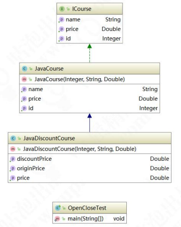
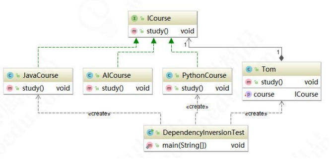
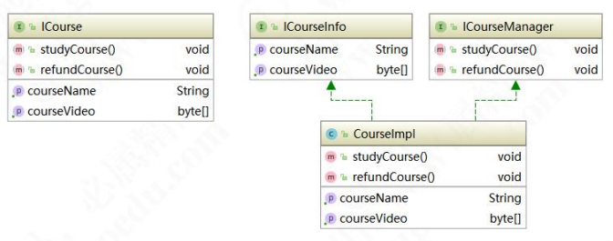
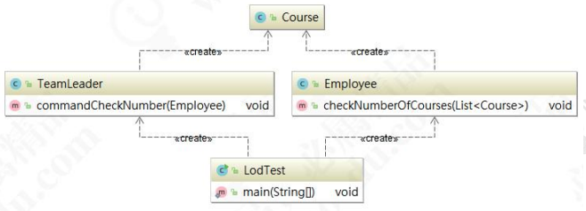
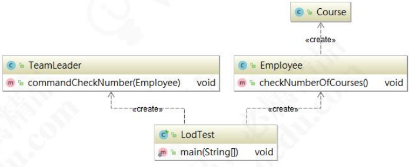
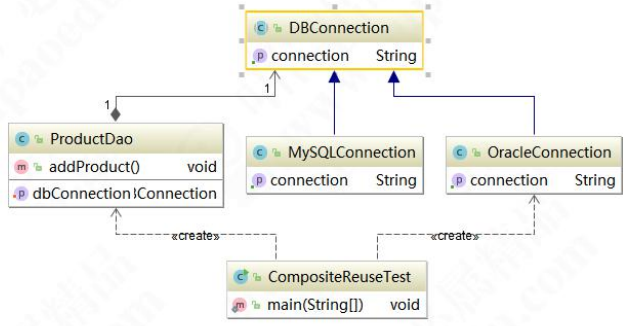

# 软件架构设计原则

学习设计原则，学习设计模式的基础。在实际开发过程中，并不是一定要求所有代码都遵循设计原 则，我们要考虑人力、时间、成本、质量，不是刻意追求完美，要在适当的场景遵循设计原则，体现的 是一种平衡取舍，帮助我们设计出更加优雅的代码结构。

### 开闭原则

开闭原则（Open-Closed Principle, OCP）是指一个软件实体如类、模块和函数应该对扩展开放，对修改关闭。所谓的开闭，也正是对扩展的修改连个行为的原则。强调的是用抽象的构建框架，用实现扩展细节。可以提高软件系统的可复用性及可维护性。开闭原则，是面向对象设计中最基础的设计原则。它指导我们如何建立稳定灵活的系统，例如：我们版本更新，我尽可能不修改源代码，但是可以增加新功能。

在现实生活中对开闭原则也有体现。比如，很多互联网公司都实行弹性作息时间，规定每天工作8小时。意思就是说，对于每天工作8小时这个规定是关闭的，但是你什么时候来，什么时候走是开放的。早来早走，晚来晚走。

实现开闭原则的核心思想就是面向抽象编程，接下来我们看一段代码：

以咕咆学院的课程体系为例，首先创建一个课程接口ICourse:

```java
public interface ICourse {
    Integer getId();
    String getName();
    Double getPrice();
}
```

整体课程生态有Java架构、大数据、人工智能、前端、软件测试等，我们来创建一个Java架构课程的类JavaCourse:

```java
public class JavaCourse implements ICourse {
	private Integer id;
    private String name;
    private Double price;
    public JavaCourse (Integer id, String name, Double price) {
        this.id = id;
        this.name = name;
        this.price = price;
    }
    public Integer getId() {
        return this.id;
    }
    public String getName() {
        return this.name;
    }
    public Double getPrice() {
        return this.price;
    }
}
```

现在我们要给Java架构课程做活动，价格优惠。如果修改JavaCourse中的getPrice()方法，则会存在一定的风险，可能影响其他地方的调用结果。我们如何在不修改原有代码的前提下，实现价格优惠这个功能呢？现在，我们再写一个处理优惠逻辑的类，JavaDiscountCourse类（思考一下为什么要叫JavaDiscountCourse, 而不叫DiscountCourse）:

```java
public class JavaDiscountCourse extends JavaCourse {
    public JavaDiscountCourse (Integer id, String name, Double price) {
        super(id, name, price);
    }
    public Double getOriginPrice() {
        return super.getPrice();
    }
    public Double getPrice() {
        return super.getPrice() * 0.61;
    }
}
```

回顾一下，简单一下类结构图：




### 依赖倒置原则

依赖倒置原则（Dependence Inversion Principle,DIP）是指设计代码结构时，高层模块不应该依赖底层模块，二者都应该依赖其抽象。抽象不应该依赖细节；细节应该依赖抽象。通过依赖倒置，可以减少类与类之间的耦合性，提高系统的稳定性，提高代码的可读性和可维护性，并能够降低修改程序所造成的风险。接下来看一个案例，还是以课程为例，先来创建一个类Tom:

```java
public class Tom {
    public void studyJavaCourse() {
        System.out.printIn("Tom 在学习Java的课程");
    }
    public void studyPythonCourse() {
        System.out.printIn("Tom 在学习Python的课程");
    }
}
```

来调用一下：

```java
public static void main(String[] args) {
    Tom tom = new Tom();
    tom.studyJavaCourse();
    tom.studyPythonCourse();
}
```

Tom 热爱学习，目前正在学习Java课程和Python课程。大家都知道，学习也是会上瘾的。随着学习兴趣的暴涨，现在Tom还想学习AI人工智能的课程。这个时候，业务扩展，我们的代码要从底层到高层（调用层）一次修改代码。在Tom类中增加studyAICourse()的方法，在高层也要追加调用。如此一来，系统发布以后，实际上是非常不稳定的，在修改代码的同时也会带来意想不到的风险。接下来我们优化代码，创建一个课程的抽象Icourse接口：

```java
public interface ICourse {
    void study();
}
```

然后写JavaCourse类：

```java
public class JavaCource implements ICourse {
    @override
    public void study() {
        System.out.printIn("Tom在学习Java课程");
    }
}
```

再实现PythonCourse 类：

```java
public class JavaCourse implements Icource {
    @override
    public void study() {
        System.out.printIn("Tom在学习Python课程");
    } 
}
```

修改Tom类：

```java
public class Tom {
    public void study(ICourse course) {
        course.study();
    }
}
```

来看调用：

```java
public static void main(String[] args) {
    Tom tom = new Tom();
    tom.study(new JavaCourse());
    tom.study(new PythonCourse());
}
```

我们这时候在看来代码，Tom的兴趣无论怎么暴涨，对于新的课程，我只需要新建一个类，通过传参的方式告诉Tom, 而不需要修改底层代码。实际上这是一种大家非常熟悉的方式，叫依赖注入。注入的方式还有构造方式和setter方式。我们来看构造器注入方式：

```java
public class Tom {
    private Icourse course;
    public Tom(Icourse course) {
        this.course = course;
    }
    public void study() {
        course.study();
    }
}
```

看调用代码：

```java
public static void main(String[] args) {
    Tom tom = new Tom(new JavaCourse());
    tom.study();
}
```

根据构造器方式注入，在调用时，每次都要创建实例。那么，如果Tom是全局单例，则我们就只能选择用Setter方式来注入，继续修改Tom类的代码：

```java
public class Tom {
    private ICourse course;
    public void setCourse(ICourse course) {
        this.course = course;
    }
    public void study() {
        course.study();
    }
}
```

看调用代码：

```java
public static void main(String[] args) {
    Tom tom = new Tom();
    tom.setCourse(new JavaCourse());
    tom.study();
    
    tom.setCourse(new PythonCource());
    tom.study();
}
```

现在我们再来看最终的类图：



大家要切记：以抽象为基准比以细节为基准搭建起来的架构要稳定的多，因此大家在拿到需求之后，要面向接口编程，先顶层再细节来设计代码结构。


### 单一职责原则

单一职责是指不要存在多于一个导致类变更的原因。假设我们有一个Class负责两个职责，一旦发生需求变更，修改其中一个职责的逻辑代码，有可能会导致另一个职责的功能发生故障。这样一来，这个Class存在两个导致类变更的原因。如何解决这个问题呢？我们就要给两个职责分别用两个Class来实现，进行解耦。后期需求变更维护互不影响。这样的设计，可以降低类的复杂度，提高类的可读性，提高系统的可维护性，降低变更引起的风险，总体来说就是一个Class/Interface/Method只负责一项责任。

接下来，我们来看代码示例，还是用课程举例，我们的课程有直播课程和录播课程。直播课不能快进和快退，录播可以任意的反复观看，功能职责不一样。还是创建一个Course类：

```java
public class Course {
    public void study(String courseName) {
        if ("直播课".equals(courseName)) {
            System.out.printIn(courseName + "不能快进");
        } else {
            System.out.printIn(courseName + "可以反复回看");
        }
    }
}
```

看代码调用：

```
public static void main(String[] args) {
    Course course = new Course();
    course.study("直播课");
    course.study("录播课");
}
```

从上面代码来看， Course类承担了两种处理逻辑。假如，现在要对课程进行加密，那么录播课和直播课的加密逻辑不一样，必须要修改代码。而修改代码逻辑势必会互相影响造成不可控的风险。我们对职责进行分离解耦，来看代码，分别创建两个类ReplayCourse和LiveCourse:

LiveCourse 类：

```java
public class LiveCouse {
    public void study(String courseName) {
        System.out.pringIn(courseName + "不能快进看");
    }
}
```

ReplayCourse类：

```java
public class ReplayCourse {
    public void study(String courseName) {
        System.out.printIn(courseName + "可以反复回");
    }
}
```

调用代码：

```java
public static void main(String[] args) {
    LiveCource liveCourse = new LiveCourse();
    liveCourse.study("直播课");
    
    RepalyCourse replayCourse = new ReplayCourse();
    repalyCourse.study("录播课");
}
```

业务继续发展，课程要做权限。没有付费的学员可以获取课程基本信息，已经付费的学员可以获得视频流，即学习权限。那么对于控制课程层面上至少有两个职责。我们可以把展示职责和管理职责分离开来，都实现同一个抽象依赖。设计一个顶层接口，创建ICourse接口：

```java
public interface ICource {
    
    // 获得基本信息
    String getCourseName();
    
    // 获得视频流
    byte[] getCourseVideo();
    
    // 学习课程
    void studyCourse();
    
    // 退款
    void refundCourse();
    
}
```

我们可以把这个接口拆开成两个接口，创建一个接口ICourseInfo 和 ICourseManager:

ICourseInfo 接口：

```java
public interface ICourseInfo {
    String getCourseName();
    byte[] getCourseVideo();
}
```

ICourseManager 接口：

```java
public interface ICourseManager {
    void studtCourse();
    void refundCourse();
}
```

来看一下类图： 



下面我们来看一下方法层面的单一职责设计，有时候，我们为了偷懒，通常会把一个方法写成下面这样：

```java
private void modifyUserInfo(String userName, String address) {
    userName = "Tom";
    address = "Changsha";
}
```

还可能写成这样：

```java
private void modifyUserInfo(String userName, String... fileds) {
    userName = "Tom";
}
private void modiyUserInfo(String userName, String address, boolean bool) {
    if (bool) {
        
    } else {
        
    }
}
```

显然，上面的modifyUserInfo() 方法中都承担了多个职责，既可以修改userName，也可以修改address， 甚至更多，明显不符合单一职责。那么我们做如下修改，把这个方法拆成两个：

```java
private void modifyUserName(String userName) {
    userName = "Tom";
}
private void modifyAddress(String address) {
    address = "Changsha";
}
```

这修改之后，开发起来简单，维护起来也容易。但是，我们在实际开发中会项目依赖，组合，聚合 这些关系，还有还有项目的规模，周期，技术人员的水平，对进度的把控，很多类都不符合单一职责。 但是，我们在编写代码的过程，尽可能地让接口和方法保持单一职责，对我们项目后期的维护是有很大帮助的。

### 接口隔离原则

接口隔离原则是指用多个专门的接口，而不是用单一的总接口，客户端不应该依赖它不需要的接口。这个原则指导我们在设计接口时应当注意一下几点：

1. 一个类对一类的依赖应该建立在最小的接口之上。
2. 建立单一接口，不要建立庞大臃肿的接口。
3. 尽量细化接口，接口中的方法尽量少（不是越少越好，一定要适度）。

接口隔离原则符合我们常说的高内聚低耦合的设计思想，从而使得类具有很好的可读性、可扩展性和可维护性。我们在设计接口的时候，要花时间去思考，要考虑业务模型，包括以后有可能发生变更的地方还要做一些预判。所以，对于抽象，对业务模型的理解是非常重要的。下面我们来看一段代码，写一个动物行为的抽象：

IAnimal 接口：

```java
public interface IAnimal {
    void eat();
    void fly();
    void swim();
}
```

Bird 类实现：

```java
public class Bird implements IAnimal {
    @Override
    public void eat() {}
    @Override
    public void fly() {}
    @Override
    public void swim() {}
}
```

Dog 类实现：

```java
public class Dog implements IAnimal {
    @Override
    public void eat() {}
    @Override
    public void fly() {}
    @Override
    public void swim() {}
}
```

可以看出，Bird的swim()方法可能只能空着，Dog的fly() 方法显然不可能的。这时候，我们针对不同动物行为来设计不同的接口，分别设计IEatAnimal, IFlyAnimal 和ISwimAnimal 接口，来看代码：

IEatAnimal接口：

```java
public interface IEatAnimal {
    void eat();
}
```

IFlyAnimal接口：

```java
public interface IFlyAnimal {
    void fly();
}
```

ISwimAnimal 接口：

```java
public interface ISwimAnimal {
    void swim();
}
```

Dog只实现IEatAnimal和ISwimAnimal接口：

```java
public class Dog implements ISwimAnmal, IEatAnmal {
    @Override
    public void eat() {}
    @Override
    public void swim() {}
}
```

来看下两种类图的对比，还是非常清晰明了的：


### 迪米特法则

迪米特法则（Law of Demeter LoD）是指一个对象应该对其他对象保持最少的了解，又叫最少知道原则则（Least Knowledge Principle,LKP）， 尽量较低类与类之间的耦合。迪米特法则主要强调只和朋友交流，不和陌生人说话。出现在成员变量、方法的输入、输出参数中的类都可以称之为成员朋友类，而出现在方法体内部的类不属于朋友类。

现在来设计一个权限系统，Boss 需要查看目前发布到线上的课程数量。这时候，Boss 要找到TeamLeader去进行统计，TeamLeader 再把统计结果告诉Boss。接下来我们还是来看代码：

Course 类：

```java
public class Course {

}
```

TeamLeader类：

```java
public class TeamLeader {
    public void checkNumberOfCourses(List<Course> courseList) {
        System.out.printIn("目前已发布的课程数量是：" + courseList.size());
    }
}
```

Boss类

```java
public class Boss {
	public void commandCheckNumber(TeamLeader teamLeader) {
	    // 模拟Boss一页一页往下翻页， TeamLeader 实时统计
	    List<Course> courseList = new ArrayList<>();
	    for (int i = 0; i < 20; i ++) {
	        courseList.add(new Course());
	    }
	    teamLeader.checkNumberOfCourses(courseList);
	}
}
```


测试代码：

```java
public static void main(String[] args) {
    Boss boss = new Boss();
    TeamLeader teamLeader = new TeamLeader();
    boss.commandCheckNumber(teamLeader);
}
```

写到这里，其实功能已经都已经实现，代码看上去也没什么问题。根据迪米特原则，Boss只想要结果，不需要跟Course产生直接的交流。而TeamLeader统计需要引用Course对象。Boss和Course并不是朋友，从下面的类图就可以看出来：



下面来对代码进行改造：

TeamLeader 类：

```java
public class TeamLeader {
    public void checkNumberOfCourses() {
        List<Course> courseList = new ArrayList<Course>();
        for (int i = 0; i < 20; i ++) {
            courseList.add(new Course());
        }
        System.out.printIn("目前已发布的课程数量是：" + courseList.size());
    }
}
```

Boss类：

```java
public class Boss {
    public void commandCheckNumber(TeamLeader teamLeader) {
        teamLeader.checkNumberOfCourses();
    }
}
```

再来看下面的类图， Course和Boss已经没有关联了



学习软件设计原则，千万不能形成强迫症。碰到业务复杂的场景，我们需要随机应变。


### 里氏替换原则

里氏替换原则是指如果对每一个类型的T1的对象o1, 都有类型为T2的对象 o2, 使得以T1定义的所有程序P在所有的对象o1都替换成o2时。程序P的行为没有变化，那么类型T2是类型T1的子类型。

定义看上去哈市比较抽象，我们重新理解一下，可以理解为一个软件实体如果适合一个父类的话，那一定是适合于其子类，所有引用父类的地方必须能透明地使用其子类的对象，子类对象能够替换父类对象，而程序逻辑不变。根据这个理解，我们总结一下：引申含义：子类可以扩展父类的功能，但不能改变父类原有的功能。

1. 子类可以实现父类的抽象方法，单不能覆盖父类的非抽象方法。
2. 子类中可以增加自己特有方法。
3. 当子类的方法重载父类的方法，方法的前置条件（即方法的输入/入参）要比父类方法的输入参数更宽裕。
4. 当子类的方法实现父类的方法（重写、重载或实现抽象方法），方法的后置条件（即方法的输出、返回值）要比父类更严格或相等。

在前面讲开闭原则的时候埋下了一个伏笔，我们集的在获取折后是重写覆盖了父类的getPrice()方法，增加了一个获取源代码的方法getOriginPrice(), 显然就违背了里氏替换原则。我们修改一下代码，不应该覆盖getPrice() 方法，增加getDiscountPrice()方法：

```java
public class JavaDiscountCourse extends JavaCourse {
    public JavaDiscountCourse(Integer id, String name, Double price) {
        super(id, name, price);
    }
    public Double getDiscountPrice() {
        return super.getPrice() * 0.61;
    }
}
```

使用里氏替换原则有以下优点：

1. 约束继承泛滥，开闭原则的一种体现。

2. 加强程序的健壮性，同时变更时也可以做的非常好的兼容性，提高程序的维护性、扩展性。降低雪球变更时引入的风险。

   现在来描述一个经典的业务场景，用正方形、矩形和四边形的关系说明里氏替换原则，我们都知道正方形是一个特殊的长方形，那么就可以创建一个长方形父类Rectangle类：

   ```java
   public class Rectangle {
       private long height;
       private long width;
       @Override
       public long getWidth() {
           return width;
       }
       @Override
       public long getLength() {
           return length;
       }
       public void setLength(long length) {
           this.length = length;
       }
       public void setWidth(long width) {
           this.width = width;
       }
   }
   ```

   创建正方形Square类继承长方形：

   ```java
   public class Square extends Rectangle {
       private long length;
       public long getLength() {
           return length;
       }
       public void setLength(long length) {
           this.length = length;
       }
       @Override
       public long getWidth() {
           return getLength();
       }
       @Override
       public long getHeight() {
           return getLength();
       }
       @Override
       public void setHeight(long height) {
           setLength(height);
       }
       @Override
       public void setWidth(long width) {
           setLength(width);
       }
   }
   ```

   在测试类中创建resize()方法，根据逻辑长方形的宽应该大于等于高，我们让高一直自增，知道高等于宽变成正方形：

   ```java
   public static void resize() {
       while (rectangle.getWidth() >= rectangle.getHeight()) {
           rectangle.setHeight(ractangle.getHeight() + 1);
       }
       System.out.printIn("resize方法结束 \n width:" + rectangle.getWidth() + "\n, height:" + rectangle.getHeight());
   }
   ```

   测试代码：

   ```java
   public static void main(String[] args) {
       Rectangle rectangle = new Rectangle();
       rectangle.setWidth(20);
       rectangle.setHeight(10);
       resize(rectangle);
   }
   ```

   运行结果：

   ```
   width:20,height:11
   
   ```

   发现高比宽还大了，在长方形中是一种非常正常的情况。现在我们再来看下面的代码，把长方形Rectangle 替换成它的子类正方形Square，修改测试代码：

   ```java
   public static void main(String[] args) {
       Square square = new Square();
       square.setLength(10);
       resize(square);
   }
   ```

   这时候我们运行的时候出现了死循环，违背了里氏替换原则，将父类替换为子类后，程序运行结果没有达到预期。因此，我们的代码设计是一定风险的。里氏替换原则只存在父类与子类之间，约束继承泛滥。我们再来创建一个基于长方形与正方形共同的抽象四边形Quadrangle接口：

   ```java
   public interface Quadrangle {
       long getWidth();
       long getHeight();
   }
   ```

   修改长方形Rectangle类：

   ```java
   public class Rectangle implements Quadrangle {
       private long height;
       private long width;
       @Override
       public long getWidth() {
           return width;
       }
       public long getHeight() {
           return height;
       }
       public void setHeight(long height) {
           this.height = height;
       }
       public void setWidth(long width) {
           this.width = width;
       }
   }
   ```

   修改正方形类Square类：

   ```java
   public class Square implements Quadrangle {
       private long length;
       public long getLength() {
           return length;
       }
       public void setLength(long length) {
           this.length = length;
       }
       @Override
       public long getWidth() {
           return length;
       }
       @Override
       public long getHeight() {
           return length;
       }
   }
   ```

   此时，如果我们把resize()方法的参数替换成四边形Quadrangle类，方法内部就会报错。因为正方形Square已经没有了setWidth()和setHeight()方法了。因此，为了约束继承泛滥，resize()的方法参数只能用Rectangle长方形。当然，我们再后面的设计模式课程中还会继续升入讲解。


### 合成复用原则

合成复用原则是指尽量使用对象组合成/聚合，而不是继承关系达到软件复用的目的。可以使系统更加灵活，降低类与类之间的耦合度，一个类的变化对其他类造成的影响相对较少。

继承我们叫做白箱复用，相当于把所有的实现细节暴露给子类。组合/聚合页称之为黑箱复用，对类以外的对象是无法获取到实现细节的。要根据具体的业务场景来做代码设计，其实也都需要遵循OOP模型。还是以数据库操作为例，先来创建DBConnection类：

```java
public class DBConnection {
    public String getConnection() {
        return "MySQL 数据库连接";
    }
}
```

创建ProductDao类：

```java
public class ProductDao {
    private DBConnection dbConnection;
    public void setDbConnection(DBConnection dbConnection) {
        this.dbConnection = dbConnection;
    }
    public void addProduct() {
        String conn = dbConnection.getConnection();
        System.out.printIn("使用" + conn + "增加产品");
    }
}
```

这就是一种非常典型的合成复用原则应用场景。但是，目前的设计来说，DBConnection还不是一种抽象，不便于系统扩展。目前的系统支持MySQL数据库连接，假设业务发生变化，数据库操作层要支持Oracle数据库。当然，我们可以在DBConnection中增加对Oracle数据库支持的方法。但是违背了开闭原则。其实，我们可以不必修改Dao的代码，将DBConnection修改为abstract，来看代码：

```java
public abstract class DBConnection {
    public abstract String getConnection();
}
```

然后，将MySQL的逻辑抽离：

```java
public class MySQLConnection extends DBConnection {
    @Override
    public String getConnection() {
        return "MySQL 数据库连接";
    }
}
```

再创建Oracle支持的逻辑：

```java
public class OracleConnection extends DBConnection {
    @Override
    public String getConnection() {
        return "Oracle 数据库连接";
    }
}
```

具体选择交给应用层，来看一下类图：




### 设计原则总结

学习设计原则，学习设计模式的基础。在实际开发过程中，并不是一定要求所有代码都遵循设计原则，我们要考虑人力、时间、成本、质量，不是刻意追求完美，要在适当的场景遵循设计原则，体现的是一种平衡取舍，帮助我们设计出更加优雅的代码结构。

