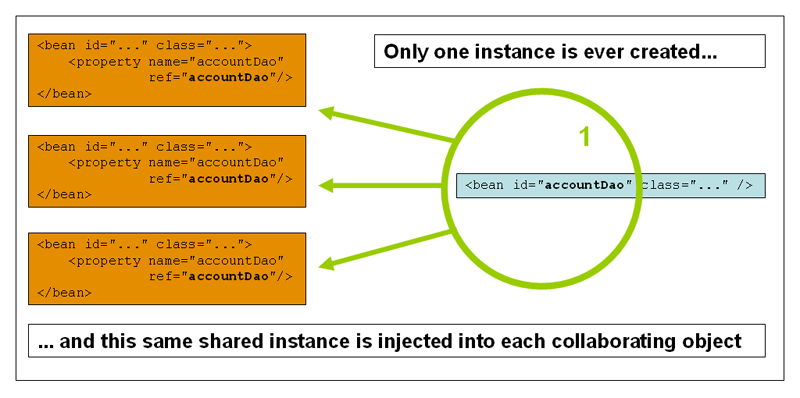
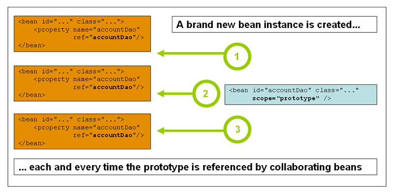

本章介绍了Spring的控制反转（IoC）容器。

### 1.1 Spring IoC容器和Bean简介

本章介绍了控制反转（IoC）原理的Spring框架实现。IoC也称为依赖注入（DI）。在此过程中，对象仅通过构造函数参数，工厂方法的参数或在构造或从工厂方法返回后在对象实例上设置的属性来定义其依赖项（即，与它们一起使用的其他对象） 。然后，容器在创建bean时注入那些依赖项。此过程从根本上讲是通过使用类的直接构造或诸如服务定位器模式之类的机制来控制其依赖项的实例化或位置的bean本身的逆过程（因此称为Control Inversion）。

在`org.springframework.beans`和`org.springframework.context`包是Spring框架的IoC容器的基础。该 [`BeanFactory`](https://docs.spring.io/spring-framework/docs/5.2.5.RELEASE/javadoc-api/org/springframework/beans/factory/BeanFactory.html) 界面提供了一种高级配置机制，能够管理任何类型的对象。 [`ApplicationContext`](https://docs.spring.io/spring-framework/docs/5.2.5.RELEASE/javadoc-api/org/springframework/context/ApplicationContext.html) 是的子接口`BeanFactory`。它增加了：

- 与Spring的AOP功能轻松集成
- 消息资源处理（用于国际化）
- 活动发布
- 应用层特定的上下文，例如`WebApplicationContext` 用于Web应用程序中的。

简而言之，`BeanFactory`提供了配置框架和基本功能，并`ApplicationContext`增加了更多针对企业的功能。该`ApplicationContext`是对一个完整的超集`BeanFactory`，并在Spring的IoC容器的描述本章独占使用。有关使用的详细信息`BeanFactory`，而不是`ApplicationContext,`看到 [ `BeanFactory`](https://docs.spring.io/spring/docs/5.2.5.RELEASE/spring-framework-reference/core.html#beans-beanfactory)。

在Spring中，构成应用程序主干并由Spring IoC容器管理的对象称为bean。Bean是由Spring IoC容器实例化，组装和以其他方式管理的对象。否则，bean仅仅是应用程序中许多对象之一。Bean及其之间的依赖关系反映在容器使用的配置元数据中。

### 1.2 容器概述

该`org.springframework.context.ApplicationContext`接口代表Spring IoC容器，并负责实例化，配置和组装Bean。容器通过读取配置元数据来获取有关要实例化，配置和组装哪些对象的指令。配置元数据以XML，Java批注或Java代码表示。它使您能够表达组成应用程序的对象以及这些对象之间的丰富相互依赖关系。

`ApplicationContext`Spring提供了该接口的几种实现。在独立应用程序中，通常创建[`ClassPathXmlApplicationContext`](https://docs.spring.io/spring-framework/docs/5.2.5.RELEASE/javadoc-api/org/springframework/context/support/ClassPathXmlApplicationContext.html) 或的实例 [`FileSystemXmlApplicationContext`](https://docs.spring.io/spring-framework/docs/5.2.5.RELEASE/javadoc-api/org/springframework/context/support/FileSystemXmlApplicationContext.html)。尽管XML是定义配置元数据的传统格式，但是您可以通过提供少量XML配置来声明性地启用对这些其他元数据格式的支持，从而指示容器将Java注释或代码用作元数据格式。

在大多数应用场景中，不需要显式的用户代码来实例化一个Spring IoC容器的一个或多个实例。例如，在Web应用程序场景中，应用程序文件中的简单八行（约）样板Web描述符XML `web.xml`通常就足够了（请参阅[Web应用程序的便捷ApplicationContext实例化](https://docs.spring.io/spring/docs/5.2.5.RELEASE/spring-framework-reference/core.html#context-create)）。如果您使用 [Spring Tools for Eclipse](https://spring.io/tools)（Eclipse支持的开发环境），则只需单击几下鼠标或击键即可轻松创建此样板配置。

下图显示了Spring的工作原理的高级视图。您的应用程序类与配置元数据结合在一起，以便在`ApplicationContext`创建和初始化之后，您便拥有了一个完全配置且可执行的系统或应用程序。


图1. Spring IoC容器

#### 1.2.1 配置元数据

如上图所示，Spring IoC容器使用一种形式的配置元数据。此配置元数据表示您作为应用程序开发人员如何告诉Spring容器实例化，配置和组装应用程序中的对象。

传统上，配置元数据以简单直观的XML格式提供，这是本章大部分内容用来传达Spring IoC容器的关键概念和功能的内容。

|      | 基于XML的元数据不是配置元数据的唯一允许形式。Spring IoC容器本身与实际写入此配置元数据的格式完全脱钩。如今，许多开发人员为他们的Spring应用程序选择 [基于Java的配置](https://docs.spring.io/spring/docs/5.2.5.RELEASE/spring-framework-reference/core.html#beans-java)。 |
| ---- | ------------------------------------------------------------ |
|      |                                                              |

有关在Spring容器中使用其他形式的元数据的信息，请参见：

- [基于注释的配置](https://docs.spring.io/spring/docs/5.2.5.RELEASE/spring-framework-reference/core.html#beans-annotation-config)：Spring 2.5引入了对基于注释的配置元数据的支持。
- [基于Java的配置](https://docs.spring.io/spring/docs/5.2.5.RELEASE/spring-framework-reference/core.html#beans-java)：从Spring 3.0开始，Spring JavaConfig项目提供的许多功能成为核心Spring Framework的一部分。因此，您可以使用Java而不是XML文件来定义应用程序类外部的bean。要使用这些新功能，请参阅 [`@Configuration`](https://docs.spring.io/spring-framework/docs/current/javadoc-api/org/springframework/context/annotation/Configuration.html)， [`@Bean`](https://docs.spring.io/spring-framework/docs/current/javadoc-api/org/springframework/context/annotation/Bean.html)， [`@Import`](https://docs.spring.io/spring-framework/docs/current/javadoc-api/org/springframework/context/annotation/Import.html)，和[`@DependsOn`](https://docs.spring.io/spring-framework/docs/current/javadoc-api/org/springframework/context/annotation/DependsOn.html)注释。

Spring配置由容器必须管理的至少一个（通常是一个以上）bean定义组成。基于XML的配置元数据将这些bean配置为``顶级元素内的``元素。Java配置通常`@Bean`在`@Configuration`类中使用带注释的方法。

这些bean定义对应于组成应用程序的实际对象。通常，您定义服务层对象，数据访问对象（DAO），表示对象（例如Struts `Action`实例），基础结构对象（例如Hibernate `SessionFactories`，JMS `Queues`等）。通常，不会在容器中配置细粒度的域对象，因为创建和加载域对象通常是DAO和业务逻辑的职责。但是，您可以使用Spring与AspectJ的集成来配置在IoC容器的控制范围之外创建的对象。请参阅[使用AspectJ通过Spring依赖注入域对象](https://docs.spring.io/spring/docs/5.2.5.RELEASE/spring-framework-reference/core.html#aop-atconfigurable)。

以下示例显示了基于XML的配置元数据的基本结构：

```xml
<?xml version="1.0" encoding="UTF-8"?>
<beans xmlns="http://www.springframework.org/schema/beans"
    xmlns:xsi="http://www.w3.org/2001/XMLSchema-instance"
    xsi:schemaLocation="http://www.springframework.org/schema/beans
        https://www.springframework.org/schema/beans/spring-beans.xsd">

    <bean id="..." class="...">  
        <!-- collaborators and configuration for this bean go here -->
    </bean>

    <bean id="..." class="...">
        <!-- collaborators and configuration for this bean go here -->
    </bean>

    <!-- more bean definitions go here -->

</beans>
```

|      | 该`id`属性是标识单个bean定义的字符串。              |
| ---- | --------------------------------------------------- |
|      | 该`class`属性定义bean的类型，并使用完全限定的类名。 |

该`id`属性的值是指协作对象。在此示例中未显示用于引用协作对象的XML。有关更多信息，请参见 [依赖项](https://docs.spring.io/spring/docs/5.2.5.RELEASE/spring-framework-reference/core.html#beans-dependencies)。

#### 1.2.2 实例化容器

提供给`ApplicationContext`构造函数的位置路径是资源字符串，这些资源字符串使容器可以从各种外部资源（例如本地文件系统，Java等）加载配置元数据`CLASSPATH`。

Java


```java
ApplicationContext context = new ClassPathXmlApplicationContext("services.xml", "daos.xml");
```

|      | 在了解了Spring的IoC容器之后，您可能想了解更多有关Spring的 `Resource`抽象（如[参考资料中所述](https://docs.spring.io/spring/docs/5.2.5.RELEASE/spring-framework-reference/core.html#resources)），它提供了一种方便的机制，用于从URI语法中定义的位置读取InputStream。特别`Resource`是，如[应用程序上下文和资源路径中](https://docs.spring.io/spring/docs/5.2.5.RELEASE/spring-framework-reference/core.html#resources-app-ctx)所述， 路径用于构造应用[程序上下文](https://docs.spring.io/spring/docs/5.2.5.RELEASE/spring-framework-reference/core.html#resources-app-ctx)。 |
| ---- | ------------------------------------------------------------ |
|      |                                                              |

以下示例显示了服务层对象`(services.xml)`配置文件：

```xml
<?xml version="1.0" encoding="UTF-8"?>
<beans xmlns="http://www.springframework.org/schema/beans"
    xmlns:xsi="http://www.w3.org/2001/XMLSchema-instance"
    xsi:schemaLocation="http://www.springframework.org/schema/beans
        https://www.springframework.org/schema/beans/spring-beans.xsd">

    <!-- services -->

    <bean id="petStore" class="org.springframework.samples.jpetstore.services.PetStoreServiceImpl">
        <property name="accountDao" ref="accountDao"/>
        <property name="itemDao" ref="itemDao"/>
        <!-- additional collaborators and configuration for this bean go here -->
    </bean>

    <!-- more bean definitions for services go here -->

</beans>
```

以下示例显示了数据访问对象`daos.xml`文件：

```xml
<?xml version="1.0" encoding="UTF-8"?>
<beans xmlns="http://www.springframework.org/schema/beans"
    xmlns:xsi="http://www.w3.org/2001/XMLSchema-instance"
    xsi:schemaLocation="http://www.springframework.org/schema/beans
        https://www.springframework.org/schema/beans/spring-beans.xsd">

    <bean id="accountDao"
        class="org.springframework.samples.jpetstore.dao.jpa.JpaAccountDao">
        <!-- additional collaborators and configuration for this bean go here -->
    </bean>

    <bean id="itemDao" class="org.springframework.samples.jpetstore.dao.jpa.JpaItemDao">
        <!-- additional collaborators and configuration for this bean go here -->
    </bean>

    <!-- more bean definitions for data access objects go here -->

</beans>
```

在前面的示例中，服务层由的`PetStoreServiceImpl`类和类型的两个数据访问对象`JpaAccountDao`和`JpaItemDao`（基于JPA对象关系映射标准）。该`property name`元素是指JavaBean属性的名称，以及`ref`元素指的是另一个bean定义的名称。`id`和`ref`元素之间的这种联系表达了协作对象之间的依赖性。有关配置对象的依赖关系的详细信息，请参见 [依赖关系](https://docs.spring.io/spring/docs/5.2.5.RELEASE/spring-framework-reference/core.html#beans-dependencies)。

##### 组成基于XML的配置元数据

使bean定义跨越多个XML文件可能很有用。通常，每个单独的XML配置文件都代表体系结构中的逻辑层或模块。

您可以使用应用程序上下文构造函数从所有这些XML片段中加载bean定义。`Resource`如上[一节中](https://docs.spring.io/spring/docs/5.2.5.RELEASE/spring-framework-reference/core.html#beans-factory-instantiation)所示，该构造函数具有多个位置 。或者，使用一个或多个出现的``元素从另一个文件中加载bean定义。以下示例显示了如何执行此操作：

```xml
<beans>
    <import resource="services.xml"/>
    <import resource="resources/messageSource.xml"/>
    <import resource="/resources/themeSource.xml"/>

    <bean id="bean1" class="..."/>
    <bean id="bean2" class="..."/>
</beans>
```

在前面的例子中，外部Bean定义是从三个文件加载： `services.xml`，`messageSource.xml`，和`themeSource.xml`。所有位置路径都相对于进行导入的定义文件，因此`services.xml`必须与进行导入的文件位于同一目录或类路径位置， `messageSource.xml`并且`themeSource.xml`必须位于`resources`导入文件位置下方的位置。如您所见，斜杠被忽略。但是，鉴于这些路径是相对的，最好不要使用任何斜线。``根据Spring Schema，导入的文件的内容（包括顶层元素）必须是有效的XML bean定义。

|      | 可以但不建议使用相对的“ ../”路径引用父目录中的文件。这样做会创建对当前应用程序外部文件的依赖。特别是，不建议将该引用用于`classpath:`URL（例如`classpath:../services.xml`），在URL 中，运行时解析过程将选择“最近”的类路径根，然后查看其父目录。类路径配置的更改可能导致选择其他错误的目录。您始终可以使用完全限定的资源位置来代替相对路径：例如`file:C:/config/services.xml`或`classpath:/config/services.xml`。但是，请注意，您正在将应用程序的配置耦合到特定的绝对位置。通常最好为这样的绝对位置保留一个间接寻址-例如，通过在运行时针对JVM系统属性解析的“ $ {…}”占位符。 |
| ---- | ------------------------------------------------------------ |
|      |                                                              |

命名空间本身提供了导入指令功能。Spring提供的一系列XML名称空间（例如`context`和`util`名称空间）中提供了超出普通bean定义的其他配置功能。

##### Groovy Bean定义DSL

作为外部化配置元数据的另一个示例，Bean定义也可以在Spring的Groovy Bean定义DSL中表达，如Grails框架所知。通常，这种配置位于“ .groovy”文件中，其结构如以下示例所示：

```groovy
beans {
    dataSource(BasicDataSource) {
        driverClassName = "org.hsqldb.jdbcDriver"
        url = "jdbc:hsqldb:mem:grailsDB"
        username = "sa"
        password = ""
        settings = [mynew:"setting"]
    }
    sessionFactory(SessionFactory) {
        dataSource = dataSource
    }
    myService(MyService) {
        nestedBean = { AnotherBean bean ->
            dataSource = dataSource
        }
    }
}
```

这种配置样式在很大程度上等同于XML bean定义，甚至支持Spring的XML配置名称空间。它还允许通过`importBeans`指令导入XML bean定义文件。

#### 1.2.3 使用容器

该`ApplicationContext`是一个维护bean定义以及相互依赖的注册表的高级工厂的接口。通过使用方法`T getBean(String name, Class requiredType)`，您可以检索bean的实例。

将`ApplicationContext`让你读bean定义和访问它们，如下例所示：

Java


```java
// create and configure beans
ApplicationContext context = new ClassPathXmlApplicationContext("services.xml", "daos.xml");

// retrieve configured instance
PetStoreService service = context.getBean("petStore", PetStoreService.class);

// use configured instance
List<String> userList = service.getUsernameList();
```

使用Groovy配置，引导看起来非常相似。它有一个不同的上下文实现类，该类可识别Groovy（但也了解XML Bean定义）。以下示例显示了Groovy配置：

Java


```java
ApplicationContext context = new GenericGroovyApplicationContext("services.groovy", "daos.groovy");
```

最灵活的变体是`GenericApplicationContext`与读取器委托结合使用，例如，与`XmlBeanDefinitionReader`XML文件结合使用，如以下示例所示：

Java


```java
GenericApplicationContext context = new GenericApplicationContext();
new XmlBeanDefinitionReader(context).loadBeanDefinitions("services.xml", "daos.xml");
context.refresh();
```

您也可以将`GroovyBeanDefinitionReader`Groovy文件用于，如以下示例所示：

Java


```java
GenericApplicationContext context = new GenericApplicationContext();
new GroovyBeanDefinitionReader(context).loadBeanDefinitions("services.groovy", "daos.groovy");
context.refresh();
```

您可以`ApplicationContext`在不同的配置源中从相同的Bean中混合和匹配此类阅读器委托，以读取Bean定义。

然后，您可以`getBean`用来检索bean的实例。该`ApplicationContext` 接口还有其他几种检索bean的方法，但是理想情况下，您的应用程序代码永远不要使用它们。实际上，您的应用程序代码应该根本不调用该 `getBean()`方法，因此完全不依赖于Spring API。例如，Spring与Web框架的集成为各种Web框架组件（例如控制器和JSF管理的Bean）提供了依赖注入，使您可以通过元数据（例如自动装配注释）声明对特定Bean的依赖。

### 1.3 Bean总览

Spring IoC容器管理一个或多个bean。这些bean是使用您提供给容器的配置元数据创建的（例如，以XML ``定义的形式 ）。

在容器本身内，这些bean定义表示为`BeanDefinition` 对象，这些对象包含（除其他信息外）以下元数据：

- 包限定的类名：通常，定义了Bean的实际实现类。
- Bean行为配置元素，用于声明Bean在容器中的行为（作用域，生命周期回调等）。
- 引用其他bean完成其工作所需的bean。这些引用也称为协作者或依赖项。
- 要在新创建的对象中设置的其他配置设置-例如，池的大小限制或要在管理连接池的bean中使用的连接数。

此元数据转换为构成每个bean定义的一组属性。下表描述了这些属性：

| 属性           | 在...中解释                                                  |
| :------------- | :----------------------------------------------------------- |
| 类             | [实例化Bean](https://docs.spring.io/spring/docs/5.2.5.RELEASE/spring-framework-reference/core.html#beans-factory-class) |
| 名称           | [命名Bean](https://docs.spring.io/spring/docs/5.2.5.RELEASE/spring-framework-reference/core.html#beans-beanname) |
| 范围           | [Bean范围](https://docs.spring.io/spring/docs/5.2.5.RELEASE/spring-framework-reference/core.html#beans-factory-scopes) |
| 构造函数参数   | [依赖注入](https://docs.spring.io/spring/docs/5.2.5.RELEASE/spring-framework-reference/core.html#beans-factory-collaborators) |
| 物产           | [依赖注入](https://docs.spring.io/spring/docs/5.2.5.RELEASE/spring-framework-reference/core.html#beans-factory-collaborators) |
| 自动接线方式   | [自动装配协作器](https://docs.spring.io/spring/docs/5.2.5.RELEASE/spring-framework-reference/core.html#beans-factory-autowire) |
| 延迟初始化模式 | [懒初始化Bean](https://docs.spring.io/spring/docs/5.2.5.RELEASE/spring-framework-reference/core.html#beans-factory-lazy-init) |
| 初始化方法     | [初始化回调](https://docs.spring.io/spring/docs/5.2.5.RELEASE/spring-framework-reference/core.html#beans-factory-lifecycle-initializingbean) |
| 销毁方式       | [销毁回调](https://docs.spring.io/spring/docs/5.2.5.RELEASE/spring-framework-reference/core.html#beans-factory-lifecycle-disposablebean) |

除了包含有关如何创建特定bean的信息的bean定义之外，`ApplicationContext`实现还允许注册在容器外部（由用户）创建的现有对象。这是通过通过方法访问ApplicationContext的BeanFactory来完成的`getBeanFactory()`，该方法返回BeanFactory `DefaultListableBeanFactory`实现。`DefaultListableBeanFactory` 通过`registerSingleton(..)`和 `registerBeanDefinition(..)`方法支持此注册。但是，典型的应用程序只能与通过常规bean定义元数据定义的bean一起使用。

|      | Bean元数据和手动提供的单例实例需要尽早注册，以便容器在自动装配和其他自省步骤中正确地推理它们。虽然在某种程度上支持覆盖现有的元数据和现有的单例实例，但是在运行时（与对工厂的实时访问同时）对新bean的注册未得到正式支持，并且可能导致并发访问异常，bean容器中的状态不一致或都。 |
| ---- | ------------------------------------------------------------ |
|      |                                                              |

#### 1.3.1 命名Bean

每个bean具有一个或多个标识符。这些标识符在承载Bean的容器内必须唯一。一个bean通常只有一个标识符。但是，如果需要多个，则可以将多余的别名视为别名。

在基于XML配置文件，您可以使用`id`属性，该`name`属性，或两者来指定bean标识符。该`id`属性使您可以精确指定一个ID。按照惯例，这些名称是字母数字（“ myBean”，“ someService”等），但它们也可以包含特殊字符。如果要为bean引入其他别名，还可以在`name` 属性中指定它们，并用逗号（`,`），分号（`;`）或空格分隔。作为历史记录，在Spring 3.1之前的版本中，该`id`属性被定义为一种`xsd:ID`类型，该类型限制了可能的字符。从3.1开始，它被定义为`xsd:string`类型。请注意，Bean `id`唯一性仍由容器强制执行，尽管XML解析器不再如此。

您不需要为bean 提供`name`或`id`。如果不提供 `name`或`id`显式提供，容器将为该bean生成一个唯一的名称。但是，如果要通过名称引用该bean，则必须通过使用`ref`元素或服务定位器样式查找来提供名称。不提供名称的动机与使用[内部bean](https://docs.spring.io/spring/docs/5.2.5.RELEASE/spring-framework-reference/core.html#beans-inner-beans)和[自动装配合作者有关](https://docs.spring.io/spring/docs/5.2.5.RELEASE/spring-framework-reference/core.html#beans-factory-autowire)。

Bean命名约定

约定是在命名bean时将标准Java约定用于实例字段名称。也就是说，bean名称以小写字母开头，并从那里用驼峰式大小写。这样的名字的例子包括`accountManager`， `accountService`，`userDao`，`loginController`，等等。

一致地命名Bean使您的配置更易于阅读和理解。另外，如果您使用Spring AOP，则在将建议应用于名称相关的一组bean时，它会很有帮助。

|      | 通过在类路径中进行组件扫描，Spring会按照前面描述的规则为未命名的组件生成Bean名称：本质上，采用简单的类名称并将其初始字符转换为小写。但是，在（不寻常的）特殊情况下，如果有多个字符并且第一个和第二个字符均为大写字母，则会保留原始大小写。这些规则与`java.beans.Introspector.decapitalize`（由Spring在此处使用）定义的规则相同。 |
| ---- | ------------------------------------------------------------ |
|      |                                                              |

##### 在Bean定义之外别名Bean

在bean定义本身中，可以通过使用由`id`属性指定的最多一个名称和属性中任意数量的其他名称的组合来为bean提供多个名称`name`。这些名称可以是同一个bean的等效别名，并且在某些情况下很有用，例如，通过使用特定于该组件本身的bean名称，让应用程序中的每个组件都引用一个公共依赖项。

但是，在实际定义bean的地方指定所有别名并不总是足够的。有时需要为在别处定义的bean引入别名。在大型系统中通常是这种情况，在大型系统中，配置是在每个子系统之间分配的，每个子系统都有自己的对象定义集。在基于XML的配置元数据中，您可以使用``元素来完成此任务。以下示例显示了如何执行此操作：

```xml
<alias name="fromName" alias="toName"/>
```

在这种情况下，`fromName`在使用该别名定义之后，命名为Bean（位于同一容器中）的Bean也可以称为`toName`。

例如，子系统A的配置元数据可以使用名称来引用数据源`subsystemA-dataSource`。子系统B的配置元数据可以使用的名称引用数据源`subsystemB-dataSource`。组成使用这两个子系统的主应用程序时，主应用程序使用名称引用数据源`myApp-dataSource`。要使所有三个名称都引用同一个对象，可以将以下别名定义添加到配置元数据中：

```xml
<alias name="myApp-dataSource" alias="subsystemA-dataSource"/>
<alias name="myApp-dataSource" alias="subsystemB-dataSource"/>
```

现在，每个组件和主应用程序都可以通过唯一的名称引用数据源，并保证不与任何其他定义冲突（有效地创建名称空间），但它们引用的是同一bean。

Java配置

如果使用Java配置，则`@Bean`注释可用于提供别名。有关详细信息，请参见[使用`@Bean`注释](https://docs.spring.io/spring/docs/5.2.5.RELEASE/spring-framework-reference/core.html#beans-java-bean-annotation)。

#### 1.3.2。实例化Bean

Bean定义实质上是创建一个或多个对象的方法。当被询问时，容器将查看命名bean的配方，并使用该bean定义封装的配置元数据来创建（或获取）实际对象。

如果使用基于XML的配置元数据，则`class`在``元素的属性中指定要实例化的对象的类型（或类）。此 `class`属性（在内部是 实例的`Class`属性`BeanDefinition`）通常是必需的。（有关异常，请参阅 [使用实例工厂方法实例化](https://docs.spring.io/spring/docs/5.2.5.RELEASE/spring-framework-reference/core.html#beans-factory-class-instance-factory-method)和[Bean定义继承](https://docs.spring.io/spring/docs/5.2.5.RELEASE/spring-framework-reference/core.html#beans-child-bean-definitions)。）可以通过以下`Class`两种方式之一使用该属性：

- 通常，在容器本身通过反射性地调用其构造函数直接创建Bean的情况下，指定要构造的Bean类，这在某种程度上等同于使用`new`运算符的Java代码。
- 要指定包含`static`要创建对象而调用的工厂方法的实际类，在不太常见的情况下，容器将`static`在类上调用 工厂方法来创建Bean。从`static`工厂方法的调用返回的对象类型可以是相同的类，也可以是完全不同的另一类。

内部班级名称

如果要为`static`嵌套类配置Bean定义，则必须使用嵌套类的二进制名称。

例如，如果`SomeThing`在`com.example`包中有一个名为的类，并且 `SomeThing`该类有一个`static`名为的嵌套类`OtherThing`，则`class` bean定义上的属性值将为`com.example.SomeThing$OtherThing`。

请注意，名称中使用了`$`字符，以将嵌套的类名与外部类名分开。

##### 用构造函数实例化

当通过构造函数方法创建bean时，所有普通类都可以被Spring使用并与之兼容。也就是说，正在开发的类不需要实现任何特定的接口或以特定的方式进行编码。只需指定bean类就足够了。但是，根据您用于该特定bean的IoC的类型，您可能需要一个默认（空）构造函数。

Spring IoC容器几乎可以管理您要管理的任何类。它不仅限于管理真正的JavaBean。大多数Spring用户更喜欢实际的JavaBean，它们仅具有默认（无参数）构造函数，并具有根据容器中的属性建模的适当的setter和getter。您还可以在容器中具有更多奇特的非bean样式类。例如，如果您需要使用绝对不符合JavaBean规范的旧式连接池，则Spring也可以对其进行管理。

使用基于XML的配置元数据，您可以如下指定bean类：

```xml
<bean id="exampleBean" class="examples.ExampleBean"/>

<bean name="anotherExample" class="examples.ExampleBeanTwo"/>
```

有关向构造函数提供参数（如果需要）并在构造对象之后设置对象实例属性的机制的详细信息，请参见 [注入依赖项](https://docs.spring.io/spring/docs/5.2.5.RELEASE/spring-framework-reference/core.html#beans-factory-collaborators)。

##### 用静态工厂方法实例化

在定义使用静态工厂方法创建的bean时，请使用`class` 属性指定包含`static`工厂方法的类，并使用命名`factory-method`为属性的属性来指定工厂方法本身的名称。您应该能够调用此方法（使用可选参数，如稍后所述）并返回一个活动对象，该对象随后将被视为已通过构造函数创建。这种bean定义的一种用法是`static`用旧版代码调用工厂。

以下bean定义指定通过调用工厂方法来创建bean。该定义不指定返回对象的类型（类），而仅指定包含工厂方法的类。在此示例中，该`createInstance()` 方法必须是静态方法。以下示例显示如何指定工厂方法：

```xml
<bean id="clientService"
    class="examples.ClientService"
    factory-method="createInstance"/>
```

以下示例显示了一个可与前面的bean定义一起使用的类：

Java


```java
public class ClientService {
    private static ClientService clientService = new ClientService();
    private ClientService() {}

    public static ClientService createInstance() {
        return clientService;
    }
}
```

有关为工厂方法提供（可选）参数并在从工厂返回对象之后设置对象实例属性的机制的详细信息，请参见[Dependencies and Configuration in Detail](https://docs.spring.io/spring/docs/5.2.5.RELEASE/spring-framework-reference/core.html#beans-factory-properties-detailed)。

##### 使用实例工厂方法实例化

类似于通过[静态工厂方法进行](https://docs.spring.io/spring/docs/5.2.5.RELEASE/spring-framework-reference/core.html#beans-factory-class-static-factory-method)实例化，使用实例工厂方法进行实例化会从容器中调用现有bean的非静态方法来创建新bean。要使用此机制，请将`class`属性保留为空，并在`factory-bean`属性中指定当前（或父或祖先）容器中的Bean名称，该容器包含将被调用以创建对象的实例方法。使用`factory-method`属性设置工厂方法本身的名称。以下示例显示了如何配置此类Bean：

```xml
<!-- the factory bean, which contains a method called createInstance() -->
<bean id="serviceLocator" class="examples.DefaultServiceLocator">
    <!-- inject any dependencies required by this locator bean -->
</bean>

<!-- the bean to be created via the factory bean -->
<bean id="clientService"
    factory-bean="serviceLocator"
    factory-method="createClientServiceInstance"/>
```

以下示例显示了相应的类：

Java


```java
public class DefaultServiceLocator {

    private static ClientService clientService = new ClientServiceImpl();

    public ClientService createClientServiceInstance() {
        return clientService;
    }
}
```

一个工厂类也可以包含一个以上的工厂方法，如以下示例所示：

```xml
<bean id="serviceLocator" class="examples.DefaultServiceLocator">
    <!-- inject any dependencies required by this locator bean -->
</bean>

<bean id="clientService"
    factory-bean="serviceLocator"
    factory-method="createClientServiceInstance"/>

<bean id="accountService"
    factory-bean="serviceLocator"
    factory-method="createAccountServiceInstance"/>
```

以下示例显示了相应的类：

Java


```java
public class DefaultServiceLocator {

    private static ClientService clientService = new ClientServiceImpl();

    private static AccountService accountService = new AccountServiceImpl();

    public ClientService createClientServiceInstance() {
        return clientService;
    }

    public AccountService createAccountServiceInstance() {
        return accountService;
    }
}
```

这种方法表明，工厂Bean本身可以通过依赖项注入（DI）进行管理和配置。[详细信息，](https://docs.spring.io/spring/docs/5.2.5.RELEASE/spring-framework-reference/core.html#beans-factory-properties-detailed)请参见[依赖性和配置](https://docs.spring.io/spring/docs/5.2.5.RELEASE/spring-framework-reference/core.html#beans-factory-properties-detailed)。

|      | 在Spring文档中，“ factory bean”是指在Spring容器中配置并通过[实例](https://docs.spring.io/spring/docs/5.2.5.RELEASE/spring-framework-reference/core.html#beans-factory-class-instance-factory-method)或 [静态](https://docs.spring.io/spring/docs/5.2.5.RELEASE/spring-framework-reference/core.html#beans-factory-class-static-factory-method)工厂方法创建对象的bean 。相反， `FactoryBean`（请注意，大写字母）是指特定于Spring的 [`FactoryBean` ](https://docs.spring.io/spring/docs/5.2.5.RELEASE/spring-framework-reference/core.html#beans-factory-extension-factorybean)。 |
| ---- | ------------------------------------------------------------ |
|      |                                                              |

### 1.4 依存关系

典型的企业应用程序不包含单个对象（或Spring的bean）。即使是最简单的应用程序，也有一些对象可以协同工作，以呈现最终用户视为一致的应用程序。下一部分将说明如何从定义多个独立的Bean定义到实现对象协作以实现目标的完全实现的应用程序。

#### 1.4.1 依赖注入

依赖注入（DI）是一个过程，通过该过程，对象只能通过构造函数参数，工厂方法的参数或在构造或创建对象实例后在对象实例上设置的属性来定义其依赖关系（即，与它们一起工作的其他对象）。从工厂方法返回。然后，容器在创建bean时注入那些依赖项。从根本上讲，此过程是通过使用类的直接构造或服务定位器模式来控制bean自身依赖关系的实例化或位置的bean本身的逆过程（因此称为Control Inversion）。

使用DI原理，代码更加简洁，当为对象提供依赖项时，去耦会更有效。该对象不查找其依赖项，也不知道依赖项的位置或类。结果，您的类变得更易于测试，尤其是当依赖项依赖于接口或抽象基类时，它们允许在单元测试中使用存根或模拟实现。

DI存在两个主要变体：[基于构造函数的依赖注入](https://docs.spring.io/spring/docs/5.2.5.RELEASE/spring-framework-reference/core.html#beans-constructor-injection)和[基于Setter的依赖注入](https://docs.spring.io/spring/docs/5.2.5.RELEASE/spring-framework-reference/core.html#beans-setter-injection)。

##### 基于构造函数的依赖注入

基于构造函数的DI是通过容器调用具有多个参数（每个参数代表一个依赖项）的构造函数来完成的。调用`static`带有特定参数的工厂方法来构造Bean几乎是等效的，并且本次讨论将构造函数和`static`工厂方法的参数视为类似。以下示例显示了只能通过构造函数注入进行依赖项注入的类：

Java


```java
public class SimpleMovieLister {

    // the SimpleMovieLister has a dependency on a MovieFinder
    private MovieFinder movieFinder;

    // a constructor so that the Spring container can inject a MovieFinder
    public SimpleMovieLister(MovieFinder movieFinder) {
        this.movieFinder = movieFinder;
    }

    // business logic that actually uses the injected MovieFinder is omitted...
}
```

注意，该类没有什么特别的。它是一个POJO，不依赖于特定于容器的接口，基类或注释。

###### 构造函数参数解析

构造函数参数解析匹配通过使用参数的类型进行。如果Bean定义的构造函数参数中不存在潜在的歧义，则在实例化Bean时，在Bean定义中定义构造函数参数的顺序就是将这些参数提供给适当的构造函数的顺序。考虑以下类别：

Java


```java
package x.y;

public class ThingOne {

    public ThingOne(ThingTwo thingTwo, ThingThree thingThree) {
        // ...
    }
}
```

假设`ThingTwo`和`ThingThree`类不是通过继承关联的，则不存在潜在的歧义。因此，以下配置可以正常工作，并且您无需在`` 元素中显式指定构造函数参数索引或类型。

```xml
<beans>
    <bean id="beanOne" class="x.y.ThingOne">
        <constructor-arg ref="beanTwo"/>
        <constructor-arg ref="beanThree"/>
    </bean>

    <bean id="beanTwo" class="x.y.ThingTwo"/>

    <bean id="beanThree" class="x.y.ThingThree"/>
</beans>
```

当引用另一个bean时，类型是已知的，并且可以发生匹配（与前面的示例一样）。当使用诸如的简单类型时 `true`，Spring无法确定值的类型，因此在没有帮助的情况下无法按类型进行匹配。考虑以下类别：

Java


```java
package examples;

public class ExampleBean {

    // Number of years to calculate the Ultimate Answer
    private int years;

    // The Answer to Life, the Universe, and Everything
    private String ultimateAnswer;

    public ExampleBean(int years, String ultimateAnswer) {
        this.years = years;
        this.ultimateAnswer = ultimateAnswer;
    }
}
```

构造函数参数类型匹配

在上述情况下，如果通过使用`type`属性显式指定构造函数参数的类型，则容器可以使用简单类型的类型匹配。如以下示例所示：

```xml
<bean id="exampleBean" class="examples.ExampleBean">
    <constructor-arg type="int" value="7500000"/>
    <constructor-arg type="java.lang.String" value="42"/>
</bean>
```

构造函数参数索引

您可以使用该`index`属性来明确指定构造函数参数的索引，如以下示例所示：

```xml
<bean id="exampleBean" class="examples.ExampleBean">
    <constructor-arg index="0" value="7500000"/>
    <constructor-arg index="1" value="42"/>
</bean>
```

除了解决多个简单值的歧义性之外，指定索引还可以解决歧义，其中构造函数具有两个相同类型的参数。

|      | 索引从0开始。 |
| ---- | ------------- |
|      |               |

构造函数参数名称

您还可以使用构造函数参数名称来消除歧义，如以下示例所示：

```xml
<bean id="exampleBean" class="examples.ExampleBean">
    <constructor-arg name="years" value="7500000"/>
    <constructor-arg name="ultimateAnswer" value="42"/>
</bean>
```

请记住，要立即使用该功能，必须在启用调试标志的情况下编译代码，以便Spring可以从构造函数中查找参数名称。如果您不能或不希望使用debug标志编译代码，则可以使用 [@ConstructorProperties](https://download.oracle.com/javase/8/docs/api/java/beans/ConstructorProperties.html) JDK注释显式命名构造函数参数。然后，样本类必须如下所示：

Java


```java
package examples;

public class ExampleBean {

    // Fields omitted

    @ConstructorProperties({"years", "ultimateAnswer"})
    public ExampleBean(int years, String ultimateAnswer) {
        this.years = years;
        this.ultimateAnswer = ultimateAnswer;
    }
}
```

##### 基于Setter的依赖注入

基于设置器的DI是通过在调用无参数构造函数或无参数`static`工厂方法以实例化您的bean 之后，在您的bean上调用setter方法来完成的。

下面的示例显示只能通过使用纯setter注入来依赖注入的类。此类是常规的Java。它是一个POJO，不依赖于容器特定的接口，基类或注释。

Java


```java
public class SimpleMovieLister {

    // the SimpleMovieLister has a dependency on the MovieFinder
    private MovieFinder movieFinder;

    // a setter method so that the Spring container can inject a MovieFinder
    public void setMovieFinder(MovieFinder movieFinder) {
        this.movieFinder = movieFinder;
    }

    // business logic that actually uses the injected MovieFinder is omitted...
}
```

将`ApplicationContext`支持基于构造函数和的Setter DI为它所管理的Bean类。在已经通过构造函数方法注入了某些依赖项之后，它还支持基于setter的DI。您可以以的形式配置依赖项，将`BeanDefinition`其与`PropertyEditor`实例结合使用以将属性从一种格式转换为另一种格式。但是，大多数Spring用户并不直接（即以编程方式）使用这些类，而是使用XML `bean` 定义，带注释的组件（即带有`@Component`， `@Controller`等等的类）或`@Bean`基于Java的`@Configuration`类中的方法。然后将这些源在内部转换为的实例，`BeanDefinition`并用于加载整个Spring IoC容器实例。

基于构造函数或基于setter的DI？

由于可以混合使用基于构造函数的DI和基于setter的DI，因此，将构造函数用于强制性依赖项，将setter方法或配置方法用于可选性依赖项是一个很好的经验法则。请注意，可以 在setter方法上使用[@Required](https://docs.spring.io/spring/docs/5.2.5.RELEASE/spring-framework-reference/core.html#beans-required-annotation)批注，以使该属性成为必需的依赖项。但是，最好使用带有参数的程序验证的构造函数注入。

Spring团队通常提倡构造函数注入，因为它使您可以将应用程序组件实现为不可变对象，并确保不存在必需的依赖项`null`。此外，构造函数注入的组件始终以完全初始化的状态返回到客户端（调用）代码。附带说明一下，大量的构造函数自变量是一种不好的代码味道，这意味着该类可能承担了太多的职责，应该对其进行重构以更好地解决关注点分离问题。

Setter注入主要应仅用于可以在类中分配合理的默认值的可选依赖项。否则，必须在代码使用依赖项的任何地方执行非空检查。setter注入的一个好处是，setter方法可使该类的对象在以后重新配置或重新注入。因此，通过[JMX MBean进行](https://docs.spring.io/spring/docs/5.2.5.RELEASE/spring-framework-reference/integration.html#jmx)管理是用于setter注入的引人注目的用例。

使用最适合特定班级的DI风格。有时，在处理您没有源代码的第三方类时，将为您做出选择。例如，如果第三方类未公开任何setter方法，则构造函数注入可能是DI的唯一可用形式。

##### 依赖性解析过程

容器执行bean依赖项解析，如下所示：

- 使用`ApplicationContext`描述所有bean的配置元数据创建和初始化。可以通过XML，Java代码或注释指定配置元数据。
- 对于每个bean，其依赖项都以属性，构造函数参数或static-factory方法的参数的形式表示（如果使用它而不是普通的构造函数）。实际创建Bean时，会将这些依赖项提供给Bean。
- 每个属性或构造函数参数都是要设置的值的实际定义，或者是对容器中另一个bean的引用。
- 作为值的每个属性或构造函数参数都将从其指定的格式转换为该属性或构造函数参数的实际类型。默认情况下，Spring能够以String类型提供值转换成所有内置类型，比如`int`， `long`，`String`，`boolean`，等等。

在创建容器时，Spring容器会验证每个bean的配置。但是，在实际创建Bean之前，不会设置Bean属性本身。创建容器时，将创建具有单例作用域并设置为预先实例化（默认）的Bean。范围在[Bean范围](https://docs.spring.io/spring/docs/5.2.5.RELEASE/spring-framework-reference/core.html#beans-factory-scopes)中定义。否则，仅在请求时才创建Bean。创建和分配bean的依赖关系及其依赖关系（依此类推）时，创建bean可能会导致创建一个bean图。请注意，这些依赖项之间的分辨率不匹配可能会显示得较晚-即在第一次创建受影响的bean时。

循环依赖

如果主要使用构造函数注入，则可能会创建无法解决的循环依赖方案。

例如：类A通过构造函数注入需要B类的实例，而类B通过构造函数注入需要B类的实例。如果您为将类A和B相互注入而配置了bean，则Spring IoC容器会在运行时检测到此循环引用，并抛出 `BeanCurrentlyInCreationException`。

一种可能的解决方案是编辑某些类的源代码，这些类将由设置者而不是构造函数来配置。或者，避免构造函数注入，而仅使用setter注入。换句话说，尽管不建议这样做，但是您可以使用setter注入配置循环依赖关系。

与典型情况（没有循环依赖关系）不同，Bean A和Bean B之间的循环依赖关系迫使其中一个Bean在完全完全初始化之前被注入另一个Bean（经典的“鸡与蛋”场景）。

通常，您可以信任Spring做正确的事。它在容器加载时检测配置问题，例如对不存在的Bean的引用和循环依赖项。在实际创建Bean时，Spring设置属性并尽可能晚地解决依赖关系。这意味着已经正确加载的Spring容器以后可以在请求对象时生成异常，如果在创建该对象或其依赖项之一时遇到问题-例如，由于缺少或无效，Bean会引发异常属性。某些配置问题的这种潜在的延迟可见性是为什么`ApplicationContext`默认情况下，实现会实例化单例bean。在实际需要这些bean之前，要花一些前期时间和内存来创建它们，您会在创建bean时发现配置问题`ApplicationContext`，而不是稍后发现。您仍然可以覆盖此默认行为，以便单例bean延迟初始化，而不是预先实例化。

如果不存在循环依赖关系，则在将一个或多个协作Bean注入从属Bean时，每个协作Bean都将被完全配置，然后再注入到从属Bean中。这意味着，如果bean A依赖于bean B，则Spring IoC容器会在对bean A调用setter方法之前完全配置beanB。换句话说，bean被实例化（如果不是预先实例化的singleton）。 ），设置其依赖项，并调用相关的生命周期方法（例如已[配置的init方法](https://docs.spring.io/spring/docs/5.2.5.RELEASE/spring-framework-reference/core.html#beans-factory-lifecycle-initializingbean) 或[InitializingBean回调方法](https://docs.spring.io/spring/docs/5.2.5.RELEASE/spring-framework-reference/core.html#beans-factory-lifecycle-initializingbean)）。

##### 依赖注入的例子

以下示例将基于XML的配置元数据用于基于setter的DI。Spring XML配置文件的一小部分指定了一些bean定义，如下所示：

```xml
<bean id="exampleBean" class="examples.ExampleBean">
    <!-- setter injection using the nested ref element -->
    <property name="beanOne">
        <ref bean="anotherExampleBean"/>
    </property>

    <!-- setter injection using the neater ref attribute -->
    <property name="beanTwo" ref="yetAnotherBean"/>
    <property name="integerProperty" value="1"/>
</bean>

<bean id="anotherExampleBean" class="examples.AnotherBean"/>
<bean id="yetAnotherBean" class="examples.YetAnotherBean"/>
```

以下示例显示了相应的`ExampleBean`类：

Java


```java
public class ExampleBean {

    private AnotherBean beanOne;

    private YetAnotherBean beanTwo;

    private int i;

    public void setBeanOne(AnotherBean beanOne) {
        this.beanOne = beanOne;
    }

    public void setBeanTwo(YetAnotherBean beanTwo) {
        this.beanTwo = beanTwo;
    }

    public void setIntegerProperty(int i) {
        this.i = i;
    }
}
```

在前面的示例中，声明了setter以与XML文件中指定的属性匹配。以下示例使用基于构造函数的DI：

```xml
<bean id="exampleBean" class="examples.ExampleBean">
    <!-- constructor injection using the nested ref element -->
    <constructor-arg>
        <ref bean="anotherExampleBean"/>
    </constructor-arg>

    <!-- constructor injection using the neater ref attribute -->
    <constructor-arg ref="yetAnotherBean"/>

    <constructor-arg type="int" value="1"/>
</bean>

<bean id="anotherExampleBean" class="examples.AnotherBean"/>
<bean id="yetAnotherBean" class="examples.YetAnotherBean"/>
```

以下示例显示了相应的`ExampleBean`类：

Java


```java
public class ExampleBean {

    private AnotherBean beanOne;

    private YetAnotherBean beanTwo;

    private int i;

    public ExampleBean(
        AnotherBean anotherBean, YetAnotherBean yetAnotherBean, int i) {
        this.beanOne = anotherBean;
        this.beanTwo = yetAnotherBean;
        this.i = i;
    }
}
```

Bean定义中指定的构造函数参数用作的构造函数的参数`ExampleBean`。

现在考虑该示例的一个变体，在该变体中，不是使用构造函数，而是告诉Spring调用`static`工厂方法以返回对象的实例：

```xml
<bean id="exampleBean" class="examples.ExampleBean" factory-method="createInstance">
    <constructor-arg ref="anotherExampleBean"/>
    <constructor-arg ref="yetAnotherBean"/>
    <constructor-arg value="1"/>
</bean>

<bean id="anotherExampleBean" class="examples.AnotherBean"/>
<bean id="yetAnotherBean" class="examples.YetAnotherBean"/>
```

以下示例显示了相应的`ExampleBean`类：

Java


```java
public class ExampleBean {

    // a private constructor
    private ExampleBean(...) {
        ...
    }

    // a static factory method; the arguments to this method can be
    // considered the dependencies of the bean that is returned,
    // regardless of how those arguments are actually used.
    public static ExampleBean createInstance (
        AnotherBean anotherBean, YetAnotherBean yetAnotherBean, int i) {

        ExampleBean eb = new ExampleBean (...);
        // some other operations...
        return eb;
    }
}
```

`static`工厂方法的参数由``元素提供，就像实际使用构造函数一样。factory方法返回的类的类型不必与包含`static`factory方法的类具有相同的类型（尽管在此示例中是）。实例（非静态）工厂方法可以以本质上相同的方式使用（除了使用`factory-bean`属性代替`class`属性之外），因此在此不讨论这些细节。

#### 1.4.2 依赖性和详细配置

如上[一节所述](https://docs.spring.io/spring/docs/5.2.5.RELEASE/spring-framework-reference/core.html#beans-factory-collaborators)，您可以将bean属性和构造函数参数定义为对其他托管bean（协作者）的引用或内联定义的值。Spring的基于XML的配置元数据为此目的在其``和``元素中支持子元素类型。

##### 直值（原语，字符串等）

在`value`所述的属性``元素指定属性或构造器参数的人类可读的字符串表示。Spring的 [转换服务](https://docs.spring.io/spring/docs/5.2.5.RELEASE/spring-framework-reference/core.html#core-convert-ConversionService-API)用于将这些值从转换`String`为属性或参数的实际类型。以下示例显示了设置的各种值：

```xml
<bean id="myDataSource" class="org.apache.commons.dbcp.BasicDataSource" destroy-method="close">
    <!-- results in a setDriverClassName(String) call -->
    <property name="driverClassName" value="com.mysql.jdbc.Driver"/>
    <property name="url" value="jdbc:mysql://localhost:3306/mydb"/>
    <property name="username" value="root"/>
    <property name="password" value="masterkaoli"/>
</bean>
```

下面的示例使用[p-namespace](https://docs.spring.io/spring/docs/5.2.5.RELEASE/spring-framework-reference/core.html#beans-p-namespace)进行更简洁的XML配置：

```xml
<beans xmlns="http://www.springframework.org/schema/beans"
    xmlns:xsi="http://www.w3.org/2001/XMLSchema-instance"
    xmlns:p="http://www.springframework.org/schema/p"
    xsi:schemaLocation="http://www.springframework.org/schema/beans
    https://www.springframework.org/schema/beans/spring-beans.xsd">

    <bean id="myDataSource" class="org.apache.commons.dbcp.BasicDataSource"
        destroy-method="close"
        p:driverClassName="com.mysql.jdbc.Driver"
        p:url="jdbc:mysql://localhost:3306/mydb"
        p:username="root"
        p:password="masterkaoli"/>

</beans>
```

前面的XML更简洁。但是，除非在创建bean定义时使用支持自动属性完成的IDE（例如[IntelliJ IDEA](https://www.jetbrains.com/idea/)或[Spring Tools for Eclipse](https://spring.io/tools)），否则错字是在运行时而不是设计时发现的。强烈建议您使用此类IDE帮助。

您还可以配置`java.util.Properties`实例，如下所示：

```xml
<bean id="mappings"
    class="org.springframework.context.support.PropertySourcesPlaceholderConfigurer">

    <!-- typed as a java.util.Properties -->
    <property name="properties">
        <value>
            jdbc.driver.className=com.mysql.jdbc.Driver
            jdbc.url=jdbc:mysql://localhost:3306/mydb
        </value>
    </property>
</bean>
```

Spring容器使用JavaBeans 机制将``元素内的文本转换为 `java.util.Properties`实例`PropertyEditor`。这是一个不错的捷径，并且是Spring团队偏爱使用嵌套``元素而非`value`属性样式的少数几个地方之一。

###### 该`idref`元素

所述`idref`元件是一个简单的防错方法对通过`id`（一个字符串值-而不是参考）在该容器另一个bean的一个``或`` 元件。以下示例显示了如何使用它：

```xml
<bean id="theTargetBean" class="..."/>

<bean id="theClientBean" class="...">
    <property name="targetName">
        <idref bean="theTargetBean"/>
    </property>
</bean>
```

前面的bean定义片段（在运行时）与下面的片段完全等效：

```xml
<bean id="theTargetBean" class="..." />

<bean id="client" class="...">
    <property name="targetName" value="theTargetBean"/>
</bean>
```

第一种形式优于第二种形式，因为使用`idref`标记可以使容器在部署时验证所引用的命名Bean实际上是否存在。在第二个变体中，不对传递给bean `targetName`属性的值进行验证`client`。拼写错误仅在`client`实际实例化bean 时才发现（可能会导致致命的结果）。如果该`client` bean是[原型](https://docs.spring.io/spring/docs/5.2.5.RELEASE/spring-framework-reference/core.html#beans-factory-scopes) bean，则可能在部署容器后很长时间才发现此错字和所产生的异常。

|      | 元素 的`local`属性在`idref`4.0 bean XSD中不再受支持，因为它不再提供常规`bean`引用上的值。升级到4.0模式时，将现有`idref local`引用更改`idref bean`为。 |
| ---- | ------------------------------------------------------------ |
|      |                                                              |

其中一个共同的地方（至少在早期比Spring 2.0版本）``元素带来的值在配置[AOP拦截](https://docs.spring.io/spring/docs/5.2.5.RELEASE/spring-framework-reference/core.html#aop-pfb-1)在 `ProxyFactoryBean`bean定义。``在指定拦截器名称时使用元素可防止您拼写错误的拦截器ID。

##### 对其他Bean的引用（协作者）

所述`ref`元件是内部的最终元件``或`` 定义元素。在这里，您将Bean的指定属性的值设置为对容器管理的另一个Bean（协作者）的引用。引用的bean是要设置其属性的bean的依赖关系，并且在设置属性之前根据需要对其进行初始化。（如果协作者是单例bean，则它可能已经由容器初始化了。）所有引用最终都是对另一个对象的引用。范围和验证取决于是否通过`bean`或`parent`属性指定另一个对象的ID或名称。

通过标记的`bean`属性指定目标bean ``是最通用的形式，并且允许在相同容器或父容器中创建对任何bean的引用，而不管它是否在同一XML文件中。该`bean`属性的值 可以`id`与目标Bean 的属性相同，也可以与目标Bean 的属性之一相同`name`。以下示例显示如何使用`ref`元素：

```xml
<ref bean="someBean"/>
```

通过`parent`属性指定目标Bean 将创建对当前容器的父容器中的Bean的引用。该`parent` 属性的值可以`id`与目标Bean 的属性或目标Bean的`name`属性中的值之一相同。目标Bean必须位于当前容器的父容器中。主要在具有容器层次结构并且要使用与父bean名称相同的代理将现有bean封装在父容器中时，才应使用此bean参考变量。以下清单对显示了如何使用该`parent`属性：

```xml
<!-- in the parent context -->
<bean id="accountService" class="com.something.SimpleAccountService">
    <!-- insert dependencies as required as here -->
</bean>
<!-- in the child (descendant) context -->
<bean id="accountService" <!-- bean name is the same as the parent bean -->
    class="org.springframework.aop.framework.ProxyFactoryBean">
    <property name="target">
        <ref parent="accountService"/> <!-- notice how we refer to the parent bean -->
    </property>
    <!-- insert other configuration and dependencies as required here -->
</bean>
```

|      | 元素 的`local`属性在`ref`4.0 bean XSD中不再受支持，因为它不再提供常规`bean`引用上的值。升级到4.0模式时，将现有`ref local`引用更改`ref bean`为。 |
| ---- | ------------------------------------------------------------ |
|      |                                                              |

##### 内Bean

甲``内部的元件``或``元件限定内部Bean，如下面的示例所示：

```xml
<bean id="outer" class="...">
    <!-- instead of using a reference to a target bean, simply define the target bean inline -->
    <property name="target">
        <bean class="com.example.Person"> <!-- this is the inner bean -->
            <property name="name" value="Fiona Apple"/>
            <property name="age" value="25"/>
        </bean>
    </property>
</bean>
```

内部bean定义不需要定义的ID或名称。如果指定，则容器不使用该值作为标识符。容器还会忽略`scope`创建时的标志，因为内部Bean始终是匿名的，并且始终与外部Bean一起创建。不可能独立地访问内部bean或将它们注入到协作bean中而不是封装在bean中。

作为一个特例，可以从自定义范围接收破坏回调，例如，针对单例bean中包含的请求范围内的bean。内部bean实例的创建与其包含的bean绑定在一起，但是销毁回调使它可以参与请求范围的生命周期。这不是常见的情况。内部bean通常只共享其包含bean的作用域。

##### 馆藏

的``，``，``，和``元件设置Java的属性和参数`Collection`类型`List`，`Set`，`Map`，和`Properties`，分别。以下示例显示了如何使用它们：

```xml
<bean id="moreComplexObject" class="example.ComplexObject">
    <!-- results in a setAdminEmails(java.util.Properties) call -->
    <property name="adminEmails">
        <props>
            <prop key="administrator">administrator@example.org</prop>
            <prop key="support">support@example.org</prop>
            <prop key="development">development@example.org</prop>
        </props>
    </property>
    <!-- results in a setSomeList(java.util.List) call -->
    <property name="someList">
        <list>
            <value>a list element followed by a reference</value>
            <ref bean="myDataSource" />
        </list>
    </property>
    <!-- results in a setSomeMap(java.util.Map) call -->
    <property name="someMap">
        <map>
            <entry key="an entry" value="just some string"/>
            <entry key ="a ref" value-ref="myDataSource"/>
        </map>
    </property>
    <!-- results in a setSomeSet(java.util.Set) call -->
    <property name="someSet">
        <set>
            <value>just some string</value>
            <ref bean="myDataSource" />
        </set>
    </property>
</bean>
```

映射键或值的值或设置值也可以是以下任意元素：

```xml
bean | ref | idref | list | set | map | props | value | null
```

###### 集合合并

Spring容器还支持合并集合。应用程序开发人员可以定义父<list/>，<map/>，<set/>或<props/>元素，并有孩子<list/>，<map/>，<set/>或<props/>元素继承和父集合覆盖值。也就是说，子集合的值是合并父集合和子集合的元素的结果，子集合的元素将覆盖父集合中指定的值。

关于合并的本节讨论了父子bean机制。不熟悉父bean和子bean定义的读者可能希望在继续之前阅读 [相关部分](https://docs.spring.io/spring/docs/5.2.5.RELEASE/spring-framework-reference/core.html#beans-child-bean-definitions)。

下面的示例演示了集合合并：

```xml
<beans>
    <bean id="parent" abstract="true" class="example.ComplexObject">
        <property name="adminEmails">
            <props>
                <prop key="administrator">administrator@example.com</prop>
                <prop key="support">support@example.com</prop>
            </props>
        </property>
    </bean>
    <bean id="child" parent="parent">
        <property name="adminEmails">
            <!-- the merge is specified on the child collection definition -->
            <props merge="true">
                <prop key="sales">sales@example.com</prop>
                <prop key="support">support@example.co.uk</prop>
            </props>
        </property>
    </bean>
<beans>
```

注意，在bean定义的`merge=true`属性的``元素 上使用了属性。当bean解析并由容器实例化时，结果实例具有一个集合，该集合包含将子项的集合与父项的集合合并的结果 。以下清单显示了结果：`adminEmails``child``child``adminEmails` `Properties``adminEmails``adminEmails`

```
管理员
=administrator@example.com 
sales=sales@example.com support=support@example.co.uk
```

孩子`Properties`集合的值设置继承父所有属性元素``，和孩子的为值`support`值将覆盖父集合的价值。

这一合并行为同样适用于``，``和`` 集合类型。在``元素的特定情况下，将 维护与`List`集合类型关联的语义（即`ordered`值集合的概念）。父级的值位于所有子级列表的值之前。在的情况下`Map`，`Set`和`Properties`集合类型，没有顺序存在。因此，没有排序的语义在背后的关联的集合类型的效果`Map`，`Set`以及`Properties`实现类型，容器内部使用。

###### 馆藏合并的局限性

您不能合并不同的集合类型（例如`Map`和`List`）。如果尝试这样做，`Exception`则会抛出一个适当的值。该`merge`属性必须在下面的继承的子定义中指定。`merge`在父集合定义上指定属性是多余的，不会导致所需的合并。

###### 强类型集合

随着Java 5中通用类型的引入，您可以使用强类型集合。也就是说，可以声明一个`Collection`类型，使其仅包含（例如）`String`元素。如果使用Spring将强类型依赖注入`Collection`到Bean中，则可以利用Spring的类型转换支持，以便在将强类型`Collection` 实例的元素添加到之前将其转换为适当的类型`Collection`。以下Java类和bean定义显示了如何执行此操作：

Java


```java
public class SomeClass {

    private Map<String, Float> accounts;

    public void setAccounts(Map<String, Float> accounts) {
        this.accounts = accounts;
    }
}
```

```xml
<beans>
    <bean id="something" class="x.y.SomeClass">
        <property name="accounts">
            <map>
                <entry key="one" value="9.99"/>
                <entry key="two" value="2.75"/>
                <entry key="six" value="3.99"/>
            </map>
        </property>
    </bean>
</beans>
```

当准备注入bean 的`accounts`属性时，可以通过反射获得`something`有关强类型的元素类型的泛型信息`Map`。因此，Spring的类型转换基础结构将各种值元素识别为type `Float`，并将字符串值（`9.99, 2.75`和 `3.99`）转换为实际`Float`类型。

##### 空字符串值和空字符串值

Spring将属性等的空参数视为empty `Strings`。以下基于XML的配置元数据片段将`email`属性设置为空 `String`值（“”）。

```xml
<bean class="ExampleBean">
    <property name="email" value=""/>
</bean>
```

前面的示例等效于以下Java代码：

Java


```java
exampleBean.setEmail("");
```

该``元素处理`null`的值。以下清单显示了一个示例：

```xml
<bean class="ExampleBean">
    <property name="email">
        <null/>
    </property>
</bean>
```

前面的配置等效于下面的Java代码：

Java


```java
exampleBean.setEmail(null);
```

##### 具有p-命名空间的XML快捷方式

p-namespace允许您使用`bean`元素的属性（而不是嵌套 ``元素）来描述协作bean的属性值，或同时使用这两者。

Spring支持基于XML Schema定义的[具有名称空间的](https://docs.spring.io/spring/docs/5.2.5.RELEASE/spring-framework-reference/core.html#xsd-schemas)可扩展配置格式。`beans`本章讨论的配置格式在XML Schema文档中定义。但是，p命名空间未在XSD文件中定义，仅存在于Spring的核心中。

以下示例显示了两个XML代码段（第一个使用标准XML格式，第二个使用p-命名空间），它们可以解析为相同的结果：

```xml
<beans xmlns="http://www.springframework.org/schema/beans"
    xmlns:xsi="http://www.w3.org/2001/XMLSchema-instance"
    xmlns:p="http://www.springframework.org/schema/p"
    xsi:schemaLocation="http://www.springframework.org/schema/beans
        https://www.springframework.org/schema/beans/spring-beans.xsd">

    <bean name="classic" class="com.example.ExampleBean">
        <property name="email" value="someone@somewhere.com"/>
    </bean>

    <bean name="p-namespace" class="com.example.ExampleBean"
        p:email="someone@somewhere.com"/>
</beans>
```

该示例显示了`email`在bean定义中调用的p-namespace中的属性。这告诉Spring包含一个属性声明。如前所述，p名称空间没有架构定义，因此可以将属性名称设置为属性名称。

下一个示例包括另外两个bean定义，它们都引用了另一个bean：

```xml
<beans xmlns="http://www.springframework.org/schema/beans"
    xmlns:xsi="http://www.w3.org/2001/XMLSchema-instance"
    xmlns:p="http://www.springframework.org/schema/p"
    xsi:schemaLocation="http://www.springframework.org/schema/beans
        https://www.springframework.org/schema/beans/spring-beans.xsd">

    <bean name="john-classic" class="com.example.Person">
        <property name="name" value="John Doe"/>
        <property name="spouse" ref="jane"/>
    </bean>

    <bean name="john-modern"
        class="com.example.Person"
        p:name="John Doe"
        p:spouse-ref="jane"/>

    <bean name="jane" class="com.example.Person">
        <property name="name" value="Jane Doe"/>
    </bean>
</beans>
```

此示例不仅包括使用p-namespace的属性值，还使用特殊格式声明属性引用。第一个bean定义用于``创建从bean `john`到bean 的引用 `jane`，而第二个bean定义`p:spouse-ref="jane"`用作属性来执行完全相同的操作。在这种情况下，`spouse`属性名称是，而该`-ref`部分表示这不是一个直接值，而是对另一个bean的引用。

|      | p命名空间不如标准XML格式灵活。例如，用于声明属性引用的格式与以结尾的属性发生冲突`Ref`，而标准XML格式则没有。我们建议您仔细选择方法，并与团队成员进行交流，以避免同时使用这三种方法生成XML文档。 |
| ---- | ------------------------------------------------------------ |
|      |                                                              |

##### 具有c-namespace的XML快捷方式

与[具有p-namespace](https://docs.spring.io/spring/docs/5.2.5.RELEASE/spring-framework-reference/core.html#beans-p-namespace)的[XML Shortcut](https://docs.spring.io/spring/docs/5.2.5.RELEASE/spring-framework-reference/core.html#beans-p-namespace)相似，在Spring 3.1中引入的c-namespace允许使用内联属性来配置构造函数参数，而不是嵌套`constructor-arg`元素。

以下示例使用`c:`名称空间执行与 [基于构造函数的依赖注入相同的操作](https://docs.spring.io/spring/docs/5.2.5.RELEASE/spring-framework-reference/core.html#beans-constructor-injection)：

```xml
<beans xmlns="http://www.springframework.org/schema/beans"
    xmlns:xsi="http://www.w3.org/2001/XMLSchema-instance"
    xmlns:c="http://www.springframework.org/schema/c"
    xsi:schemaLocation="http://www.springframework.org/schema/beans
        https://www.springframework.org/schema/beans/spring-beans.xsd">

    <bean id="beanTwo" class="x.y.ThingTwo"/>
    <bean id="beanThree" class="x.y.ThingThree"/>

    <!-- traditional declaration with optional argument names -->
    <bean id="beanOne" class="x.y.ThingOne">
        <constructor-arg name="thingTwo" ref="beanTwo"/>
        <constructor-arg name="thingThree" ref="beanThree"/>
        <constructor-arg name="email" value="something@somewhere.com"/>
    </bean>

    <!-- c-namespace declaration with argument names -->
    <bean id="beanOne" class="x.y.ThingOne" c:thingTwo-ref="beanTwo"
        c:thingThree-ref="beanThree" c:email="something@somewhere.com"/>

</beans>
```

该`c:`命名空间使用相同的约定作为`p:`一个（尾部`-ref`的bean引用），供他们的名字设置构造函数的参数。同样，即使未在XSD模式中定义它（也存在于Spring内核中），也需要在XML文件中声明它。

对于极少数情况下无法使用构造函数自变量名称的情况（通常，如果字节码是在没有调试信息的情况下编译的），可以对参数索引使用后备，如下所示：

```xml
<!-- c-namespace index declaration -->
<bean id="beanOne" class="x.y.ThingOne" c:_0-ref="beanTwo" c:_1-ref="beanThree"
    c:_2="something@somewhere.com"/>
```

|      | 由于XML语法的原因，索引表示法要求使用前导`_`，因为XML属性名称不能以数字开头（即使某些IDE允许）。相应的索引符号也可用于``元素，但不常用，因为声明的简单顺序通常就足够了。 |
| ---- | ------------------------------------------------------------ |
|      |                                                              |

实际上，构造函数解析 [机制](https://docs.spring.io/spring/docs/5.2.5.RELEASE/spring-framework-reference/core.html#beans-factory-ctor-arguments-resolution)在匹配参数方面非常有效，因此，除非您确实需要，否则我们建议在整个配置过程中使用名称表示法。

##### 复合属性名称

设置bean属性时，可以使用复合属性名称或嵌套属性名称，只要路径中除最终属性名称之外的所有组件都没有`null`。考虑以下bean定义：

```xml
<bean id="something" class="things.ThingOne">
    <property name="fred.bob.sammy" value="123" />
</bean>
```

所述`something`Bean具有`fred`属性，该属性具有`bob`属性，其具有`sammy` 特性，并且最终`sammy`属性被设置为值`123`。为了使其工作，bean 的`fred`属性`something`和的`bob`属性`fred`一定不能`null`在bean构建之后。否则，将`NullPointerException`引发a。

#### 1.4.3。使用`depends-on`

如果一个bean是另一个bean的依赖项，则通常意味着将一个bean设置为另一个bean的属性。通常，您可以使用基于XML的配置元数据中的[`` 元素](https://docs.spring.io/spring/docs/5.2.5.RELEASE/spring-framework-reference/core.html#beans-ref-element)来完成此操作。但是，有时bean之间的依赖性不太直接。一个示例是何时需要触发类中的静态初始值设定项，例如用于数据库驱动程序注册。该`depends-on`属性可以在初始化使用此元素的bean之前显式强制初始化一个或多个bean。以下示例使用该`depends-on`属性表示对单个bean的依赖关系：

```xml
<bean id="beanOne" class="ExampleBean" depends-on="manager"/>
<bean id="manager" class="ManagerBean" />
```

要表达对多个bean的依赖关系，请提供一个bean名称列表作为该`depends-on`属性的值（逗号，空格和分号是有效的分隔符）：

```xml
<bean id="beanOne" class="ExampleBean" depends-on="manager,accountDao">
    <property name="manager" ref="manager" />
</bean>

<bean id="manager" class="ManagerBean" />
<bean id="accountDao" class="x.y.jdbc.JdbcAccountDao" />
```

|      | 该`depends-on`属性既可以指定初始化时间依赖性，也可以仅在[单例](https://docs.spring.io/spring/docs/5.2.5.RELEASE/spring-framework-reference/core.html#beans-factory-scopes-singleton) bean 的情况下指定相应的销毁时间依赖性。定义`depends-on`与给定bean 的关系的从属bean 首先被销毁，然后再销毁给定bean本身。这样，`depends-on`还可以控制关机顺序。 |
| ---- | ------------------------------------------------------------ |
|      |                                                              |

#### 1.4.4。懒初始化Bean

默认情况下，`ApplicationContext`实现会在初始化过程中积极创建和配置所有 [单例](https://docs.spring.io/spring/docs/5.2.5.RELEASE/spring-framework-reference/core.html#beans-factory-scopes-singleton) bean。通常，这种预初始化是可取的，因为与数小时甚至数天后相比，会立即发现配置或周围环境中的错误。如果不希望这种行为，则可以通过将bean定义标记为延迟初始化来防止单例bean的预实例化。延迟初始化的bean告诉IoC容器在首次请求时（而不是在启动时）创建一个bean实例。

在XML中，此行为由 元素`lazy-init`上的属性控制``，如以下示例所示：

```xml
<bean id="lazy" class="com.something.ExpensiveToCreateBean" lazy-init="true"/>
<bean name="not.lazy" class="com.something.AnotherBean"/>
```

当上述配置是通过消耗`ApplicationContext`，所述`lazy`Bean是不是提前被实例化时`ApplicationContext`开始，而`not.lazy`Bean急切预实例化。

但是，当延迟初始化的bean是未进行延迟初始化的单例bean的依赖项`ApplicationContext`时，由于在启动时必须满足单例的依赖关系，所以Bean在启动时会创建延迟初始化的bean。延迟初始化的bean被注入到其他未延迟初始化的单例bean中。

您还可以通过使用元素`default-lazy-init`上的属性在容器级别上控制延迟初始化， ``以下示例显示：

```xml
<beans default-lazy-init="true">
    <!-- no beans will be pre-instantiated... -->
</beans>
```

#### 1.4.5。自动装配协作器

Spring容器可以自动装配协作bean之间的关系。您可以通过检查的内容，让Spring自动为您的bean解决协作者（其他bean）`ApplicationContext`。自动装配具有以下优点：

- 自动装配可以大大减少指定属性或构造函数参数的需要。（[在本章其他地方讨论的](https://docs.spring.io/spring/docs/5.2.5.RELEASE/spring-framework-reference/core.html#beans-child-bean-definitions)其他机制，例如Bean模板 [，](https://docs.spring.io/spring/docs/5.2.5.RELEASE/spring-framework-reference/core.html#beans-child-bean-definitions)在这方面也很有价值。）
- 随着对象的发展，自动装配可以更新配置。例如，如果您需要向类中添加依赖项，则无需修改配置即可自动满足该依赖项。因此，自动装配在开发过程中特别有用，而不必担心在代码库变得更稳定时切换到显式接线的选择。

使用基于XML的配置元数据时（请参阅[Dependency Injection](https://docs.spring.io/spring/docs/5.2.5.RELEASE/spring-framework-reference/core.html#beans-factory-collaborators)），您可以使用元素的`autowire`属性为 bean定义指定自动装配模式``。自动装配功能具有四种模式。您可以为每个bean指定自动装配，因此可以选择要自动装配的装配。下表描述了四种自动装配模式：

| 模式          | 说明                                                         |
| :------------ | :----------------------------------------------------------- |
| `no`          | （默认）无自动装配。Bean引用必须由`ref`元素定义。对于较大的部署，建议不要更改默认设置，因为明确指定协作者可以提供更好的控制和清晰度。在某种程度上，它记录了系统的结构。 |
| `byName`      | 按属性名称自动布线。Spring寻找与需要自动装配的属性同名的bean。例如，如果一个bean定义被设置为按名称自动装配并且包含一个`master`属性（即它具有一个 `setMaster(..)`方法），那么Spring将查找一个名为的bean定义，`master`并使用它来设置该属性。 |
| `byType`      | 如果容器中恰好存在一个属性类型的bean，则使该属性自动连接。如果存在多个错误，则会引发致命异常，这表明您可能无法`byType`对该bean 使用自动装配。如果没有匹配的bean，则什么都不会发生（未设置该属性）。 |
| `constructor` | 类似于`byType`但适用于构造函数参数。如果容器中不存在构造函数参数类型的一个bean，则将引发致命错误。 |

使用`byType`或`constructor`自动装配模式，您可以连接阵列和键入的集合。在这种情况下，将提供容器中与期望类型匹配的所有自动装配候选，以满足相关性。`Map`如果期望的密钥类型为，则可以自动连接强类型实例`String`。自动装配`Map` 实例的值包括与期望类型匹配的所有bean实例，并且 `Map`实例的键包含相应的bean名称。

##### 自动接线的局限性和缺点

当在项目中一致使用自动装配时，自动装配效果最佳。如果通常不使用自动装配，那么使用开发人员仅连接一个或两个bean定义可能会使开发人员感到困惑。

考虑自动装配的局限性和缺点：

- 显式依赖项`property`和`constructor-arg`设置始终会覆盖自动装配。您无法自动装配简单的属性，例如基元 `Strings`，和`Classes`（以及此类简单属性的数组）。此限制是设计使然。
- 自动装配不如显式接线精确。尽管如前所述，Spring还是谨慎地避免在可能产生意外结果的模棱两可的情况下进行猜测。Spring管理的对象之间的关系不再明确记录。
- 接线信息可能不适用于可能从Spring容器生成文档的工具。
- 容器中的多个bean定义可能与要自动装配的setter方法或构造函数参数指定的类型匹配。对于数组，集合或 `Map`实例，这不一定是问题。但是，对于期望单个值的依赖项，不会任意解决此歧义。如果没有唯一的bean定义可用，则引发异常。

在后一种情况下，您有几种选择：

- 放弃自动布线，转而使用明确的布线。
- 如[下一节](https://docs.spring.io/spring/docs/5.2.5.RELEASE/spring-framework-reference/core.html#beans-factory-autowire-candidate)所述，通过将其`autowire-candidate`属性设置为来避免自动装配bean定义。`false`
- 通过将单个bean定义`primary`的``元素属性设置为，将其指定为主要候选对象 `true`。
- 如[基于注释的容器配置中](https://docs.spring.io/spring/docs/5.2.5.RELEASE/spring-framework-reference/core.html#beans-annotation-config)所述，[通过基于](https://docs.spring.io/spring/docs/5.2.5.RELEASE/spring-framework-reference/core.html#beans-annotation-config)注释的配置实现更细粒度的控件。

##### 从自动装配中排除Bean

在每个bean的基础上，您可以从自动装配中排除一个bean。使用Spring的XML格式，将元素的`autowire-candidate`属性设置``为`false`。容器使特定的bean定义对自动装配基础结构不可用（包括注释样式配置，例如[`@Autowired`](https://docs.spring.io/spring/docs/5.2.5.RELEASE/spring-framework-reference/core.html#beans-autowired-annotation)）。

|      | 该`autowire-candidate`属性旨在仅影响基于类型的自动装配。它不会影响按名称显示的显式引用，即使未将指定的Bean标记为自动装配候选，该名称也可以解析。结果，如果名称匹配，按名称自动装配仍然会注入一个bean。 |
| ---- | ------------------------------------------------------------ |
|      |                                                              |

您还可以基于与Bean名称的模式匹配来限制自动装配候选。顶级``元素在其`default-autowire-candidates`属性内接受一个或多个模式 。例如，要将自动装配候选状态限制为名称以结尾的任何bean `Repository`，请提供值`*Repository`。要提供多种模式，请在以逗号分隔的列表中定义它们。`true`或`false`Bean定义`autowire-candidate`属性的显式值 始终优先。对于此类bean，模式匹配规则不适用。

这些技术对于您不希望通过自动装配将其注入到其他bean中的bean非常有用。这并不意味着排除的bean本身不能使用自动装配进行配置。相反，bean本身不是自动装配其他bean的候选对象。

#### 1.4.6 方法注入

在大多数应用场景中，容器中的大多数bean是 [singletons](https://docs.spring.io/spring/docs/5.2.5.RELEASE/spring-framework-reference/core.html#beans-factory-scopes-singleton)。当单例Bean需要与另一个单例Bean协作或非单例Bean需要与另一个非单例Bean协作时，通常可以通过将一个Bean定义为另一个Bean的属性来处理依赖性。当bean的生命周期不同时会出现问题。假设单例bean A可能需要使用非单例（原型）bean B，也许是在A的每个方法调用上使用。容器仅创建一次单例bean A，因此只有一次机会来设置属性。每次需要一个容器时，容器都无法为bean A提供一个新的bean B实例。

一个解决方案是放弃某些控制反转。您可以通过实现接口，并通过每次[容器](https://docs.spring.io/spring/docs/5.2.5.RELEASE/spring-framework-reference/core.html#beans-factory-client) A都需要[容器](https://docs.spring.io/spring/docs/5.2.5.RELEASE/spring-framework-reference/core.html#beans-factory-client) B [的](https://docs.spring.io/spring/docs/5.2.5.RELEASE/spring-framework-reference/core.html#beans-factory-client)[调用来](https://docs.spring.io/spring/docs/5.2.5.RELEASE/spring-framework-reference/core.html#beans-factory-client)请求（通常是新的）bean B实例，来[使bean A知道容器](https://docs.spring.io/spring/docs/5.2.5.RELEASE/spring-framework-reference/core.html#beans-factory-aware)。以下示例显示了此方法：`ApplicationContextAware`[`getBean("B")`](https://docs.spring.io/spring/docs/5.2.5.RELEASE/spring-framework-reference/core.html#beans-factory-client)

Java


```java
// a class that uses a stateful Command-style class to perform some processing
package fiona.apple;

// Spring-API imports
import org.springframework.beans.BeansException;
import org.springframework.context.ApplicationContext;
import org.springframework.context.ApplicationContextAware;

public class CommandManager implements ApplicationContextAware {

    private ApplicationContext applicationContext;

    public Object process(Map commandState) {
        // grab a new instance of the appropriate Command
        Command command = createCommand();
        // set the state on the (hopefully brand new) Command instance
        command.setState(commandState);
        return command.execute();
    }

    protected Command createCommand() {
        // notice the Spring API dependency!
        return this.applicationContext.getBean("command", Command.class);
    }

    public void setApplicationContext(
            ApplicationContext applicationContext) throws BeansException {
        this.applicationContext = applicationContext;
    }
}
```

前面的内容是不理想的，因为业务代码知道并耦合到Spring框架。方法注入是Spring IoC容器的一项高级功能，使您可以干净地处理此用例。

您可以在[此博客条目中](https://spring.io/blog/2004/08/06/method-injection/)了解有关方法注入动机的更多信息 。

##### 查找方法注入

查找方法注入是容器覆盖容器管理的Bean上的方法并返回容器中另一个命名Bean的查找结果的能力。查找通常涉及原型bean，如上[一节中所述](https://docs.spring.io/spring/docs/5.2.5.RELEASE/spring-framework-reference/core.html#beans-factory-method-injection)。Spring框架通过使用从CGLIB库生成字节码来动态生成覆盖该方法的子类来实现此方法注入。

|      | 为了使此动态子类起作用，Spring Bean容器子类的类也不能为`final`，要覆盖的方法也不能为`final`。对具有`abstract`方法的类进行单元测试需要您自己对该类进行子类化，并提供该`abstract`方法的存根实现。组件扫描也需要具体的方法，这需要具体的类。另一个关键限制是，查找方法不适用于工厂方法，尤其不适`@Bean`用于配置类中的方法，因为在这种情况下，容器不负责创建实例，因此无法在其上创建运行时生成的子类。苍蝇。 |
| ---- | ------------------------------------------------------------ |
|      |                                                              |

对于`CommandManager`前面的代码片段中的类，Spring容器动态地覆盖该`createCommand()` 方法的实现。该`CommandManager`班没有任何Spring的依赖，因为返工例所示：

Java


```java
package fiona.apple;

// no more Spring imports!

public abstract class CommandManager {

    public Object process(Object commandState) {
        // grab a new instance of the appropriate Command interface
        Command command = createCommand();
        // set the state on the (hopefully brand new) Command instance
        command.setState(commandState);
        return command.execute();
    }

    // okay... but where is the implementation of this method?
    protected abstract Command createCommand();
}
```

在包含要注入的方法的客户端类（`CommandManager`在本例中为）中，要注入的方法需要以下形式的签名：

```xml
<public|protected> [abstract] <return-type> theMethodName(no-arguments);
```

如果方法为`abstract`，则动态生成的子类将实现该方法。否则，动态生成的子类将覆盖原始类中定义的具体方法。考虑以下示例：

```xml
<!-- a stateful bean deployed as a prototype (non-singleton) -->
<bean id="myCommand" class="fiona.apple.AsyncCommand" scope="prototype">
    <!-- inject dependencies here as required -->
</bean>

<!-- commandProcessor uses statefulCommandHelper -->
<bean id="commandManager" class="fiona.apple.CommandManager">
    <lookup-method name="createCommand" bean="myCommand"/>
</bean>
```

只要需要新的bean 实例，被标识为的bean 就会`commandManager`调用其自己的`createCommand()`方法`myCommand`。`myCommand`如果确实需要，您必须小心地将bean 部署为原型。如果是[单例](https://docs.spring.io/spring/docs/5.2.5.RELEASE/spring-framework-reference/core.html#beans-factory-scopes-singleton)，`myCommand` 则每次都返回Bean 的相同实例。

另外，在基于注释的组件模型中，您可以通过`@Lookup`注释声明一个查找方法，如以下示例所示：

Java


```java
public abstract class CommandManager {

    public Object process(Object commandState) {
        Command command = createCommand();
        command.setState(commandState);
        return command.execute();
    }

    @Lookup("myCommand")
    protected abstract Command createCommand();
}
```

或者，更习惯地说，您可以依赖于针对查找方法的声明返回类型解析的目标bean：

Java


```java
public abstract class CommandManager {

    public Object process(Object commandState) {
        MyCommand command = createCommand();
        command.setState(commandState);
        return command.execute();
    }

    @Lookup
    protected abstract MyCommand createCommand();
}
```

请注意，通常应使用具体的存根实现声明此类带注释的查找方法，以使它们与Spring的组件扫描规则（默认情况下抽象类会被忽略）兼容。此限制不适用于显式注册或显式导入的Bean类。

|      | 访问范围不同的目标bean的另一种方法是`ObjectFactory`/ `Provider`注入点。请参阅将[范围Bean作为依赖项](https://docs.spring.io/spring/docs/5.2.5.RELEASE/spring-framework-reference/core.html#beans-factory-scopes-other-injection)。您可能还会发现`ServiceLocatorFactoryBean`（在 `org.springframework.beans.factory.config`包装中）有用。 |
| ---- | ------------------------------------------------------------ |
|      |                                                              |

##### 任意方法替换

与查找方法注入相比，方法注入的一种不太有用的形式是能够用另一种方法实现替换托管bean中的任意方法。您可以放心地跳过本节的其余部分，直到您真正需要此功能为止。

借助基于XML的配置元数据，您可以使用`replaced-method`元素将现有方法实现替换为已部署bean的另一个实现。考虑以下类，该类具有一个`computeValue`我们要重写的方法：

Java


```java
public class MyValueCalculator {

    public String computeValue(String input) {
        // some real code...
    }

    // some other methods...
}
```

实现该`org.springframework.beans.factory.support.MethodReplacer` 接口的类提供了新的方法定义，如以下示例所示：

Java


```java
/**
 * meant to be used to override the existing computeValue(String)
 * implementation in MyValueCalculator
 */
public class ReplacementComputeValue implements MethodReplacer {

    public Object reimplement(Object o, Method m, Object[] args) throws Throwable {
        // get the input value, work with it, and return a computed result
        String input = (String) args[0];
        ...
        return ...;
    }
}
```

用于部署原始类并指定方法重写的Bean定义类似于以下示例：

```xml
<bean id="myValueCalculator" class="x.y.z.MyValueCalculator">
    <!-- arbitrary method replacement -->
    <replaced-method name="computeValue" replacer="replacementComputeValue">
        <arg-type>String</arg-type>
    </replaced-method>
</bean>

<bean id="replacementComputeValue" class="a.b.c.ReplacementComputeValue"/>
```

您可以``在元素内使用一个或多个元素`` 来指示要覆盖的方法的方法签名。仅当方法重载且类中存在多个变体时，才需要对参数签名。为了方便起见，参数的类型字符串可以是完全限定类型名称的子字符串。例如，以下所有匹配项 `java.lang.String`：

```java
java.lang.String
String
Str
```

因为参数的数量通常足以区分每个可能的选择，所以通过让您仅键入与参数类型匹配的最短字符串，此快捷方式可以节省很多输入。

### 1.5 Bean范围

创建bean定义时，将创建一个配方来创建该bean定义所定义的类的实际实例。bean定义是配方的想法很重要，因为它意味着与类一样，您可以从一个配方中创建许多对象实例。

您不仅可以控制要插入到从特定bean定义创建的对象中的各种依赖项和配置值，还可以控制从特定bean定义创建的对象的范围。这种方法功能强大且灵活，因为您可以选择通过配置创建的对象的范围，而不必在Java类级别上烘烤对象的范围。可以将Bean定义为部署在多个范围之一中。Spring框架支持六个范围，其中只有在使用web感知时才可用`ApplicationContext`。您还可以创建 [自定义范围。](https://docs.spring.io/spring/docs/5.2.5.RELEASE/spring-framework-reference/core.html#beans-factory-scopes-custom)

下表描述了受支持的范围：

| 范围                                                         | 描述                                                         |
| :----------------------------------------------------------- | :----------------------------------------------------------- |
| [单身人士](https://docs.spring.io/spring/docs/5.2.5.RELEASE/spring-framework-reference/core.html#beans-factory-scopes-singleton) | （默认值）将每个Spring IoC容器的单个bean定义范围限定为单个对象实例。 |
| [原型](https://docs.spring.io/spring/docs/5.2.5.RELEASE/spring-framework-reference/core.html#beans-factory-scopes-prototype) | 将单个bean定义的作用域限定为任意数量的对象实例。             |
| [请求](https://docs.spring.io/spring/docs/5.2.5.RELEASE/spring-framework-reference/core.html#beans-factory-scopes-request) | 将单个bean定义的范围限定为单个HTTP请求的生命周期。也就是说，每个HTTP请求都有一个在单个bean定义后面创建的bean实例。仅在可感知网络的Spring上下文中有效`ApplicationContext`。 |
| [会议](https://docs.spring.io/spring/docs/5.2.5.RELEASE/spring-framework-reference/core.html#beans-factory-scopes-session) | 将单个bean定义的范围限定为HTTP的生命周期`Session`。仅在可感知网络的Spring上下文中有效`ApplicationContext`。 |
| [应用](https://docs.spring.io/spring/docs/5.2.5.RELEASE/spring-framework-reference/core.html#beans-factory-scopes-application) | 将单个bean定义的作用域限定为的生命周期`ServletContext`。仅在可感知网络的Spring上下文中有效`ApplicationContext`。 |
| [网络套接字](https://docs.spring.io/spring/docs/5.2.5.RELEASE/spring-framework-reference/web.html#websocket-stomp-websocket-scope) | 将单个bean定义的作用域限定为的生命周期`WebSocket`。仅在可感知网络的Spring上下文中有效`ApplicationContext`。 |

|      | 从Spring 3.0开始，线程作用域可用，但默认情况下未注册。有关更多信息，请参见的文档 [`SimpleThreadScope`](https://docs.spring.io/spring-framework/docs/5.2.5.RELEASE/javadoc-api/org/springframework/context/support/SimpleThreadScope.html)。有关如何注册此自定义范围或任何其他自定义范围的说明，请参阅 [使用自定义范围](https://docs.spring.io/spring/docs/5.2.5.RELEASE/spring-framework-reference/core.html#beans-factory-scopes-custom-using)。 |
| ---- | ------------------------------------------------------------ |
|      |                                                              |

#### 1.5.1 单例范围

仅管理一个singleton bean的一个共享实例，并且所有对具有ID或与该bean定义相匹配的ID的bean的请求都会导致该特定的bean实例由Spring容器返回。

换句话说，当您定义一个bean定义并且其作用域为单例时，Spring IoC容器将为该bean定义所定义的对象创建一个实例。该单个实例存储在此类单例bean的高速缓存中，并且对该命名bean的所有后续请求和引用都返回该高速缓存的对象。下图显示了单例作用域的工作方式：



Spring的singleton bean的概念不同于“四人帮（Gang of Four，GoF）模式”一书中定义的singleton模式。GoF单例对对象的范围进行硬编码，以使每个ClassLoader只能创建一个特定类的一个实例。最好将Spring单例的范围描述为每个容器和每个bean。这意味着，如果您在单个Spring容器中为特定类定义一个bean，则Spring容器将创建该bean定义所定义的类的一个且只有一个实例。单例作用域是Spring中的默认作用域。要将bean定义为XML中的单例，可以定义bean，如以下示例所示：

```xml
<bean id="accountService" class="com.something.DefaultAccountService"/>

<!-- the following is equivalent, though redundant (singleton scope is the default) -->
<bean id="accountService" class="com.something.DefaultAccountService" scope="singleton"/>
```

#### 1.5.2 原型范围

每次对特定bean提出请求时，bean部署的非单一原型范围都会导致创建一个新bean实例。也就是说，将Bean注入到另一个Bean中，或者您可以通过`getBean()`容器上的方法调用来请求它。通常，应将原型作用域用于所有有状态Bean，将单例作用域用于无状态Bean。

下图说明了Spring原型范围：



（数据访问对象（DAO）通常不配置为原型，因为典型的DAO不拥有任何对话状态。对于我们而言，重用单例图的核心更为容易。）

以下示例将bean定义为XML原型：

```xml
<bean id="accountService" class="com.something.DefaultAccountService" scope="prototype"/>
```

与其他作用域相反，Spring不管理原型Bean的完整生命周期。容器实例化，配置或组装原型对象，然后将其交给客户端，而没有该原型实例的进一步记录。因此，尽管在不考虑范围的情况下在所有对象上都调用了初始化生命周期回调方法，但对于原型而言，不会调用已配置的销毁生命周期回调。客户端代码必须清除原型作用域内的对象并释放原型Bean拥有的昂贵资源。要使Spring容器释放由原型作用域的bean 占用的资源，请尝试使用自定义[bean后处理器](https://docs.spring.io/spring/docs/5.2.5.RELEASE/spring-framework-reference/core.html#beans-factory-extension-bpp)，其中包含对需要清理的bean的引用。

在某些方面，Spring容器在原型作用域bean方面的角色是Java `new`运算符的替代。超过该时间点的所有生命周期管理必须由客户端处理。（有关Spring容器中bean的生命周期的详细信息，请参阅[Lifecycle Callbacks](https://docs.spring.io/spring/docs/5.2.5.RELEASE/spring-framework-reference/core.html#beans-factory-lifecycle)。）

#### 1.5.3 具有原型Bean依赖关系的Singleton Bean

当您使用对原型bean有依赖性的单例作用域Bean时，请注意，依赖关系在实例化时已解决。因此，如果将依赖项原型的bean依赖项注入到单例范围的bean中，则将实例化新的原型bean，然后将依赖项注入到单例bean中。原型实例是曾经提供给单例范围的bean的唯一实例。

但是，假设您希望单例作用域的bean在运行时重复获取原型作用域的bean的新实例。您不能将原型作用域的bean依赖项注入到您的单例bean中，因为当Spring容器实例化单例bean并解析并注入其依赖项时，该注入仅发生一次。如果在运行时不止一次需要原型bean的新实例，请参见[方法注入](https://docs.spring.io/spring/docs/5.2.5.RELEASE/spring-framework-reference/core.html#beans-factory-method-injection)

#### 1.5.4 请求，会话，应用程序和WebSocket范围

在`request`，`session`，`application`，和`websocket`范围只有当你使用一个基于web的Spring可`ApplicationContext`实现（例如 `XmlWebApplicationContext`）。如果您使用这些范围与普通的Spring IoC容器，如`ClassPathXmlApplicationContext`，一个`IllegalStateException`是抱怨一个未知的bean作用域被抛出。

##### 初始Web配置

为了支持Bean的范围界定在`request`，`session`，`application`，和 `websocket`（即具有web作用域bean），需要做少量的初始配置定义你的Bean之前。（对于标准示波器，不需要此初始设置：`singleton`和`prototype`。）

如何完成此初始设置取决于您的特定Servlet环境。

如果您在Spring Web MVC中访问作用域化的bean，实际上是在Spring处理的请求中，则`DispatcherServlet`不需要特殊的设置。 `DispatcherServlet`已经公开了所有相关状态。

如果您使用Servlet 2.5 Web容器，并且在Spring之外处理请求 `DispatcherServlet`（例如，使用JSF或Struts时），则需要注册 `org.springframework.web.context.request.RequestContextListener` `ServletRequestListener`。对于Servlet 3.0+，可以使用该`WebApplicationInitializer` 接口以编程方式完成此操作。或者，或者对于较旧的容器，将以下声明添加到Web应用程序的`web.xml`文件中：

```xml
<web-app>
    ...
    <listener>
        <listener-class>
            org.springframework.web.context.request.RequestContextListener
        </listener-class>
    </listener>
    ...
</web-app>
```

另外，如果您的监听器设置存在问题，请考虑使用Spring的 `RequestContextFilter`。过滤器映射取决于周围的Web应用程序配置，因此您必须适当地对其进行更改。以下清单显示了Web应用程序的过滤器部分：

```xml
<web-app>
    ...
    <filter>
        <filter-name>requestContextFilter</filter-name>
        <filter-class>org.springframework.web.filter.RequestContextFilter</filter-class>
    </filter>
    <filter-mapping>
        <filter-name>requestContextFilter</filter-name>
        <url-pattern>/*</url-pattern>
    </filter-mapping>
    ...
</web-app>
```

`DispatcherServlet`，`RequestContextListener`和`RequestContextFilter`都做完全相同的事情，即将HTTP请求对象绑定到`Thread`为该请求提供服务的对象。这使得在请求链和会话范围内的bean可以在调用链的更下游使用。

##### 要求范围

考虑将以下XML配置用于bean定义：

```xml
<bean id="loginAction" class="com.something.LoginAction" scope="request"/>
```

Spring容器`LoginAction`通过`loginAction`为每个HTTP请求使用bean定义来创建bean 的新实例。也就是说， `loginAction`bean的作用域位于HTTP请求级别。您可以根据需要更改创建实例的内部状态，因为从同一`loginAction`bean定义创建的其他实例看不到这些状态变化。它们特定于单个请求。当请求完成处理时，将丢弃作用于该请求的Bean。

使用注释驱动的组件或Java配置时，`@RequestScope`可以使用注释将组件分配给`request`作用域。以下示例显示了如何执行此操作：

Java


```java
@RequestScope
@Component
public class LoginAction {
    // ...
}
```

##### 会议范围

考虑将以下XML配置用于bean定义：

```xml
<bean id="userPreferences" class="com.something.UserPreferences" scope="session"/>
```

Spring容器`UserPreferences`通过在`userPreferences`单个HTTP的生存期内使用bean定义来创建bean 的新实例`Session`。换句话说，`userPreferences`bean有效地在HTTP `Session`级别范围内。与请求范围的Bean一样，您可以根据需要更改创建的实例的内部状态，因为知道其他`Session`也在使用从相同`userPreferences`Bean定义创建的实例的HTTP 实例也看不到这些状态变化，因为它们特定于单个HTTP `Session`。当`Session`最终丢弃HTTP时，作用于该特定HTTP的bean `Session`也将被丢弃。

使用注释驱动的组件或Java配置时，可以使用 `@SessionScope`注释将组件分配给`session`作用域。

Java


```java
@SessionScope
@Component
public class UserPreferences {
    // ...
}
```

##### 适用范围

考虑将以下XML配置用于bean定义：

```xml
<bean id="appPreferences" class="com.something.AppPreferences" scope="application"/>
```

Spring容器`AppPreferences`通过`appPreferences`对整个Web应用程序使用Bean定义一次来创建Bean 的新实例。也就是说， `appPreferences`bean的作用域在该`ServletContext`级别上，并存储为常规 `ServletContext`属性。这有点类似于Spring单例bean，但是有两个重要的区别：它是每个`ServletContext`而不是每个Spring'ApplicationContext' 的单例（在任何给定的Web应用程序中可能都有多个），并且实际上是公开的，因此可见作为`ServletContext`属性。

使用注释驱动的组件或Java配置时，可以使用 `@ApplicationScope`注释将组件分配给`application`作用域。以下示例显示了如何执行此操作：

Java


```java
@ApplicationScope
@Component
public class AppPreferences {
    // ...
}
```

##### 范围Bean作为依赖项

Spring IoC容器不仅管理对象（bean）的实例化，而且还管理协作者（或依赖项）的连接。如果要将（例如）HTTP请求范围的Bean注入（例如）另一个作用域更长的Bean，则可以选择注入AOP代理来代替已定义范围的Bean。也就是说，您需要注入一个代理对象，该对象公开与范围对象相同的公共接口，但还可以从相关范围（例如HTTP请求）中检索实际目标对象，并将方法调用委托给该真实对象。

|      | 您也可以``在范围为的Bean之间`singleton`使用，引用然后经过可序列化的中间代理，因此可以在反序列化时重新获得目标单例Bean。在声明``范围bean时`prototype`，共享代理上的每个方法调用都会导致创建新的目标实例，然后将该调用转发到该目标实例。同样，作用域代理不是以生命周期安全的方式从较短的作用域访问bean的唯一方法。您还可以将注入点（即，构造函数或setter参数或自动连接的字段）声明为`ObjectFactory`，从而允许`getObject()`每次需要时调用按需检索当前实例，而无需保留该实例或将其单独存储。作为扩展变体，您可以声明`ObjectProvider`，它提供了几个附加的访问变体，包括`getIfAvailable`和`getIfUnique`。对此的JSR-330变体将被调用`Provider`，`Provider` 并在`get()`每次检索尝试中与声明和相应的调用一起使用。有关JSR-330总体的更多详细信息，请参见[此处](https://docs.spring.io/spring/docs/5.2.5.RELEASE/spring-framework-reference/core.html#beans-standard-annotations)。 |
| ---- | ------------------------------------------------------------ |
|      |                                                              |

以下示例中的配置仅一行，但是了解其背后的“原因”和“方式”很重要：

```xml
<?xml version="1.0" encoding="UTF-8"?>
<beans xmlns="http://www.springframework.org/schema/beans"
    xmlns:xsi="http://www.w3.org/2001/XMLSchema-instance"
    xmlns:aop="http://www.springframework.org/schema/aop"
    xsi:schemaLocation="http://www.springframework.org/schema/beans
        https://www.springframework.org/schema/beans/spring-beans.xsd
        http://www.springframework.org/schema/aop
        https://www.springframework.org/schema/aop/spring-aop.xsd">

    <!-- an HTTP Session-scoped bean exposed as a proxy -->
    <bean id="userPreferences" class="com.something.UserPreferences" scope="session">
        <!-- instructs the container to proxy the surrounding bean -->
        <aop:scoped-proxy/> 
    </bean>

    <!-- a singleton-scoped bean injected with a proxy to the above bean -->
    <bean id="userService" class="com.something.SimpleUserService">
        <!-- a reference to the proxied userPreferences bean -->
        <property name="userPreferences" ref="userPreferences"/>
    </bean>
</beans>
```

|      | 定义代理的行。 |
| ---- | -------------- |
|      |                |

要创建这样的代理，请将子``元素插入到有作用域的bean定义中（请参阅[选择要创建的代理类型](https://docs.spring.io/spring/docs/5.2.5.RELEASE/spring-framework-reference/core.html#beans-factory-scopes-other-injection-proxies)和 [基于XML Schema的配置](https://docs.spring.io/spring/docs/5.2.5.RELEASE/spring-framework-reference/core.html#xsd-schemas)）。为什么Bean的定义范围为`request`，`session`并且自定义范围级别需要``元素？考虑以下单例bean定义，并将其与您需要为上述范围定义的内容进行对比（请注意，以下 `userPreferences`bean定义不完整）：

```xml
<bean id="userPreferences" class="com.something.UserPreferences" scope="session"/>

<bean id="userManager" class="com.something.UserManager">
    <property name="userPreferences" ref="userPreferences"/>
</bean>
```

在前面的示例中，单例bean（`userManager`）注入了对HTTP `Session`范围的bean（`userPreferences`）的引用。这里的要点是， `userManager`bean是单例的：每个容器仅实例化一次，并且它的依赖项（在这种情况下，仅一个，即`userPreferences`bean）也仅注入一次。这意味着`userManager`Bean仅在完全相同的`userPreferences`对象（即最初注入该对象的对象）上操作。

将寿命较短的作用域bean注入寿命较长的作用域bean时，这不是您想要的行为（例如，将HTTP `Session`范围的协作bean作为依赖项注入到singleton bean中）。相反，您只需要一个`userManager` 对象，并且在HTTP的生存期内`Session`，您需要一个`userPreferences`特定于HTTP 的对象`Session`。因此，容器创建了一个对象，该对象公开了与`UserPreferences`类完全相同的公共接口（理想情况下是作为`UserPreferences`实例的对象），该`UserPreferences`对象可以从范围确定机制（HTTP请求`Session`等）中获取实际 对象。容器将此代理对象注入到`userManager`Bean中，而后者并不知道此`UserPreferences`引用是代理。在此示例中，当 `UserManager`实例在依赖项注入`UserPreferences` 对象上调用方法，实际上是在代理上调用方法。然后，代理 `UserPreferences`从HTTP（在这种情况下）`Session`获取真实`UserPreferences`对象，并将方法调用委托给检索到的真实对象。

因此，在将Bean `request-`和`session-scoped`Bean注入到协作对象中时，需要以下配置（正确和完整） ，如以下示例所示：

```xml
<bean id="userPreferences" class="com.something.UserPreferences" scope="session">
    <aop:scoped-proxy/>
</bean>

<bean id="userManager" class="com.something.UserManager">
    <property name="userPreferences" ref="userPreferences"/>
</bean>
```

###### 选择要创建的代理类型

默认情况下，当Spring容器为使用``元素标记的bean创建代理时，将创建基于CGLIB的类代理。

|      | CGLIB代理仅拦截公共方法调用！不要在此类代理上调用非公共方法。它们没有被委派给实际的作用域目标对象。 |
| ---- | ------------------------------------------------------------ |
|      |                                                              |

另外，您可以通过指定元素`false`的`proxy-target-class`属性值，将Spring容器配置为为此类作用域的Bean创建基于标准JDK接口的代理``。使用基于JDK接口的代理意味着您不需要应用程序类路径中的其他库即可影响此类代理。但是，这也意味着作用域Bean的类必须实现至少一个接口，并且作用域Bean注入到其中的所有协作者必须通过其接口之一引用该Bean。以下示例显示基于接口的代理：

```xml
<!-- DefaultUserPreferences implements the UserPreferences interface -->
<bean id="userPreferences" class="com.stuff.DefaultUserPreferences" scope="session">
    <aop:scoped-proxy proxy-target-class="false"/>
</bean>

<bean id="userManager" class="com.stuff.UserManager">
    <property name="userPreferences" ref="userPreferences"/>
</bean>
```

有关选择基于类或基于接口的代理的更多详细信息，请参阅[代理机制](https://docs.spring.io/spring/docs/5.2.5.RELEASE/spring-framework-reference/core.html#aop-proxying)。

#### 1.5.5 自定义范围

Bean作用域机制是可扩展的。您可以定义自己的作用域，甚至重新定义现有作用域，尽管后者被认为是不好的做法，并且您不能覆盖内置作用域`singleton`和`prototype`作用域。

##### 创建自定义范围

要将自定义范围集成到Spring容器中，您需要实现`org.springframework.beans.factory.config.Scope`本节中描述的 接口。有关如何实现自己的范围的想法，请参阅`Scope` Spring Framework本身和[`Scope`](https://docs.spring.io/spring-framework/docs/5.2.5.RELEASE/javadoc-api/org/springframework/beans/factory/config/Scope.html)javadoc 附带的实现 ，其中详细说明了需要实现的方法。

该`Scope`接口有四种方法可以从作用域中获取对象，将其从作用域中删除，然后将其销毁。

例如，会话范围实现返回会话范围的Bean（如果不存在，则该方法将其绑定到会话上以供将来参考之后，将返回该Bean的新实例）。以下方法从基础范围返回对象：

Java


```java
Object get(String name, ObjectFactory<?> objectFactory)
```

会话范围的实现，例如，从基础会话中删除了会话范围的bean。应该返回该对象，但是如果找不到具有指定名称的对象，则可以返回null。以下方法将对象从基础范围中删除：

Java


```java
Object remove(String name)
```

以下方法注册在销毁作用域或销毁作用域中的指定对象时作用域应执行的回调：

Java


```java
void registerDestructionCallback(String name, Runnable destructionCallback)
```

有关 销毁回调的更多信息，请参见[javadoc](https://docs.spring.io/spring-framework/docs/5.2.5.RELEASE/javadoc-api/org/springframework/beans/factory/config/Scope.html#registerDestructionCallback)或Spring范围实现。

以下方法获取基础范围的会话标识符：

Java


```java
String getConversationId()
```

每个范围的标识符都不相同。对于会话范围的实现，此标识符可以是会话标识符。

##### 使用自定义范围

在编写和测试一个或多个自定义`Scope`实现之后，您需要使Spring容器意识到您的新作用域。以下方法是`Scope`在Spring容器中注册新方法的主要方法：

Java


```java
void registerScope(String scopeName, Scope scope);
```

此方法在`ConfigurableBeanFactory`接口上声明，该接口可通过 Spring附带的`BeanFactory`大多数具体`ApplicationContext`实现上的属性获得。

该`registerScope(..)`方法的第一个参数是与范围关联的唯一名称。Spring容器本身中的此类名称示例为`singleton`和 `prototype`。该`registerScope(..)`方法的第二个参数是`Scope`您希望注册和使用的自定义实现的实际实例。

假设您编写了自定义`Scope`实现，然后注册它，如下面的示例所示。

|      | 下一个示例使用`SimpleThreadScope`Spring附带的，但默认情况下未注册。对于您自己的自定义`Scope` 实现，说明将是相同的。 |
| ---- | ------------------------------------------------------------ |
|      |                                                              |

Java


```java
Scope threadScope = new SimpleThreadScope();
beanFactory.registerScope("thread", threadScope);
```

然后，您可以按照您的custom的作用域规则创建bean定义， `Scope`如下所示：

```xml
<bean id="..." class="..." scope="thread">
```

使用自定义`Scope`实现，您不仅限于范围的程序注册。您还可以`Scope`使用`CustomScopeConfigurer`该类以声明方式进行注册 ，如以下示例所示：

```xml
<?xml version="1.0" encoding="UTF-8"?>
<beans xmlns="http://www.springframework.org/schema/beans"
    xmlns:xsi="http://www.w3.org/2001/XMLSchema-instance"
    xmlns:aop="http://www.springframework.org/schema/aop"
    xsi:schemaLocation="http://www.springframework.org/schema/beans
        https://www.springframework.org/schema/beans/spring-beans.xsd
        http://www.springframework.org/schema/aop
        https://www.springframework.org/schema/aop/spring-aop.xsd">

    <bean class="org.springframework.beans.factory.config.CustomScopeConfigurer">
        <property name="scopes">
            <map>
                <entry key="thread">
                    <bean class="org.springframework.context.support.SimpleThreadScope"/>
                </entry>
            </map>
        </property>
    </bean>

    <bean id="thing2" class="x.y.Thing2" scope="thread">
        <property name="name" value="Rick"/>
        <aop:scoped-proxy/>
    </bean>

    <bean id="thing1" class="x.y.Thing1">
        <property name="thing2" ref="thing2"/>
    </bean>

</beans>
```

|      | 当您放置``在`FactoryBean`实现中时，作用域是工厂Bean本身，而不是从中返回的对象`getObject()`。 |
| ---- | ------------------------------------------------------------ |
|      |                                                              |

### 1.6 自定义Bean的性质

Spring框架提供了许多接口，可用于自定义Bean的性质。本节将它们分组如下：

- [生命周期回调](https://docs.spring.io/spring/docs/5.2.5.RELEASE/spring-framework-reference/core.html#beans-factory-lifecycle)
- [`ApplicationContextAware` 和 `BeanNameAware`](https://docs.spring.io/spring/docs/5.2.5.RELEASE/spring-framework-reference/core.html#beans-factory-aware)
- [其他`Aware`介面](https://docs.spring.io/spring/docs/5.2.5.RELEASE/spring-framework-reference/core.html#aware-list)

#### 1.6.1 生命周期回调

为了与容器对bean生命周期的管理进行交互，可以实现Spring `InitializingBean`和`DisposableBean`接口。容器要求 `afterPropertiesSet()`前者和`destroy()`后者使bean在初始化和销毁bean时执行某些操作。

|      | 通常，JSR-250 `@PostConstruct`和`@PreDestroy`注释被认为是在现代Spring应用程序中接收生命周期回调的最佳实践。使用这些注释意味着您的bean没有耦合到特定于Spring的接口。有关详细信息，请参见[使用`@PostConstruct`和`@PreDestroy`](https://docs.spring.io/spring/docs/5.2.5.RELEASE/spring-framework-reference/core.html#beans-postconstruct-and-predestroy-annotations)。如果你不希望使用JSR-250注解，但你仍然要删除的耦合，考虑`init-method`和`destroy-method`bean定义元数据。 |
| ---- | ------------------------------------------------------------ |
|      |                                                              |

在内部，Spring Framework使用`BeanPostProcessor`实现来处理它可以找到的任何回调接口并调用适当的方法。如果您需要自定义功能或其他生命周期行为，Spring默认不提供，则您可以`BeanPostProcessor`自己实现。有关更多信息，请参见 [容器扩展点](https://docs.spring.io/spring/docs/5.2.5.RELEASE/spring-framework-reference/core.html#beans-factory-extension)。

除了初始化和销毁回调，Spring管理的对象还可以实现`Lifecycle`接口，以便这些对象可以在容器自身生命周期的驱动下参与启动和关闭过程。

本节介绍了生命周期回调接口。

##### 初始化回调

`org.springframework.beans.factory.InitializingBean`容器在bean上设置了所有必需的属性后，该接口使bean可以执行初始化工作。该`InitializingBean`接口指定一个方法：

Java


```java
void afterPropertiesSet() throws Exception;
```

我们建议您不要使用该`InitializingBean`接口，因为它不必要地将代码耦合到Spring。另外，我们建议使用[`@PostConstruct`](https://docs.spring.io/spring/docs/5.2.5.RELEASE/spring-framework-reference/core.html#beans-postconstruct-and-predestroy-annotations)注释或指定POJO初始化方法。对于基于XML的配置元数据，可以使用`init-method`属性指定具有无效无参数签名的方法的名称。通过Java配置，您可以使用的`initMethod`属性 `@Bean`。请参阅[接收生命周期回调](https://docs.spring.io/spring/docs/5.2.5.RELEASE/spring-framework-reference/core.html#beans-java-lifecycle-callbacks)。考虑以下示例：

```xml
<bean id="exampleInitBean" class="examples.ExampleBean" init-method="init"/>
```

Java


```java
public class ExampleBean {

    public void init() {
        // do some initialization work
    }
}
```

前面的示例与下面的示例（由两个清单组成）几乎具有完全相同的效果：

```xml
<bean id="exampleInitBean" class="examples.AnotherExampleBean"/>
```

Java


```java
public class AnotherExampleBean implements InitializingBean {

    @Override
    public void afterPropertiesSet() {
        // do some initialization work
    }
}
```

但是，前面两个示例中的第一个示例并未将代码耦合到Spring。

##### 销毁回调

`org.springframework.beans.factory.DisposableBean`当包含该接口的容器被销毁时，实现该接口可使Bean获得回调。该 `DisposableBean`接口指定一个方法：

Java


```java
void destroy() throws Exception;
```

我们建议您不要使用`DisposableBean`回调接口，因为它不必要地将代码耦合到Spring。另外，我们建议使用[`@PreDestroy`](https://docs.spring.io/spring/docs/5.2.5.RELEASE/spring-framework-reference/core.html#beans-postconstruct-and-predestroy-annotations)注释或指定bean定义支持的通用方法。对于基于XML的配置元数据，您可以在`destroy-method`上使用属性``。通过Java配置，您可以使用的`destroyMethod`属性`@Bean`。请参阅 [接收生命周期回调](https://docs.spring.io/spring/docs/5.2.5.RELEASE/spring-framework-reference/core.html#beans-java-lifecycle-callbacks)。考虑以下定义：

```xml
<bean id="exampleInitBean" class="examples.ExampleBean" destroy-method="cleanup"/>
```

Java


```java
public class ExampleBean {

    public void cleanup() {
        // do some destruction work (like releasing pooled connections)
    }
}
```

前面的定义与下面的定义几乎具有完全相同的效果：

```xml
<bean id="exampleInitBean" class="examples.AnotherExampleBean"/>
```

Java


```java
public class AnotherExampleBean implements DisposableBean {

    @Override
    public void destroy() {
        // do some destruction work (like releasing pooled connections)
    }
}
```

但是，前面两个定义中的第一个没有将代码耦合到Spring。

|      | 您可以`destroy-method`为``元素的属性分配一个特殊 `(inferred)`值，该值指示Spring自动检测特定bean类上的公共`close`或 `shutdown`方法。（实现`java.lang.AutoCloseable`或`java.io.Closeable`匹配的任何类 。）您还可以`(inferred)`在元素的`default-destroy-method`属性 上设置此特殊值，``以将该行为应用于整个bean集（请参见 [Default Initialization and Destroy Methods](https://docs.spring.io/spring/docs/5.2.5.RELEASE/spring-framework-reference/core.html#beans-factory-lifecycle-default-init-destroy-methods)）。请注意，这是Java配置的默认行为。 |
| ---- | ------------------------------------------------------------ |
|      |                                                              |

##### 默认初始化和销毁方法

当你写的初始化和销毁不使用Spring的具体方法回调`InitializingBean`和`DisposableBean`回调接口，你的名字，如通常的写入方法`init()`，`initialize()`，`dispose()`，等等。理想情况下，此类生命周期回调方法的名称应在整个项目中标准化，以便所有开发人员都使用相同的方法名称并确保一致性。

您可以将Spring容器配置为“查找”命名的初始化，并销毁每个bean上的回调方法名称。这意味着作为应用程序开发人员，您可以编写应用程序类并使用称为的初始化回调 `init()`，而不必为`init-method="init"`每个bean定义配置属性。Spring IoC容器在创建bean时（并按照[前面描述](https://docs.spring.io/spring/docs/5.2.5.RELEASE/spring-framework-reference/core.html#beans-factory-lifecycle)的标准生命周期回调协定）调用该方法。此功能还对初始化和销毁方法回调强制执行一致的命名约定。

假设您的初始化回调方法已命名，`init()`而destroy回调方法已命名`destroy()`。然后，您的课程类似于以下示例中的课程：

Java


```java
public class DefaultBlogService implements BlogService {

    private BlogDao blogDao;

    public void setBlogDao(BlogDao blogDao) {
        this.blogDao = blogDao;
    }

    // this is (unsurprisingly) the initialization callback method
    public void init() {
        if (this.blogDao == null) {
            throw new IllegalStateException("The [blogDao] property must be set.");
        }
    }
}
```

然后，您可以在类似于以下内容的Bean中使用该类：

```xml
<beans default-init-method="init">

    <bean id="blogService" class="com.something.DefaultBlogService">
        <property name="blogDao" ref="blogDao" />
    </bean>

</beans>
```

`default-init-method`顶级``元素属性上存在该属性会导致Spring IoC容器将`init`在bean类上调用的方法识别为初始化方法回调。创建和组装bean时，如果bean类具有这种方法，则会在适当的时间调用它。

您可以使用`default-destroy-method`顶级``元素上的属性，以类似方式（在XML中）配置destroy方法回调 。

如果现有的Bean类已经具有按惯例命名的回调方法，则可以通过使用 自身的`init-method`and `destroy-method`属性指定（在XML中）方法名称来覆盖默认值``。

Spring容器保证在为bean提供所有依赖项后立即调用已配置的初始化回调。因此，在原始bean引用上调用了初始化回调，这意味着AOP拦截器等尚未应用于bean。首先完全创建目标bean，然后应用带有其拦截器链的AOP代理（例如）。如果目标Bean和代理分别定义，则您的代码甚至可以绕过代理与原始目标Bean进行交互。因此，将拦截器应用于该`init`方法将是不一致的，因为这样做会将目标Bean的生命周期耦合到其代理或拦截器，并在代码直接与原始目标Bean交互时留下奇怪的语义。

##### 组合生命周期机制

从Spring 2.5开始，您可以使用三个选项来控制Bean生命周期行为：

- 在[`InitializingBean`](https://docs.spring.io/spring/docs/5.2.5.RELEASE/spring-framework-reference/core.html#beans-factory-lifecycle-initializingbean)和 [`DisposableBean`](https://docs.spring.io/spring/docs/5.2.5.RELEASE/spring-framework-reference/core.html#beans-factory-lifecycle-disposablebean)回调接口
- 习惯`init()`和`destroy()`方法
- 在[`@PostConstruct`和`@PreDestroy` 注释](https://docs.spring.io/spring/docs/5.2.5.RELEASE/spring-framework-reference/core.html#beans-postconstruct-and-predestroy-annotations)。您可以结合使用这些机制来控制给定的bean。

|      | 如果为一个bean配置了多个生命周期机制，并且为每个机制配置了不同的方法名称，则将按照此注释后列出的顺序执行每个已配置的方法。但是，如果`init()`为多个生命周期机制中的多个生命周期机制（例如，对于初始化方法）配置了相同的方法名 ，则该方法将执行一次，如上 [一节所述](https://docs.spring.io/spring/docs/5.2.5.RELEASE/spring-framework-reference/core.html#beans-factory-lifecycle-default-init-destroy-methods)。 |
| ---- | ------------------------------------------------------------ |
|      |                                                              |

为同一个bean配置的具有不同初始化方法的多种生命周期机制称为：

1. 用注释的方法 `@PostConstruct`
2. `afterPropertiesSet()`由`InitializingBean`回调接口定义
3. 定制配置的`init()`方法

销毁方法的调用顺序相同：

1. 用注释的方法 `@PreDestroy`
2. `destroy()`由`DisposableBean`回调接口定义
3. 定制配置的`destroy()`方法

##### 启动和关机回调

该`Lifecycle`接口为具有自己生命周期要求（例如启动和停止某些后台进程）的任何对象定义了基本方法：

Java


```java
public interface Lifecycle {

    void start();

    void stop();

    boolean isRunning();
}
```

任何Spring管理的对象都可以实现该`Lifecycle`接口。然后，当 `ApplicationContext`自身接收到启动和停止信号时（例如，对于运行时的停止/重新启动场景），它将这些调用级联到`Lifecycle`在该上下文中定义的所有实现。它通过委派给来完成此操作`LifecycleProcessor`，如以下清单所示：

Java


```java
public interface LifecycleProcessor extends Lifecycle {

    void onRefresh();

    void onClose();
}
```

请注意，`LifecycleProcessor`本身是`Lifecycle` 接口的扩展。它还添加了两种其他方法来对刷新和关闭的上下文做出反应。

|      | 请注意，常规`org.springframework.context.Lifecycle`接口是用于显式启动和停止通知的普通协议，并不意味着在上下文刷新时自动启动。为了对特定bean的自动启动进行精细控制（包括启动阶段），请考虑实施`org.springframework.context.SmartLifecycle`。另外，请注意，不能保证会在销毁之前发出停止通知。在常规关闭时，`Lifecycle`在传播常规销毁回调之前，所有Bean首先都会收到停止通知。但是，在上下文生存期内的热刷新或中止的刷新尝试中，仅调用destroy方法。 |
| ---- | ------------------------------------------------------------ |
|      |                                                              |

启动和关闭调用的顺序可能很重要。如果任何两个对象之间存在“依赖”关系，则依赖方在其依赖之后开始，而在依赖之前停止。但是，有时直接依赖项是未知的。您可能只知道某种类型的对象应该先于另一种类型的对象开始。在这些情况下，`SmartLifecycle`接口定义另一个选项，即`getPhase()`在其超级接口上定义的方法 `Phased`。以下清单显示了`Phased`接口的定义：

Java


```java
public interface Phased {

    int getPhase();
}
```

以下清单显示了`SmartLifecycle`接口的定义：

Java


```java
public interface SmartLifecycle extends Lifecycle, Phased {

    boolean isAutoStartup();

    void stop(Runnable callback);
}
```

启动时，相位最低的对象首先启动。停止时，遵循相反的顺序。因此，实现`SmartLifecycle`并`getPhase()`返回其方法的对象`Integer.MIN_VALUE`将是第一个启动且最后一个停止的对象。在频谱的另一端，相位值 `Integer.MAX_VALUE`表示应该最后启动对象，然后首先停止对象（可能是因为它取决于正在运行的其他进程）。当考虑相位值，同样重要的是要知道，对于任何“正常”的默认阶段 `Lifecycle`目标没有实现`SmartLifecycle`的`0`。因此，任何负相位值都表明对象应在这些标准组件之前开始（并在它们之后停止）。对于任何正相位值，反之亦然。

定义的stop方法`SmartLifecycle`接受回调。`run()`在该实现的关闭过程完成之后，任何实现都必须调用该回调的方法。由于`LifecycleProcessor`接口 的默认实现`DefaultLifecycleProcessor`会在每个阶段内的对象组等待其超时值，以调用该回调，因此可以在必要时启用异步关闭。默认的每阶段超时是30秒。您可以通过定义`lifecycleProcessor`上下文中命名的bean来覆盖默认的生命周期处理器实例 。如果只想修改超时，则定义以下内容即可：

```xml
<bean id="lifecycleProcessor" class="org.springframework.context.support.DefaultLifecycleProcessor">
    <!-- timeout value in milliseconds -->
    <property name="timeoutPerShutdownPhase" value="10000"/>
</bean>
```

如前所述，该`LifecycleProcessor`接口还定义了用于刷新和关闭上下文的回调方法。后者驱动关闭过程，就好像`stop()`已显式调用了它一样，但是它在上下文关闭时发生。另一方面，“刷新”回调启用了`SmartLifecycle`bean的另一个功能 。刷新上下文后（在所有对象都实例化和初始化之后），该回调将被调用。此时，默认的生命周期处理器将检查每个`SmartLifecycle`对象的`isAutoStartup()`方法返回的布尔值 。如果为`true`，则在该点启动该对象，而不是等待上下文或其自身的显式调用`start()`方法（与上下文刷新不同，对于标准上下文实现，上下文启动不会自动发生）。该`phase`值与任何“依赖式”的关系确定为前面所述的启动顺序。

##### 在非Web应用程序中正常关闭Spring IoC容器

|      | 本节仅适用于非Web应用程序。Spring的基于Web的 `ApplicationContext`实现已经有了相应的代码，可以在相关Web应用程序关闭时正常关闭Spring IoC容器。 |
| ---- | ------------------------------------------------------------ |
|      |                                                              |

如果您在非Web应用程序环境中（例如，在富客户端桌面环境中）使用Spring的IoC容器，请向JVM注册一个关闭钩子。这样做可以确保正常关机，并在您的Singleton bean上调用相关的destroy方法，以便释放所有资源。您仍然必须正确配置和实现这些destroy回调。

要注册关闭钩子，请调用接口`registerShutdownHook()`上声明的方法`ConfigurableApplicationContext`，如以下示例所示：

Java


```java
import org.springframework.context.ConfigurableApplicationContext;
import org.springframework.context.support.ClassPathXmlApplicationContext;

public final class Boot {

    public static void main(final String[] args) throws Exception {
        ConfigurableApplicationContext ctx = new ClassPathXmlApplicationContext("beans.xml");

        // add a shutdown hook for the above context...
        ctx.registerShutdownHook();

        // app runs here...

        // main method exits, hook is called prior to the app shutting down...
    }
}
```

#### 1.6.2。`ApplicationContextAware`和`BeanNameAware`

当`ApplicationContext`创建创建实现该`org.springframework.context.ApplicationContextAware`接口的对象实例时，该实例将获得对该 接口的引用`ApplicationContext`。以下清单显示了`ApplicationContextAware`接口的定义：

Java


```java
public interface ApplicationContextAware {

    void setApplicationContext(ApplicationContext applicationContext) throws BeansException;
}
```

因此，bean可以`ApplicationContext`通过`ApplicationContext`接口或通过将引用转换为该接口的已知子类（例如`ConfigurableApplicationContext`，公开其他功能）来以编程方式操纵创建它们的bean 。一种用途是通过编程方式检索其他bean。有时，此功能很有用。但是，通常应避免使用它，因为它会将代码耦合到Spring，并且不遵循控制反转样式，在该样式中，将协作者作为属性提供给bean。提供的其他方法 `ApplicationContext`提供对文件资源的访问，发布应用程序事件以及访问`MessageSource`。这些附加功能在的 [附加功能中进行了介绍`ApplicationContext`](https://docs.spring.io/spring/docs/5.2.5.RELEASE/spring-framework-reference/core.html#context-introduction)。

自动装配是获得对的引用的另一种方法 `ApplicationContext`。的*传统的* `constructor`和`byType`自动装配模式（在所描述的[自动装配协作者](https://docs.spring.io/spring/docs/5.2.5.RELEASE/spring-framework-reference/core.html#beans-factory-autowire)）可以提供类型的依赖 `ApplicationContext`于构造器参数或设置器方法参数，分别。要获得更大的灵活性，包括能够自动连接字段和使用多个参数方法，请使用基于注释的自动装配功能。如果您这样做，则将`ApplicationContext`自动将其连接到需要该`ApplicationContext`类型的字段，构造函数参数或方法参数中（如果相关的字段，构造函数或方法带有`@Autowired`注释）。有关更多信息，请参见 [使用`@Autowired`](https://docs.spring.io/spring/docs/5.2.5.RELEASE/spring-framework-reference/core.html#beans-autowired-annotation)。

当`ApplicationContext`创建一个实现该 `org.springframework.beans.factory.BeanNameAware`接口的类时，该类将获得对其关联对象定义中定义的名称的引用。以下清单显示了BeanNameAware接口的定义：

Java


```java
public interface BeanNameAware {

    void setBeanName(String name) throws BeansException;
}
```

回调正常bean属性的人口之后，但在一个初始化回调诸如调用`InitializingBean`，`afterPropertiesSet`或自定义的初始化方法。

#### 1.6.3 其他`Aware`介面

除了`ApplicationContextAware`和`BeanNameAware`（前面[已经](https://docs.spring.io/spring/docs/5.2.5.RELEASE/spring-framework-reference/core.html#beans-factory-aware)讨论[过](https://docs.spring.io/spring/docs/5.2.5.RELEASE/spring-framework-reference/core.html#beans-factory-aware)），Spring还提供了各种各样的`Aware`回调接口，这些接口使bean可以向容器指示它们需要某种基础结构依赖性。通常，名称表示依赖项类型。下表总结了最重要的`Aware`接口：

| 名称                             | 注入依赖                                                     | 在...中解释                                                  |
| :------------------------------- | :----------------------------------------------------------- | :----------------------------------------------------------- |
| `ApplicationContextAware`        | 宣告`ApplicationContext`。                                   | [`ApplicationContextAware` 和 `BeanNameAware`](https://docs.spring.io/spring/docs/5.2.5.RELEASE/spring-framework-reference/core.html#beans-factory-aware) |
| `ApplicationEventPublisherAware` | 附件的事件发布者`ApplicationContext`。                       | [的其他功能 `ApplicationContext`](https://docs.spring.io/spring/docs/5.2.5.RELEASE/spring-framework-reference/core.html#context-introduction) |
| `BeanClassLoaderAware`           | 类加载器，用于加载Bean类。                                   | [实例化Bean](https://docs.spring.io/spring/docs/5.2.5.RELEASE/spring-framework-reference/core.html#beans-factory-class) |
| `BeanFactoryAware`               | 宣告`BeanFactory`。                                          | [`ApplicationContextAware` 和 `BeanNameAware`](https://docs.spring.io/spring/docs/5.2.5.RELEASE/spring-framework-reference/core.html#beans-factory-aware) |
| `BeanNameAware`                  | 声明bean的名称。                                             | [`ApplicationContextAware` 和 `BeanNameAware`](https://docs.spring.io/spring/docs/5.2.5.RELEASE/spring-framework-reference/core.html#beans-factory-aware) |
| `BootstrapContextAware`          | `BootstrapContext`容器在其中运行的资源适配器。通常仅在支持JCA的`ApplicationContext`实例中可用。 | [JCA CCI](https://docs.spring.io/spring/docs/5.2.5.RELEASE/spring-framework-reference/integration.html#cci) |
| `LoadTimeWeaverAware`            | 定义的编织器，用于在加载时处理类定义。                       | [在Spring Framework中使用AspectJ进行加载时编织](https://docs.spring.io/spring/docs/5.2.5.RELEASE/spring-framework-reference/core.html#aop-aj-ltw) |
| `MessageSourceAware`             | 解决消息的已配置策略（支持参数化和国际化）。                 | [的其他功能 `ApplicationContext`](https://docs.spring.io/spring/docs/5.2.5.RELEASE/spring-framework-reference/core.html#context-introduction) |
| `NotificationPublisherAware`     | Spring JMX通知发布者。                                       | [通知事项](https://docs.spring.io/spring/docs/5.2.5.RELEASE/spring-framework-reference/integration.html#jmx-notifications) |
| `ResourceLoaderAware`            | 配置的加载程序，用于对资源的低级别访问。                     | [资源资源](https://docs.spring.io/spring/docs/5.2.5.RELEASE/spring-framework-reference/core.html#resources) |
| `ServletConfigAware`             | 当前`ServletConfig`容器在其中运行。仅在可感知网络的Spring中有效 `ApplicationContext`。 | [春季MVC](https://docs.spring.io/spring/docs/5.2.5.RELEASE/spring-framework-reference/web.html#mvc) |
| `ServletContextAware`            | 当前`ServletContext`容器在其中运行。仅在可感知网络的Spring中有效 `ApplicationContext`。 | [春季MVC](https://docs.spring.io/spring/docs/5.2.5.RELEASE/spring-framework-reference/web.html#mvc) |

再次注意，使用这些接口会将您的代码与Spring API绑定在一起，并且不遵循“控制反转”样式。因此，我们建议将它们用于需要以编程方式访问容器的基础结构Bean。

### 1.7 Bean定义继承

Bean定义可以包含许多配置信息，包括构造函数参数，属性值和特定于容器的信息，例如初始化方法，静态工厂方法名称等。子bean定义从父定义继承配置数据。子定义可以覆盖某些值或根据需要添加其他值。使用父bean和子bean定义可以节省很多输入。实际上，这是一种模板形式。

如果您以`ApplicationContext`编程方式使用接口，则子bean定义由`ChildBeanDefinition`类表示。大多数用户不在此级别上与他们合作。相反，它们在诸如之类的类中声明性地配置Bean定义`ClassPathXmlApplicationContext`。当使用基于XML的配置元数据时，可以通过使用`parent`属性来指定子bean定义，并将父bean指定为该属性的值。以下示例显示了如何执行此操作：

```xml
<bean id="inheritedTestBean" abstract="true"
        class="org.springframework.beans.TestBean">
    <property name="name" value="parent"/>
    <property name="age" value="1"/>
</bean>

<bean id="inheritsWithDifferentClass"
        class="org.springframework.beans.DerivedTestBean"
        parent="inheritedTestBean" init-method="initialize">  
    <property name="name" value="override"/>
    <!-- the age property value of 1 will be inherited from parent -->
</bean>
```

|      | 注意该`parent`属性。 |
| ---- | -------------------- |
|      |                      |

如果未指定子bean定义，则使用父定义中的bean类，但也可以覆盖它。在后一种情况下，子bean类必须与父类兼容（也就是说，它必须接受父类的属性值）。

子bean定义从父项继承范围，构造函数参数值，属性值和方法替代，并可以选择添加新值。`static`您指定的任何范围，初始化方法，destroy方法或工厂方法设置都会覆盖相应的父设置。

其余设置始终从子定义中获取：依赖项，自动装配模式，依赖项检查，单例和惰性初始化。

前面的示例通过使用`abstract`属性将父bean定义显式标记为抽象。如果父定义未指定类，请根据`abstract`需要显式标记父bean定义，如以下示例所示：

```xml
<bean id="inheritedTestBeanWithoutClass" abstract="true">
    <property name="name" value="parent"/>
    <property name="age" value="1"/>
</bean>

<bean id="inheritsWithClass" class="org.springframework.beans.DerivedTestBean"
        parent="inheritedTestBeanWithoutClass" init-method="initialize">
    <property name="name" value="override"/>
    <!-- age will inherit the value of 1 from the parent bean definition-->
</bean>
```

父bean不能单独实例化，因为它不完整，并且也被显式标记为`abstract`。当定义`abstract`为时，只能用作纯模板bean定义，用作子定义的父定义。尝试`abstract`通过将其称为另一个bean的ref属性来单独使用此类父bean或`getBean()`使用父bean ID 进行显式调用会返回错误。同样，容器的内部 `preInstantiateSingletons()`方法将忽略定义为抽象的bean定义。

|      | `ApplicationContext`默认情况下预先实例化所有单例。因此，重要的是（至少对于单例bean），如果有一个（父）bean定义仅打算用作模板，并且此定义指定了一个类，则必须确保将*abstract*属性设置为*true*，否则应用程序上下文将实际（试图）预先实例化`abstract`bean。 |
| ---- | ------------------------------------------------------------ |
|      |                                                              |

### 1.8 集装箱延伸点

通常，应用程序开发人员不需要对`ApplicationContext` 实现类进行子类化。相反，可以通过插入特殊集成接口的实现来扩展Spring IoC容器。接下来的几节描述了这些集成接口。

#### 1.8.1 使用a定制Bean`BeanPostProcessor`

该`BeanPostProcessor`接口定义了回调方法，您可以实现这些回调方法以提供自己的（或覆盖容器的默认值）实例化逻辑，依赖关系解析逻辑等。如果您想在Spring容器完成实例化，配置和初始化bean之后实现一些自定义逻辑，则可以插入一个或多个自定义`BeanPostProcessor`实现。

您可以配置多个`BeanPostProcessor`实例，并且可以`BeanPostProcessor`通过设置`order`属性来控制这些实例的执行顺序。仅当`BeanPostProcessor`实现`Ordered` 接口时才可以设置此属性。如果您编写自己的代码`BeanPostProcessor`，则也应该考虑实现该`Ordered`接口。有关更多详细信息，请参见[`BeanPostProcessor`](https://docs.spring.io/spring-framework/docs/5.2.5.RELEASE/javadoc-api/org/springframework/beans/factory/config/BeanPostProcessor.html) 和[`Ordered`](https://docs.spring.io/spring-framework/docs/5.2.5.RELEASE/javadoc-api/org/springframework/core/Ordered.html)接口的javadoc 。另请参见有关[实例](https://docs.spring.io/spring/docs/5.2.5.RELEASE/spring-framework-reference/core.html#beans-factory-programmatically-registering-beanpostprocessors)[编程注册`BeanPostProcessor`](https://docs.spring.io/spring/docs/5.2.5.RELEASE/spring-framework-reference/core.html#beans-factory-programmatically-registering-beanpostprocessors)的说明。

|      | `BeanPostProcessor`实例在bean（或对象）实例上运行。也就是说，Spring IoC容器实例化一个bean实例，然后`BeanPostProcessor` 实例执行其工作。`BeanPostProcessor`实例是按容器划分作用域的。仅在使用容器层次结构时，这才有意义。如果`BeanPostProcessor`在一个容器中定义一个，它将仅对该容器中的bean进行后处理。换句话说，一个容器中定义的bean不会被`BeanPostProcessor`另一个容器中的定义进行后处理，即使这两个容器是同一层次结构的一部分也是如此。要更改实际的bean定义（即定义bean的蓝图），您需要使用a `BeanFactoryPostProcessor`，如 使用“ [定制配置元数据”中所述`BeanFactoryPostProcessor`](https://docs.spring.io/spring/docs/5.2.5.RELEASE/spring-framework-reference/core.html#beans-factory-extension-factory-postprocessors)。 |
| ---- | ------------------------------------------------------------ |
|      |                                                              |

该`org.springframework.beans.factory.config.BeanPostProcessor`接口恰好由两个回调方法组成。当此类被注册为容器的后处理器时，对于容器创建的每个bean实例，后处理器都会在容器初始化方法（例如`InitializingBean.afterPropertiesSet()`或任何声明的`init`方法）被使用之前从容器获得回调。在任何bean初始化回调之后调用。后处理器可以对bean实例执行任何操作，包括完全忽略回调。Bean后处理器通常检查回调接口，或者可以用代理包装Bean。一些Spring AOP基础结构类被实现为bean后处理器，以提供代理包装逻辑。

A `ApplicationContext`自动检测实现该`BeanPostProcessor`接口的配置元数据中定义的所有bean 。将 `ApplicationContext`这些Bean注册为后处理器，以便以后在创建Bean时调用它们。Bean后处理器可以与其他Bean相同的方式部署在容器中。

请注意，在配置类上`BeanPostProcessor`通过使用`@Bean`工厂方法声明a时，工厂方法的返回类型应该是实现类本身或至少是`org.springframework.beans.factory.config.BeanPostProcessor` 接口，以清楚地表明该bean的后处理器性质。否则， `ApplicationContext`无法在完全创建之前按类型自动检测它。由于a `BeanPostProcessor`需要提前实例化以便应用于上下文中其他bean的初始化，因此这种早期类型检测至关重要。

|      | 以编程方式注册`BeanPostProcessor`实例虽然建议的`BeanPostProcessor`注册方法是通过 `ApplicationContext`自动检测（如前所述），但是您可以`ConfigurableBeanFactory`使用`addBeanPostProcessor` 方法以编程方式针对进行注册。当您需要在注册之前评估条件逻辑，甚至需要跨层次结构中的上下文复制bean后处理器时，这将非常有用。但是请注意，以`BeanPostProcessor`编程方式添加的实例不遵守该`Ordered`接口。在这里，注册的顺序决定了执行的顺序。还要注意，以`BeanPostProcessor`编程方式注册的实例总是在通过自动检测注册的实例之前进行处理，而不考虑任何明确的顺序。 |
| ---- | ------------------------------------------------------------ |
|      |                                                              |

|      | `BeanPostProcessor` 实例和AOP自动代理实现该`BeanPostProcessor`接口的类是特殊的，并且容器对它们的处理方式有所不同。`BeanPostProcessor`它们直接引用的所有实例和bean在启动时都会实例化，作为的特殊启动阶段的一部分`ApplicationContext`。接下来，`BeanPostProcessor`以排序的方式注册所有实例，并将其应用于容器中的所有其他bean。因为AOP自动代理`BeanPostProcessor`本身是实现的，所以`BeanPostProcessor` 实例或它们直接引用的bean都没有资格进行自动代理，因此没有编织的方面。对于任何此类bean，您应该看到一条参考日志消息：`Bean someBean is not eligible for getting processed by all BeanPostProcessor interfaces (for example: not eligible for auto-proxying)`。如果您`BeanPostProcessor`使用自动装配或`@Resource`（可能会退回到自动装配）将Bean连接到您的 bean ，则Spring在搜索类型匹配的依赖项候选对象时可能会访问意外的bean，因此使它们不符合自动代理或其他种类的bean的要求。处理。例如，如果您有一个依赖项，`@Resource`其中字段或设置器名称不直接与bean的声明名称相对应，并且不使用name属性，则Spring将访问其他bean以按类型匹配它们。 |
| ---- | ------------------------------------------------------------ |
|      |                                                              |

以下示例显示了如何在中编写，注册和使用`BeanPostProcessor`实例`ApplicationContext`。

##### 示例：Hello World，`BeanPostProcessor`-style

第一个示例说明了基本用法。该示例显示了一个定制 `BeanPostProcessor`实现，该实现调用`toString()`容器创建每个bean 的方法并将其输出到系统控制台。

以下清单显示了定制`BeanPostProcessor`实现类定义：

Java


```java
package scripting;

import org.springframework.beans.factory.config.BeanPostProcessor;

public class InstantiationTracingBeanPostProcessor implements BeanPostProcessor {

    // simply return the instantiated bean as-is
    public Object postProcessBeforeInitialization(Object bean, String beanName) {
        return bean; // we could potentially return any object reference here...
    }

    public Object postProcessAfterInitialization(Object bean, String beanName) {
        System.out.println("Bean '" + beanName + "' created : " + bean.toString());
        return bean;
    }
}
```

以下`beans`元素使用`InstantiationTracingBeanPostProcessor`：

```xml
<?xml version="1.0" encoding="UTF-8"?>
<beans xmlns="http://www.springframework.org/schema/beans"
    xmlns:xsi="http://www.w3.org/2001/XMLSchema-instance"
    xmlns:lang="http://www.springframework.org/schema/lang"
    xsi:schemaLocation="http://www.springframework.org/schema/beans
        https://www.springframework.org/schema/beans/spring-beans.xsd
        http://www.springframework.org/schema/lang
        https://www.springframework.org/schema/lang/spring-lang.xsd">

    <lang:groovy id="messenger"
            script-source="classpath:org/springframework/scripting/groovy/Messenger.groovy">
        <lang:property name="message" value="Fiona Apple Is Just So Dreamy."/>
    </lang:groovy>

    <!--
    when the above bean (messenger) is instantiated, this custom
    BeanPostProcessor implementation will output the fact to the system console
    -->
    <bean class="scripting.InstantiationTracingBeanPostProcessor"/>

</beans>
```

注意`InstantiationTracingBeanPostProcessor`仅如何定义。它甚至没有名称，并且因为它是Bean，所以可以像其他任何Bean一样对其进行依赖注入。（前面的配置还定义了一个由Groovy脚本支持的bean。Spring动态语言支持在标题为[Dynamic Language Support](https://docs.spring.io/spring/docs/5.2.5.RELEASE/spring-framework-reference/languages.html#dynamic-language)的章节中有详细介绍 。）

以下Java应用程序运行上述代码和配置：

Java


```java
import org.springframework.context.ApplicationContext;
import org.springframework.context.support.ClassPathXmlApplicationContext;
import org.springframework.scripting.Messenger;

public final class Boot {

    public static void main(final String[] args) throws Exception {
        ApplicationContext ctx = new ClassPathXmlApplicationContext("scripting/beans.xml");
        Messenger messenger = ctx.getBean("messenger", Messenger.class);
        System.out.println(messenger);
    }

}
```

前面的应用程序的输出类似于以下内容：

```
创建的Bean'messenger '：org.springframework.scripting.groovy.GroovyMessenger@272961 
org.springframework.scripting.groovy.GroovyMessenger@272961
```

##### 示例： `RequiredAnnotationBeanPostProcessor`

将回调接口或注释与自定义`BeanPostProcessor`实现结合使用 是扩展Spring IoC容器的常用方法。一个例子是Spring的`RequiredAnnotationBeanPostProcessor` -一个`BeanPostProcessor`与Spring发行版一起提供的实现，该 实现可确保在Bean上标有（任意）注释的JavaBean属性实际上（配置为）依赖注入了一个值。

#### 1.8.2 使用以下命令自定义配置元数据`BeanFactoryPostProcessor`

我们要看的下一个扩展点是 `org.springframework.beans.factory.config.BeanFactoryPostProcessor`。该接口的语义与相似，但`BeanPostProcessor`有一个主要区别：`BeanFactoryPostProcessor`对Bean配置元数据进行操作。也就是说，Spring IoC容器允许`BeanFactoryPostProcessor`读取配置元数据，并有可能在容器实例化实例以外的任何bean *之前*更改它`BeanFactoryPostProcessor`。

您可以配置多个`BeanFactoryPostProcessor`实例，并且可以`BeanFactoryPostProcessor`通过设置`order`属性来控制这些实例的运行顺序。但是，只有在`BeanFactoryPostProcessor`实现`Ordered`接口的情况下 才能设置此属性。如果您编写自己的代码`BeanFactoryPostProcessor`，则也应该考虑实现该`Ordered`接口。有关更多详细信息，请参见[`BeanFactoryPostProcessor`](https://docs.spring.io/spring-framework/docs/5.2.5.RELEASE/javadoc-api/org/springframework/beans/factory/config/BeanFactoryPostProcessor.html)和[`Ordered`](https://docs.spring.io/spring-framework/docs/5.2.5.RELEASE/javadoc-api/org/springframework/core/Ordered.html)接口的javadoc 。

|      | 如果要更改实际的bean实例（即，从配置元数据创建的对象），则需要使用a `BeanPostProcessor` （前面在[使用a定制Bean中所述`BeanPostProcessor`](https://docs.spring.io/spring/docs/5.2.5.RELEASE/spring-framework-reference/core.html#beans-factory-extension-bpp)）。尽管在技术上可以使用`BeanFactoryPostProcessor`（例如，通过使用 `BeanFactory.getBean()`）中的bean实例，但这会导致bean实例化过早，从而违反了标准容器的生命周期。这可能会导致负面影响，例如绕过bean后处理。同样，`BeanFactoryPostProcessor`实例是按容器划分作用域的。仅在使用容器层次结构时才有意义。如果`BeanFactoryPostProcessor`在一个容器中定义a ，则仅将其应用于该容器中的bean定义。一个容器中的Bean定义不会被`BeanFactoryPostProcessor`另一个容器中的实例后处理，即使两个容器都属于同一层次结构也是如此。 |
| ---- | ------------------------------------------------------------ |
|      |                                                              |

将Bean工厂后处理器声明为时，它将自动执行 `ApplicationContext`，以便将更改应用于定义容器的配置元数据。Spring包含许多预定义的bean工厂后处理器，例如`PropertyOverrideConfigurer`和 `PropertySourcesPlaceholderConfigurer`。您还可以使用自定义`BeanFactoryPostProcessor` -例如，注册自定义属性编辑器。

A `ApplicationContext`自动检测实现该`BeanFactoryPostProcessor`接口的部署到其中的所有bean 。它在适当的时候将这些bean用作bean工厂的后处理器。您可以像部署其他任何bean一样部署这些后处理器bean。

|      | 与`BeanPostProcessor`s一样，您通常不希望将`BeanFactoryPostProcessor`s 配置 为延迟初始化。如果没有其他bean引用a `Bean(Factory)PostProcessor`，则该后处理器将完全不会实例化。因此，将其标记为延迟初始化将被忽略，并且`Bean(Factory)PostProcessor`即使您在元素声明中将`default-lazy-init`属性设置为， 也会立即实例化 。 `true``` |
| ---- | ------------------------------------------------------------ |
|      |                                                              |

##### 示例：类名替换 `PropertySourcesPlaceholderConfigurer`

您可以使用`PropertySourcesPlaceholderConfigurer`标准Java `Properties`格式，使用来从单独文件中的bean定义外部化属性值。这样做使部署应用程序的人员可以自定义特定于环境的属性，例如数据库URL和密码，而无需为修改容器的主要XML定义文件而复杂或冒风险。

考虑以下基于XML的配置元数据片段，其中`DataSource` 定义了带有占位符的值：

```xml
<bean class="org.springframework.context.support.PropertySourcesPlaceholderConfigurer">
    <property name="locations" value="classpath:com/something/jdbc.properties"/>
</bean>

<bean id="dataSource" destroy-method="close"
        class="org.apache.commons.dbcp.BasicDataSource">
    <property name="driverClassName" value="${jdbc.driverClassName}"/>
    <property name="url" value="${jdbc.url}"/>
    <property name="username" value="${jdbc.username}"/>
    <property name="password" value="${jdbc.password}"/>
</bean>
```

该示例显示了从外部`Properties`文件配置的属性。在运行时，将a `PropertySourcesPlaceholderConfigurer`应用于替换数据源某些属性的元数据。将要替换的值指定为形式的占位符，该形式`${property-name}`遵循Ant和log4j和JSP EL样式。

实际值来自标准Java `Properties`格式的另一个文件：

```
jdbc.driverClassName = org.hsqldb.jdbcDriver
jdbc.url = jdbc：hsqldb：hsql：// production：9002
jdbc.username = sa
jdbc.password =根
```

因此，`${jdbc.username}`在运行时将字符串替换为值“ sa”，并且其他与属性文件中的键匹配的占位符值也适用。在`PropertySourcesPlaceholderConfigurer`为大多数属性和bean定义的属性占位符检查。此外，您可以自定义占位符前缀和后缀。

借助`context`Spring 2.5中引入的名称空间，您可以使用专用配置元素配置属性占位符。您可以在`location`属性中提供一个或多个位置作为逗号分隔的列表，如以下示例所示：

```xml
<context:property-placeholder location="classpath:com/something/jdbc.properties"/>
```

在`PropertySourcesPlaceholderConfigurer`不仅将查找在属性`Properties` 指定的文件。默认情况下，如果无法在指定的属性文件中找到属性，则将检查Spring `Environment`属性和常规Java `System`属性。

|      | 您可以使用`PropertySourcesPlaceholderConfigurer`代替类名，当您必须在运行时选择特定的实现类时，这有时很有用。以下示例显示了如何执行此操作：`            classpath:com/something/strategy.properties                custom.strategy.class=com.something.DefaultStrategy      `如果无法在运行时将类解析为有效的类，则在将要创建该bean时（在非延迟初始化bean 的`preInstantiateSingletons()` 阶段），将无法解析该`ApplicationContext`bean。 |
| ---- | ------------------------------------------------------------ |
|      |                                                              |

##### 示例： `PropertyOverrideConfigurer`

在`PropertyOverrideConfigurer`另一个bean工厂后处理器，类似 `PropertySourcesPlaceholderConfigurer`，但不同的是后者，原来的定义可以在所有的bean属性有缺省值或者根本没有值。如果覆盖 `Properties`文件没有某个bean属性的条目，则使用默认的上下文定义。

注意，bean定义不知道会被覆盖，因此从XML定义文件中不能立即看出正在使用覆盖配置器。如果有多个`PropertyOverrideConfigurer`实例为同一个bean属性定义了不同的值，则由于覆盖机制，最后一个实例将获胜。

属性文件配置行采用以下格式：

```
beanName.property =值
```

下面的清单显示了格式的示例：

```
dataSource.driverClassName = com.mysql.jdbc.Driver
dataSource.url = jdbc：mysql：mydb
```

此示例文件可与包含定义为`dataSource`具有`driver`和`url`属性的bean的容器定义一起使用 。

只要路径的每个组成部分（最终属性被覆盖）之外的所有组成部分都已经为非空（可能是由构造函数初始化），则也支持复合属性名。在以下示例中，bean `sammy`的`bob`property的`fred`property属性`tom`设置为标量值`123`：

```
tom.fred.bob.sammy = 123
```

|      | 指定的替代值始终是文字值。它们不会转换为bean引用。当XML bean定义中的原始值指定bean引用时，此约定也适用。 |
| ---- | ------------------------------------------------------------ |
|      |                                                              |

使用`context`Spring 2.5中引入的名称空间，可以使用专用配置元素配置属性覆盖，如以下示例所示：

```xml
<context:property-override location="classpath:override.properties"/>
```

#### 1.8.3。自定义实例化逻辑`FactoryBean`

您可以`org.springframework.beans.factory.FactoryBean`为本身就是工厂的对象实现接口。

该`FactoryBean`接口是可插入Spring IoC容器的实例化逻辑的一点。如果您拥有复杂的初始化代码，而不是（可能）冗长的XML量，可以用Java更好地表达，则可以创建自己的代码 `FactoryBean`，在该类中编写复杂的初始化，然后将自定义`FactoryBean`插入容器。

该`FactoryBean`界面提供了三种方法：

- `Object getObject()`：返回此工厂创建的对象的实例。实例可以共享，具体取决于该工厂是否返回单例或原型。
- `boolean isSingleton()`：`true`如果`FactoryBean`返回单例或`false`其他则返回 。
- `Class getObjectType()`：返回`getObject()`方法返回的对象类型，或者`null`如果类型未知则返回该对象类型。

`FactoryBean`Spring框架中的许多地方都使用了该概念和接口。`FactoryBean`Spring附带了50多种接口实现。

当您需要向容器询问`FactoryBean`本身而不是由它产生的bean的实际实例时，请在调用的方法时在该bean的`id`前面加上“＆”符号（`&`）。因此，对于给定 与的，调用在容器回报的产品，而调用返回的 实例本身。`getBean()``ApplicationContext``FactoryBean``id``myBean``getBean("myBean")``FactoryBean``getBean("&myBean")``FactoryBean`

### 1.9 基于注释的容器配置

在配置Spring时，注释是否比XML更好？

基于注释的配置的引入提出了一个问题，即这种方法是否比XML“更好”。简短的答案是“取决于情况”。长的答案是每种方法都有其优缺点，通常，由开发人员决定哪种策略更适合他们。由于定义方式的不同，注释在声明中提供了很多上下文，从而使配置更短，更简洁。但是，XML擅长连接组件而不接触其源代码或重新编译它们。一些开发人员更喜欢将布线放置在靠近源的位置，而另一些开发人员则认为带注释的类不再是POJO，而且，该配置变得分散且难以控制。

无论选择如何，Spring都可以容纳两种样式，甚至可以将它们混合在一起。值得指出的是，通过其[JavaConfig](https://docs.spring.io/spring/docs/5.2.5.RELEASE/spring-framework-reference/core.html#beans-java)选项，Spring允许以非侵入方式使用批注，而无需接触目标组件的源代码，并且就工具而言，[Spring Tools for Eclipse](https://spring.io/tools)支持所有配置样式 。

基于注释的配置提供了XML设置的替代方法，该配置依赖字节码元数据来连接组件，而不是尖括号声明。通过使用相关类，方法或字段声明上的注释，开发人员无需使用XML来描述bean的连接，而是将配置移入组件类本身。如[示例中所述：将`RequiredAnnotationBeanPostProcessor`](https://docs.spring.io/spring/docs/5.2.5.RELEASE/spring-framework-reference/core.html#beans-factory-extension-bpp-examples-rabpp)，`BeanPostProcessor`与注释结合使用是扩展Spring IoC容器的常用方法。例如，Spring 2.0引入了通过[`@Required`](https://docs.spring.io/spring/docs/5.2.5.RELEASE/spring-framework-reference/core.html#beans-required-annotation)注释强制执行必需属性的可能性。Spring 2.5使遵循相同的通用方法来驱动Spring的依赖注入成为可能。本质上，`@Autowired`注解提供的功能与[自动装配协作器中](https://docs.spring.io/spring/docs/5.2.5.RELEASE/spring-framework-reference/core.html#beans-factory-autowire)所述的功能相同，但具有更细粒度的控制和更广泛的适用性。Spring 2.5还添加了对JSR-250批注（例如 `@PostConstruct`和）的支持`@PreDestroy`。弹簧3.0 JSR-330（Java依赖注入）加入支持注释包含在`javax.inject`包如`@Inject` 和`@Named`。有关这些注释的详细信息，请参见 [相关章节](https://docs.spring.io/spring/docs/5.2.5.RELEASE/spring-framework-reference/core.html#beans-standard-annotations)。

|      | 注释注入在XML注入之前执行。因此，XML配置将覆盖通过两种方法连接的属性的注释。 |
| ---- | ------------------------------------------------------------ |
|      |                                                              |

与往常一样，您可以将它们注册为单独的bean定义，但也可以通过在基于XML的Spring配置中包括以下标记来隐式注册它们（注意，包括`context`名称空间）：

```xml
<?xml version="1.0" encoding="UTF-8"?>
<beans xmlns="http://www.springframework.org/schema/beans"
    xmlns:xsi="http://www.w3.org/2001/XMLSchema-instance"
    xmlns:context="http://www.springframework.org/schema/context"
    xsi:schemaLocation="http://www.springframework.org/schema/beans
        https://www.springframework.org/schema/beans/spring-beans.xsd
        http://www.springframework.org/schema/context
        https://www.springframework.org/schema/context/spring-context.xsd">

    <context:annotation-config/>

</beans>
```

（隐式注册的后处理器包括 [`AutowiredAnnotationBeanPostProcessor`](https://docs.spring.io/spring-framework/docs/5.2.5.RELEASE/javadoc-api/org/springframework/beans/factory/annotation/AutowiredAnnotationBeanPostProcessor.html)， [`CommonAnnotationBeanPostProcessor`](https://docs.spring.io/spring-framework/docs/5.2.5.RELEASE/javadoc-api/org/springframework/context/annotation/CommonAnnotationBeanPostProcessor.html)和 [`PersistenceAnnotationBeanPostProcessor`](https://docs.spring.io/spring-framework/docs/5.2.5.RELEASE/javadoc-api/org/springframework/orm/jpa/support/PersistenceAnnotationBeanPostProcessor.html)，以及上述 [`RequiredAnnotationBeanPostProcessor`](https://docs.spring.io/spring-framework/docs/5.2.5.RELEASE/javadoc-api/org/springframework/beans/factory/annotation/RequiredAnnotationBeanPostProcessor.html)。）

|      | ``只在定义它的相同应用程序上下文中查找关于bean的注释。这意味着，如果 ``在中输入`WebApplicationContext`for `DispatcherServlet`，则仅检查`@Autowired`控制器中的bean，而不检查服务中的bean。有关更多信息，请参见 [DispatcherServlet](https://docs.spring.io/spring/docs/5.2.5.RELEASE/spring-framework-reference/web.html#mvc-servlet)。 |
| ---- | ------------------------------------------------------------ |
|      |                                                              |

#### 1.9.1 @需要

该`@Required`注释适用于bean属性setter方法，如下面的例子：

Java


```java
public class SimpleMovieLister {

    private MovieFinder movieFinder;

    @Required
    public void setMovieFinder(MovieFinder movieFinder) {
        this.movieFinder = movieFinder;
    }

    // ...
}
```

此注释指示必须在配置时通过bean定义中的显式属性值或通过自动装配来填充受影响的bean属性。如果尚未填充受影响的bean属性，则容器将引发异常。这允许急切和显式的故障，避免`NullPointerException` 以后再发生实例等。我们仍然建议您将断言放入bean类本身中（例如，放入init方法中）。这样做会强制执行那些必需的引用和值，即使您在容器外部使用该类也是如此。

|      | 从`@Required`Spring Framework 5.1开始，正式弃用了该批注，以支持对所需的设置（或`InitializingBean.afterPropertiesSet()`Bean属性setter方法的自定义实现）使用构造函数注入 。 |
| ---- | ------------------------------------------------------------ |
|      |                                                              |

#### 1.9.2 使用`@Autowired`

|      | 在本节中的示例中，`@Inject`可以使用JSR 330的注释代替Spring的`@Autowired`注释。有关更多详细信息，请参见[此处](https://docs.spring.io/spring/docs/5.2.5.RELEASE/spring-framework-reference/core.html#beans-standard-annotations)。 |
| ---- | ------------------------------------------------------------ |
|      |                                                              |

您可以将`@Autowired`注释应用于构造函数，如以下示例所示：

Java


```java
public class MovieRecommender {

    private final CustomerPreferenceDao customerPreferenceDao;

    @Autowired
    public MovieRecommender(CustomerPreferenceDao customerPreferenceDao) {
        this.customerPreferenceDao = customerPreferenceDao;
    }

    // ...
}
```

|      | 从Spring Framework 4.3开始，`@Autowired`如果目标bean仅定义一个构造函数作为开始，则不再需要在此类构造函数上添加注释。但是，如果有多个构造函数可用，则必须至少注释一个构造函数，`@Autowired`以指示容器使用哪个构造函数。 |
| ---- | ------------------------------------------------------------ |
|      |                                                              |

您还可以将`@Autowired`注释应用于*传统的* setter方法，如以下示例所示：

Java


```java
public class SimpleMovieLister {

    private MovieFinder movieFinder;

    @Autowired
    public void setMovieFinder(MovieFinder movieFinder) {
        this.movieFinder = movieFinder;
    }

    // ...
}
```

您还可以将注释应用于具有任意名称和多个参数的方法，如以下示例所示：

Java


```java
public class MovieRecommender {

    private MovieCatalog movieCatalog;

    private CustomerPreferenceDao customerPreferenceDao;

    @Autowired
    public void prepare(MovieCatalog movieCatalog,
            CustomerPreferenceDao customerPreferenceDao) {
        this.movieCatalog = movieCatalog;
        this.customerPreferenceDao = customerPreferenceDao;
    }

    // ...
}
```

您还可以将其应用于`@Autowired`字段，甚至将其与构造函数混合使用，如以下示例所示：

Java


```java
public class MovieRecommender {

    private final CustomerPreferenceDao customerPreferenceDao;

    @Autowired
    private MovieCatalog movieCatalog;

    @Autowired
    public MovieRecommender(CustomerPreferenceDao customerPreferenceDao) {
        this.customerPreferenceDao = customerPreferenceDao;
    }

    // ...
}
```

|      | 确保目标组件（例如`MovieCatalog`或`CustomerPreferenceDao`）由用于带`@Autowired`注释的注入点的类型一致地声明。否则，注入可能会由于运行时出现“找不到类型匹配”错误而失败。对于通过类路径扫描找到的XML定义的bean或组件类，容器通常预先知道具体的类型。但是，对于`@Bean`工厂方法，您需要确保声明的返回类型具有足够的表现力。对于实现多个接口的组件或可能由其实现类型引用的组件，请考虑在工厂方法中声明最具体的返回类型（至少根据引用您的bean的注入点的要求具体声明）。 |
| ---- | ------------------------------------------------------------ |
|      |                                                              |

您还可以`ApplicationContext`通过将`@Autowired`注释添加到需要该类型数组的字段或方法中，指示Spring提供特定类型的所有bean ，如以下示例所示：

Java


```java
public class MovieRecommender {

    @Autowired
    private MovieCatalog[] movieCatalogs;

    // ...
}
```

如下例所示，这同样适用于类型化集合：

Java


```java
public class MovieRecommender {

    private Set<MovieCatalog> movieCatalogs;

    @Autowired
    public void setMovieCatalogs(Set<MovieCatalog> movieCatalogs) {
        this.movieCatalogs = movieCatalogs;
    }

    // ...
}
```

|      | 如果要使数组或列表中的项目以特定顺序排序，则目标bean可以实现`org.springframework.core.Ordered`接口或使用`@Order`或标准`@Priority`注释。否则，它们的顺序将遵循容器中相应目标bean定义的注册顺序。您可以`@Order`在目标类级别和`@Bean`方法上声明注释，可能是针对单个bean定义（在使用同一bean类的多个定义的情况下）。`@Order`值可能会影响注入点的优先级，但请注意它们不会影响单例启动顺序，这是由依赖关系和`@DependsOn`声明确定的正交关注点。请注意，标准`javax.annotation.Priority`注释在该`@Bean`级别不可用 ，因为无法在方法上声明它。可以通过将每种类型的`@Order`值与`@Primary`单个bean 结合使用来对其语义进行建模。 |
| ---- | ------------------------------------------------------------ |
|      |                                                              |

`Map`只要预期的密钥类型为，即使是键入的实例也可以自动装配`String`。映射值包含所有预期类型的bean，并且键包含相应的bean名称，如以下示例所示：

Java


```java
public class MovieRecommender {

    private Map<String, MovieCatalog> movieCatalogs;

    @Autowired
    public void setMovieCatalogs(Map<String, MovieCatalog> movieCatalogs) {
        this.movieCatalogs = movieCatalogs;
    }

    // ...
}
```

默认情况下，当给定注入点没有匹配的候选bean可用时，自动装配将失败。对于声明的数组，集合或映射，至少应有一个匹配元素。

默认行为是将带注释的方法和字段视为指示所需的依赖项。您可以更改此行为，如以下示例所示，使框架可以通过将其标记为不需要来跳过不满意的注入点（即，将`required`属性设置`@Autowired`为`false`）：

Java


```java
public class SimpleMovieLister {

    private MovieFinder movieFinder;

    @Autowired(required = false)
    public void setMovieFinder(MovieFinder movieFinder) {
        this.movieFinder = movieFinder;
    }

    // ...
}
```

如果不需要的方法（或在多个参数的情况下，其中一个依赖项）不可用，则根本不会调用该方法。在这种情况下，不需要的字段将完全不会填充，而将其默认值保留在适当的位置。

注入的构造函数和工厂方法参数是一种特殊情况，因为由于Spring的构造函数解析算法可能会处理多个构造函数，所以`required` in `@Autowired`中的属性含义有所不同。默认情况下，有效地需要构造函数和工厂方法参数，但是在单构造函数场景中有一些特殊规则，例如，如果没有可用的匹配bean，则多元素注入点（数组，集合，映射）解析为空实例。这允许一种通用的实现模式，其中所有依赖项都可以在唯一的多参数构造函数中声明，例如，声明为不带`@Autowired`注释的单个公共构造函数。

|      | 只有任何给定的bean类的一个构造可以宣告`@Autowired`与`required` 属性设置为`true`，表明*该*构造函数自动装配作为一个Spring bean使用时。结果，如果将`required`属性保留为其默认值`true`，则只能使用注释单个构造函数`@Autowired`。如果多个构造函数声明注解，则都必须声明它们`required=false`才能被视为自动装配的候选对象（类似于`autowire=constructor`XML）。将选择通过匹配Spring容器中的bean可以满足的依赖关系数量最多的构造函数。如果没有一个候选者满意，则将使用主/默认构造函数（如果存在）。如果一个类仅声明一个单一的构造函数开始，即使没有注释，也将始终使用它。请注意，带注释的构造函数不必是公共的。建议 在setter方法的不建议使用的批注上使用的`required`属性。将属性设置为表示该属性对于自动装配不是必需的，并且如果不能自动装配该属性，则将忽略该属性。另一方面，它更强大，因为它强制通过容器支持的任何方式来设置属性，并且如果未定义任何值，则会引发相应的异常。`@Autowired``@Required``required``false``@Required` |
| ---- | ------------------------------------------------------------ |
|      |                                                              |

另外，您可以通过Java 8来表达特定依赖项的非必需性质`java.util.Optional`，如以下示例所示：

```java
public class SimpleMovieLister {

    @Autowired
    public void setMovieFinder(Optional<MovieFinder> movieFinder) {
        ...
    }
}
```

从Spring Framework 5.0开始，您还可以使用`@Nullable`注释（任何包中的任何注释，例如，`javax.annotation.Nullable`来自JSR-305 的注释），或仅利用Kotlin内置的null安全支持：

Java


```java
public class SimpleMovieLister {

    @Autowired
    public void setMovieFinder(@Nullable MovieFinder movieFinder) {
        ...
    }
}
```

您还可以使用`@Autowired`对于那些众所周知的解析依赖接口：`BeanFactory`，`ApplicationContext`，`Environment`，`ResourceLoader`， `ApplicationEventPublisher`，和`MessageSource`。这些接口及其扩展接口（例如`ConfigurableApplicationContext`或`ResourcePatternResolver`）将自动解析，而无需进行特殊设置。以下示例自动装配`ApplicationContext`对象：

Java


```java
public class MovieRecommender {

    @Autowired
    private ApplicationContext context;

    public MovieRecommender() {
    }

    // ...
}
```

|      | 在`@Autowired`，`@Inject`，`@Value`，和`@Resource`注释由Spring处理 `BeanPostProcessor`实现。这意味着您不能在自己的类型`BeanPostProcessor`或`BeanFactoryPostProcessor`类型（如果有）中应用这些注释。这些类型必须使用XML或Spring `@Bean`方法显式地“连接” 。 |
| ---- | ------------------------------------------------------------ |
|      |                                                              |

#### 1.9.3 通过微调基于注释的自动装配`@Primary`

由于按类型自动布线可能会导致多个候选对象，因此通常有必要对选择过程进行更多控制。实现此目的的一种方法是使用Spring的 `@Primary`注释。`@Primary`指示当多个bean是要自动装配到单值依赖项的候选对象时，应给予特定bean优先权。如果候选中恰好存在一个主bean，它将成为自动装配的值。

考虑以下定义`firstMovieCatalog`为主要配置的配置`MovieCatalog`：

Java


```java
@Configuration
public class MovieConfiguration {

    @Bean
    @Primary
    public MovieCatalog firstMovieCatalog() { ... }

    @Bean
    public MovieCatalog secondMovieCatalog() { ... }

    // ...
}
```

使用前面的配置，以下内容`MovieRecommender`将自动连接到 `firstMovieCatalog`：

Java


```java
public class MovieRecommender {

    @Autowired
    private MovieCatalog movieCatalog;

    // ...
}
```

相应的bean定义如下：

```xml
<?xml version="1.0" encoding="UTF-8"?>
<beans xmlns="http://www.springframework.org/schema/beans"
    xmlns:xsi="http://www.w3.org/2001/XMLSchema-instance"
    xmlns:context="http://www.springframework.org/schema/context"
    xsi:schemaLocation="http://www.springframework.org/schema/beans
        https://www.springframework.org/schema/beans/spring-beans.xsd
        http://www.springframework.org/schema/context
        https://www.springframework.org/schema/context/spring-context.xsd">

    <context:annotation-config/>

    <bean class="example.SimpleMovieCatalog" primary="true">
        <!-- inject any dependencies required by this bean -->
    </bean>

    <bean class="example.SimpleMovieCatalog">
        <!-- inject any dependencies required by this bean -->
    </bean>

    <bean id="movieRecommender" class="example.MovieRecommender"/>

</beans>
```

#### 1.9.4 使用限定符对基于注释的自动装配进行微调

`@Primary`当可以确定一个主要候选对象时，它是在几种情况下按类型使用自动装配的有效方法。当您需要更好地控制选择过程时，可以使用Spring的`@Qualifier`注释。您可以将限定符值与特定的参数相关联，从而缩小类型匹配的范围，以便为每个参数选择特定的bean。在最简单的情况下，这可以是简单的描述性值，如以下示例所示：

Java


```java
public class MovieRecommender {

    @Autowired
    @Qualifier("main")
    private MovieCatalog movieCatalog;

    // ...
}
```

您还可以`@Qualifier`在各个构造函数参数或方法参数上指定注释，如以下示例所示：

Java


```java
public class MovieRecommender {

    private MovieCatalog movieCatalog;

    private CustomerPreferenceDao customerPreferenceDao;

    @Autowired
    public void prepare(@Qualifier("main") MovieCatalog movieCatalog,
            CustomerPreferenceDao customerPreferenceDao) {
        this.movieCatalog = movieCatalog;
        this.customerPreferenceDao = customerPreferenceDao;
    }

    // ...
}
```

以下示例显示了相应的bean定义。

```xml
<?xml version="1.0" encoding="UTF-8"?>
<beans xmlns="http://www.springframework.org/schema/beans"
    xmlns:xsi="http://www.w3.org/2001/XMLSchema-instance"
    xmlns:context="http://www.springframework.org/schema/context"
    xsi:schemaLocation="http://www.springframework.org/schema/beans
        https://www.springframework.org/schema/beans/spring-beans.xsd
        http://www.springframework.org/schema/context
        https://www.springframework.org/schema/context/spring-context.xsd">

    <context:annotation-config/>

    <bean class="example.SimpleMovieCatalog">
        <qualifier value="main"/> 

        <!-- inject any dependencies required by this bean -->
    </bean>

    <bean class="example.SimpleMovieCatalog">
        <qualifier value="action"/> 

        <!-- inject any dependencies required by this bean -->
    </bean>

    <bean id="movieRecommender" class="example.MovieRecommender"/>

</beans>
```

|      | 具有`main`限定符值的Bean与限定有相同值的构造函数参数连接。   |
| ---- | ------------------------------------------------------------ |
|      | 具有`action`限定符值的Bean与限定有相同值的构造函数参数连接。 |

对于后备匹配，bean名称被视为默认的限定符值。因此，可以使用`id`of `main`而不是嵌套的限定符元素来定义bean ，从而得到相同的匹配结果。但是，尽管可以使用此约定按名称引用特定的bean，但从`@Autowired`根本上讲，它是带有可选语义限定符的类型驱动的注入。这意味着限定符值，即使具有bean名称回退，也总是在类型匹配集中具有狭窄的语义。它们没有在语义上表示对唯一bean的引用`id`。好的限定符值是`main` 或`EMEA`或`persistent`，表示独立于Bean的特定组件的特征`id`，如果是匿名Bean定义（例如上例中的定义），则可以自动生成。

限定符还适用于类型化的集合，如前所述（例如，应用于） `Set`。在这种情况下，根据声明的限定词，所有匹配的bean都作为一个集合注入。这意味着限定词不必是唯一的。相反，它们构成了过滤标准。例如，您可以`MovieCatalog`使用相同的限定符值“ action” 来定义多个bean，所有这些都将注入到带有的`Set`注释中`@Qualifier("action")`。

|      | 在类型匹配的候选对象中，让限定符值针对目标bean名称进行选择，在`@Qualifier`注入点不需要注释。如果没有其他解析度指示符（例如限定词或主标记），则对于非唯一依赖性情况，Spring将注入点名称（即字段名称或参数名称）与目标Bean名称进行匹配，然后选择同名候选人（如果有）。 |
| ---- | ------------------------------------------------------------ |
|      |                                                              |

就是说，如果您打算按名称表示注释驱动的注入，则不要主要使用`@Autowired`，即使它能够在类型匹配的候选对象中按bean名称进行选择。而是使用JSR-250 `@Resource`批注，该批注的语义定义是通过其唯一名称来标识特定目标组件，而声明的类型与匹配过程无关。`@Autowired`具有不同的语义：按类型选择候选bean之后，`String` 仅在那些类型选择的候选对象中考虑指定的限定符值（例如，将`account`限定符与标记有相同限定符标签的bean进行匹配）。

对于本身定义为collection `Map`或array类型的`@Resource` bean是一个很好的解决方案，可以通过唯一的名称引用特定的collection或array bean。也就是说，从4.3版本开始，只要元素类型信息保留在返回类型签名或集合继承层次结构中，就可以`Map`通过Spring的`@Autowired`类型匹配算法来匹配和数组类型 `@Bean`。在这种情况下，您可以使用限定符值在同类型的集合中进行选择，如上一段所述。

从4.3开始，`@Autowired`还考虑了自我注入的引用（即，对当前注入的Bean的引用）。请注意，自我注入是一个后备。对其他组件的常规依赖始终优先。从这个意义上说，自我推荐不参与常规的候选人选择，因此尤其是绝不是主要的。相反，它们总是以最低优先级结束。实际上，您应该仅将自引用用作最后的手段（例如，通过bean的事务代理在同一实例上调用其他方法）。考虑在这种情况下将受影响的方法分解为单独的委托bean。或者，您可以使用`@Resource`，它可以通过其唯一名称获取返回到当前bean的代理。

|      | 尝试从`@Bean`相同配置类上的方法中注入结果也是有效的自引用方案。要么在实际需要的方法签名中延迟解析这些引用（与配置类中的自动装配字段相对），要么将受影响的`@Bean`方法声明为`static`，将它们与包含的配置类实例及其生命周期脱钩。否则，仅在回退阶段考虑此类Bean，而将其他配置类上的匹配Bean选作主要候选对象（如果可用）。 |
| ---- | ------------------------------------------------------------ |
|      |                                                              |

`@Autowired`适用于字段，构造函数和多参数方法，从而允许在参数级别缩小限定符注释的范围。相反，`@Resource` 仅支持具有单个参数的字段和bean属性设置器方法。因此，如果注入目标是构造函数或多参数方法，则应坚持使用限定符。

您可以创建自己的自定义限定符注释。为此，请定义一个注释并`@Qualifier`在您的定义中提供该注释，如以下示例所示：

Java


```java
@Target({ElementType.FIELD, ElementType.PARAMETER})
@Retention(RetentionPolicy.RUNTIME)
@Qualifier
public @interface Genre {

    String value();
}
```

然后，您可以在自动连接的字段和参数上提供自定义限定符，如以下示例所示：

Java


```java
public class MovieRecommender {

    @Autowired
    @Genre("Action")
    private MovieCatalog actionCatalog;

    private MovieCatalog comedyCatalog;

    @Autowired
    public void setComedyCatalog(@Genre("Comedy") MovieCatalog comedyCatalog) {
        this.comedyCatalog = comedyCatalog;
    }

    // ...
}
```

接下来，您可以提供有关候选bean定义的信息。您可以将``标签添加为 标签的子元素，``然后指定`type`和 `value`以匹配您的自定义限定符注释。该类型与注释的完全限定的类名匹配。另外，为方便起见，如果不存在名称冲突的风险，则可以使用简短的类名。下面的示例演示了两种方法：

```xml
<?xml version="1.0" encoding="UTF-8"?>
<beans xmlns="http://www.springframework.org/schema/beans"
    xmlns:xsi="http://www.w3.org/2001/XMLSchema-instance"
    xmlns:context="http://www.springframework.org/schema/context"
    xsi:schemaLocation="http://www.springframework.org/schema/beans
        https://www.springframework.org/schema/beans/spring-beans.xsd
        http://www.springframework.org/schema/context
        https://www.springframework.org/schema/context/spring-context.xsd">

    <context:annotation-config/>

    <bean class="example.SimpleMovieCatalog">
        <qualifier type="Genre" value="Action"/>
        <!-- inject any dependencies required by this bean -->
    </bean>

    <bean class="example.SimpleMovieCatalog">
        <qualifier type="example.Genre" value="Comedy"/>
        <!-- inject any dependencies required by this bean -->
    </bean>

    <bean id="movieRecommender" class="example.MovieRecommender"/>

</beans>
```

在“ [类路径扫描和托管组件”中](https://docs.spring.io/spring/docs/5.2.5.RELEASE/spring-framework-reference/core.html#beans-classpath-scanning)，您可以看到基于注释的替代方法，以XML提供限定符元数据。具体来说，请参阅[为Qualifier元数据提供注释](https://docs.spring.io/spring/docs/5.2.5.RELEASE/spring-framework-reference/core.html#beans-scanning-qualifiers)。

在某些情况下，使用没有值的注释就足够了。当注释具有更一般的用途并且可以应用于几种不同类型的依赖项时，这将很有用。例如，您可以提供一个脱机目录，当没有Internet连接可用时，可以对其进行搜索。首先，定义简单注释，如以下示例所示：

Java


```java
@Target({ElementType.FIELD, ElementType.PARAMETER})
@Retention(RetentionPolicy.RUNTIME)
@Qualifier
public @interface Offline {

}
```

然后将注释添加到要自动装配的字段或属性，如以下示例所示：

Java


```java
public class MovieRecommender {

    @Autowired
    @Offline 
    private MovieCatalog offlineCatalog;

    // ...
}
```

|      | 这行添加`@Offline`注释。 |
| ---- | ------------------------ |
|      |                          |

现在，bean定义只需要一个限定符`type`，如以下示例所示：

```xml
<bean class="example.SimpleMovieCatalog">
    <qualifier type="Offline"/> 
    <!-- inject any dependencies required by this bean -->
</bean>
```

|      | 该元素指定限定词。 |
| ---- | ------------------ |
|      |                    |

您还可以定义自定义限定符批注，该批注除了简单`value`属性之外或代替简单属性，还接受命名属性。如果随后在要自动装配的字段或参数上指定了多个属性值，则Bean定义必须与所有此类属性值匹配才能被视为自动装配候选。例如，请考虑以下注释定义：

Java


```java
@Target({ElementType.FIELD, ElementType.PARAMETER})
@Retention(RetentionPolicy.RUNTIME)
@Qualifier
public @interface MovieQualifier {

    String genre();

    Format format();
}
```

在这种情况下`Format`是一个枚举，定义如下：

Java


```java
public enum Format {
    VHS, DVD, BLURAY
}
```

要自动装配的字段将用定制限定符进行注释，并包括这两个属性的值：`genre`和`format`，如以下示例所示：

Java


```java
public class MovieRecommender {

    @Autowired
    @MovieQualifier(format=Format.VHS, genre="Action")
    private MovieCatalog actionVhsCatalog;

    @Autowired
    @MovieQualifier(format=Format.VHS, genre="Comedy")
    private MovieCatalog comedyVhsCatalog;

    @Autowired
    @MovieQualifier(format=Format.DVD, genre="Action")
    private MovieCatalog actionDvdCatalog;

    @Autowired
    @MovieQualifier(format=Format.BLURAY, genre="Comedy")
    private MovieCatalog comedyBluRayCatalog;

    // ...
}
```

最后，bean定义应包含匹配的限定符值。此示例还演示了可以使用bean元属性代替 ``元素。如果可用，则``元素及其属性优先，但是，``如果不存在这样的限定符，则自动装配机制将退回到标签内提供的值 ，如以下示例中的最后两个bean定义：

```xml
<?xml version="1.0" encoding="UTF-8"?>
<beans xmlns="http://www.springframework.org/schema/beans"
    xmlns:xsi="http://www.w3.org/2001/XMLSchema-instance"
    xmlns:context="http://www.springframework.org/schema/context"
    xsi:schemaLocation="http://www.springframework.org/schema/beans
        https://www.springframework.org/schema/beans/spring-beans.xsd
        http://www.springframework.org/schema/context
        https://www.springframework.org/schema/context/spring-context.xsd">

    <context:annotation-config/>

    <bean class="example.SimpleMovieCatalog">
        <qualifier type="MovieQualifier">
            <attribute key="format" value="VHS"/>
            <attribute key="genre" value="Action"/>
        </qualifier>
        <!-- inject any dependencies required by this bean -->
    </bean>

    <bean class="example.SimpleMovieCatalog">
        <qualifier type="MovieQualifier">
            <attribute key="format" value="VHS"/>
            <attribute key="genre" value="Comedy"/>
        </qualifier>
        <!-- inject any dependencies required by this bean -->
    </bean>

    <bean class="example.SimpleMovieCatalog">
        <meta key="format" value="DVD"/>
        <meta key="genre" value="Action"/>
        <!-- inject any dependencies required by this bean -->
    </bean>

    <bean class="example.SimpleMovieCatalog">
        <meta key="format" value="BLURAY"/>
        <meta key="genre" value="Comedy"/>
        <!-- inject any dependencies required by this bean -->
    </bean>

</beans>
```

#### 1.9.5 将泛型用作自动装配限定符

除了`@Qualifier`注释之外，您还可以将Java泛型类型用作资格的隐式形式。例如，假设您具有以下配置：

Java


```java
@Configuration
public class MyConfiguration {

    @Bean
    public StringStore stringStore() {
        return new StringStore();
    }

    @Bean
    public IntegerStore integerStore() {
        return new IntegerStore();
    }
}
```

假设前面的bean实现了一个通用接口（即`Store`和 `Store`），则可以`@Autowire`将该`Store`接口和通用用作限定符，如以下示例所示：

Java


```java
@Autowired
private Store<String> s1; // <String> qualifier, injects the stringStore bean

@Autowired
private Store<Integer> s2; // <Integer> qualifier, injects the integerStore bean
```

当自动装配列表，`Map`实例和数组时，通用限定符也适用。下面的示例自动连接泛型`List`：

Java


```java
// Inject all Store beans as long as they have an <Integer> generic
// Store<String> beans will not appear in this list
@Autowired
private List<Store<Integer>> s;
```

#### 1.9.6 使用`CustomAutowireConfigurer`

[`CustomAutowireConfigurer`](https://docs.spring.io/spring-framework/docs/5.2.5.RELEASE/javadoc-api/org/springframework/beans/factory/annotation/CustomAutowireConfigurer.html) 是一个`BeanFactoryPostProcessor`，即使您没有使用Spring的`@Qualifier`注释来注释自己的自定义限定符注释类型，也可以使用它。以下示例显示如何使用`CustomAutowireConfigurer`：

```xml
<bean id="customAutowireConfigurer"
        class="org.springframework.beans.factory.annotation.CustomAutowireConfigurer">
    <property name="customQualifierTypes">
        <set>
            <value>example.CustomQualifier</value>
        </set>
    </property>
</bean>
```

通过以下方式`AutowireCandidateResolver`确定自动装配候选对象：

- `autowire-candidate`每个bean定义的值
- 元素`default-autowire-candidates`上可用的任何模式``
- `@Qualifier`注释的存在以及向NET注册的任何自定义注释`CustomAutowireConfigurer`

当多个bean符合自动装配候选条件时，确定“主要”的步骤如下：如果候选中恰好有一个bean定义将`primary` 属性设置为`true`，则将其选中。

#### 1.9.7 注射用`@Resource`

Spring还通过在字段或bean属性设置器方法上使用JSR-250 `@Resource`批注（`javax.annotation.Resource`）支持注入。这是Java EE中的一种常见模式：例如，在JSF管理的Bean和JAX-WS端点中。Spring也为Spring管理的对象支持此模式。

`@Resource`具有名称属性。默认情况下，Spring将该值解释为要注入的Bean名称。换句话说，它遵循名称语义，如以下示例所示：

Java


```java
public class SimpleMovieLister {

    private MovieFinder movieFinder;

    @Resource(name="myMovieFinder") 
    public void setMovieFinder(MovieFinder movieFinder) {
        this.movieFinder = movieFinder;
    }
}
```

|      | 这行注入`@Resource`。 |
| ---- | --------------------- |
|      |                       |

如果未明确指定名称，则默认名称是从字段名称或setter方法派生的。如果是字段，则采用字段名称。在使用setter方法的情况下，它采用bean属性名称。以下示例将名为bean `movieFinder`的setter方法注入：

Java


```java
public class SimpleMovieLister {

    private MovieFinder movieFinder;

    @Resource
    public void setMovieFinder(MovieFinder movieFinder) {
        this.movieFinder = movieFinder;
    }
}
```

|      | 提供注解的名称解析由一个bean的名称 `ApplicationContext`，其中的`CommonAnnotationBeanPostProcessor`知道。如果您[`SimpleJndiBeanFactory`](https://docs.spring.io/spring-framework/docs/5.2.5.RELEASE/javadoc-api/org/springframework/jndi/support/SimpleJndiBeanFactory.html) 显式配置Spring的名称，则可以通过JNDI解析名称 。但是，我们建议您依赖默认行为并使用Spring的JNDI查找功能来保留间接级别。 |
| ---- | ------------------------------------------------------------ |
|      |                                                              |

在专属情况下，`@Resource`不指定明确的名称，以及类似的使用`@Autowired`，`@Resource`发现的主要类型匹配，而不是一个具体的bean并解决众所周知的解析依存关系：`BeanFactory`， `ApplicationContext`，`ResourceLoader`，`ApplicationEventPublisher`，和`MessageSource` 接口。

因此，在以下示例中，该`customerPreferenceDao`字段首先查找名为“ customerPreferenceDao”的bean，然后回退到该类型的主类型匹配项 `CustomerPreferenceDao`：

Java


```java
public class MovieRecommender {

    @Resource
    private CustomerPreferenceDao customerPreferenceDao;

    @Resource
    private ApplicationContext context; 

    public MovieRecommender() {
    }

    // ...
}
```

|      | 该`context`字段是根据已知的可解析依赖类型注入的 `ApplicationContext`。 |
| ---- | ------------------------------------------------------------ |
|      |                                                              |

#### 1.9.8 使用`@Value`

`@Value` 通常用于注入外部属性：

Java


```java
@Component
public class MovieRecommender {

    private final String catalog;

    public MovieRecommender(@Value("${catalog.name}") String catalog) {
        this.catalog = catalog;
    }
}
```

使用以下配置：

Java


```java
@Configuration
@PropertySource("classpath:application.properties")
public class AppConfig { }
```

和以下`application.properties`文件：

```java
catalog.name=MovieCatalog
```

在这种情况下，`catalog`参数和字段将等于`MovieCatalog`值。

Spring提供了一个默认的宽松内嵌值解析器。它将尝试解析属性值，如果无法解析，`${catalog.name}`则将注入属性名称（例如）作为值。如果要严格控制不存在的值，则应声明一个`PropertySourcesPlaceholderConfigurer`bean，如以下示例所示：

Java


```java
@Configuration
public class AppConfig {

     @Bean
     public static PropertySourcesPlaceholderConfigurer propertyPlaceholderConfigurer() {
           return new PropertySourcesPlaceholderConfigurer();
     }
}
```

|      | 当配置`PropertySourcesPlaceholderConfigurer`使用JavaConfig，该 `@Bean`方法必须是`static`。 |
| ---- | ------------------------------------------------------------ |
|      |                                                              |

如果`${}` 无法解析任何占位符，则使用上述配置可确保Spring初始化失败。也可以使用`setPlaceholderPrefix`，，之类的方法 `setPlaceholderSuffix`或`setValueSeparator`自定义占位符。

|      | 默认情况下，Spring Boot配置一个`PropertySourcesPlaceholderConfigurer`将从`application.properties`和获取属性的bean `application.yml`。 |
| ---- | ------------------------------------------------------------ |
|      |                                                              |

Spring提供的内置转换器支持允许自动处理简单的类型转换（例如转换为`Integer` 或`int`）。多个逗号分隔的值可以自动转换为String数组，而无需付出额外的努力。

可以提供如下默认值：

Java


```java
@Component
public class MovieRecommender {

    private final String catalog;

    public MovieRecommender(@Value("${catalog.name:defaultCatalog}") String catalog) {
        this.catalog = catalog;
    }
}
```

Spring `BeanPostProcessor`使用`ConversionService`幕后处理将String值转换`@Value`为目标类型的过程。如果要为自己的自定义类型提供转换支持，则可以提供自己的 `ConversionService`bean实例，如以下示例所示：

Java


```java
@Configuration
public class AppConfig {

    @Bean
    public ConversionService conversionService() {
        DefaultFormattingConversionService conversionService = new DefaultFormattingConversionService();
        conversionService.addConverter(new MyCustomConverter());
        return conversionService;
    }
}
```

当`@Value`包含[`SpEL`表达式时，](https://docs.spring.io/spring/docs/5.2.5.RELEASE/spring-framework-reference/core.html#expressions)该值将在运行时动态计算，如以下示例所示：

Java


```java
@Component
public class MovieRecommender {

    private final String catalog;

    public MovieRecommender(@Value("#{systemProperties['user.catalog'] + 'Catalog' }") String catalog) {
        this.catalog = catalog;
    }
}
```

SpEL还支持使用更复杂的数据结构：

Java


```java
@Component
public class MovieRecommender {

    private final Map<String, Integer> countOfMoviesPerCatalog;

    public MovieRecommender(
            @Value("#{{'Thriller': 100, 'Comedy': 300}}") Map<String, Integer> countOfMoviesPerCatalog) {
        this.countOfMoviesPerCatalog = countOfMoviesPerCatalog;
    }
}
```

#### 1.9.9 使用`@PostConstruct`和`@PreDestroy`

将`CommonAnnotationBeanPostProcessor`不仅承认了`@Resource`注解也是JSR-250的生命周期注解：`javax.annotation.PostConstruct`和 `javax.annotation.PreDestroy`。在Spring 2.5中引入了对这些注释的支持，为[初始化回调](https://docs.spring.io/spring/docs/5.2.5.RELEASE/spring-framework-reference/core.html#beans-factory-lifecycle-initializingbean)和 [销毁回调中](https://docs.spring.io/spring/docs/5.2.5.RELEASE/spring-framework-reference/core.html#beans-factory-lifecycle-disposablebean)描述的生命周期回调机制提供了一种替代 [方法](https://docs.spring.io/spring/docs/5.2.5.RELEASE/spring-framework-reference/core.html#beans-factory-lifecycle-disposablebean)。假设 `CommonAnnotationBeanPostProcessor`在Spring内注册`ApplicationContext`，则在生命周期的同一点将调用带有这些注释之一的方法作为相应的Spring生命周期接口方法或显式声明的回调方法。在以下示例中，缓存在初始化时预先填充，并在销毁时清除：

Java


```java
public class CachingMovieLister {

    @PostConstruct
    public void populateMovieCache() {
        // populates the movie cache upon initialization...
    }

    @PreDestroy
    public void clearMovieCache() {
        // clears the movie cache upon destruction...
    }
}
```

有关组合各种生命周期机制的效果的详细信息，请参见 [组合生命周期机制](https://docs.spring.io/spring/docs/5.2.5.RELEASE/spring-framework-reference/core.html#beans-factory-lifecycle-combined-effects)。

|      | 像和一样`@Resource`，`@PostConstruct`和`@PreDestroy`注释类型是JDK 6到8的标准Java库的一部分。但是，整个`javax.annotation` 包都与JDK 9中的核心Java模块分开，并最终在JDK 11中删除了。如果需要，需要对`javax.annotation-api`工件进行处理。现在可以通过Maven Central获得，只需像其他任何库一样将其添加到应用程序的类路径中即可。 |
| ---- | ------------------------------------------------------------ |
|      |                                                              |

### 1.10 类路径扫描和托管组件

本章中的大多数示例都使用XML来指定`BeanDefinition`在Spring容器中生成每个配置的配置元数据。上一节（[基于注释的容器配置](https://docs.spring.io/spring/docs/5.2.5.RELEASE/spring-framework-reference/core.html#beans-annotation-config)）演示了如何通过源级注释提供大量配置元数据。但是，即使在这些示例中，“基本” bean定义也已在XML文件中明确定义，而注释仅驱动依赖项注入。本节介绍了通过扫描类路径来隐式检测候选组件的选项。候选组件是与过滤条件匹配的类，并具有在容器中注册的相应bean定义。这消除了使用XML进行bean注册的需要。相反，您可以使用注释（例如`@Component`），AspectJ类型表达式或您自己的自定义过滤条件来选择哪些类已向容器注册了bean定义。

|      | 从Spring 3.0开始，Spring JavaConfig项目提供的许多功能是核心Spring Framework的一部分。这使您可以使用Java而不是使用传统的XML文件来定义bean。看看的`@Configuration`，`@Bean`， `@Import`，和`@DependsOn`注释有关如何使用这些新功能的例子。 |
| ---- | ------------------------------------------------------------ |
|      |                                                              |

#### 1.10.1 @Component`和更多的刻板印象注释

的`@Repository`注释是针对满足的存储库（也被称为数据访问对象或DAO）的作用或者固定型的任何类的标记。如[Exception Translation中](https://docs.spring.io/spring/docs/5.2.5.RELEASE/spring-framework-reference/data-access.html#orm-exception-translation)所述，此标记的用途是自动翻译 [异常](https://docs.spring.io/spring/docs/5.2.5.RELEASE/spring-framework-reference/data-access.html#orm-exception-translation)。

Spring提供进一步典型化注解：`@Component`，`@Service`，和 `@Controller`。`@Component`是任何Spring托管组件的通用构造型。 `@Repository`，`@Service`和`@Controller`是`@Component`针对更特定用例的专业化（分别在持久性，服务和表示层）。因此，您可以来注解你的组件类有 `@Component`，但是，通过与注解它们`@Repository`，`@Service`或者`@Controller` ，你的类能更好地适合于通过工具处理，或与切面进行关联。例如，这些构造型注释成为切入点的理想目标。`@Repository`，`@Service`和，并且`@Controller`在Spring框架的将来版本中还可以包含其他语义。因此，如果您选择使用`@Component`或`@Service`对于您的服务层，`@Service`显然是更好的选择。同样，如前所述，`@Repository`在持久层中已经支持作为自动异常转换的标记。

#### 1.10.2 使用元注释和组合注释

Spring提供的许多注释都可以在您自己的代码中用作元注释。元注释是可以应用于另一个注释的注释。例如，`@Service`注释提及[早期](https://docs.spring.io/spring/docs/5.2.5.RELEASE/spring-framework-reference/core.html#beans-stereotype-annotations) 为间注释有`@Component`，如下面的示例所示：

Java


```java
@Target(ElementType.TYPE)
@Retention(RetentionPolicy.RUNTIME)
@Documented
@Component 
public @interface Service {

    // ...
}
```

|      | 将`Component`导致`@Service`以同样的方式来对待`@Component`。 |
| ---- | ----------------------------------------------------------- |
|      |                                                             |

您还可以结合使用元注释来创建“组合注释”。例如，`@RestController`Spring MVC中的注释由`@Controller`和 组成`@ResponseBody`。

此外，组合注释可以选择从元注释中重新声明属性，以允许自定义。当您只希望公开元注释属性的子集时，这特别有用。例如，Spring的 `@SessionScope`注释将作用域名称硬编码为，`session`但仍允许自定义`proxyMode`。以下清单显示了`SessionScope`注释的定义 ：

Java


```java
@Target({ElementType.TYPE, ElementType.METHOD})
@Retention(RetentionPolicy.RUNTIME)
@Documented
@Scope(WebApplicationContext.SCOPE_SESSION)
public @interface SessionScope {

    /**
     * Alias for {@link Scope#proxyMode}.
     * <p>Defaults to {@link ScopedProxyMode#TARGET_CLASS}.
     */
    @AliasFor(annotation = Scope.class)
    ScopedProxyMode proxyMode() default ScopedProxyMode.TARGET_CLASS;

}
```

然后，您`@SessionScope`无需声明`proxyMode`以下即可使用：

Java


```java
@Service
@SessionScope
public class SessionScopedService {
    // ...
}
```

您还可以覆盖的值`proxyMode`，如以下示例所示：

Java


```java
@Service
@SessionScope(proxyMode = ScopedProxyMode.INTERFACES)
public class SessionScopedUserService implements UserService {
    // ...
}
```

有关更多详细信息，请参见 [Spring Annotation编程模型](https://github.com/spring-projects/spring-framework/wiki/Spring-Annotation-Programming-Model) Wiki页面。

#### 1.10.3 自动检测类并注册Bean定义

Spring可以自动检测构造型类，并使用来注册相应的 `BeanDefinition`实例`ApplicationContext`。例如，以下两个类别可进行这种自动检测：

Java


```java
@Service
public class SimpleMovieLister {

    private MovieFinder movieFinder;

    public SimpleMovieLister(MovieFinder movieFinder) {
        this.movieFinder = movieFinder;
    }
}
```

Java


```java
@Repository
public class JpaMovieFinder implements MovieFinder {
    // implementation elided for clarity
}
```

要自动检测这些类并注册相应的bean，您需要添加 `@ComponentScan`到`@Configuration`类中，其中`basePackages`属性是两个类的公共父包。（或者，您可以指定一个逗号分隔，分号分隔或空格分隔的列表，其中包括每个类的父包。）

Java


```java
@Configuration
@ComponentScan(basePackages = "org.example")
public class AppConfig  {
    // ...
}
```

|      | 为简洁起见，前面的示例可能使用`value`了注释的属性（即`@ComponentScan("org.example")`）。 |
| ---- | ------------------------------------------------------------ |
|      |                                                              |

以下替代方法使用XML：

```xml
<?xml version="1.0" encoding="UTF-8"?>
<beans xmlns="http://www.springframework.org/schema/beans"
    xmlns:xsi="http://www.w3.org/2001/XMLSchema-instance"
    xmlns:context="http://www.springframework.org/schema/context"
    xsi:schemaLocation="http://www.springframework.org/schema/beans
        https://www.springframework.org/schema/beans/spring-beans.xsd
        http://www.springframework.org/schema/context
        https://www.springframework.org/schema/context/spring-context.xsd">

    <context:component-scan base-package="org.example"/>

</beans>
```

|      | 使用``隐式启用的功能 ``。``使用时，通常无需包含 元素``。 |
| ---- | -------------------------------------------------------- |
|      |                                                          |

|      | 扫描类路径包需要在类路径中存在相应的目录条目。使用Ant构建JAR时，请确保不要激活JAR任务的仅文件开关。此外，在某些环境中，可能不会基于安全策略公开类路径目录，例如，在JDK 1.7.0_45及更高版本上的独立应用程序（这需要在清单中设置“受信任的库”，请参见 [https://stackoverflow.com/ Questions / 19394570 / java-jre-7u45-breaks-classloader-getresources](https://stackoverflow.com/questions/19394570/java-jre-7u45-breaks-classloader-getresources)）。在JDK 9的模块路径（Jigsaw）上，Spring的类路径扫描通常可以按预期进行。但是，请确保在您的`module-info` 描述符中导出了组件类。如果您期望Spring调用您的类的非公共成员，请确保它们是“打开的”（也就是说，它们使用`opens`声明而不是描述符中的 `exports`声明`module-info`）。 |
| ---- | ------------------------------------------------------------ |
|      |                                                              |

此外，当您使用component-scan元素时，`AutowiredAnnotationBeanPostProcessor`和 `CommonAnnotationBeanPostProcessor`都隐式包括在内。这意味着将自动检测这两个组件并将它们连接在一起，而这一切都不需要XML中提供的任何bean配置元数据。

|      | 您可以禁用注册`AutowiredAnnotationBeanPostProcessor`并 `CommonAnnotationBeanPostProcessor`通过包括`annotation-config`与属性的值`false`。 |
| ---- | ------------------------------------------------------------ |
|      |                                                              |

#### 1.10.4 使用过滤器自定义扫描

默认情况下，类注有`@Component`，`@Repository`，`@Service`，`@Controller`， `@Configuration`，或自定义的注释，与自身的注解`@Component`是唯一检测到的候选组件。但是，您可以通过应用自定义过滤器来修改和扩展此行为。将它们添加为`includeFilters`或注释的`excludeFilters`属性`@ComponentScan`（或XML配置中元素的``或 ``子元素``）。每个过滤器元素都需要`type`和`expression`属性。下表描述了过滤选项：

| 过滤器类型   | 范例表达                     | 描述                                                         |
| :----------- | :--------------------------- | :----------------------------------------------------------- |
| 注释（默认） | `org.example.SomeAnnotation` | 在目标组件中的类型级别上*存在*或*元存在*的注释。             |
| 可分配的     | `org.example.SomeClass`      | 目标组件可分配给（扩展或实现）的类（或接口）。               |
| 方面         | `org.example..*Service+`     | 目标组件要匹配的AspectJ类型表达式。                          |
| 正则表达式   | `org\.example\.Default.*`    | 要与目标组件的类名匹配的正则表达式。                         |
| 习俗         | `org.example.MyTypeFilter`   | `org.springframework.core.type.TypeFilter`接口的自定义实现。 |

以下示例显示了忽略所有`@Repository`注释并改为使用“存根”存储库的配置：

Java


```java
@Configuration
@ComponentScan(basePackages = "org.example",
        includeFilters = @Filter(type = FilterType.REGEX, pattern = ".*Stub.*Repository"),
        excludeFilters = @Filter(Repository.class))
public class AppConfig {
    ...
}
```

以下清单显示了等效的XML：

```xml
<beans>
    <context:component-scan base-package="org.example">
        <context:include-filter type="regex"
                expression=".*Stub.*Repository"/>
        <context:exclude-filter type="annotation"
                expression="org.springframework.stereotype.Repository"/>
    </context:component-scan>
</beans>
```

|      | 您也可以通过设置`useDefaultFilters=false`注释或通过提供元素`use-default-filters="false"`的属性来 禁用默认过滤器``。这样有效地禁止的注释的或与间注解的类自动检测`@Component`，`@Repository`，`@Service`，`@Controller`， `@RestController`，或`@Configuration`。 |
| ---- | ------------------------------------------------------------ |
|      |                                                              |

#### 1.10.5 在组件中定义Bean元数据

Spring组件还可以将bean定义元数据贡献给容器。您可以`@Bean`使用与在带`@Configuration` 注释的类中定义Bean元数据相同的注释来执行此操作。以下示例显示了如何执行此操作：

Java


```java
@Component
public class FactoryMethodComponent {

    @Bean
    @Qualifier("public")
    public TestBean publicInstance() {
        return new TestBean("publicInstance");
    }

    public void doWork() {
        // Component method implementation omitted
    }
}
```

上一类是Spring组件，其`doWork()`方法中包含特定于应用程序的代码 。但是，它也提供了具有工厂方法的bean定义，该工厂方法引用了method `publicInstance()`。该`@Bean`注释标识工厂方法和其它bean定义特性，如通过一个限定值`@Qualifier`注释。可以指定其他方法级别的注解是 `@Scope`，`@Lazy`和自定义限定器注解。

|      | 除了用于组件初始化的角色外，您还可以将`@Lazy`注释放置在标有`@Autowired`或的注入点上`@Inject`。在这种情况下，它导致注入了惰性解析代理。 |
| ---- | ------------------------------------------------------------ |
|      |                                                              |

如前所述，支持自动连线的字段和方法，并自动支持`@Bean`方法的附加支持。以下示例显示了如何执行此操作：

Java


```java
@Component
public class FactoryMethodComponent {

    private static int i;

    @Bean
    @Qualifier("public")
    public TestBean publicInstance() {
        return new TestBean("publicInstance");
    }

    // use of a custom qualifier and autowiring of method parameters
    @Bean
    protected TestBean protectedInstance(
            @Qualifier("public") TestBean spouse,
            @Value("#{privateInstance.age}") String country) {
        TestBean tb = new TestBean("protectedInstance", 1);
        tb.setSpouse(spouse);
        tb.setCountry(country);
        return tb;
    }

    @Bean
    private TestBean privateInstance() {
        return new TestBean("privateInstance", i++);
    }

    @Bean
    @RequestScope
    public TestBean requestScopedInstance() {
        return new TestBean("requestScopedInstance", 3);
    }
}
```

该示例将`String`方法参数自动连接`country`到`age` 另一个名为的bean上的属性值`privateInstance`。Spring Expression Language元素通过符号定义属性的值`#{  }`。对于`@Value` 注释，表达式解析器已预先配置为在解析表达式文本时查找bean名称。

从Spring Framework 4.3开始，您还可以声明类型`InjectionPoint`（或其更具体的子类：）的工厂方法参数， `DependencyDescriptor`以访问触发当前bean创建的请求注入点。注意，这仅适用于实际创建bean实例，而不适用于注入现有实例。因此，此功能对原型范围的bean最有意义。对于其他作用域，factory方法仅在给定作用域中看到触发创建新bean实例的注入点（例如，触发创建惰性单例bean的依赖项）。在这种情况下，可以将提供的注入点元数据与语义一起使用。以下示例显示了如何使用`InjectionPoint`：

Java


```java
@Component
public class FactoryMethodComponent {

    @Bean @Scope("prototype")
    public TestBean prototypeInstance(InjectionPoint injectionPoint) {
        return new TestBean("prototypeInstance for " + injectionPoint.getMember());
    }
}
```

将`@Bean`在普通的Spring组件方法比春天里的同行处理方式不同`@Configuration`类。不同之处在于`@Component` CGLIB并未增强类来拦截方法和字段的调用。CGLIB代理是一种方法，通过该方法可以调用类中的方法或`@Bean`方法中的字段来`@Configuration`创建Bean元数据引用以协作对象。此类方法不是用普通的Java语义调用的，而是通过容器进行的，以提供Spring Bean的常规生命周期管理和代理，即使通过程序调用`@Bean`方法引用其他Bean时也是如此。相反，`@Bean`在普通区域内调用方法或方法中的字段`@Component` 类具有标准的Java语义，没有特殊的CGLIB处理或其他限制。

|      | 您可以将`@Bean`方法声明为`static`，从而允许在不将其包含配置类创建为实例的情况下调用它们。在定义后处理器Bean（例如类型`BeanFactoryPostProcessor` 或`BeanPostProcessor`）时，这特别有意义，因为此类Bean在容器生命周期的早期进行了初始化，并且应避免在此时触发配置的其他部分。由于技术限制，对静态`@Bean`方法的调用永远不会被容器拦截，即使在`@Configuration`类内也不会 （如本节前面所述），因为技术限制：CGLIB子类只能覆盖非静态方法。结果，直接调用另一个`@Bean`方法具有标准的Java语义，从而导致直接从工厂方法本身返回一个独立的实例。方法的Java语言可见性`@Bean`不会对Spring容器中的结果bean定义产生直接影响。您可以随意声明自己的工厂方法（如果您认为适合非`@Configuration`类），也可以在任何地方声明静态方法。但是，类中的常规`@Bean`方法`@Configuration`必须是可重写的-也就是说，不得将其声明为`private`或`final`。`@Bean`还可以在给定组件或配置类的基类上以及在由组件或配置类实现的接口中声明的Java 8默认方法上发现方法。这为组合复杂的配置安排提供了很大的灵活性，从Spring 4.2开始，通过Java 8默认方法甚至可以进行多重继承。最后，单个类可以`@Bean`为同一个bean 保留多个方法，这取决于在运行时可用的依赖项，以安排使用多个工厂方法。这与在其他配置方案中选择“最贪婪”的构造函数或工厂方法的算法相同：在构造时选择具有最大可满足依赖关系数量的变量，类似于容器在多个`@Autowired`构造函数之间进行选择的方式。 |
| ---- | ------------------------------------------------------------ |
|      |                                                              |

#### 1.10.6 命名自动检测的组件

当组件被自动检测为扫描过程的一部分时，其bean名称由该`BeanNameGenerator`扫描器已知的策略生成。默认情况下，任何Spring刻板印象注释（`@Component`，`@Repository`，`@Service`和 `@Controller`），其中包含一个名称`value`，从而提供了名称，相应的bean定义。

如果这样的注释不包含名称，`value`或者不包含任何其他检测到的组件（例如，由自定义过滤器发现的组件），则缺省bean名称生成器将返回不使用大写字母的非限定类名称。例如，如果检测到以下组件类，则名称为`myMovieLister`和`movieFinderImpl`：

Java


```java
@Service("myMovieLister")
public class SimpleMovieLister {
    // ...
}
```

Java


```java
@Repository
public class MovieFinderImpl implements MovieFinder {
    // ...
}
```

如果不想依赖默认的Bean命名策略，则可以提供自定义Bean命名策略。首先，实现 [`BeanNameGenerator`](https://docs.spring.io/spring-framework/docs/5.2.5.RELEASE/javadoc-api/org/springframework/beans/factory/support/BeanNameGenerator.html) 接口，并确保包括默认的无参数构造函数。然后，在配置扫描程序时提供完全限定的类名，如以下示例注释和Bean定义所示。

|      | 如果由于多个自动检测到的组件具有相同的非限定类名而遇到命名冲突（即，具有相同名称但位于不同包中的类），则可能需要配置一个`BeanNameGenerator`默认生成的完全限定类名Bean名称。从Spring Framework 5.2.3开始， `FullyQualifiedAnnotationBeanNameGenerator`位于package中的包 `org.springframework.context.annotation`可用于此类目的。 |
| ---- | ------------------------------------------------------------ |
|      |                                                              |

Java


```java
@Configuration
@ComponentScan(basePackages = "org.example", nameGenerator = MyNameGenerator.class)
public class AppConfig {
    // ...
}
```

```xml
<beans>
    <context:component-scan base-package="org.example"
        name-generator="org.example.MyNameGenerator" />
</beans>
```

作为一般规则，每当其他组件可能对其进行显式引用时，请考虑使用注释指定名称。另一方面，只要容器负责接线，自动生成的名称就足够了。

#### 1.10.7 提供自动检测组件的范围

一般而言，与Spring管理的组件一样，自动检测到的组件的默认范围也是最常见的范围是`singleton`。但是，有时您需要`@Scope`注释可以指定的其他范围。您可以在批注中提供范围的名称，如以下示例所示：

Java


```java
@Scope("prototype")
@Repository
public class MovieFinderImpl implements MovieFinder {
    // ...
}
```

|      | `@Scope`注释仅在具体的bean类（对于带注释的组件）或工厂方法（对于`@Bean`方法）上进行内省。与XML bean定义相反，没有bean定义继承的概念，并且在类级别的继承层次结构与元数据目的无关。 |
| ---- | ------------------------------------------------------------ |
|      |                                                              |

有关特定于Web的范围的详细信息，例如Spring上下文中的“ request”或“ session”，请参阅[Request，Session，Application和WebSocket Scope](https://docs.spring.io/spring/docs/5.2.5.RELEASE/spring-framework-reference/core.html#beans-factory-scopes-other)。与这些作用域的预构建批注一样，您也可以使用Spring的元注释方法来编写自己的作用域注释：例如，用`@Scope("prototype")`，注释自定义注释的自定义注释，也可能会声明自定义作用域代理模式。

|      | 要提供用于范围解析的自定义策略，而不是依赖于基于注释的方法，可以实现该 [`ScopeMetadataResolver`](https://docs.spring.io/spring-framework/docs/5.2.5.RELEASE/javadoc-api/org/springframework/context/annotation/ScopeMetadataResolver.html) 接口。确保包括默认的无参数构造函数。然后，可以在配置扫描器时提供完全限定的类名，如以下注释和Bean定义示例所示： |
| ---- | ------------------------------------------------------------ |
|      |                                                              |

Java


```java
@Configuration
@ComponentScan(basePackages = "org.example", scopeResolver = MyScopeResolver.class)
public class AppConfig {
    // ...
}
```

```xml
<beans>
    <context:component-scan base-package="org.example" scope-resolver="org.example.MyScopeResolver"/>
</beans>
```

使用某些非单作用域时，可能有必要为作用域对象生成代理。在[范围Bean中将](https://docs.spring.io/spring/docs/5.2.5.RELEASE/spring-framework-reference/core.html#beans-factory-scopes-other-injection)推理描述[为依赖项](https://docs.spring.io/spring/docs/5.2.5.RELEASE/spring-framework-reference/core.html#beans-factory-scopes-other-injection)。为此，在component-scan元素上可以使用scoped-proxy属性。三个可能的值是：`no`，`interfaces`，和`targetClass`。例如，以下配置生成标准的JDK动态代理：

Java


```java
@Configuration
@ComponentScan(basePackages = "org.example", scopedProxy = ScopedProxyMode.INTERFACES)
public class AppConfig {
    // ...
}
```

```xml
<beans>
    <context:component-scan base-package="org.example" scoped-proxy="interfaces"/>
</beans>
```

#### 1.10.8 提供带有注释的限定符元数据

在`@Qualifier`注释中讨论[，基于注解微调自动装配与预选赛](https://docs.spring.io/spring/docs/5.2.5.RELEASE/spring-framework-reference/core.html#beans-autowired-annotation-qualifiers)。该部分中的示例演示了如何使用`@Qualifier`注释和自定义限定符注释在解析自动装配候选时提供细粒度的控制。由于这些示例基于XML Bean定义，因此通过使用XML 中的元素的`qualifier`或`meta`子元素，在候选Bean定义上提供了限定符元数据`bean`。当依靠类路径扫描来自动检测组件时，可以在候选类上为限定符元数据提供类型级别的注释。下面的三个示例演示了此技术：

Java


```java
@Component
@Qualifier("Action")
public class ActionMovieCatalog implements MovieCatalog {
    // ...
}
```

Java


```java
@Component
@Genre("Action")
public class ActionMovieCatalog implements MovieCatalog {
    // ...
}
```

Java


```java
@Component
@Offline
public class CachingMovieCatalog implements MovieCatalog {
    // ...
}
```

|      | 与大多数基于注释的替代方法一样，请记住，注释元数据绑定到类定义本身，而XML的使用允许相同类型的多个bean提供其限定符元数据的变体，因为该元数据是按-instance而不是按类。 |
| ---- | ------------------------------------------------------------ |
|      |                                                              |

#### 1.10.9 生成候选组件的索引

尽管类路径扫描非常快，但是可以通过在编译时创建候选静态列表来提高大型应用程序的启动性能。在这种模式下，作为组件扫描目标的所有模块都必须使用此机制。

|      | 您现有的`@ComponentScan`或`指令必须保持原样，以请求上下文扫描某些软件包中的候选对象。当 `ApplicationContext`检测到这样的索引时，它将自动使用它而不是扫描类路径。 |
| ---- | ------------------------------------------------------------ |
|      |                                                              |

要生成索引，请向每个包含组件的模块添加附加依赖关系，这些组件是组件扫描指令的目标。以下示例显示了如何使用Maven进行操作：

```xml
<dependencies>
    <dependency>
        <groupId>org.springframework</groupId>
        <artifactId>spring-context-indexer</artifactId>
        <version>5.2.5.RELEASE</version>
        <optional>true</optional>
    </dependency>
</dependencies>
```

对于Gradle 4.5及更早版本，应在`compileOnly` 配置中声明依赖项，如以下示例所示：

```groovy
dependencies {
    compileOnly "org.springframework:spring-context-indexer:5.2.5.RELEASE"
}
```

对于Gradle 4.6和更高版本，应在`annotationProcessor` 配置中声明依赖项，如以下示例所示：

```groovy
dependencies {
    annotationProcessor "org.springframework:spring-context-indexer:{spring-version}"
}
```

该过程将生成一个`META-INF/spring.components`包含在jar文件中的文件。

|      | 在IDE中使用此模式时，`spring-context-indexer`必须将其注册为注释处理器，以确保在更新候选组件时索引是最新的。 |
| ---- | ------------------------------------------------------------ |
|      |                                                              |

|      | 当`META-INF/spring.components`在类路径上找到a时，索引将自动启用。如果某个索引对于某些库（或用例）部分可用，但无法为整个应用程序构建，则可以通过将设置`spring.index.ignore`为 `true`，来回退到常规的类路径安排（好像根本没有索引）属性或`spring.properties`类路径根目录下的文件中。 |
| ---- | ------------------------------------------------------------ |
|      |                                                              |

### 1.11。使用JSR 330标准注释

从Spring 3.0开始，Spring提供对JSR-330标准注释（依赖注入）的支持。这些注释的扫描方式与Spring注释的扫描方式相同。要使用它们，您需要在类路径中有相关的jar。

|      | 如果使用Maven，`javax.inject`则可以在标准Maven存储库（https://repo1.maven.org/maven2/javax/inject/javax.inject/1/）中找到该工件 。您可以将以下依赖项添加到文件pom.xml中：`    javax.inject    javax.inject    1 ` |
| ---- | ------------------------------------------------------------ |
|      |                                                              |

#### 1.11.1。与`@Inject`和的依赖注入`@Named`

除了`@Autowired`，您可以使用`@javax.inject.Inject`以下方法：

Java


```java
import javax.inject.Inject;

public class SimpleMovieLister {

    private MovieFinder movieFinder;

    @Inject
    public void setMovieFinder(MovieFinder movieFinder) {
        this.movieFinder = movieFinder;
    }

    public void listMovies() {
        this.movieFinder.findMovies(...);
        // ...
    }
}
```

与一样`@Autowired`，您可以`@Inject`在字段级别，方法级别和构造函数参数级别使用。此外，您可以将注入点声明为 `Provider`，以允许按需访问范围更短的bean，或者通过`Provider.get()`调用延迟访问其他bean 。以下示例提供了前面示例的变体：

Java


```java
import javax.inject.Inject;
import javax.inject.Provider;

public class SimpleMovieLister {

    private Provider<MovieFinder> movieFinder;

    @Inject
    public void setMovieFinder(Provider<MovieFinder> movieFinder) {
        this.movieFinder = movieFinder;
    }

    public void listMovies() {
        this.movieFinder.get().findMovies(...);
        // ...
    }
}
```

如果要为应注入的依赖项使用限定名称，则应使用`@Named`批注，如以下示例所示：

Java


```java
import javax.inject.Inject;
import javax.inject.Named;

public class SimpleMovieLister {

    private MovieFinder movieFinder;

    @Inject
    public void setMovieFinder(@Named("main") MovieFinder movieFinder) {
        this.movieFinder = movieFinder;
    }

    // ...
}
```

与一样`@Autowired`，`@Inject`也可以与`java.util.Optional`或 一起使用`@Nullable`。这在这里更为适用，因为`@Inject`它没有`required`属性。以下示例展示了如何使用`@Inject`和 `@Nullable`：

```java
public class SimpleMovieLister {

    @Inject
    public void setMovieFinder(Optional<MovieFinder> movieFinder) {
        // ...
    }
}
```

Java


```java
public class SimpleMovieLister {

    @Inject
    public void setMovieFinder(@Nullable MovieFinder movieFinder) {
        // ...
    }
}
```

#### 1.11.2。`@Named`和`@ManagedBean`：`@Component`注释的标准等效项

代替`@Component`，您可以使用`@javax.inject.Named`或`javax.annotation.ManagedBean`，如以下示例所示：

Java


```java
import javax.inject.Inject;
import javax.inject.Named;

@Named("movieListener")  // @ManagedBean("movieListener") could be used as well
public class SimpleMovieLister {

    private MovieFinder movieFinder;

    @Inject
    public void setMovieFinder(MovieFinder movieFinder) {
        this.movieFinder = movieFinder;
    }

    // ...
}
```

在`@Component`不指定组件名称的情况下使用非常常见。 `@Named`可以类似的方式使用，如以下示例所示：

Java


```java
import javax.inject.Inject;
import javax.inject.Named;

@Named
public class SimpleMovieLister {

    private MovieFinder movieFinder;

    @Inject
    public void setMovieFinder(MovieFinder movieFinder) {
        this.movieFinder = movieFinder;
    }

    // ...
}
```

使用`@Named`或时`@ManagedBean`，可以使用与使用Spring注释完全相同的方式来使用组件扫描，如以下示例所示：

Java


```java
@Configuration
@ComponentScan(basePackages = "org.example")
public class AppConfig  {
    // ...
}
```

|      | 与相比`@Component`，JSR-330 `@Named`和JSR-250 `ManagedBean` 注释是不可组合的。您应该使用Spring的构造型模型来构建自定义组件注释。 |
| ---- | ------------------------------------------------------------ |
|      |                                                              |

#### 1.11.3。JSR-330标准注释的局限性

当使用标准注释时，您应该知道某些重要功能不可用，如下表所示：

| 弹簧                   | javax.inject。*       | javax.inject限制/注释                                        |
| :--------------------- | :-------------------- | :----------------------------------------------------------- |
| @Autowired             | @注入                 | `@Inject`没有“必填”属性。可以与Java 8一起使用`Optional`。    |
| @零件                  | @Named / @ManagedBean | JSR-330不提供可组合的模型，仅提供一种识别命名组件的方法。    |
| @Scope（“ singleton”） | @辛格尔顿             | JSR-330的默认范围类似于Spring的`prototype`。但是，为了使其与Spring的默认默认值保持一致，默认情况下，在Spring容器中声明的JSR-330 bean是a `singleton`。为了使用之外的范围`singleton`，您应该使用Spring的`@Scope`注释。`javax.inject`还提供了 [@Scope](https://download.oracle.com/javaee/6/api/javax/inject/Scope.html)批注。但是，此仅用于创建自己的注释。 |
| @Qualifier             | @Qualifier / @命名    | `javax.inject.Qualifier`只是用于构建自定义限定符的元注释。具体的`String`限定词（如`@Qualifier`带有值的Spring的限定词）可以通过关联`javax.inject.Named`。 |
| @值                    | --                    | 没有等效                                                     |
| @需要                  | --                    | 没有等效                                                     |
| @懒                    | --                    | 没有等效                                                     |
| 对象工厂               | 提供者                | `javax.inject.Provider`是Spring的直接替代方法`ObjectFactory`，只是`get()`方法名称较短。它也可以与Spring `@Autowired`或非注释构造函数和setter方法结合使用。 |

### 1.12。基于Java的容器配置

本节介绍如何在Java代码中使用注释来配置Spring容器。它包括以下主题：

- [基本概念：`@Bean`和`@Configuration`](https://docs.spring.io/spring/docs/5.2.5.RELEASE/spring-framework-reference/core.html#beans-java-basic-concepts)
- [使用实例化Spring容器 `AnnotationConfigApplicationContext`](https://docs.spring.io/spring/docs/5.2.5.RELEASE/spring-framework-reference/core.html#beans-java-instantiating-container)
- [使用`@Bean`注释](https://docs.spring.io/spring/docs/5.2.5.RELEASE/spring-framework-reference/core.html#beans-java-bean-annotation)
- [使用`@Configuration`注释](https://docs.spring.io/spring/docs/5.2.5.RELEASE/spring-framework-reference/core.html#beans-java-configuration-annotation)
- [组成基于Java的配置](https://docs.spring.io/spring/docs/5.2.5.RELEASE/spring-framework-reference/core.html#beans-java-composing-configuration-classes)
- [Bean定义配置文件](https://docs.spring.io/spring/docs/5.2.5.RELEASE/spring-framework-reference/core.html#beans-definition-profiles)
- [`PropertySource` 抽象化](https://docs.spring.io/spring/docs/5.2.5.RELEASE/spring-framework-reference/core.html#beans-property-source-abstraction)
- [使用 `@PropertySource`](https://docs.spring.io/spring/docs/5.2.5.RELEASE/spring-framework-reference/core.html#beans-using-propertysource)
- [声明中的占位符解析](https://docs.spring.io/spring/docs/5.2.5.RELEASE/spring-framework-reference/core.html#beans-placeholder-resolution-in-statements)

#### 1.12.1。基本概念：`@Bean`和`@Configuration`

Spring的新Java配置支持中的主要工件是-带 `@Configuration`注释的类和-带`@Bean`注释的方法。

该`@Bean`注释被用于指示一个方法实例，可以配置，并初始化到由Spring IoC容器进行管理的新对象。对于那些熟悉Spring的``XML配置的人来说，`@Bean`注释的作用与``元素相同。您可以`@Bean`对任何Spring 使用带注释的方法 `@Component`。但是，它们最常与`@Configuration`bean一起使用。

用注释类`@Configuration`表示其主要目的是作为Bean定义的来源。此外，`@Configuration`类允许通过调用`@Bean`同一类中的其他方法来定义Bean之间的依赖关系。最简单的`@Configuration`类如下：

Java


```java
@Configuration
public class AppConfig {

    @Bean
    public MyService myService() {
        return new MyServiceImpl();
    }
}
```

上一`AppConfig`类等效于以下Spring ``XML：

```xml
<beans>
    <bean id="myService" class="com.acme.services.MyServiceImpl"/>
</beans>
```

完整的@Configuration与“精简” @Bean模式？

如果`@Bean`在未使用注释的类中声明方法，则 `@Configuration`它们被称为以“精简”模式进行处理。在一个`@Component`或什至在一个普通的旧类中声明的Bean方法被认为是“精简版”，其包含类的主要目的不同，而`@Bean`方法在那儿是一种奖励。例如，服务组件可以通过`@Bean`每个适用组件类上的其他方法向容器公开管理视图。在这种情况下，`@Bean`方法是通用的工厂方法机制。

与full不同`@Configuration`，lite `@Bean`方法无法声明Bean间的依赖关系。相反，它们在其包含组件的内部状态上进行操作，并且还可以根据可能声明的自变量进行操作。`@Bean`因此，此类方法不应调用其他 `@Bean`方法。每个此类方法实际上只是针对特定bean引用的工厂方法，而没有任何特殊的运行时语义。这里的积极副作用是，不必在运行时应用CGLIB子类，因此在类设计方面没有任何限制（也就是说，包含类可以是`final`依此类推）。

在常见情况下，`@Bean`方法将在`@Configuration`类中声明，以确保始终使用“完全”模式，并且因此将跨方法引用重定向到容器的生命周期管理。这样可以防止`@Bean`通过常规Java调用意外地调用同一 方法，从而有助于减少在“精简”模式下运行时难以追查的细微错误。

的`@Bean`和`@Configuration`注解的深度在以下章节中讨论。但是，首先，我们介绍了通过基于Java的配置使用创建spring容器的各种方法。

#### 1.12.2。使用实例化Spring容器`AnnotationConfigApplicationContext`

以下各节`AnnotationConfigApplicationContext`介绍了Spring 3.0中引入的Spring。这种通用的`ApplicationContext`实现方式不仅可以接受`@Configuration`类作为输入，还可以接受 普通`@Component`类和使用JSR-330元数据注释的类。

当`@Configuration`提供类作为输入时，`@Configuration`该类本身将注册为Bean定义，并且`@Bean`该类中所有已声明的方法也将注册为Bean定义。

当提供`@Component`和JSR-330类时，它们被注册为bean定义，并且假定在必要时在这些类中使用DI元数据，例如`@Autowired`或`@Inject`。

##### 施工简单

与实例化a时将Spring XML文件用作输入的方式几乎相同，实例化a时 `ClassPathXmlApplicationContext`可以将`@Configuration`类用作输入`AnnotationConfigApplicationContext`。如下面的示例所示，这允许Spring容器的使用完全不依赖XML：

Java


```java
public static void main(String[] args) {
    ApplicationContext ctx = new AnnotationConfigApplicationContext(AppConfig.class);
    MyService myService = ctx.getBean(MyService.class);
    myService.doStuff();
}
```

如前所述，`AnnotationConfigApplicationContext`不仅限于仅使用`@Configuration`类。`@Component`可以将任何或带有JSR-330注释的类作为输入提供给构造函数，如以下示例所示：

Java


```java
public static void main(String[] args) {
    ApplicationContext ctx = new AnnotationConfigApplicationContext(MyServiceImpl.class, Dependency1.class, Dependency2.class);
    MyService myService = ctx.getBean(MyService.class);
    myService.doStuff();
}
```

前面的例子中假定`MyServiceImpl`，`Dependency1`以及`Dependency2`使用Spring依赖注入注解，例如`@Autowired`。

##### 通过使用编程方式构建容器 `register(Class…)`

您可以`AnnotationConfigApplicationContext`使用no-arg构造函数实例化一个，然后使用`register()`方法进行配置。以编程方式构建.NET时，此方法特别有用`AnnotationConfigApplicationContext`。以下示例显示了如何执行此操作：

Java


```java
public static void main(String[] args) {
    AnnotationConfigApplicationContext ctx = new AnnotationConfigApplicationContext();
    ctx.register(AppConfig.class, OtherConfig.class);
    ctx.register(AdditionalConfig.class);
    ctx.refresh();
    MyService myService = ctx.getBean(MyService.class);
    myService.doStuff();
}
```

##### 使用启用组件扫描 `scan(String…)`

要启用组件扫描，您可以`@Configuration`按如下方式注释您的类：

Java


```java
@Configuration
@ComponentScan(basePackages = "com.acme") 
public class AppConfig  {
    ...
}
```

|      | 此注释启用组件扫描。 |
| ---- | -------------------- |
|      |                      |

|      | 有经验的Spring用户可能熟悉Spring `context:`命名空间中的XML声明，如以下示例所示：`     ` |
| ---- | ------------------------------------------------------------ |
|      |                                                              |

在前面的示例中，将`com.acme`扫描软件包以查找任何带 `@Component`注释的类，并将这些类注册为容器内的Spring bean定义。`AnnotationConfigApplicationContext`公开此 `scan(String…)`方法以允许相同的组件扫描功能，如以下示例所示：

Java


```java
public static void main(String[] args) {
    AnnotationConfigApplicationContext ctx = new AnnotationConfigApplicationContext();
    ctx.scan("com.acme");
    ctx.refresh();
    MyService myService = ctx.getBean(MyService.class);
}
```

|      | 请记住，`@Configuration`类是[元注释](https://docs.spring.io/spring/docs/5.2.5.RELEASE/spring-framework-reference/core.html#beans-meta-annotations) 用`@Component`，所以他们是组件扫描候选人。在前面的示例中，假设`AppConfig`在`com.acme`包（或下面的任何包）中声明，则在调用期间将其拾取`scan()`。基于`refresh()`，其所有`@Bean` 方法都将在容器内处理并注册为Bean定义。 |
| ---- | ------------------------------------------------------------ |
|      |                                                              |

##### 支持Web应用程序 `AnnotationConfigWebApplicationContext`

一个`WebApplicationContext`变种`AnnotationConfigApplicationContext`是可用的`AnnotationConfigWebApplicationContext`。在配置Spring `ContextLoaderListener`servlet侦听器，Spring MVC等时 `DispatcherServlet`，可以使用此实现。以下`web.xml`代码片段配置了典型的Spring MVC Web应用程序（请注意使用`contextClass`context-param和init-param）：

```xml
<web-app>
    <!-- Configure ContextLoaderListener to use AnnotationConfigWebApplicationContext
        instead of the default XmlWebApplicationContext -->
    <context-param>
        <param-name>contextClass</param-name>
        <param-value>
            org.springframework.web.context.support.AnnotationConfigWebApplicationContext
        </param-value>
    </context-param>

    <!-- Configuration locations must consist of one or more comma- or space-delimited
        fully-qualified @Configuration classes. Fully-qualified packages may also be
        specified for component-scanning -->
    <context-param>
        <param-name>contextConfigLocation</param-name>
        <param-value>com.acme.AppConfig</param-value>
    </context-param>

    <!-- Bootstrap the root application context as usual using ContextLoaderListener -->
    <listener>
        <listener-class>org.springframework.web.context.ContextLoaderListener</listener-class>
    </listener>

    <!-- Declare a Spring MVC DispatcherServlet as usual -->
    <servlet>
        <servlet-name>dispatcher</servlet-name>
        <servlet-class>org.springframework.web.servlet.DispatcherServlet</servlet-class>
        <!-- Configure DispatcherServlet to use AnnotationConfigWebApplicationContext
            instead of the default XmlWebApplicationContext -->
        <init-param>
            <param-name>contextClass</param-name>
            <param-value>
                org.springframework.web.context.support.AnnotationConfigWebApplicationContext
            </param-value>
        </init-param>
        <!-- Again, config locations must consist of one or more comma- or space-delimited
            and fully-qualified @Configuration classes -->
        <init-param>
            <param-name>contextConfigLocation</param-name>
            <param-value>com.acme.web.MvcConfig</param-value>
        </init-param>
    </servlet>

    <!-- map all requests for /app/* to the dispatcher servlet -->
    <servlet-mapping>
        <servlet-name>dispatcher</servlet-name>
        <url-pattern>/app/*</url-pattern>
    </servlet-mapping>
</web-app>
```

#### 1.12.3。使用`@Bean`注释

`@Bean`是方法级别的注释，是XML ``元素的直接模拟。注释支持提供的某些属性``，例如：* [init-method](https://docs.spring.io/spring/docs/5.2.5.RELEASE/spring-framework-reference/core.html#beans-factory-lifecycle-initializingbean) * [destroy-method](https://docs.spring.io/spring/docs/5.2.5.RELEASE/spring-framework-reference/core.html#beans-factory-lifecycle-disposablebean) * [autowiring](https://docs.spring.io/spring/docs/5.2.5.RELEASE/spring-framework-reference/core.html#beans-factory-autowire) * `name`。

你可以使用`@Bean`一个注释`@Configuration`-annotated或在 `@Component`-annotated类。

##### 声明一个Bean

要声明一个bean，可以用注解对方法进行`@Bean`注解。您可以使用此方法在`ApplicationContext`指定为该方法的返回值的类型内注册Bean定义。缺省情况下，bean名称与方法名称相同。以下示例显示了`@Bean`方法声明：

Java


```java
@Configuration
public class AppConfig {

    @Bean
    public TransferServiceImpl transferService() {
        return new TransferServiceImpl();
    }
}
```

前面的配置与下面的Spring XML完全等效：

```xml
<beans>
    <bean id="transferService" class="com.acme.TransferServiceImpl"/>
</beans>
```

双方的声明作出的bean `transferService`中可用 `ApplicationContext`，势必类的对象实例`TransferServiceImpl`，如下面的文字图像显示：

```
transferService-> com.acme.TransferServiceImpl
```

您还可以`@Bean`使用接口（或基类）返回类型声明您的方法，如以下示例所示：

Java


```java
@Configuration
public class AppConfig {

    @Bean
    public TransferService transferService() {
        return new TransferServiceImpl();
    }
}
```

但是，这将高级类型预测的可见性限制为指定的接口类型（`TransferService`）。然后，使用`TransferServiceImpl`仅一次容器已知的完整类型（），实例化受影响的单例bean。非惰性单例bean根据其声明顺序实例化，因此您可能会看到不同的类型匹配结果，具体取决于另一个组件何时尝试通过未声明的类型进行匹配（例如`@Autowired TransferServiceImpl`，，仅`transferService`在实例化bean之后才解析）。

|      | 如果您通过声明的服务接口一致地引用类型，则 `@Bean`返回类型可以安全地加入该设计决策。但是，对于实现多个接口的组件或由其实现类型潜在引用的组件，声明可能的最具体的返回类型（至少与引用您的bean的注入点所要求的具体类型一样）更为安全。 |
| ---- | ------------------------------------------------------------ |
|      |                                                              |

##### Bean依赖

带`@Bean`注释的方法可以具有任意数量的参数，这些参数描述构建该bean所需的依赖关系。例如，如果我们`TransferService` 需要一个`AccountRepository`，我们可以使用方法参数来实现该依赖关系，如以下示例所示：

Java


```java
@Configuration
public class AppConfig {

    @Bean
    public TransferService transferService(AccountRepository accountRepository) {
        return new TransferServiceImpl(accountRepository);
    }
}
```

解析机制与基于构造函数的依赖注入几乎相同。[有关](https://docs.spring.io/spring/docs/5.2.5.RELEASE/spring-framework-reference/core.html#beans-constructor-injection)更多详细信息，请参见[相关部分](https://docs.spring.io/spring/docs/5.2.5.RELEASE/spring-framework-reference/core.html#beans-constructor-injection)。

##### 接收生命周期回调

用`@Bean`注释定义的任何类都支持常规的生命周期回调，并且可以使用JSR-250中的`@PostConstruct`和`@PreDestroy`注释。有关更多详细信息，请参见 [JSR-250注释](https://docs.spring.io/spring/docs/5.2.5.RELEASE/spring-framework-reference/core.html#beans-postconstruct-and-predestroy-annotations)。

常规Spring [生命周期](https://docs.spring.io/spring/docs/5.2.5.RELEASE/spring-framework-reference/core.html#beans-factory-nature)回调也得到完全支持。如果bean实现`InitializingBean`，`DisposableBean`或`Lifecycle`，则容器将调用它们各自的方法。

也完全支持标准`*Aware`接口集（例如[BeanFactoryAware](https://docs.spring.io/spring/docs/5.2.5.RELEASE/spring-framework-reference/core.html#beans-beanfactory)， [BeanNameAware](https://docs.spring.io/spring/docs/5.2.5.RELEASE/spring-framework-reference/core.html#beans-factory-aware)， [MessageSourceAware](https://docs.spring.io/spring/docs/5.2.5.RELEASE/spring-framework-reference/core.html#context-functionality-messagesource)， [ApplicationContextAware](https://docs.spring.io/spring/docs/5.2.5.RELEASE/spring-framework-reference/core.html#beans-factory-aware)等）。

该`@Bean`注释支持指定任意初始化和销毁回调方法，就像Spring XML中的`init-method`和`destroy-method`属性的`bean`元素，如下面的示例所示：

Java


```java
public class BeanOne {

    public void init() {
        // initialization logic
    }
}

public class BeanTwo {

    public void cleanup() {
        // destruction logic
    }
}

@Configuration
public class AppConfig {

    @Bean(initMethod = "init")
    public BeanOne beanOne() {
        return new BeanOne();
    }

    @Bean(destroyMethod = "cleanup")
    public BeanTwo beanTwo() {
        return new BeanTwo();
    }
}
```

|      | 默认情况下，用Java配置定义的具有公共`close`或`shutdown` 方法的bean 会自动通过销毁回调进行登记。如果您有公共 `close`或`shutdown`方法，并且不希望在容器关闭时调用它，则可以添加`@Bean(destroyMethod="")`到bean定义中以禁用默认`(inferred)`模式。默认情况下，您可能要对通过JNDI获取的资源执行此操作，因为其生命周期是在应用程序外部进行管理的。特别是，请确保始终对进行操作`DataSource`，因为这在Java EE应用程序服务器上是有问题的。以下示例显示了如何防止对的自动销毁回调 `DataSource`：Java`@Bean(destroyMethod="") public DataSource dataSource() throws NamingException {    return (DataSource) jndiTemplate.lookup("MyDS"); }`此外，对于`@Bean`方法，通常使用程序化JNDI查找，方法是使用Spring `JndiTemplate`或`JndiLocatorDelegate`辅助方法，或者直接`InitialContext`使用JNDI 用法，但不使用`JndiObjectFactoryBean`变体（这会迫使您将返回类型声明为`FactoryBean`类型，而不是实际的目标类型，这使得它很难实现。在`@Bean`打算引用此处提供的资源的其他方法中用于交叉引用调用）。 |
| ---- | ------------------------------------------------------------ |
|      |                                                              |

对于`BeanOne`前面注释中的示例，`init()` 在构造期间直接调用该方法同样有效，如以下示例所示：

Java


```java
@Configuration
public class AppConfig {

    @Bean
    public BeanOne beanOne() {
        BeanOne beanOne = new BeanOne();
        beanOne.init();
        return beanOne;
    }

    // ...
}
```

|      | 当您直接使用Java工作时，您可以对对象执行任何操作，而不必总是依赖于容器的生命周期。 |
| ---- | ------------------------------------------------------------ |
|      |                                                              |

##### 指定Bean范围

Spring包含`@Scope`注释，以便您可以指定bean的范围。

###### 使用`@Scope`注释

您可以指定使用`@Bean`批注定义的bean 应该具有特定范围。您可以使用[Bean Scopes](https://docs.spring.io/spring/docs/5.2.5.RELEASE/spring-framework-reference/core.html#beans-factory-scopes)部分中指定的任何标准范围 。

默认范围是`singleton`，但是您可以使用`@Scope`注释覆盖它，如以下示例所示：

Java


```java
@Configuration
public class MyConfiguration {

    @Bean
    @Scope("prototype")
    public Encryptor encryptor() {
        // ...
    }
}
```

###### `@Scope` 和 `scoped-proxy`

Spring提供了一种通过[作用域代理](https://docs.spring.io/spring/docs/5.2.5.RELEASE/spring-framework-reference/core.html#beans-factory-scopes-other-injection)处理作用域依赖关系的便捷方法 。使用XML配置时创建此类代理的最简单方法是``元素。使用`@Scope`注释在Java中配置bean 可以为该`proxyMode`属性提供同等的支持。默认值为no proxy（`ScopedProxyMode.NO`），但您可以指定`ScopedProxyMode.TARGET_CLASS`或`ScopedProxyMode.INTERFACES`。

如果将XML参考文档（请参阅[作用域代理](https://docs.spring.io/spring/docs/5.2.5.RELEASE/spring-framework-reference/core.html#beans-factory-scopes-other-injection)）中的作用域代理示例移植到我们`@Bean`使用Java的示例中 ，则它类似于以下内容：

Java


```java
// an HTTP Session-scoped bean exposed as a proxy
@Bean
@SessionScope
public UserPreferences userPreferences() {
    return new UserPreferences();
}

@Bean
public Service userService() {
    UserService service = new SimpleUserService();
    // a reference to the proxied userPreferences bean
    service.setUserPreferences(userPreferences());
    return service;
}
```

##### 自定义Bean命名

默认情况下，配置类使用`@Bean`方法的名称作为结果bean的名称。但是，可以使用`name`属性覆盖此功能，如以下示例所示：

Java


```java
@Configuration
public class AppConfig {

    @Bean(name = "myThing")
    public Thing thing() {
        return new Thing();
    }
}
```

##### Bean别名

如[Naming Beans中](https://docs.spring.io/spring/docs/5.2.5.RELEASE/spring-framework-reference/core.html#beans-beanname)所讨论的，有时希望为单个Bean提供多个名称，否则称为Bean别名。 为此`name`，`@Bean`注释的属性接受String数组。以下示例显示了如何为bean设置多个别名：

Java


```java
@Configuration
public class AppConfig {

    @Bean({"dataSource", "subsystemA-dataSource", "subsystemB-dataSource"})
    public DataSource dataSource() {
        // instantiate, configure and return DataSource bean...
    }
}
```

##### Bean描述

有时，提供有关bean的更详细的文本描述会很有帮助。当出于监视目的而暴露（可能通过JMX）bean时，这特别有用。

要将说明添加到`@Bean`，可以使用 [`@Description`](https://docs.spring.io/spring-framework/docs/5.2.5.RELEASE/javadoc-api/org/springframework/context/annotation/Description.html) 批注，如以下示例所示：

Java


```java
@Configuration
public class AppConfig {

    @Bean
    @Description("Provides a basic example of a bean")
    public Thing thing() {
        return new Thing();
    }
}
```

#### 1.12.4。使用`@Configuration`注释

`@Configuration`是类级别的注释，指示对象是Bean定义的源。`@Configuration`类通过公共`@Bean`注释方法声明bean 。`@Bean`对`@Configuration`类的方法的调用也可以用于定义Bean之间的依赖关系。请参阅[基本概念：`@Bean`以及`@Configuration`](https://docs.spring.io/spring/docs/5.2.5.RELEASE/spring-framework-reference/core.html#beans-java-basic-concepts)一般性介绍。

##### 注入bean间的依赖关系

当bean彼此依赖时，表达这种依赖就像让一个bean方法调用另一个依赖一样简单，如以下示例所示：

Java


```java
@Configuration
public class AppConfig {

    @Bean
    public BeanOne beanOne() {
        return new BeanOne(beanTwo());
    }

    @Bean
    public BeanTwo beanTwo() {
        return new BeanTwo();
    }
}
```

在前面的示例中，通过构造函数注入`beanOne`接收对的引用`beanTwo`。

|      | 仅当`@Bean`在`@Configuration`类中声明该方法时，此声明bean间依赖关系的方法才有效。您不能使用普通`@Component`类声明bean间的依赖关系。 |
| ---- | ------------------------------------------------------------ |
|      |                                                              |

##### 查找方法注入

如前所述，[查找方法注入](https://docs.spring.io/spring/docs/5.2.5.RELEASE/spring-framework-reference/core.html#beans-factory-method-injection)是一项高级功能，您应该很少使用。在单例作用域的bean依赖于原型作用域的bean的情况下，这很有用。将Java用于这种类型的配置为实现这种模式提供了自然的方法。以下示例显示如何使用查找方法注入：

Java


```java
public abstract class CommandManager {
    public Object process(Object commandState) {
        // grab a new instance of the appropriate Command interface
        Command command = createCommand();
        // set the state on the (hopefully brand new) Command instance
        command.setState(commandState);
        return command.execute();
    }

    // okay... but where is the implementation of this method?
    protected abstract Command createCommand();
}
```

通过使用Java配置，可以创建一个覆盖`CommandManager`抽象`createCommand()`方法的子类，该方法将以某种方式查找新的（原型）命令对象。以下示例显示了如何执行此操作：

Java


```java
@Bean
@Scope("prototype")
public AsyncCommand asyncCommand() {
    AsyncCommand command = new AsyncCommand();
    // inject dependencies here as required
    return command;
}

@Bean
public CommandManager commandManager() {
    // return new anonymous implementation of CommandManager with createCommand()
    // overridden to return a new prototype Command object
    return new CommandManager() {
        protected Command createCommand() {
            return asyncCommand();
        }
    }
}
```

##### 有关基于Java的配置如何在内部工作的更多信息

考虑以下示例，该示例显示了一个带`@Bean`注释的方法被调用两次：

Java


```java
@Configuration
public class AppConfig {

    @Bean
    public ClientService clientService1() {
        ClientServiceImpl clientService = new ClientServiceImpl();
        clientService.setClientDao(clientDao());
        return clientService;
    }

    @Bean
    public ClientService clientService2() {
        ClientServiceImpl clientService = new ClientServiceImpl();
        clientService.setClientDao(clientDao());
        return clientService;
    }

    @Bean
    public ClientDao clientDao() {
        return new ClientDaoImpl();
    }
}
```

`clientDao()`被称为一次`clientService1()`和一次`clientService2()`。由于此方法创建的新实例`ClientDaoImpl`并返回它，因此通常希望有两个实例（每个服务一个）。那肯定是有问题的：在Spring中，实例化的bean `singleton`默认具有作用域。这就是神奇的地方：所有`@Configuration`类在启动时都使用子类化`CGLIB`。在子类中，子方法在调用父方法并创建新实例之前，首先检查容器中是否有任何缓存（作用域）的bean。

|      | 根据bean的范围，行为可能有所不同。我们在这里谈论单例。 |
| ---- | ------------------------------------------------------ |
|      |                                                        |

|      | 从Spring 3.2开始，不再需要将CGLIB添加到您的类路径中，因为CGLIB类已经被重新打包`org.springframework.cglib`并直接包含在spring-core JAR中。 |
| ---- | ------------------------------------------------------------ |
|      |                                                              |

|      | 由于CGLIB在启动时会动态添加功能，因此存在一些限制。特别是，配置类不能是最终的。但是，从4.3版本开始，配置类中允许使用任何构造函数，包括`@Autowired`对默认注入使用 或单个非默认构造函数声明。如果您希望避免任何CGLIB施加的限制，请考虑`@Bean` 在非`@Configuration`类上声明您的方法（例如，在普通`@Component`类上声明）。`@Bean`然后不会截获方法之间的跨方法调用，因此您必须专门依赖那里的构造函数或方法级别的依赖项注入。 |
| ---- | ------------------------------------------------------------ |
|      |                                                              |

#### 1.12.5。组成基于Java的配置

Spring的基于Java的配置功能使您可以编写批注，从而可以降低配置的复杂性。

##### 使用`@Import`注释

就像``在Spring XML文件中使用元素来帮助模块化配置一样，`@Import`注释允许`@Bean`从另一个配置类加载定义，如以下示例所示：

Java


```java
@Configuration
public class ConfigA {

    @Bean
    public A a() {
        return new A();
    }
}

@Configuration
@Import(ConfigA.class)
public class ConfigB {

    @Bean
    public B b() {
        return new B();
    }
}
```

现在，无需同时指定两者`ConfigA.class`和`ConfigB.class`实例化上下文，只需`ConfigB`显式提供，如以下示例所示：

Java


```java
public static void main(String[] args) {
    ApplicationContext ctx = new AnnotationConfigApplicationContext(ConfigB.class);

    // now both beans A and B will be available...
    A a = ctx.getBean(A.class);
    B b = ctx.getBean(B.class);
}
```

这种方法简化了容器的实例化，因为只需要处理一个类，而不是要求您`@Configuration`在构造过程中记住大量潜在的 类。

|      | 从Spring Framework 4.2开始，`@Import`还支持对常规组件类的引用，类似于该`AnnotationConfigApplicationContext.register`方法。如果要通过使用一些配置类作为入口点来显式定义所有组件，从而避免组件扫描，则此功能特别有用。 |
| ---- | ------------------------------------------------------------ |
|      |                                                              |

###### 注入对导入`@Bean`定义的依赖

前面的示例有效，但过于简单。在大多数实际情况下，Bean在配置类之间相互依赖。使用XML时，这不是问题，因为不涉及任何编译器，并且您可以声明 `ref="someBean"`并信任Spring以便在容器初始化期间对其进行处理。使用`@Configuration`类时，Java编译器会在配置模型上施加约束，因为对其他bean的引用必须是有效的Java语法。

幸运的是，解决这个问题很简单。正如[我们已经讨论的那样](https://docs.spring.io/spring/docs/5.2.5.RELEASE/spring-framework-reference/core.html#beans-java-dependencies)，一种`@Bean`方法可以具有任意数量的描述Bean依赖关系的参数。考虑以下具有多个`@Configuration` 类的更真实的场景，每个类都取决于其他类中声明的bean：

Java


```java
@Configuration
public class ServiceConfig {

    @Bean
    public TransferService transferService(AccountRepository accountRepository) {
        return new TransferServiceImpl(accountRepository);
    }
}

@Configuration
public class RepositoryConfig {

    @Bean
    public AccountRepository accountRepository(DataSource dataSource) {
        return new JdbcAccountRepository(dataSource);
    }
}

@Configuration
@Import({ServiceConfig.class, RepositoryConfig.class})
public class SystemTestConfig {

    @Bean
    public DataSource dataSource() {
        // return new DataSource
    }
}

public static void main(String[] args) {
    ApplicationContext ctx = new AnnotationConfigApplicationContext(SystemTestConfig.class);
    // everything wires up across configuration classes...
    TransferService transferService = ctx.getBean(TransferService.class);
    transferService.transfer(100.00, "A123", "C456");
}
```

还有另一种方法可以达到相同的结果。请记住，`@Configuration`类是在容器中最终只有另一个bean：这意味着他们可以利用 `@Autowired`与`@Value`注入等功能相同的其它bean。

|      | 确保以这种方式注入的依赖项只是最简单的一种。`@Configuration` 在上下文的初始化期间很早就处理了类，并且强制以这种方式注入依赖项可能会导致意外的早期初始化。如上例所示，尽可能使用基于参数的注入。另外，还要特别注意`BeanPostProcessor`和的`BeanFactoryPostProcessor`定义`@Bean`。通常应将那些声明为`static @Bean`方法，而不触发其包含的配置类的实例化。否则，`@Autowired`并且`@Value`可能不会对配置类本身的工作，因为可以将其创建为一个bean实例早于 [`AutowiredAnnotationBeanPostProcessor`](https://docs.spring.io/spring-framework/docs/5.2.5.RELEASE/javadoc-api/org/springframework/beans/factory/annotation/AutowiredAnnotationBeanPostProcessor.html)。 |
| ---- | ------------------------------------------------------------ |
|      |                                                              |

以下示例显示如何将一个bean自动连接到另一个bean：

Java


```java
@Configuration
public class ServiceConfig {

    @Autowired
    private AccountRepository accountRepository;

    @Bean
    public TransferService transferService() {
        return new TransferServiceImpl(accountRepository);
    }
}

@Configuration
public class RepositoryConfig {

    private final DataSource dataSource;

    public RepositoryConfig(DataSource dataSource) {
        this.dataSource = dataSource;
    }

    @Bean
    public AccountRepository accountRepository() {
        return new JdbcAccountRepository(dataSource);
    }
}

@Configuration
@Import({ServiceConfig.class, RepositoryConfig.class})
public class SystemTestConfig {

    @Bean
    public DataSource dataSource() {
        // return new DataSource
    }
}

public static void main(String[] args) {
    ApplicationContext ctx = new AnnotationConfigApplicationContext(SystemTestConfig.class);
    // everything wires up across configuration classes...
    TransferService transferService = ctx.getBean(TransferService.class);
    transferService.transfer(100.00, "A123", "C456");
}
```

|      | `@Configuration`从Spring Framework 4.3开始，仅支持 在类中进行构造函数注入。还要注意，无需指定`@Autowired`目标bean是否仅定义一个构造函数。 |
| ---- | ------------------------------------------------------------ |
|      |                                                              |

完全合格的进口Bean，易于浏览

在前面的场景中，使用`@Autowired`效果很好，并提供了所需的模块化，但是要确切确定声明自动装配的bean定义的位置仍然有些模棱两可。例如，当开发人员查看时`ServiceConfig`，您如何确切知道该`@Autowired AccountRepository`bean的声明位置？它在代码中不是明确的，这可能很好。请记住， [Spring Tools for Eclipse](https://spring.io/tools)提供了可以渲染图形的工具，这些图形显示了所有接线的方式，这可能就是您所需要的。另外，您的Java IDE可以轻松找到该`AccountRepository`类型的所有声明和使用，并快速向您显示`@Bean`返回该类型的方法的位置。

如果这种歧义是不可接受的，并且您希望从IDE内部直接从一个`@Configuration`类导航到另一个类，请考虑自动装配配置类本身。以下示例显示了如何执行此操作：

Java


```java
@Configuration
public class ServiceConfig {

    @Autowired
    private RepositoryConfig repositoryConfig;

    @Bean
    public TransferService transferService() {
        // navigate 'through' the config class to the @Bean method!
        return new TransferServiceImpl(repositoryConfig.accountRepository());
    }
}
```

在前面的情况中，哪里`AccountRepository`定义是完全明确的。但是，`ServiceConfig`现在与紧密耦合`RepositoryConfig`。那是权衡。通过使用基于接口的类或基于抽象类的`@Configuration`类，可以在某种程度上缓解这种紧密耦合。考虑以下示例：

Java


```java
@Configuration
public class ServiceConfig {

    @Autowired
    private RepositoryConfig repositoryConfig;

    @Bean
    public TransferService transferService() {
        return new TransferServiceImpl(repositoryConfig.accountRepository());
    }
}

@Configuration
public interface RepositoryConfig {

    @Bean
    AccountRepository accountRepository();
}

@Configuration
public class DefaultRepositoryConfig implements RepositoryConfig {

    @Bean
    public AccountRepository accountRepository() {
        return new JdbcAccountRepository(...);
    }
}

@Configuration
@Import({ServiceConfig.class, DefaultRepositoryConfig.class})  // import the concrete config!
public class SystemTestConfig {

    @Bean
    public DataSource dataSource() {
        // return DataSource
    }

}

public static void main(String[] args) {
    ApplicationContext ctx = new AnnotationConfigApplicationContext(SystemTestConfig.class);
    TransferService transferService = ctx.getBean(TransferService.class);
    transferService.transfer(100.00, "A123", "C456");
}
```

现在`ServiceConfig`就具体而言松散耦合 `DefaultRepositoryConfig`，并且内置的IDE工具仍然有用：您可以轻松地获得实现的类型层次结构`RepositoryConfig`。通过这种方式，导航`@Configuration`类及其依赖项与导航基于接口的代码的通常过程没有什么不同。

|      | 如果要影响某些Bean的启动创建顺序，请考虑将其中一些声明为`@Lazy`（用于首次访问而不是在启动时创建）或声明为`@DependsOn`其他某些Bean（确保在当前Bean之前创建特定的其他Bean），后者的直接依赖意味着什么）。 |
| ---- | ------------------------------------------------------------ |
|      |                                                              |

##### 有条件地包含`@Configuration`类或`@Bean`方法

基于某些任意系统状态，有条件地启用或禁用完整的`@Configuration`类甚至单个`@Bean`方法通常很有用。一个常见的示例是`@Profile`仅在Spring中启用了特定配置文件时才使用注释激活Bean `Environment`（ 有关详细[信息](https://docs.spring.io/spring/docs/5.2.5.RELEASE/spring-framework-reference/core.html#beans-definition-profiles)，请参见[Bean定义配置文件](https://docs.spring.io/spring/docs/5.2.5.RELEASE/spring-framework-reference/core.html#beans-definition-profiles)）。

该`@Profile`注释是通过使用一种称为更灵活的注释实际执行[`@Conditional`](https://docs.spring.io/spring-framework/docs/5.2.5.RELEASE/javadoc-api/org/springframework/context/annotation/Conditional.html)。该`@Conditional`注释指示特定 `org.springframework.context.annotation.Condition`前应谘询的实施`@Bean`是注册。

`Condition`接口的实现提供了`matches(…)` 返回`true`或的方法`false`。例如，以下清单显示了`Condition`用于的实际 实现`@Profile`：

Java


```java
@Override
public boolean matches(ConditionContext context, AnnotatedTypeMetadata metadata) {
    // Read the @Profile annotation attributes
    MultiValueMap<String, Object> attrs = metadata.getAllAnnotationAttributes(Profile.class.getName());
    if (attrs != null) {
        for (Object value : attrs.get("value")) {
            if (context.getEnvironment().acceptsProfiles(((String[]) value))) {
                return true;
            }
        }
        return false;
    }
    return true;
}
```

有关[`@Conditional`](https://docs.spring.io/spring-framework/docs/5.2.5.RELEASE/javadoc-api/org/springframework/context/annotation/Conditional.html) 更多详细信息，请参见javadoc。

##### 结合Java和XML配置

Spring的`@Configuration`类支持并非旨在100％完全替代Spring XML。某些工具（例如Spring XML名称空间）仍然是配置容器的理想方法。在使用XML方便或有必要的情况下，您可以选择：通过使用，以“以XML为中心”的方式实例化容器`ClassPathXmlApplicationContext`，或者通过使用`AnnotationConfigApplicationContext`和`@ImportResource`注释以以“ Java中心”的方式 实例化容器。 根据需要导入XML。

###### 以XML为中心的`@Configuration`类使用

最好从XML引导Spring容器并`@Configuration`以即席方式包含 类。例如，在使用Spring XML的大型现有代码库中，根据需要创建`@Configuration`类并从现有XML文件中包含类会更容易。在本节的后面，我们将介绍`@Configuration`在这种“以XML为中心”的情况下使用类的选项。

将`@Configuration`类声明为纯Spring ``元素

请记住，`@Configuration`类最终是容器中的bean定义。在本系列示例中，我们创建一个`@Configuration`名为的类，`AppConfig`并将其包含在其中`system-test-config.xml`作为``定义。因为 ``已打开，所以容器会识别 `@Configuration`注释并 正确处理`@Bean`声明的方法`AppConfig`。

以下示例显示了Java中的普通配置类：

Java


```java
@Configuration
public class AppConfig {

    @Autowired
    private DataSource dataSource;

    @Bean
    public AccountRepository accountRepository() {
        return new JdbcAccountRepository(dataSource);
    }

    @Bean
    public TransferService transferService() {
        return new TransferService(accountRepository());
    }
}
```

以下示例显示了示例`system-test-config.xml`文件的一部分：

```xml
<beans>
    <!-- enable processing of annotations such as @Autowired and @Configuration -->
    <context:annotation-config/>
    <context:property-placeholder location="classpath:/com/acme/jdbc.properties"/>

    <bean class="com.acme.AppConfig"/>

    <bean class="org.springframework.jdbc.datasource.DriverManagerDataSource">
        <property name="url" value="${jdbc.url}"/>
        <property name="username" value="${jdbc.username}"/>
        <property name="password" value="${jdbc.password}"/>
    </bean>
</beans>
```

以下示例显示了一个可能的`jdbc.properties`文件：

```
jdbc.url = jdbc：hsqldb：hsql：// localhost / xdb
jdbc.username = sa
jdbc.password =
```

Java


```java
public static void main(String[] args) {
    ApplicationContext ctx = new ClassPathXmlApplicationContext("classpath:/com/acme/system-test-config.xml");
    TransferService transferService = ctx.getBean(TransferService.class);
    // ...
}
```

|      | 在`system-test-config.xml`文件中，`AppConfig` ``没有声明`id` 元素。尽管这样做是可以接受的，但由于没有其他bean引用过它，因此这是没有必要的，并且不太可能通过名称从容器中显式获取。同样，`DataSource`仅按类型自动对Bean进行接线，因此`id` 严格要求不使用显式Bean 。 |
| ---- | ------------------------------------------------------------ |
|      |                                                              |

使用<context：component-scan />拾取`@Configuration`类

因为`@Configuration`是间注释有`@Component`，`@Configuration`-annotated类自动对于组件扫描的候选者。使用与上一示例相同的方案，我们可以重新定义`system-test-config.xml`以利用组件扫描的优势。请注意，在这种情况下，我们无需显式声明 ``，因为``启用了相同的功能。

以下示例显示了修改后的`system-test-config.xml`文件：

```xml
<beans>
    <!-- picks up and registers AppConfig as a bean definition -->
    <context:component-scan base-package="com.acme"/>
    <context:property-placeholder location="classpath:/com/acme/jdbc.properties"/>

    <bean class="org.springframework.jdbc.datasource.DriverManagerDataSource">
        <property name="url" value="${jdbc.url}"/>
        <property name="username" value="${jdbc.username}"/>
        <property name="password" value="${jdbc.password}"/>
    </bean>
</beans>
```

###### `@Configuration` 以类为中心的XML使用 `@ImportResource`

在`@Configuration`类是配置容器的主要机制的应用程序中，仍然有必要至少使用一些XML。在这些情况下，您可以`@ImportResource`根据需要使用和定义尽可能多的XML。这样做实现了一种“以Java为中心”的方法来配置容器，并将XML保持在最低限度。以下示例（包括配置类，定义Bean的XML文件，属性文件和`main`该类）显示了如何使用`@ImportResource`注释来实现按需使用XML的“以Java为中心”的配置：

Java


```java
@Configuration
@ImportResource("classpath:/com/acme/properties-config.xml")
public class AppConfig {

    @Value("${jdbc.url}")
    private String url;

    @Value("${jdbc.username}")
    private String username;

    @Value("${jdbc.password}")
    private String password;

    @Bean
    public DataSource dataSource() {
        return new DriverManagerDataSource(url, username, password);
    }
}
```

```xml
properties-config.xml
<beans>
    <context:property-placeholder location="classpath:/com/acme/jdbc.properties"/>
</beans>
```

```
jdbc.properties
jdbc.url = jdbc：hsqldb：hsql：// localhost / xdb
jdbc.username = sa
jdbc.password =
```

Java


```java
public static void main(String[] args) {
    ApplicationContext ctx = new AnnotationConfigApplicationContext(AppConfig.class);
    TransferService transferService = ctx.getBean(TransferService.class);
    // ...
}
```

### 1.13。环境抽象

该[`Environment`](https://docs.spring.io/spring-framework/docs/5.2.5.RELEASE/javadoc-api/org/springframework/core/env/Environment.html)接口是集成在容器中的抽象，可以对应用程序环境的两个关键方面进行建模：[profile](https://docs.spring.io/spring/docs/5.2.5.RELEASE/spring-framework-reference/core.html#beans-definition-profiles) 和[properties](https://docs.spring.io/spring/docs/5.2.5.RELEASE/spring-framework-reference/core.html#beans-property-source-abstraction)。

概要文件是仅在给定概要文件处于活动状态时才向容器注册的Bean定义的命名逻辑组。可以将Bean分配给概要文件，无论是以XML定义还是带有注释。`Environment`对象与配置文件相关的作用是确定当前哪些配置文件（如果有）处于活动状态，以及默认情况下哪些配置文件（如果有）应处于活动状态。

属性在几乎所有应用程序中都起着重要作用，并且可能源自各种来源：属性文件，JVM系统属性，系统环境变量，JNDI，Servlet上下文参数，即席`Properties`对象，`Map`对象等。`Environment`对象与属性有关的角色是为用户提供方便的服务界面，用于配置属性源并从中解析属性。

#### 1.13.1。Bean定义配置文件

Bean定义配置文件在核心容器中提供了一种机制，该机制允许在不同环境中注册不同的Bean。“环境”一词对不同的用户可能具有不同的含义，并且此功能可以帮助解决许多用例，包括：

- 在开发中针对内存中的数据源进行工作，而不是在进行QA或生产时从JNDI查找相同的数据源。
- 仅在将应用程序部署到性能环境中时注册监视基础结构。
- 为客户A和客户B部署注册bean的自定义实现。

考虑实际应用中第一个用例的需求 `DataSource`。在测试环境中，配置可能类似于以下内容：

Java


```java
@Bean
public DataSource dataSource() {
    return new EmbeddedDatabaseBuilder()
        .setType(EmbeddedDatabaseType.HSQL)
        .addScript("my-schema.sql")
        .addScript("my-test-data.sql")
        .build();
}
```

现在，假设该应用程序的数据源已在生产应用程序服务器的JNDI目录中注册，请考虑如何将该应用程序部署到QA或生产环境中。`dataSource`现在，我们的bean看起来像下面的清单：

Java


```java
@Bean(destroyMethod="")
public DataSource dataSource() throws Exception {
    Context ctx = new InitialContext();
    return (DataSource) ctx.lookup("java:comp/env/jdbc/datasource");
}
```

问题是如何根据当前环境在使用这两种变体之间进行切换。随着时间的流逝，Spring用户已经设计出许多方法来完成此任务，通常依赖于系统环境变量和XML ``语句的组合，XML 语句包含`${placeholder}`根据环境变量的值解析为正确的配置文件路径的令牌。Bean定义配置文件是一个核心容器功能，可提供此问题的解决方案。

如果我们概括前面特定于环境的Bean定义示例中所示的用例，那么最终需要在某些上下文中而不是在其他上下文中注册某些Bean定义。您可能会说您要在情况A中注册一个特定的bean定义配置文件，在情况B中注册一个不同的配置文件。我们首先更新配置以反映这种需求。

##### 使用 `@Profile`

该[`@Profile`](https://docs.spring.io/spring-framework/docs/5.2.5.RELEASE/javadoc-api/org/springframework/context/annotation/Profile.html) 注解让你指示组件有资格登记在一个或多个指定的配置文件是活动的。使用前面的示例，我们可以`dataSource`如下重写配置：

Java


```java
@Configuration
@Profile("development")
public class StandaloneDataConfig {

    @Bean
    public DataSource dataSource() {
        return new EmbeddedDatabaseBuilder()
            .setType(EmbeddedDatabaseType.HSQL)
            .addScript("classpath:com/bank/config/sql/schema.sql")
            .addScript("classpath:com/bank/config/sql/test-data.sql")
            .build();
    }
}
```

Java


```java
@Configuration
@Profile("production")
public class JndiDataConfig {

    @Bean(destroyMethod="")
    public DataSource dataSource() throws Exception {
        Context ctx = new InitialContext();
        return (DataSource) ctx.lookup("java:comp/env/jdbc/datasource");
    }
}
```

|      | 如前所述，使用`@Bean`方法时，通常选择使用程序化JNDI查找，方法是使用Spring的`JndiTemplate`/ `JndiLocatorDelegate`helpers或`InitialContext`前面显示的直接JNDI 用法，而不使用`JndiObjectFactoryBean` 变体，这将迫使您将返回类型声明为该`FactoryBean`类型。 |
| ---- | ------------------------------------------------------------ |
|      |                                                              |

配置文件字符串可以包含简单的配置文件名称（例如`production`）或配置文件表达式。配置文件表达式允许表达更复杂的配置文件逻辑（例如`production & us-east`）。概要文件表达式中支持以下运算符：

- `!`：配置文件的逻辑“不”
- `&`：配置文件的逻辑“与”
- `|`：配置文件的逻辑“或”

|      | 您不能在不使用括号的情况下混合使用`&`and `|`运算符。例如， `production & us-east | eu-central`不是有效的表达式。它必须表示为 `production & (us-east | eu-central)`。 |
| ---- | ------------------------------------------------------------ |
|      |                                                              |

您可以将其`@Profile`用作[元注释](https://docs.spring.io/spring/docs/5.2.5.RELEASE/spring-framework-reference/core.html#beans-meta-annotations)，以创建自定义的组合注释。以下示例定义了一个自定义 `@Production`批注，您可以将其用作替代品 `@Profile("production")`：

Java


```java
@Target(ElementType.TYPE)
@Retention(RetentionPolicy.RUNTIME)
@Profile("production")
public @interface Production {
}
```

|      | 如果用`@Configuration`标记了一个类，则除非一个或多个指定的配置文件处于活动状态，否则将忽略与该类关联的`@Profile`所有`@Bean`方法和 `@Import`注释。如果使用标记了`@Component`或`@Configuration`类`@Profile({"p1", "p2"})`，除非激活了配置文件“ p1”或“ p2”，否则该类不会注册或处理。如果给定的配置文件以NOT运算符（`!`）为前缀，则仅在该配置文件不活动时才注册带注释的元素。例如，给定`@Profile({"p1", "!p2"})`，如果配置文件“ p1”处于活动状态或配置文件“ p2”未处于活动状态，则会进行注册。 |
| ---- | ------------------------------------------------------------ |
|      |                                                              |

`@Profile` 也可以在方法级别声明为仅包含配置类的一个特定bean（例如，特定bean的替代变体），如以下示例所示：

Java


```java
@Configuration
public class AppConfig {

    @Bean("dataSource")
    @Profile("development") 
    public DataSource standaloneDataSource() {
        return new EmbeddedDatabaseBuilder()
            .setType(EmbeddedDatabaseType.HSQL)
            .addScript("classpath:com/bank/config/sql/schema.sql")
            .addScript("classpath:com/bank/config/sql/test-data.sql")
            .build();
    }

    @Bean("dataSource")
    @Profile("production") 
    public DataSource jndiDataSource() throws Exception {
        Context ctx = new InitialContext();
        return (DataSource) ctx.lookup("java:comp/env/jdbc/datasource");
    }
}
```

|      | 该`standaloneDataSource`方法仅在`development`配置文件中可用。 |
| ---- | ------------------------------------------------------------ |
|      | 该`jndiDataSource`方法仅在`production`配置文件中可用。       |

|      | 使用`@Profile`on `@Bean`方法时，可能会出现特殊情况：对于具有`@Bean`相同Java方法名称的重载方法（类似于构造函数重载），`@Profile`需要在所有重载方法上一致声明条件。如果条件不一致，则仅重载方法中第一个声明的条件很重要。因此，`@Profile`不能用于选择具有特定自变量签名的重载方法。在创建时，同一bean的所有工厂方法之间的解析都遵循Spring的构造函数解析算法。如果要定义具有不同概要文件条件的备用Bean，请通过使用`@Bean`name属性使用指向相同Bean名称的不同Java方法名称，如前面的示例所示。如果参数签名都相同（例如，所有变体都具有no-arg工厂方法），则这是首先在有效Java类中表示这种排列的唯一方法（因为只能有一个特定名称和参数签名的方法）。 |
| ---- | ------------------------------------------------------------ |
|      |                                                              |

##### XML Bean定义配置文件

XML对应项是元素的`profile`属性``。我们前面的示例配置可以重写为两个XML文件，如下所示：

```xml
<beans profile="development"
    xmlns="http://www.springframework.org/schema/beans"
    xmlns:xsi="http://www.w3.org/2001/XMLSchema-instance"
    xmlns:jdbc="http://www.springframework.org/schema/jdbc"
    xsi:schemaLocation="...">

    <jdbc:embedded-database id="dataSource">
        <jdbc:script location="classpath:com/bank/config/sql/schema.sql"/>
        <jdbc:script location="classpath:com/bank/config/sql/test-data.sql"/>
    </jdbc:embedded-database>
</beans>
```

```xml
<beans profile="production"
    xmlns="http://www.springframework.org/schema/beans"
    xmlns:xsi="http://www.w3.org/2001/XMLSchema-instance"
    xmlns:jee="http://www.springframework.org/schema/jee"
    xsi:schemaLocation="...">

    <jee:jndi-lookup id="dataSource" jndi-name="java:comp/env/jdbc/datasource"/>
</beans>
```

也可以避免``在同一文件中拆分和嵌套元素，如以下示例所示：

```xml
<beans xmlns="http://www.springframework.org/schema/beans"
    xmlns:xsi="http://www.w3.org/2001/XMLSchema-instance"
    xmlns:jdbc="http://www.springframework.org/schema/jdbc"
    xmlns:jee="http://www.springframework.org/schema/jee"
    xsi:schemaLocation="...">

    <!-- other bean definitions -->

    <beans profile="development">
        <jdbc:embedded-database id="dataSource">
            <jdbc:script location="classpath:com/bank/config/sql/schema.sql"/>
            <jdbc:script location="classpath:com/bank/config/sql/test-data.sql"/>
        </jdbc:embedded-database>
    </beans>

    <beans profile="production">
        <jee:jndi-lookup id="dataSource" jndi-name="java:comp/env/jdbc/datasource"/>
    </beans>
</beans>
```

在`spring-bean.xsd`受到了制约，使这些元素只能作为文件中的最后一个人。这应该有助于提供灵活性，而不会引起XML文件混乱。

|      | XML对应项不支持前面描述的配置文件表达式。但是，可以通过使用`!`运算符来取消配置文件。也可以通过嵌套配置文件来应用逻辑“和”，如以下示例所示：`                                           `在前面的示例中，`dataSource`如果`production`和 `us-east`配置文件都处于活动状态，则该bean被公开。 |
| ---- | ------------------------------------------------------------ |
|      |                                                              |

##### 激活个人资料

现在我们已经更新了配置，我们仍然需要指示Spring哪个配置文件处于活动状态。如果我们现在启动示例应用程序，则会看到`NoSuchBeanDefinitionException`抛出的错误，因为容器找不到名为的Spring bean `dataSource`。

可以通过多种方式来激活配置文件，但是最直接的方法是针对`Environment`通过可以使用的API以 编程方式进行配置`ApplicationContext`。以下示例显示了如何执行此操作：

Java


```java
AnnotationConfigApplicationContext ctx = new AnnotationConfigApplicationContext();
ctx.getEnvironment().setActiveProfiles("development");
ctx.register(SomeConfig.class, StandaloneDataConfig.class, JndiDataConfig.class);
ctx.refresh();
```

此外，您还可以通过`spring.profiles.active`属性声明性地激活配置文件，可以通过系统环境变量，JVM系统属性，中的servlet上下文参数`web.xml`或什至可以作为JNDI中的条目来指定概要文件 （请参见[`PropertySource`Abstraction](https://docs.spring.io/spring/docs/5.2.5.RELEASE/spring-framework-reference/core.html#beans-property-source-abstraction)）。在集成测试中，可以通过使用 模块中的`@ActiveProfiles`注释来声明活动配置文件`spring-test`（请参阅[环境配置文件的上下文配置](https://docs.spring.io/spring/docs/5.2.5.RELEASE/spring-framework-reference/testing.html#testcontext-ctx-management-env-profiles)）。

请注意，配置文件不是“非此即彼”的命题。您可以一次激活多个配置文件。通过编程，您可以为该`setActiveProfiles()`方法提供多个配置文件名称，该名称 接受`String…`varargs。以下示例激活多个配置文件：

Java


```java
ctx.getEnvironment().setActiveProfiles("profile1", "profile2");
```

以声明的方式，`spring.profiles.active`可以接受以逗号分隔的配置文件名称列表，如以下示例所示：

```
    -Dspring.profiles.active =“ profile1，profile2”
```

##### 默认配置文件

默认配置文件表示默认情况下启用的配置文件。考虑以下示例：

Java


```java
@Configuration
@Profile("default")
public class DefaultDataConfig {

    @Bean
    public DataSource dataSource() {
        return new EmbeddedDatabaseBuilder()
            .setType(EmbeddedDatabaseType.HSQL)
            .addScript("classpath:com/bank/config/sql/schema.sql")
            .build();
    }
}
```

如果没有任何配置文件处于活动状态，则将`dataSource`创建。您可以看到这是为一个或多个bean提供默认定义的一种方法。如果启用了任何配置文件，则默认配置文件将不适用。

您可以通过更改默认的配置文件的名称`setDefaultProfiles()`上`Environment`，或者声明，通过使用`spring.profiles.default`属性。

#### 1.13.2。`PropertySource`抽象化

Spring的`Environment`抽象提供了可配置属性源层次结构上的搜索操作。考虑以下清单：

Java


```java
ApplicationContext ctx = new GenericApplicationContext();
Environment env = ctx.getEnvironment();
boolean containsMyProperty = env.containsProperty("my-property");
System.out.println("Does my environment contain the 'my-property' property? " + containsMyProperty);
```

在前面的代码片段中，我们看到了一种询问Spring是否`my-property`为当前环境定义了该属性的高级方法。为了回答这个问题，`Environment`对象在一组对象上执行搜索[`PropertySource`](https://docs.spring.io/spring-framework/docs/5.2.5.RELEASE/javadoc-api/org/springframework/core/env/PropertySource.html) 。A `PropertySource`是对任何键-值对源的简单抽象，Spring的[`StandardEnvironment`](https://docs.spring.io/spring-framework/docs/5.2.5.RELEASE/javadoc-api/org/springframework/core/env/StandardEnvironment.html) 配置有两个PropertySource对象-一个代表JVM系统属性集（`System.getProperties()`）和一个代表系统环境变量集（`System.getenv()`）。

|      | 这些默认属性源存在于中`StandardEnvironment`，供在独立应用程序中使用。[`StandardServletEnvironment`](https://docs.spring.io/spring-framework/docs/5.2.5.RELEASE/javadoc-api/org/springframework/web/context/support/StandardServletEnvironment.html) 用其他默认属性源（包括servlet配置和servlet上下文参数）填充。它可以选择启用[`JndiPropertySource`](https://docs.spring.io/spring-framework/docs/5.2.5.RELEASE/javadoc-api/org/springframework/jndi/JndiPropertySource.html)。有关详细信息，请参见javadoc。 |
| ---- | ------------------------------------------------------------ |
|      |                                                              |

具体来说，当您使用时`StandardEnvironment`，`env.containsProperty("my-property")` 如果在运行时存在`my-property`系统属性或`my-property`环境变量，则对的调用将返回true 。

|      | 执行的搜索是分层的。默认情况下，系统属性优先于环境变量。因此，如果`my-property`在调用时在两个地方同时设置了`env.getProperty("my-property")`该属性，则系统属性值将“获胜”并返回。请注意，属性值不会合并，而是会被前面的条目完全覆盖。对于common `StandardServletEnvironment`，完整层次结构如下，最高优先级条目位于顶部：ServletConfig参数（如果适用，例如在`DispatcherServlet`上下文的情况下）ServletContext参数（web.xml上下文参数条目）JNDI环境变量（`java:comp/env/`条目）JVM系统属性（`-D`命令行参数）JVM系统环境（操作系统环境变量） |
| ---- | ------------------------------------------------------------ |
|      |                                                              |

最重要的是，整个机制是可配置的。也许您具有要集成到此搜索中的自定义属性源。为此，请实现并实例化自己的实例`PropertySource`并将其添加到`PropertySources`current 的集合中`Environment`。以下示例显示了如何执行此操作：

Java


```java
ConfigurableApplicationContext ctx = new GenericApplicationContext();
MutablePropertySources sources = ctx.getEnvironment().getPropertySources();
sources.addFirst(new MyPropertySource());
```

在前面的代码中，`MyPropertySource`已在搜索中添加了最高优先级。如果它包含一个`my-property`属性，则会检测到并返回该属性，从而支持`my-property`任何其他属性`PropertySource`。该 [`MutablePropertySources`](https://docs.spring.io/spring-framework/docs/5.2.5.RELEASE/javadoc-api/org/springframework/core/env/MutablePropertySources.html) API公开了许多方法，这些方法可以精确地控制属性源集。

#### 1.13.3。使用`@PropertySource`

该[`@PropertySource`](https://docs.spring.io/spring-framework/docs/5.2.5.RELEASE/javadoc-api/org/springframework/context/annotation/PropertySource.html) 注解提供便利和声明的机制添加`PropertySource` 到Spring的`Environment`。

给定一个`app.properties`包含键-值对的名为的文件`testbean.name=myTestBean`，以下`@Configuration`类以`@PropertySource`一种调用`testBean.getName()`return 的方式使用`myTestBean`：

Java


```java
@Configuration
@PropertySource("classpath:/com/myco/app.properties")
public class AppConfig {

    @Autowired
    Environment env;

    @Bean
    public TestBean testBean() {
        TestBean testBean = new TestBean();
        testBean.setName(env.getProperty("testbean.name"));
        return testBean;
    }
}
```

资源位置中`${…}`存在的所有占位符`@PropertySource`都是根据已经针对环境注册的一组属性源来解析的，如以下示例所示：

Java


```java
@Configuration
@PropertySource("classpath:/com/${my.placeholder:default/path}/app.properties")
public class AppConfig {

    @Autowired
    Environment env;

    @Bean
    public TestBean testBean() {
        TestBean testBean = new TestBean();
        testBean.setName(env.getProperty("testbean.name"));
        return testBean;
    }
}
```

假设`my.placeholder`存在于已注册的属性源之一（例如，系统属性或环境变量）中，则占位符将解析为相应的值。如果不是，则`default/path`用作默认值。如果未指定默认值并且无法解析属性， `IllegalArgumentException`则抛出。

|      | 该`@PropertySource`注释是可重复的，根据Java的8约定。但是，所有此类`@PropertySource`批注都需要在同一级别上声明，可以直接在配置类上声明，也可以在同一自定义批注中声明为元批注。不建议将直接注释和元注释混合使用，因为直接注释会有效地覆盖元注释。 |
| ---- | ------------------------------------------------------------ |
|      |                                                              |

#### 1.13.4。声明中的占位符解析

从历史上看，元素中占位符的值只能根据JVM系统属性或环境变量来解析。这已不再是这种情况。由于`Environment`抽象是在整个容器中集成的，因此很容易通过它路由占位符的解析。这意味着您可以按照自己喜欢的任何方式配置解析过程。您可以更改搜索系统属性和环境变量的优先级，也可以完全删除它们。您还可以根据需要将自己的属性源添加到组合中。

具体而言，无论该`customer` 属性在何处定义，以下语句均有效，只要该属性在以下位置可用`Environment`：

```xml
<beans>
    <import resource="com/bank/service/${customer}-config.xml"/>
</beans>
```

### 1.14。注册一个`LoadTimeWeaver`

当`LoadTimeWeaver`类加载到Java虚拟机（JVM）中时，Spring会使用来动态转换类。

要启用加载时编织，可以将`@EnableLoadTimeWeaving`_ 添加到您的一个 `@Configuration`类，如以下示例所示：

Java


```java
@Configuration
@EnableLoadTimeWeaving
public class AppConfig {
}
```

另外，对于XML配置，可以使用`context:load-time-weaver`元素：

```xml
<beans>
    <context:load-time-weaver/>
</beans>
```

一旦针对进行了配置，则其中的`ApplicationContext`任何bean都`ApplicationContext` 可以实现`LoadTimeWeaverAware`，从而接收到对加载时韦弗实例的引用。与[Spring的JPA支持](https://docs.spring.io/spring/docs/5.2.5.RELEASE/spring-framework-reference/data-access.html#orm-jpa)结合使用时，该功能特别有用， 因为对于JPA类转换，可能需要加载时间编织。有关[`LocalContainerEntityManagerFactoryBean`](https://docs.spring.io/spring-framework/docs/5.2.5.RELEASE/javadoc-api/org/springframework/orm/jpa/LocalContainerEntityManagerFactoryBean.html) 更多详细信息，请查阅 javadoc。有关AspectJ加载时编织的更多信息，请参见[Spring Framework中的AspectJ加载时编织](https://docs.spring.io/spring/docs/5.2.5.RELEASE/spring-framework-reference/core.html#aop-aj-ltw)。

### 1.15。的其他功能`ApplicationContext`

如[本章简介](https://docs.spring.io/spring/docs/5.2.5.RELEASE/spring-framework-reference/core.html#beans)中所述，该`org.springframework.beans.factory` 软件包提供了用于管理和操纵Bean的基本功能，包括以编程方式。的`org.springframework.context`封装增加了 [`ApplicationContext`](https://docs.spring.io/spring-framework/docs/5.2.5.RELEASE/javadoc-api/org/springframework/context/ApplicationContext.html) 接口，它扩展了`BeanFactory`界面，除了延伸其它接口以更应用面向框架的方式提供附加的功能。许多人`ApplicationContext`以完全声明性的方式使用，甚至没有以编程方式创建它，而是依靠支持类，例如在Java EE Web应用程序正常启动过程中`ContextLoader`自动实例化一个 `ApplicationContext`。

为了`BeanFactory`以更加面向框架的方式增强功能，上下文包还提供以下功能：

- 通过`MessageSource`界面访问i18n样式的消息。
- 通过`ResourceLoader`界面访问资源，例如URL和文件。
- 事件发布，即`ApplicationListener`通过使用接口向实现接口的bean `ApplicationEventPublisher`。
- 加载多个（分层）上下文，使每个上下文都通过`HierarchicalBeanFactory`界面集中在一个特定的层上，例如应用程序的Web层 。

#### 1.15.1。国际化使用`MessageSource`

该`ApplicationContext`接口扩展了称为的接口`MessageSource`，因此提供了国际化（“ i18n”）功能。Spring还提供了 `HierarchicalMessageSource`接口，该接口可以分层解析消息。这些接口一起提供了Spring影响消息解析的基础。这些接口上定义的方法包括：

- `String getMessage(String code, Object[] args, String default, Locale loc)`：用于从中检索消息的基本方法`MessageSource`。如果找不到指定语言环境的消息，则使用默认消息。使用`MessageFormat`标准库提供的功能，传入的所有参数都将成为替换值。
- `String getMessage(String code, Object[] args, Locale loc)`：与以前的方法基本相同，但有一个区别：不能指定默认消息。如果找不到该消息，`NoSuchMessageException`则引发a。
- `String getMessage(MessageSourceResolvable resolvable, Locale locale)`：前述方法中使用的所有属性也都包装在名为的类中 `MessageSourceResolvable`，您可以将其与此方法一起使用。

当`ApplicationContext`被加载时，它自动搜索`MessageSource` 在上下文中定义的bean。Bean必须具有名称`messageSource`。如果找到了这样的bean，则对先前方法的所有调用都将委派给消息源。如果找不到消息源，则`ApplicationContext`尝试查找包含同名bean的父对象。如果是这样，它将使用该bean作为`MessageSource`。如果`ApplicationContext`无法找到任何消息源，则将 `DelegatingMessageSource`实例化为空 ，以便能够接受对上述方法的调用。

Spring提供了两种`MessageSource`实现，`ResourceBundleMessageSource`和 `StaticMessageSource`。两者都是`HierarchicalMessageSource`为了执行嵌套消息传递而实现的。在`StaticMessageSource`很少使用，但提供编程的方式向消息源添加消息。以下示例显示`ResourceBundleMessageSource`：

```xml
<beans>
    <bean id="messageSource"
            class="org.springframework.context.support.ResourceBundleMessageSource">
        <property name="basenames">
            <list>
                <value>format</value>
                <value>exceptions</value>
                <value>windows</value>
            </list>
        </property>
    </bean>
</beans>
```

该示例假定您有三个资源包，称为`format`，`exceptions`并`windows` 在类路径中定义。任何解析消息的请求都通过JDK标准的通过`ResourceBundle`对象解析消息的方式来处理。就本示例而言，假定上述两个资源束文件的内容如下：

```
    ＃在format.properties中
    message =扬子鳄摇滚！
```

```
    ＃在exceptions.properties中
    arguments.required =需要{0}参数。
```

下一个示例显示了执行该`MessageSource`功能的程序。请记住，所有`ApplicationContext`实现也是`MessageSource` 实现，因此可以强制转换为`MessageSource`接口。

Java


```java
public static void main(String[] args) {
    MessageSource resources = new ClassPathXmlApplicationContext("beans.xml");
    String message = resources.getMessage("message", null, "Default", Locale.ENGLISH);
    System.out.println(message);
}
```

以上程序的结果输出如下：

```
短吻鳄摇滚！
```

概括而言，`MessageSource`定义在名为的文件中`beans.xml`，该文件位于类路径的根目录下。该`messageSource`bean定义是指通过它的一些资源包的`basenames`属性。这是在列表中传递的三个文件`basenames`属性存在于你的classpath根目录的文件，被称为`format.properties`，`exceptions.properties`和 `windows.properties`分别。

下一个示例显示了传递给消息查找的参数。这些参数将转换为`String`对象，并插入到查找消息中的占位符中。

```xml
<beans>

    <!-- this MessageSource is being used in a web application -->
    <bean id="messageSource" class="org.springframework.context.support.ResourceBundleMessageSource">
        <property name="basename" value="exceptions"/>
    </bean>

    <!-- lets inject the above MessageSource into this POJO -->
    <bean id="example" class="com.something.Example">
        <property name="messages" ref="messageSource"/>
    </bean>

</beans>
```

Java


```java
public class Example {

    private MessageSource messages;

    public void setMessages(MessageSource messages) {
        this.messages = messages;
    }

    public void execute() {
        String message = this.messages.getMessage("argument.required",
            new Object [] {"userDao"}, "Required", Locale.ENGLISH);
        System.out.println(message);
    }
}
```

该`execute()`方法的调用结果如下：

```
userDao参数是必需的。
```

关于国际化（“ i18n”），Spring的各种`MessageSource` 实现遵循与标准JDK相同的语言环境解析和后备规则 `ResourceBundle`。总之，和继续该示例`messageSource`先前定义的，如果你想对英国（解析的消息`en-GB`）的语言环境，你需要创建的文件名为`format_en_GB.properties`，`exceptions_en_GB.properties`和 `windows_en_GB.properties`分别。

通常，语言环境解析由应用程序的周围环境管理。在以下示例中，手动指定了针对其解析（英国）消息的语言环境：

```
＃in exceptions_zh_CN.properties
arguments.required = Ebagum lad，我说“ {0}”参数是必需的。
```

Java


```java
public static void main(final String[] args) {
    MessageSource resources = new ClassPathXmlApplicationContext("beans.xml");
    String message = resources.getMessage("argument.required",
        new Object [] {"userDao"}, "Required", Locale.UK);
    System.out.println(message);
}
```

运行上述程序的结果输出如下：

```
Ebagum伙计，“ userDao”参数是必需的，我说是必需的。
```

您还可以使用该`MessageSourceAware`接口获取对`MessageSource`已定义的任何内容的引用 。在创建和配置Bean时，将在`ApplicationContext`实现该`MessageSourceAware`接口的中定义的任何Bean都 与应用程序上下文一起注入`MessageSource`。

|      | 作为替代`ResourceBundleMessageSource`，Spring提供了一个 `ReloadableResourceBundleMessageSource`类。该变体支持相同的捆绑文件格式，但比基于标准JDK的`ResourceBundleMessageSource`实现更灵活 。特别是，它允许从任何Spring资源位置（不仅是从类路径）读取文件，并支持热重装捆绑属性文件（同时在它们之间进行有效缓存）。有关[`ReloadableResourceBundleMessageSource`](https://docs.spring.io/spring-framework/docs/5.2.5.RELEASE/javadoc-api/org/springframework/context/support/ReloadableResourceBundleMessageSource.html) 详细信息，请参见javadoc。 |
| ---- | ------------------------------------------------------------ |
|      |                                                              |

#### 1.15.2。标准和自定义事件

`ApplicationContext`通过`ApplicationEvent` 类和`ApplicationListener`接口提供中的事件处理。如果将实现`ApplicationListener`接口的Bean 部署到上下文中，则每次 将Bean `ApplicationEvent`发布到时`ApplicationContext`，都会通知该Bean。本质上，这是标准的观察者设计模式。

|      | 从Spring 4.2开始，事件基础结构得到了显着改进，并提供了[基于注释的模型](https://docs.spring.io/spring/docs/5.2.5.RELEASE/spring-framework-reference/core.html#context-functionality-events-annotation)以及发布任意事件的能力（即，对象不一定从扩展`ApplicationEvent`）。发布此类对象后，我们会为您包装一个事件。 |
| ---- | ------------------------------------------------------------ |
|      |                                                              |

下表描述了Spring提供的标准事件：

| 事件                         | 说明                                                         |
| :--------------------------- | :----------------------------------------------------------- |
| `ContextRefreshedEvent`      | 在`ApplicationContext`初始化或刷新时发布（例如，通过使用接口`refresh()`上的方法`ConfigurableApplicationContext`）。在这里，“已初始化”表示已加载所有bean，检测并激活了后处理器bean，已预先实例化单例，并且该`ApplicationContext`对象已准备就绪可以使用。只要尚未关闭上下文，就可以多次触发刷新，前提是所选对象`ApplicationContext`实际上支持这种“热”刷新。例如，`XmlWebApplicationContext`支持热刷新，但`GenericApplicationContext`不支持 。 |
| `ContextStartedEvent`        | `ApplicationContext`使用界面`start()`上的方法 启动时发布`ConfigurableApplicationContext`。在这里，“启动”意味着所有`Lifecycle` bean都收到一个明确的启动信号。通常，此信号用于在显式停止后重新启动Bean，但也可以用于启动尚未配置为自动启动的组件（例如，尚未在初始化时启动的组件）。 |
| `ContextStoppedEvent`        | `ApplicationContext`通过使用界面`stop()`上的方法 停止时发布`ConfigurableApplicationContext`。此处，“已停止”表示所有`Lifecycle` bean均收到明确的停止信号。停止的上下文可以通过`start()`调用重新启动 。 |
| `ContextClosedEvent`         | 当发布时间`ApplicationContext`是由使用封闭`close()`方法的上`ConfigurableApplicationContext`接口或经由JVM关闭挂钩。在这里，“封闭”意味着所有单例Bean将被销毁。关闭上下文后，它将达到使用寿命，无法刷新或重新启动。 |
| `RequestHandledEvent`        | 一个特定于Web的事件，告诉所有Bean HTTP请求已得到服务。请求完成后，将发布此事件。此事件仅适用于使用Spring的Web应用程序`DispatcherServlet`。 |
| `ServletRequestHandledEvent` | 该类的子类`RequestHandledEvent`添加了特定于Servlet的上下文信息。 |

您还可以创建和发布自己的自定义事件。以下示例显示了一个简单的类，该类扩展了Spring的`ApplicationEvent`基类：

Java


```java
public class BlackListEvent extends ApplicationEvent {

    private final String address;
    private final String content;

    public BlackListEvent(Object source, String address, String content) {
        super(source);
        this.address = address;
        this.content = content;
    }

    // accessor and other methods...
}
```

要发布自定义`ApplicationEvent`，请在`publishEvent()`上调用方法 `ApplicationEventPublisher`。通常，这是通过创建一个实现`ApplicationEventPublisherAware`并注册为Spring bean 的类来完成的 。以下示例显示了此类：

Java


```java
public class EmailService implements ApplicationEventPublisherAware {

    private List<String> blackList;
    private ApplicationEventPublisher publisher;

    public void setBlackList(List<String> blackList) {
        this.blackList = blackList;
    }

    public void setApplicationEventPublisher(ApplicationEventPublisher publisher) {
        this.publisher = publisher;
    }

    public void sendEmail(String address, String content) {
        if (blackList.contains(address)) {
            publisher.publishEvent(new BlackListEvent(this, address, content));
            return;
        }
        // send email...
    }
}
```

在配置时，Spring容器检测到该`EmailService`实现 `ApplicationEventPublisherAware`并自动调用 `setApplicationEventPublisher()`。实际上，传入的参数是Spring容器本身。您正在通过其`ApplicationEventPublisher`界面与应用程序上下文进行 交互。

要接收该定制`ApplicationEvent`，您可以创建一个实现 `ApplicationListener`并注册为Spring bean的类。以下示例显示了此类：

Java


```java
public class BlackListNotifier implements ApplicationListener<BlackListEvent> {

    private String notificationAddress;

    public void setNotificationAddress(String notificationAddress) {
        this.notificationAddress = notificationAddress;
    }

    public void onApplicationEvent(BlackListEvent event) {
        // notify appropriate parties via notificationAddress...
    }
}
```

注意，`ApplicationListener`通常使用自定义事件的类型来参数化（`BlackListEvent`在前面的示例中）。这意味着该`onApplicationEvent()`方法可以保持类型安全，而无需进行向下转换。您可以根据需要注册任意数量的事件侦听器，但是请注意，默认情况下，事件侦听器会同步接收事件。这意味着该`publishEvent()`方法将阻塞，直到所有侦听器都已完成对事件的处理为止。这种同步和单线程方法的一个优点是，当侦听器收到事件时，如果有可用的事务上下文，它将在发布者的事务上下文内部进行操作。如果需要其他用于事件发布的策略，请参阅javadoc中Spring的 [`ApplicationEventMulticaster`](https://docs.spring.io/spring-framework/docs/5.2.5.RELEASE/javadoc-api/org/springframework/context/event/ApplicationEventMulticaster.html)界面和[`SimpleApplicationEventMulticaster`](https://docs.spring.io/spring-framework/docs/5.2.5.RELEASE/javadoc-api/org/springframework/context/event/SimpleApplicationEventMulticaster.html) 实现的配置选项。

以下示例显示了用于注册和配置上述每个类的Bean定义：

```xml
<bean id="emailService" class="example.EmailService">
    <property name="blackList">
        <list>
            <value>known.spammer@example.org</value>
            <value>known.hacker@example.org</value>
            <value>john.doe@example.org</value>
        </list>
    </property>
</bean>

<bean id="blackListNotifier" class="example.BlackListNotifier">
    <property name="notificationAddress" value="blacklist@example.org"/>
</bean>
```

将所有内容放在一起，当调用bean 的`sendEmail()`方法时`emailService`，如果有任何电子邮件消息应列入黑名单，则将`BlackListEvent`发布一个类型的自定义事件 。该`blackListNotifier`bean被注册为 `ApplicationListener`接收的`BlackListEvent`，在这一点上，可以通知有关各方。

|      | Spring的事件机制旨在在同一应用程序上下文内在Spring bean之间进行简单的通信。但是，对于更复杂的企业集成需求，单独维护的 [Spring Integration](https://projects.spring.io/spring-integration/)项目提供了对基于众所周知的Spring编程模型构建轻量级，[面向模式](https://www.enterpriseintegrationpatterns.com/)，事件驱动的架构的完整支持 。 |
| ---- | ------------------------------------------------------------ |
|      |                                                              |

##### 基于注释的事件侦听器

从Spring 4.2开始，您可以使用`@EventListener`注释在托管Bean的任何公共方法上注册事件侦听器。该`BlackListNotifier`可改写如下：

Java


```java
public class BlackListNotifier {

    private String notificationAddress;

    public void setNotificationAddress(String notificationAddress) {
        this.notificationAddress = notificationAddress;
    }

    @EventListener
    public void processBlackListEvent(BlackListEvent event) {
        // notify appropriate parties via notificationAddress...
    }
}
```

方法签名再次声明其侦听的事件类型，但是这次使用灵活的名称且未实现特定的侦听器接口。只要实际事件类型在其实现层次结构中解析您的通用参数，也可以通过通用类型来缩小事件类型。

如果您的方法应该侦听多个事件，或者您要完全不使用任何参数来定义它，则事件类型也可以在注释本身上指定。以下示例显示了如何执行此操作：

Java


```java
@EventListener({ContextStartedEvent.class, ContextRefreshedEvent.class})
public void handleContextStart() {
    // ...
}
```

也可以通过使用`condition`定义[`SpEL`表达式](https://docs.spring.io/spring/docs/5.2.5.RELEASE/spring-framework-reference/core.html#expressions)的注释的属性来添加其他运行时过滤，该[表达式](https://docs.spring.io/spring/docs/5.2.5.RELEASE/spring-framework-reference/core.html#expressions)应匹配以针对特定事件实际调用该方法。

以下示例说明了仅当`content`事件的属性等于时，才可以重写我们的通知程序以进行调用 `my-event`：

Java


```java
@EventListener(condition = "#blEvent.content == 'my-event'")
public void processBlackListEvent(BlackListEvent blEvent) {
    // notify appropriate parties via notificationAddress...
}
```

每个`SpEL`表达式针对专用上下文进行评估。下表列出了可用于上下文的项目，以便您可以将它们用于条件事件处理：

| 名称       | 位置     | 描述                                                         | 例                                                           |
| :--------- | :------- | :----------------------------------------------------------- | :----------------------------------------------------------- |
| 事件       | 根对象   | 实际的`ApplicationEvent`。                                   | `#root.event` 要么 `event`                                   |
| 参数数组   | 根对象   | 用于调用方法的参数（作为对象数组）。                         | `#root.args`或`args`; `args[0]`访问第一个参数，等等。        |
| *参数名称* | 评价背景 | 任何方法参数的名称。如果由于某种原因这些名称不可用（例如，因为在已编译的字节码中没有调试信息），则还可以使用`#a<#arg>`其中`<#arg>`参数代表参数索引（从0开始）的语法提供各个参数。 | `#blEvent`或`#a0`（您也可以使用`#p0`或`#p<#arg>`参数符号作为别名） |

请注意`#root.event`，即使您的方法签名实际上指向已发布的任意对象，也可以使您访问基础事件。

如果由于处理另一个事件而需要发布一个事件，则可以更改方法签名以返回应发布的事件，如以下示例所示：

Java


```java
@EventListener
public ListUpdateEvent handleBlackListEvent(BlackListEvent event) {
    // notify appropriate parties via notificationAddress and
    // then publish a ListUpdateEvent...
}
```

|      | [异步侦听](https://docs.spring.io/spring/docs/5.2.5.RELEASE/spring-framework-reference/core.html#context-functionality-events-async) 器不支持此功能 。 |
| ---- | ------------------------------------------------------------ |
|      |                                                              |

此新方法`ListUpdateEvent`为`BlackListEvent`上述方法处理的每个操作发布一个新方法。如果您需要发布多个事件，则可以返回一个`Collection`事件。

##### 异步侦听器

如果您希望特定的侦听器异步处理事件，则可以重用 [常规`@Async`支持](https://docs.spring.io/spring/docs/5.2.5.RELEASE/spring-framework-reference/integration.html#scheduling-annotation-support-async)。以下示例显示了如何执行此操作：

Java


```java
@EventListener
@Async
public void processBlackListEvent(BlackListEvent event) {
    // BlackListEvent is processed in a separate thread
}
```

使用异步事件时，请注意以下限制：

- 如果异步事件侦听器抛出`Exception`，则不会传播到调用者。请参阅`AsyncUncaughtExceptionHandler`以获取更多详细信息。
- 异步事件侦听器方法无法通过返回值来发布后续事件。如果您需要发布另一个事件作为处理的结果，请插入一个 [`ApplicationEventPublisher`](https://docs.spring.io/spring-framework/docs/5.2.5.RELEASE/javadoc-api/org/springframework/aop/interceptor/AsyncUncaughtExceptionHandler.html) 以手动发布事件。

##### 订购听众

如果需要先调用一个侦听器，则可以将`@Order` 注释添加到方法声明中，如以下示例所示：

Java


```java
@EventListener
@Order(42)
public void processBlackListEvent(BlackListEvent event) {
    // notify appropriate parties via notificationAddress...
}
```

##### 一般事件

您还可以使用泛型来进一步定义事件的结构。考虑使用 `EntityCreatedEvent`where `T`是创建的实际实体的类型。例如，您可以创建以下侦听器定义只接收`EntityCreatedEvent`了 `Person`：

Java


```java
@EventListener
public void onPersonCreated(EntityCreatedEvent<Person> event) {
    // ...
}
```

由于类型擦除，只有在触发的事件解析了事件侦听器所基于的通用参数（即`class PersonCreatedEvent extends EntityCreatedEvent { … }`）时，此方法才起作用 。

在某些情况下，如果所有事件都遵循相同的结构，这可能会变得很乏味（就像前面示例中的事件一样）。在这种情况下，您可以实现`ResolvableTypeProvider`超出运行时环境提供的范围之外的框架指导。以下事件显示了如何执行此操作：

Java


```java
public class EntityCreatedEvent<T> extends ApplicationEvent implements ResolvableTypeProvider {

    public EntityCreatedEvent(T entity) {
        super(entity);
    }

    @Override
    public ResolvableType getResolvableType() {
        return ResolvableType.forClassWithGenerics(getClass(), ResolvableType.forInstance(getSource()));
    }
}
```

|      | 这不仅适用于`ApplicationEvent`作为事件发送的任何对象，而且适用于该对象。 |
| ---- | ------------------------------------------------------------ |
|      |                                                              |

#### 1.15.3。方便地访问低级资源

为了最佳使用和理解应用程序上下文，您应该熟悉Spring的`Resource`抽象，如[参考资料中所述](https://docs.spring.io/spring/docs/5.2.5.RELEASE/spring-framework-reference/core.html#resources)。

应用程序上下文是`ResourceLoader`，可用于加载`Resource`对象。A `Resource`本质上是JDK `java.net.URL`类的功能更丰富的版本。实际上，在适当`Resource`的情况下`java.net.URL`，wrap 的实现包装了一个实例。A `Resource`可以以透明的方式从几乎任何位置获取低级资源，包括从类路径，文件系统位置，可使用标准URL描述的任何位置以及一些其他变体。如果资源位置字符串是没有任何特殊前缀的简单路径，则这些资源的来源是特定的，并且适合于实际的应用程序上下文类型。

您可以配置部署到应用程序上下文中的Bean，以实现特殊的回调接口`ResourceLoaderAware`，以便在初始化时以应用程序上下文本身作为传入自动回调`ResourceLoader`。您还可以公开type属性，`Resource`用于访问静态资源。它们像其他任何属性一样注入其中。您可以将这些`Resource` 属性指定为简单`String`路径，并在`Resource`部署Bean时依靠从这些文本字符串到实际对象的自动转换。

提供给`ApplicationContext`构造函数的一个或多个位置路径实际上是资源字符串，并且根据特定的上下文实现以简单的形式对其进行了适当处理。例如，`ClassPathXmlApplicationContext`将简单的位置路径视为类路径位置。您也可以使用带有特殊前缀的位置路径（资源字符串）来强制从类路径或URL中加载定义，而不管实际的上下文类型如何。

#### 1.15.4。Web应用程序的便捷ApplicationContext实例化

您可以`ApplicationContext`使用声明性地创建实例 `ContextLoader`。当然，您也可以`ApplicationContext`使用其中一种`ApplicationContext`实现以编程方式创建实例。

您可以`ApplicationContext`使用来注册一个`ContextLoaderListener`，如以下示例所示：

```xml
<context-param>
    <param-name>contextConfigLocation</param-name>
    <param-value>/WEB-INF/daoContext.xml /WEB-INF/applicationContext.xml</param-value>
</context-param>

<listener>
    <listener-class>org.springframework.web.context.ContextLoaderListener</listener-class>
</listener>
```

侦听器检查`contextConfigLocation`参数。如果该参数不存在，那么侦听器将使用它`/WEB-INF/applicationContext.xml`作为默认值。当参数确实存在时，侦听器将`String`使用预定义的定界符（逗号，分号和空格）将分隔，并将这些值用作搜索应用程序上下文的位置。还支持蚂蚁风格的路径模式。示例是`/WEB-INF/*Context.xml`（对于名称以结尾 `Context.xml`且位于`WEB-INF`目录`/WEB-INF/**/*Context.xml` 中的所有文件）和（对于的任何子目录中的所有此类文件`WEB-INF`）。

#### 1.15.5。将Spring部署`ApplicationContext`为Java EE RAR文件

可以将Spring部署`ApplicationContext`为RAR文件，将上下文及其所有必需的Bean类和库JAR封装在Java EE RAR部署单元中。这等效于引导`ApplicationContext`能够访问Java EE服务器功能的独立服务器（仅托管在Java EE环境中）。对于部署无头WAR文件的情况，RAR部署是一种更自然的选择-实际上，这种WAR文件没有任何HTTP入口点，仅用于`ApplicationContext`在Java EE环境中引导Spring 。

对于不需要HTTP入口点而仅由消息端点和计划的作业组成的应用程序上下文，RAR部署是理想的选择。在这样的上下文中，Bean可以使用应用程序服务器资源，例如JTA事务管理器以及绑定到JNDI的JDBC `DataSource`实例和JMS `ConnectionFactory`实例，还可以通过该平台的JMX服务器注册-全部通过Spring的标准事务管理以及JNDI和JMX支持工具。应用程序组件还可以`WorkManager`通过Spring的`TaskExecutor`抽象与应用程序服务器的JCA 进行交互。

有关[`SpringContextResourceAdapter`](https://docs.spring.io/spring-framework/docs/5.2.5.RELEASE/javadoc-api/org/springframework/jca/context/SpringContextResourceAdapter.html) RAR部署中涉及的配置详细信息，请参见该类的javadoc 。

为了将Spring ApplicationContext作为Java EE RAR文件进行简单部署：

1. 将所有应用程序类打包到RAR文件（这是具有不同文件扩展名的标准JAR文件）中。将所有必需的库JAR添加到RAR归档文件的根目录中。添加一个 `META-INF/ra.xml`部署描述符（如[javadoc中的`SpringContextResourceAdapter`](https://docs.spring.io/spring-framework/docs/5.2.5.RELEASE/javadoc-api/org/springframework/jca/context/SpringContextResourceAdapter.html)所示）和相应的Spring XML bean定义文件（通常为 `META-INF/applicationContext.xml`）。
2. 将生成的RAR文件拖放到应用程序服务器的部署目录中。

|      | 这种RAR部署单元通常是独立的。它们不会将组件暴露给外界，甚至不会暴露给同一应用程序的其他模块。与基于RAR的交互`ApplicationContext`通常是通过与其他模块共享的JMS目标进行的。基于RAR的文件`ApplicationContext`还可以例如计划一些作业或对文件系统（或类似文件）中的新文件做出反应。如果需要允许来自外部的同步访问，则可以（例如）导出RMI端点，该端点可以由同一台计算机上的其他应用程序模块使用。 |
| ---- | ------------------------------------------------------------ |
|      |                                                              |

### 1.16。的`BeanFactory`

该`BeanFactory`API为Spring的IoC功能提供了基础。它的特定合同主要与Spring的其他部分以及相关的第三方框架集成在一起使用，并且其`DefaultListableBeanFactory`实现是更高级别`GenericApplicationContext`容器中的关键委托。

`BeanFactory`和相关接口（例如`BeanFactoryAware`，`InitializingBean`， `DisposableBean`）对于其他框架组件的重要结合点。通过不需要任何注释，甚至不需要反射，它们可以在容器及其组件之间进行非常有效的交互。应用程序级Bean可以使用相同的回调接口，但通常更喜欢通过注释或通过程序配置进行声明式依赖注入。

请注意，核心`BeanFactory`API级别及其`DefaultListableBeanFactory` 实现不对配置格式或要使用的任何组件注释进行假设。所有这些风味都通过扩展名（例如`XmlBeanDefinitionReader`和`AutowiredAnnotationBeanPostProcessor`）进入，并在共享`BeanDefinition`对象上作为核心元数据表示形式进行操作。这就是使Spring的容器如此灵活和可扩展的本质。

#### 1.16.1。`BeanFactory`还是`ApplicationContext`？

本节说明`BeanFactory`和 `ApplicationContext`容器级别之间的区别以及对引导的影响。

`ApplicationContext`除非有充分的理由，否则应使用an，除非将`GenericApplicationContext`其及其子类`AnnotationConfigApplicationContext` 用作自定义引导的常见实现，除非您有充分的理由 。对于所有常见目的，这些都是Spring核心容器的主要入口点：加载配置文件，触发类路径扫描，以编程方式注册Bean定义和带注释的类，以及（从5.0版本开始）注册功能性Bean定义。

因为an `ApplicationContext`包含a的所有功能`BeanFactory`，所以通常建议在平原上使用`BeanFactory`，除非需要完全控制bean处理的场景。在一个`ApplicationContext`（例如， `GenericApplicationContext`实现）中，按照约定（即，按Bean名称或Bean类型-特别是后处理器）检测到几种Bean，而普通`DefaultListableBeanFactory`的对任何特殊的Bean均不可知。

对于许多扩展的容器功能，例如注释处理和AOP代理，[`BeanPostProcessor`扩展点](https://docs.spring.io/spring/docs/5.2.5.RELEASE/spring-framework-reference/core.html#beans-factory-extension-bpp)至关重要。如果仅使用Plain `DefaultListableBeanFactory`，则默认情况下不会检测到此类后处理器并将其激活。这种情况可能会造成混乱，因为您的bean配置实际上没有任何问题。而是在这种情况下，需要通过其他设置完全引导容器。

下表列出了`BeanFactory`and `ApplicationContext`接口和实现所提供的功能。

| 特征                                    | `BeanFactory` | `ApplicationContext` |
| :-------------------------------------- | :------------ | :------------------- |
| Bean实例化/接线                         | 是            | 是                   |
| 集成生命周期管理                        | 没有          | 是                   |
| 自动`BeanPostProcessor`注册             | 没有          | 是                   |
| 自动`BeanFactoryPostProcessor`注册      | 没有          | 是                   |
| 方便的`MessageSource`访问（用于内部化） | 没有          | 是                   |
| 内置`ApplicationEvent`发布机制          | 没有          | 是                   |

要使用显式注册Bean后处理器`DefaultListableBeanFactory`，您需要以编程方式调用`addBeanPostProcessor`，如以下示例所示：

Java


```java
DefaultListableBeanFactory factory = new DefaultListableBeanFactory();
// populate the factory with bean definitions

// now register any needed BeanPostProcessor instances
factory.addBeanPostProcessor(new AutowiredAnnotationBeanPostProcessor());
factory.addBeanPostProcessor(new MyBeanPostProcessor());

// now start using the factory
```

要将a `BeanFactoryPostProcessor`应用于平原`DefaultListableBeanFactory`，您需要调用其`postProcessBeanFactory`方法，如以下示例所示：

Java


```java
DefaultListableBeanFactory factory = new DefaultListableBeanFactory();
XmlBeanDefinitionReader reader = new XmlBeanDefinitionReader(factory);
reader.loadBeanDefinitions(new FileSystemResource("beans.xml"));

// bring in some property values from a Properties file
PropertySourcesPlaceholderConfigurer cfg = new PropertySourcesPlaceholderConfigurer();
cfg.setLocation(new FileSystemResource("jdbc.properties"));

// now actually do the replacement
cfg.postProcessBeanFactory(factory);
```

在这两种情况下，显式登记步骤是不方便的，这就是为什么在各种`ApplicationContext`变体是优选的超过一个纯 `DefaultListableBeanFactory`在弹簧支持的应用程序，依靠特别是当`BeanFactoryPostProcessor`与`BeanPostProcessor`在一个典型的企业设置实例延长容器的功能性。

|      | 一个`AnnotationConfigApplicationContext`拥有注册的所有常见的标注后处理器并通过配置注解的封面下方额外的处理器，如可能带来`@EnableTransactionManagement`。在Spring基于注释的配置模型的抽象级别上，bean后处理器的概念仅是内部容器详细信息。 |
| ---- | ------------------------------------------------------------ |
|      |                                                              |