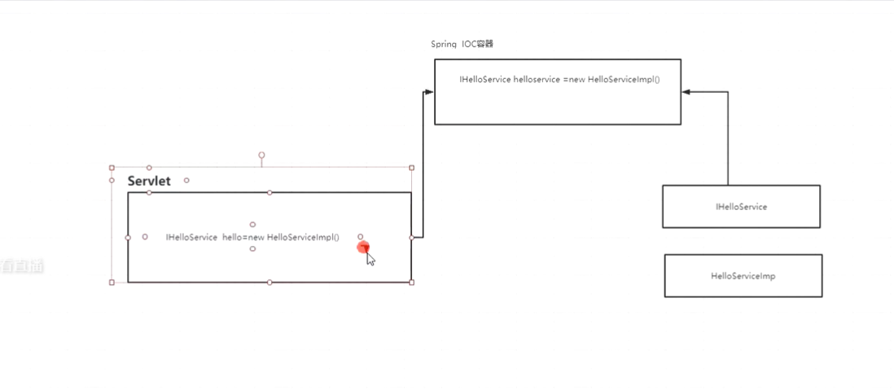

# Spring Boot 深入学习

本章节适用1-5 年的开发者，有经验的Spring Boot 开发者

# 微服务架构的现状及未来

单体架构

集群架构 水平拆分

垂直拆分

服务化 SOA

微服务

# 重新认识Spring Boot

# Spring Boot 的核心特征及设计思想

spring boot 介绍

## Spring Boot  的前世今生

## Spring Boot  的注解驱动

Spring Boot 自动装配

